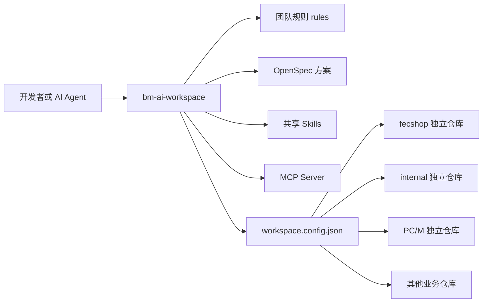
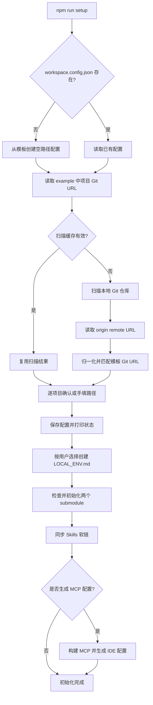
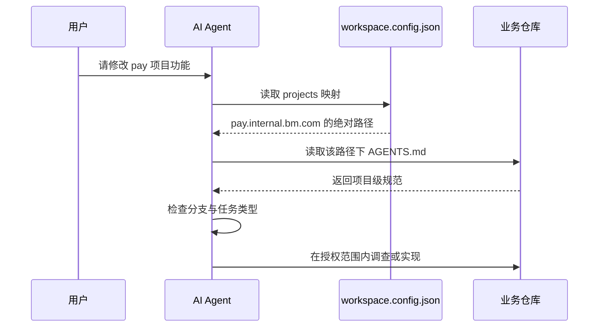
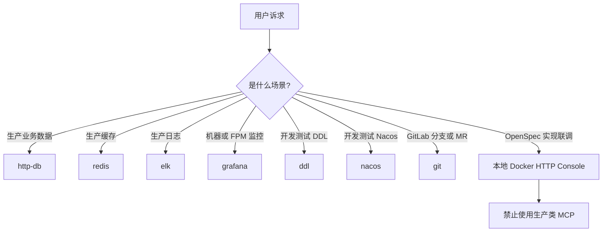
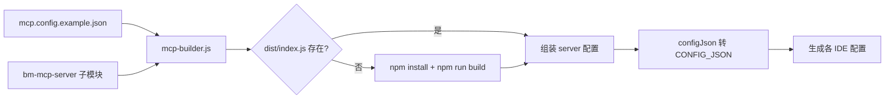
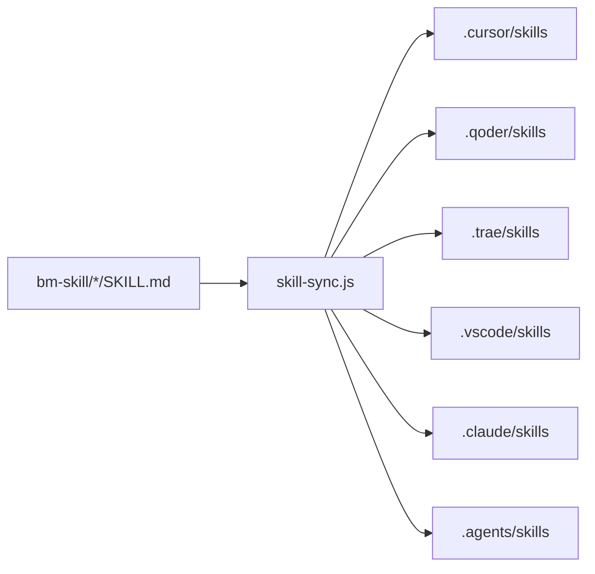
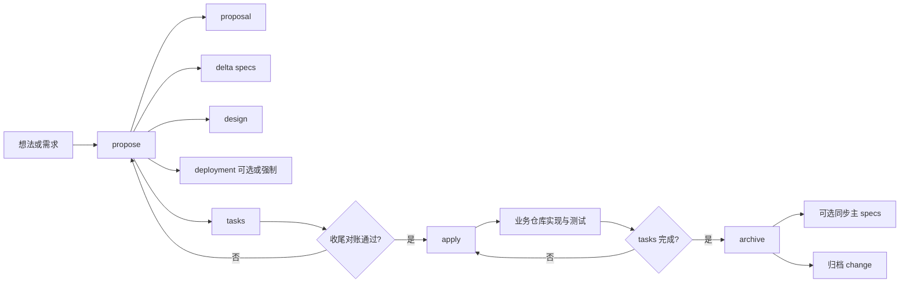
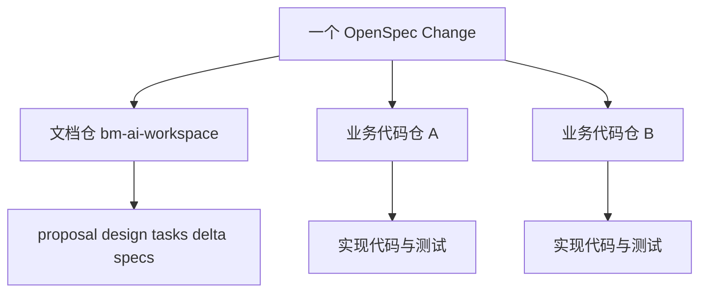

# bm AI 开发工作空间：新手完整上手指南

> 源仓库路径：`youngs/bm-ai-workspace`
>
> 本文基于该仓库当前代码、脚本和规范整理。仓库会持续演进，**如本文与仓库内容不一致，以代码现状为准**。
>
> 安全提示：本文不会展示真实 Token、密码或生产凭证。示例中的 `<TOKEN>`、`<项目路径>` 等均为占位符，请勿直接照抄为真实配置。

## 1. 先理解：这个工作空间是什么

`bm-ai-workspace` 不是某一个业务系统，也不是把全部业务代码复制到一个目录中的“大仓库”。它是团队共享的 **AI 开发工作空间**，负责把以下内容集中管理起来：

- 团队与 AI Agent 都必须遵守的开发规范；
- 各业务项目的架构说明；
- 每位开发者本机业务项目路径的映射；
- 可复用的 AI Skills；
- 查询数据、日志、监控和操作 GitLab 的 MCP Server；
- OpenSpec 需求、设计、任务和归档文档；
- 初始化、健康检查、技能同步和 MCP 配置生成脚本。

实际业务代码仍位于各自独立的 Git 仓库中，例如：

- `fecshop`
- `internal.bm.com`
- `pay.internal.bm.com`
- `nuxt-mall-pc`
- `nuxt-mall-mobile`
- `bm-store-manage-api`

工作空间通过本机的 `workspace.config.json` 找到这些仓库。



### 1.1 新手最容易混淆的两件事

第一，工作空间根目录与业务项目目录不是同一个 Git 仓库。OpenSpec 文档通常写在工作空间根仓库中，业务代码则写在一个或多个业务仓库中。

第二，模板配置与个人配置不是同一类文件：

- `workspace.config.example.json` 是团队共享模板，保存项目名和 Git URL；
- `workspace.config.json` 是个人配置，保存你本机的绝对路径，已被 Git 忽略；
- `LOCAL_ENV.example.md` 是团队共享模板；
- `LOCAL_ENV.md` 是你的个人开发环境说明，已被 Git 忽略；
- `mcp.config.example.json` 是 MCP 配置模板；
- `.cursor/mcp.json` 等是脚本为具体 IDE 生成的本机配置，已被 Git 忽略。

---

## 2. 环境要求

### 2.1 必需软件

| 软件 | 要求 | 用途 | 事实来源 |
|---|---:|---|---|
| Git | 支持 submodule | 克隆工作空间、拉取两个子模块、管理业务仓库 | `README.md`、`.gitmodules` |
| Node.js | `>= 18.0.0` | 执行初始化和 MCP 配置生成脚本 | `package.json` |
| npm | 与 Node.js 配套 | 执行 `npm run ...` 命令 | `package.json` |
| AI 编辑器 | Cursor、Qoder、Trae、VS Code 等 | 加载 Skills 和 MCP 配置 | `scripts/lib/constants.js` |
| OpenSpec CLI | 执行 OpenSpec 工作流时需要 | propose、apply、archive | OpenSpec Skills |

### 2.2 验证环境

前置条件：已打开终端；以下命令不会修改仓库。

作用：确认 Git、Node.js、npm 是否可用。

```bash
git --version
node --version
npm --version
```

预期：

- `node --version` 不低于 18；
- 三条命令都能正常输出版本号。

前置条件：需要执行 OpenSpec 工作流。

作用：确认 OpenSpec CLI 已安装。

```bash
openspec --version
```

若提示 `command not found`，说明尚未安装或不在 `PATH` 中。不要猜测安装方式，应先查看团队当前的 OpenSpec 安装约定或对应 Skill 的兼容性说明。

### 2.3 项目特有的 Node.js 版本

工作空间自身要求 Node.js 18 或更高，但业务项目可能有不同要求。例如 `LOCAL_ENV.example.md` 明确记录：

- `operate.bm.com` 使用 Node.js 14.x；
- 使用过高版本可能出现 `ERR_OSSL_EVP_UNSUPPORTED`。

因此：

1. 运行工作空间脚本时使用 Node.js 18+；
2. 进入具体业务项目后，先读该项目的 `AGENTS.md`；
3. 再读本机 `LOCAL_ENV.md`，按项目要求切换 Node.js 版本。

---

## 3. 首次初始化

### 3.1 推荐方式：AI 对话式初始化

仓库规范推荐新成员：

1. 克隆工作空间；
2. 在 Cursor 等 AI 编辑器中打开工作空间；
3. 向 Agent 发送任意消息；
4. Agent 读取根 `AGENTS.md`；
5. 若发现 `workspace.config.json` 不存在，Agent 应主动进入对话式初始化；
6. 用户确认项目路径后，Agent 执行完整的 `npm run setup`；
7. 最后询问是否生成 IDE MCP 配置。

注意：根 `AGENTS.md` 明确要求，初始化时不要手工拆分成“只复制配置”“只初始化 submodule”等零散步骤；应调用 `npm run setup`，确保路径、子模块、Skills 和 `LOCAL_ENV.md` 等环节保持一致。

### 3.2 命令行初始化

#### 第一步：克隆工作空间及子模块

前置条件：

- 已配置公司 GitLab SSH 访问权限；
- 当前目录是你希望存放工作空间的父目录。

作用：克隆主仓库，并同时初始化 `bm-mcp-server` 与 `bm-skill` 子模块。

```bash
git clone --recurse-submodules git@gitlab.bm.com:bmshop/bm-ai-workspace.git
cd bm-ai-workspace
```

如果你已经克隆过主仓库，但子模块为空：

前置条件：当前目录为工作空间根目录。

作用：补充初始化仓库声明的全部 submodule。

```bash
git submodule update --init
```

#### 第二步：执行完整初始化

前置条件：

- 当前目录为工作空间根目录；
- Node.js 版本不低于 18；
- 最好已经初始化 submodule；脚本也会尝试补充初始化。

作用：扫描业务仓库、生成或更新路径配置、处理个人环境文件、初始化子模块、同步 Skills，并询问是否生成 MCP 配置。

```bash
npm run setup
```

交互过程中可能出现三种情况：

- 找到唯一候选路径：按回车确认；
- 找到多个同源仓库：输入编号选择；
- 未找到：输入绝对路径，或输入 `n` 跳过。

#### 第三步：生成 MCP 配置

如果在 `npm run setup` 的最后选择了生成 MCP，可以不重复执行。否则：

前置条件：

- 当前目录为工作空间根目录；
- `bm-mcp-server` 已初始化；
- Node.js/npm 可用。

作用：构建缺失的 MCP Server，并生成各 IDE 的本机 MCP 配置。

```bash
npm run setup:mcp
```

脚本会提示哪些环境变量为空。请在本机安全地补全所需配置，**不要把真实 Token 或密码提交到 Git**。

#### 第四步：检查初始化结果

前置条件：初始化已执行。

作用：查看项目路径、`LOCAL_ENV.md` 和两个 submodule 的状态。

```bash
npm run status
```

前置条件：初始化已执行，`workspace.config.json` 已存在。

作用：逐项验证 `workspace.config.json` 中的路径是否存在。

```bash
npm run validate
```

前置条件：当前目录为工作空间根目录。

作用：查看两个 submodule 当前检出的 commit。

```bash
git submodule status
```

---

## 4. `npm run setup` 内部做了什么

初始化入口是：

`youngs/bm-ai-workspace/scripts/setup.mjs`

具体逻辑拆分在：

`youngs/bm-ai-workspace/scripts/lib/`

### 4.1 完整流程



### 4.2 配置创建

若 `workspace.config.json` 不存在，`scripts/lib/config.js` 会：

1. 读取 `workspace.config.example.json`；
2. 复制其中所有项目 key；
3. 将每个值初始化为 `""`；
4. 保存为个人配置。

它不会把模板中的 Git URL 当作本地路径。

### 4.3 扫描根目录

`scripts/lib/scanner.js` 在 macOS/Linux 上优先寻找以下目录：

- `~/Project`
- `~/code`
- `~/workspace`
- `~/projects`
- `~/dev`
- `~/src`

若这些常见目录都不存在，才回退扫描整个 home 目录，并提示可能较慢。

Windows 不自动猜测磁盘，而是要求用户输入要扫描的目录，例如 `D:\` 或 `D:\code`。

### 4.4 扫描限制

为避免扫描过慢，脚本：

- 最大递归深度为 4；
- 跳过 `node_modules`、`vendor`、`dist`、`build`、`.cache` 等目录；
- 跳过部分系统目录和隐藏目录；
- 找到全部目标后提前结束；
- 把结果写入 `.scan-cache.json`。

### 4.5 Git URL 如何匹配

脚本读取候选仓库 `.git/config` 中 `origin` 的 URL，并归一化：

- 去掉结尾 `.git`；
- 把 `git@host:group/repo` 转为 `host/group/repo`；
- 去掉 `http://` 或 `https://`；
- 统一转成小写。

因此 SSH 与 HTTPS 形式通常可以匹配同一个仓库。

限制：脚本读取的是普通目录下的 `.git/config`。若目录结构特殊、remote 不叫 `origin`、扫描深度超过 4，或 Git 元数据不是常规目录形式，可能无法自动发现，此时应手动输入绝对路径。

### 4.6 扫描缓存

`.scan-cache.json` 保存已匹配路径。下次执行 setup 时，只有当缓存路径仍存在且包含有效 `.git` 信息时才复用；缓存无效会重新扫描。

前置条件：自动扫描结果过期或漏掉新位置。

作用：忽略缓存并重新扫描。

```bash
npm run setup:force
```

---

## 5. 项目路径映射

### 5.1 模板文件

路径：

`youngs/bm-ai-workspace/workspace.config.example.json`

它保存项目名称与 Git URL，用于发现本机仓库。例如：

```json
{
  "$schema": "./workspace.config.schema.json",
  "projects": {
    "fecshop": {
      "git": "git@gitlab.example.com:group/fecshop.git"
    }
  }
}
```

上例域名是脱敏示例；真实模板以源仓库为准。

### 5.2 个人文件

路径：

`youngs/bm-ai-workspace/workspace.config.json`

其结构应类似：

```json
{
  "projects": {
    "fecshop": "/Users/your-name/Documents/works/fecshop",
    "internal.bm.com": "/Users/your-name/Documents/works/internal.bm.com",
    "kol": ""
  }
}
```

规则：

- 值是本机绝对路径；
- 空字符串表示未配置或主动跳过；
- 文件被 Git 忽略，不应提交；
- AI Agent 访问业务项目之前必须先读它；
- 找到业务目录后，还必须继续读取该项目自己的 `AGENTS.md`。

### 5.3 Schema

`workspace.config.schema.json` 使用 JSON Schema draft-07：

- 顶层必须有 `projects`；
- 已声明项目 key；
- 项目项允许字符串，模板元数据也允许 `{ "git": "..." }`；
- 允许额外项目项。

注意：Schema 允许的类型比实际个人配置更宽。个人配置由 setup 脚本生成时，项目值使用路径字符串。

### 5.4 当前项目映射表

| 项目 key | 常用别名 | 作用 |
|---|---|---|
| `fecshop` | `fecshop` | 电商网关 |
| `internal.bm.com` | `internal` | 核心 API 服务集群 |
| `user.internal.bm.com` | `newuser` | 用户服务 |
| `pay.internal.bm.com` | `newpay` | 支付服务 |
| `aftersale.internal.bm.com` | `aftersale` | 售后服务 |
| `operate.bm.com` | `operate` | 运营管理后台 |
| `nuxt-mall-pc` | `pc` | PC 商城 |
| `nuxt-mall-mobile` | `m` | 移动商城 |
| `bm-store-manage-api` | `store-api` | 门店管理后端 |
| `bm-store-manage` | `store-web` | 门店管理前端 |
| `kol` | `kol` | KOL 管理系统 |
| `download` | `download` | 下载中心 |
| `mail.bm.com` | `mail` | 邮件截图服务 |
| `go-mq-broker` | `mq-broker` | MQ 消费服务 |
| `go-kafka-sensor` | `kafka-sensor` | 商品兴趣分计算服务 |
| `new_bm_app` | `app` | 商城 App |

其中 `kol` 在当前模板中没有 Git URL，无法依靠 remote 自动发现，需要手动填写或跳过。

### 5.5 Agent 正确定位业务代码的顺序



---

## 6. 目录说明

```text
bm-ai-workspace/
├── AGENTS.md
├── README.md
├── PROJECTS.md
├── package.json
├── workspace.config.example.json
├── workspace.config.schema.json
├── mcp.config.example.json
├── LOCAL_ENV.example.md
├── scripts/
│   ├── setup.mjs
│   └── lib/
│       ├── config.js
│       ├── constants.js
│       ├── interactive.js
│       ├── mcp-builder.js
│       ├── scanner.js
│       ├── skill-sync.js
│       └── utils.js
├── rules/
│   ├── rules.md
│   ├── git-branch.md
│   ├── database.md
│   ├── mcp-routing.md
│   └── openspec-propose-checklist.md
├── openspec/
│   ├── config.yaml
│   ├── specs/
│   └── changes/
│       ├── <active-change>/
│       └── archive/
├── bm-skill/       # Git submodule
└── bm-mcp-server/  # Git submodule
```

本机生成且不提交的典型文件：

```text
workspace.config.json
LOCAL_ENV.md
.scan-cache.json
.cursor/mcp.json
.qoder/mcp.json
.trae/mcp.json
.vscode/mcp.json
.mcp.json
.codex/config.toml
.cursor/skills/<skill-name> -> ../../bm-skill/<skill-name>
```

---

## 7. npm 命令速查

### 7.1 `npm run setup`

前置条件：工作空间根目录；Node.js 18+。

作用：完整交互式初始化。会扫描路径、保存个人配置、处理 `LOCAL_ENV.md`、初始化 submodule、同步 Skills，并询问是否生成 MCP。

```bash
npm run setup
```

### 7.2 `npm run setup:force`

前置条件：工作空间根目录；自动扫描结果不正确或缓存已过期。

作用：忽略 `.scan-cache.json`，强制重新扫描本地仓库。

```bash
npm run setup:force
```

### 7.3 `npm run setup:mcp`

前置条件：`bm-mcp-server` 已初始化；Node.js/npm 可用。

作用：构建缺失的 `dist/index.js` 并生成 IDE MCP 配置。已有配置会询问是否覆盖。

```bash
npm run setup:mcp
```

### 7.4 `npm run validate`

前置条件：`workspace.config.json` 已存在。

作用：验证每个已配置路径是否存在；不负责修复路径。

```bash
npm run validate
```

### 7.5 `npm run status`

前置条件：无；在工作空间根目录运行。

作用：显示路径配置、`LOCAL_ENV.md` 和两个 submodule 的健康状态。

```bash
npm run status
```

### 7.6 `npm run pull:mcp`

前置条件：

- 可访问 GitLab；
- submodule remote 权限正常；
- Node.js/npm 可用；
- 当前主仓工作区状态已确认，避免意外混入 submodule 指针变更。

作用：

1. 拉取 `bm-mcp-server` 远端版本；
2. 对模板涉及的 MCP Server 执行全量构建；
3. 重新生成 IDE MCP 配置。

```bash
npm run pull:mcp
```

### 7.7 `npm run pull:skill`

前置条件：

- 可访问 GitLab；
- 已确认当前主仓分支和工作区；
- 用户明确理解该命令可能产生 Git 提交。

作用：

1. 更新 `bm-skill` submodule；
2. 暂存 submodule 指针；
3. 如指针变化，脚本会自动创建 `chore: update bm-skill submodule pointer` 提交；
4. 同步 Skills 软链。

```bash
npm run pull:skill
```

重要：这一命令在 `package.json` 中确实包含 `git add` 和条件式 `git commit`。它与仓库“禁止擅自提交”的总规则存在操作层面的特殊风险。新手不要在未确认分支和授权的情况下执行；仅需同步软链时，可请维护者确认更安全的操作方式。

### 7.8 `postinstall`

执行 `npm install` 时会自动运行：

```text
node scripts/setup.mjs --check
```

它会检查配置和 submodule，并同步 Skills 软链。它不是完整交互式 setup。

---

## 8. 规则体系、优先级与冲突处理

### 8.1 事实与解释边界

仓库明确规定了需要读取哪些规范，但没有一份名为“规则优先级”的完整排序表。下面的顺序是为了帮助新手执行而整理的 **操作性解释**，不是仓库中的原文优先级声明：

1. 平台系统规则、公司安全要求和用户当前明确授权；
2. 工作空间根 `AGENTS.md` 中的绝对红线；
3. 当前业务项目自己的 `AGENTS.md`；
4. `rules/*.md` 中的细则；
5. 当前 OpenSpec change 的 proposal/spec/design/tasks/deployment；
6. 与任务匹配的 Skill；
7. `LOCAL_ENV.md` 中的个人环境信息。

执行原则：

- 下层文档不能解除上层安全红线；
- 用户要求“实现”不等于授权“提交”或“推送”；
- 用户要求“提交”不等于授权“推送”；
- 项目级规范可能比工作空间通用规范更具体，应同时满足；
- 发生真实冲突时停止危险操作，向用户说明冲突并请求确认。

### 8.2 根规范中的 14 条红线

#### Git 与代码提交

1. **禁止在 `master` 分支直接提交代码**  
   所有功能、优化和修复必须在独立开发分支完成。

2. **禁止擅自提交代码**  
   只有用户明确要求后，才能执行 `git commit`。

3. **禁止跳过 `git pull origin master`**  
   创建开发分支前必须先更新本地 `master`。

#### 数据库与数据操作

4. **禁止物理删除数据**  
   必须使用 `UPDATE del_flag = 1` 软删除，不使用 `DELETE`。

5. **禁止省略建表强制字段**  
   新表必须包含 `created_at`、`updated_at`、`del_flag`。

6. **禁止使用 `datetime` / `timestamp` 类型**  
   时间字段必须使用 `int` Unix 时间戳。

7. **禁止查询时遗漏 `del_flag = 0`**  
   避免读取已软删除数据。

#### MCP 工具使用

8. **禁止在 OpenSpec 实现期使用生产 MCP**  
   `/opsx:apply`、联调、自测和测试结论不得使用生产 `http-db`、`redis`、`elk`、`grafana` 验证。

9. **禁止混用环境**  
   生产 MCP 只用于生产排查；开发/测试 DDL 和 Nacos 使用 dev MCP。

#### 代码规范

10. **禁止直接使用 `\Yii::error()`**  
    Yii2 后端必须使用 `g_log_info()`、`g_log_warning()`、`g_log_error()` 等统一函数。

11. **禁止手写 `g_config` 模块名字符串**  
    使用 `ConfigHelper::$PAY`、`ConfigHelper::$MALL_COMMON` 等常量。

12. **禁止在 Service 或 Controller 直接操作 Model**  
    数据访问必须经过 Repository 层：

    ```text
    Controller -> Service -> Repository -> Model -> DB
    ```

13. **禁止在 internal 项目直接生成 Excel**  
    运营后台导出必须复用异步导出和下载中心方案。

#### 问题排查

14. **禁止未查数据库就凭代码猜测问题**  
    生产问题遵循“数据先行，代码验证”：先确认实际数据，再结合代码定位。

### 8.3 数据库强制字段

`rules/database.md` 规定新表必须包含：

```sql
`created_at` int NOT NULL DEFAULT '0' COMMENT '创建时间',
`updated_at` int NOT NULL DEFAULT '0' COMMENT '更新时间',
`del_flag` tinyint(1) NOT NULL DEFAULT '0' COMMENT '删除标志 0正常 1删除'
```

同时要求：

- 更新时同步 `updated_at`；
- 查询时加入 `del_flag = 0`；
- 删除时更新 `del_flag = 1`；
- 三个字段放在字段列表末尾、主键和索引定义之前。

---

## 9. MCP：能力、环境和配置生成

### 9.1 MCP 是什么

MCP（Model Context Protocol）让 AI 编辑器通过受控工具访问外部能力，例如 GitLab、生产查询接口、日志、监控、开发数据库或 Nacos。

MCP 不代表“任何时候都能查任何环境”。本工作空间对生产与开发/测试环境有严格路由。

### 9.2 环境矩阵

| MCP Server | 环境 | 连接方式 | 典型用途 | OpenSpec 实现期 |
|---|---|---|---|---|
| `mcp-server-http-db` | 生产 | HTTP API | 查生产订单、商品、支付；读取生产 schema 快照 | 禁止 |
| `mcp-server-redis` | 生产 | HTTP API | 查生产 Redis | 禁止 |
| `mcp-server-elk` | 生产 | Elasticsearch/Kibana | 查生产应用或 Nginx 日志 | 禁止 |
| `mcp-server-grafana` | 生产 | Grafana/Prometheus | 查机器和 PHP-FPM 监控 | 禁止 |
| `mcp-server-ddl` | 开发/测试 | MySQL 直连 | 查看 dev 表结构、执行 DDL | 按任务和授权使用 |
| `mcp-server-nacos` | 开发/测试 | Nacos HTTP API | 读写 dev Nacos | 按任务和授权使用 |
| `mcp-server-git` | 无生产/dev区分 | GitLab API | 分支、MR、成员、提交统计 | 按 Git 授权使用 |

### 9.3 选择 MCP 的决策图



### 9.4 两种表结构工具不能混用

| 工具 | 数据源 | 是否实时连库 | 能看到索引/外键 | 使用场景 |
|---|---|---:|---:|---|
| `http-db get_table_schema` | 生产 schema 本地快照 | 否 | 否 | 编写生产排查 SQL 前认字段 |
| `ddl get_ddl_table_schema` | dev/test `INFORMATION_SCHEMA` | 是 | 是 | 执行 dev DDL 前检查现状 |

口诀：

- 写生产排查 SQL前确认字段：`http-db get_table_schema`；
- 改开发/测试库：先 `ddl list_databases`，再 `ddl get_ddl_table_schema`；
- 不确定 Nacos 实例：先 `nacos list_nacos_instances`。

### 9.5 MCP 配置模板

模板位置：

`youngs/bm-ai-workspace/mcp.config.example.json`

每个 Server 主要包含：

- `entry`：构建后入口，如 `bm-mcp-server/<server>/dist/index.js`；
- `env`：普通环境变量；
- `configJson`：DDL/Nacos 的多环境配置，生成时转为 `CONFIG_JSON` 环境变量。

示例只展示结构，不含真实地址或凭证：

```json
{
  "mcpServers": {
    "mcp-server-git": {
      "entry": "bm-mcp-server/mcp-server-git/dist/index.js",
      "env": {
        "GITLAB_HOST": "gitlab.example.com",
        "GITLAB_TOKEN": "<TOKEN>"
      }
    }
  }
}
```

不要把真实 Token 写入会提交的文件。优先遵循团队当前的秘密管理方式；至少应确认目标文件被 Git 忽略，并避免在聊天、日志或截图中泄露。

### 9.6 配置生成机制

`scripts/lib/mcp-builder.js` 执行以下步骤：

1. 扫描 `bm-mcp-server/` 下以 `mcp-server-` 开头且含 `package.json` 的目录；
2. 将扫描结果与 `mcp.config.example.json` 中的名称进行对照；
3. 若对应 `dist/index.js` 不存在，则在 server 目录执行 `npm install` 和 `npm run build`；
4. `npm run pull:mcp` 使用 `--build`，因此全量重新构建；
5. 只有入口文件实际存在的 server 才会写入生成配置；
6. `configJson` 被序列化为 `CONFIG_JSON`；
7. 检查空环境变量并提示；
8. 询问是否覆盖已有 IDE 配置。



### 9.7 生成目标

| IDE/客户端 | 文件 | 顶层格式 |
|---|---|---|
| Cursor | `.cursor/mcp.json` | `mcpServers` |
| Qoder | `.qoder/mcp.json` | `mcpServers` |
| Trae | `.trae/mcp.json` | `mcpServers` |
| VS Code | `.vscode/mcp.json` | `servers` |
| Claude Code | `.mcp.json` | `mcpServers` |
| Codex | `.codex/config.toml` | TOML `mcp_servers` |

Agent 看到的 MCP 名称可能被 IDE 加上类似 `project-0-bm-` 的前缀。实际调用时以 IDE MCP 元数据中的 `serverIdentifier` 为准。

---

## 10. Skills：发现、触发和同步

### 10.1 Skills 是什么

Skill 是一组面向特定任务的 AI 操作说明，可包含：

- `SKILL.md`：触发条件和工作流；
- `scripts/`：辅助脚本；
- 与任务有关的参考文件。

团队共享技能位于 `bm-skill` submodule。

### 10.2 当前技能

以 `bm-skill/AGENTS.md` 和实际包含 `SKILL.md` 的目录为准：

| Skill | 用途 |
|---|---|
| `data-crypto` | AES-128-CBC 加解密与 UPDATE SQL 组装 |
| `ai-coding-metrics` | 统计 AI 代码率和 AI 代码采纳率 |
| `export-download` | 运营后台异步导出接入下载中心 |
| `store-export` | 门店管理后台前端 xlsx/csv 导出 |

根 `AGENTS.md` 的技能列表可能没有同步展示全部技能，因此新手查询完整清单时应同时查看：

```text
bm-skill/AGENTS.md
bm-skill/*/SKILL.md
```

### 10.3 同步机制

`scripts/lib/skill-sync.js`：

1. 扫描 `bm-skill/` 的一级子目录；
2. 仅把包含 `SKILL.md` 的目录视为 Skill；
3. 在以下目录创建相对软链：
   - `.cursor/skills`
   - `.qoder/skills`
   - `.trae/skills`
   - `.vscode/skills`
   - `.claude/skills`
   - `.agents/skills`
4. 若目标是旧软链，删除后重建；
5. 若目标是一个真实目录，则跳过，不会删除真实目录。



### 10.4 Skills 没出现时怎么做

前置条件：已确认 `bm-skill` submodule 有内容。

作用：执行完整技能更新和同步。注意它可能自动提交 submodule 指针，执行前必须确认授权和分支。

```bash
npm run pull:skill
```

完成后重启或重新加载 AI 编辑器。

如果只想判断是否同步成功，可以只读检查：

前置条件：工作空间根目录。

作用：查看 Cursor Skills 目录和软链，不修改文件。

```bash
ls -la .cursor/skills
```

---

## 11. OpenSpec：从方案到实现再到归档

### 11.1 OpenSpec 的作用

OpenSpec 用结构化文档把需求、方案、验收条件和实现任务串起来。当前工作空间使用：

```yaml
schema: spec-driven
```

主要目录：

```text
openspec/
├── config.yaml
├── specs/                    # 当前主规格
└── changes/
    ├── <change-name>/        # 活跃变更
    │   ├── .openspec.yaml
    │   ├── proposal.md
    │   ├── design.md
    │   ├── tasks.md
    │   ├── deployment.md     # 有交付事项时
    │   └── specs/            # delta specs
    └── archive/              # 已归档变更
```

### 11.2 三阶段总览



### 11.3 Propose：提出变更

适用：新功能、较大优化、明确缺陷修复，需要先形成完整方案。

通常通过 `/opsx:propose` 或 `openspec-propose` Skill 执行。Skill 会：

1. 明确 change 名称；
2. 创建 change；
3. 查询 artifact 构建顺序；
4. 依次生成 proposal、spec、design、tasks 等；
5. 达到 apply-ready 状态。

前置条件：

- 已安装 OpenSpec CLI；
- 当前目录能定位到工作空间 `openspec/`；
- 已明确需求目标。

作用：查看当前活跃 change，不修改文件。

```bash
openspec list --json
```

作用：查看指定 change 的 artifact 状态。

```bash
openspec status --change "<change-name>" --json
```

Propose 宣布“可以 apply”之前，必须执行：

`rules/openspec-propose-checklist.md`

核心要求：

- 读取 change 目录全部 Markdown；
- 用 `tasks.md` 对账 design、deployment、confirmed decisions 等；
- 每项“必须/禁止/须”都应落到实现任务、测试任务或明确外部 owner；
- `tasks.md` 最后定稿；
- 向用户输出收尾检查报告；
- 有待确认项时，不得宣称可 apply。

### 11.4 deployment.md 何时强制

只要变更涉及以下任一项，实现阶段必须维护：

`openspec/changes/<change-name>/deployment.md`

| 交付类型 | 必须记录 |
|---|---|
| DDL | 完整 SQL、目标库表、执行顺序、验证 SQL、项目迁移文件 |
| Nacos | 模块名、配置键、JSON、默认值、测试/生产示例、关闭与回滚 |
| AB/神策 | 实验 key、枚举、请求参数约定 |
| 发布 | 推荐上线顺序、回滚、部署后验证 |

### 11.5 Apply：开始实现

适用：proposal/spec/design/tasks 已完成，并且用户明确要求开始实现或执行 `/opsx:apply`。

Apply Skill 会：

1. 选择 change；
2. 读取 `openspec status`；
3. 获取 apply instructions；
4. 读取所有 context files；
5. 按 tasks 实现和更新进度。

但在写代码之前，还必须完成每个受影响业务仓库的 Git 准备。

### 11.6 Archive：完成归档

适用：实现和验证已经完成。

Archive 阶段：

- 检查 artifact 与 tasks 是否完成；
- 评估 delta spec 是否要同步到 `openspec/specs/`；
- 将 change 移入 `openspec/changes/archive/`。

重要：主 spec 的同步在归档阶段评估，不应在普通 apply 提交阶段自行提前同步。

---

## 12. Git 工作流与双仓模型

### 12.1 为什么是双仓甚至多仓

一次 OpenSpec 变更可能同时涉及：

- 工作空间文档仓库：保存 proposal、design、tasks、delta specs；
- 一个或多个业务代码仓库：保存 PHP、Vue、Go 等实现；
- 两个 submodule 仓库：只在变更本身涉及 MCP 或 Skills 时修改。



每个目录都可能有独立分支、工作区和 commit。不要在工作空间根目录执行一次 `git status` 后，就假定所有业务仓库都干净。

### 12.2 创建开发分支的强制流程

对每一个将要修改的仓库分别执行。

前置条件：

- 用户已明确要求开始实现；
- 已通过 `workspace.config.json` 定位仓库；
- 已读取该仓库 `AGENTS.md`；
- 已确认网络可访问远端；
- 已检查当前工作区。

作用：查看当前分支。

```bash
git branch --show-current
```

作用：检查是否存在已修改或未跟踪文件。

```bash
git status --porcelain
```

如存在改动，作用：临时保存包含未跟踪文件在内的工作区，避免切分支丢失。

```bash
git stash push -u -m "wip: before <change-name> on $(date +%Y%m%d)"
```

作用：切到本地 `master`。

```bash
git checkout master
```

作用：将本地 `master` 更新到远端最新。仓库规则明确禁止跳过。

```bash
git pull origin master
```

作用：按当前 Git 用户名和当天日期创建开发分支。

```bash
GIT_USER=$(git config user.name)
DATE=$(date +%m%d)
git checkout -b "${GIT_USER}/feat_<功能描述>_${DATE}"
```

分支类型：

| 类型 | 格式 |
|---|---|
| 功能 | `<名字>/feat_<描述>_<MMDD>` |
| 优化 | `<名字>/opt_<描述>_<MMDD>` |
| 修复 | `<名字>/fix_<描述>_<MMDD>` |

同一变更跨多个仓库时，各仓库分支名应保持一致。

### 12.3 提交与推送是两个授权

- “提交代码”通常只授权 `git add` + `git commit`；
- “推送代码”才授权 `git push`；
- 没有明确要求时，不提交；
- 只要求提交时，不推送。

提交信息遵循 Conventional Commits，例如：

```text
feat: add express checkout
fix: handle payment retry failure
docs: update deployment checklist
```

### 12.4 OpenSpec 实现后的 MR 汇报

仓库规则要求 Agent 汇报时：

- 只提供工作空间文档仓库的 MR 链接；
- 不提供各业务代码仓库的 MR 链接；
- 业务仓库只汇报分支名、最新 commit 和远端同步状态。

这是一条团队约定，不代表业务代码无需评审；只是 Agent 的最终汇报格式不同。

---

## 13. `LOCAL_ENV.md`：个人环境说明

### 13.1 为什么需要它

业务项目路径因人而异，Docker 容器、Node.js 管理工具、本地域名和启动方式也可能不同。团队模板放在：

`LOCAL_ENV.example.md`

个人副本放在：

`LOCAL_ENV.md`

后者被 Git 忽略。

### 13.2 典型内容

- 环境类型：Docker、本机或其他；
- Docker Compose 文件；
- PHP 7.3 / PHP 8.2 容器名；
- 常用 `docker exec` 命令；
- Node.js 版本管理工具；
- `operate.bm.com` 的启动命令和端口；
- 本地测试流程。

### 13.3 安全注意

当前 `LOCAL_ENV.example.md` 中包含示例测试账号信息。新手文档不应复制任何真实生产账号、Token 或密码。个人 `LOCAL_ENV.md` 即使被 Git 忽略，也应避免记录不必要的生产秘密。

AI Agent 执行 Docker、启动服务或本地环境操作前，应先读取 `LOCAL_ENV.md`，不要凭模板猜测你的容器名。

---

## 14. 常见故障

### 14.1 `workspace.config.json` 不存在

表现：

- Agent 无法定位业务项目；
- `npm run status` 提示配置不存在。

处理：

前置条件：工作空间根目录，Node.js 18+。

作用：进入完整交互初始化。

```bash
npm run setup
```

### 14.2 路径显示 `EMPTY`

含义：该项目路径为空，可能是初始化时主动跳过或没有自动发现。

处理：

- 再次执行 `npm run setup`；
- 或在交互中输入真实绝对路径；
- 若本人不参与该项目，可以继续保留为空。

### 14.3 路径显示 `MISSING`

含义：配置中有路径，但该目录当前不存在。

常见原因：

- 项目被移动；
- 外接磁盘未挂载；
- 用户目录发生变化；
- 路径拼写错误。

处理：使用 `npm run setup:force` 重新扫描，或通过 setup 交互更新路径。

### 14.4 自动扫描找不到项目

可能原因：

- 项目不在默认扫描目录；
- 项目目录层级超过 4；
- Git remote 不是 `origin`；
- remote URL 与模板不一致；
- 模板中 Git URL 为空，例如 `kol`；
- `.git` 元数据形式特殊。

处理：在 setup 提示中手动输入绝对路径。

### 14.5 submodule 目录为空

前置条件：工作空间根目录，可访问 GitLab。

作用：初始化两个声明的 submodule。

```bash
git submodule update --init
```

若希望同步远端 MCP 新版本并重新构建，使用 `npm run pull:mcp`；不要把“初始化”和“升级到远端最新”混为一谈。

### 14.6 `git submodule status` 前出现 `+`

含义：当前 submodule 检出的 commit 与主仓记录的指针不一致。

不要直接提交。先确认：

- 是你主动更新了子模块；
- 还是主仓应该恢复记录的 commit；
- 当前所在分支是否允许修改 submodule 指针。

若只想回到主仓记录的版本：

前置条件：确认不需要保留 submodule 内当前检出状态。

作用：按主仓记录更新 submodule。

```bash
git submodule update
```

### 14.7 MCP 配置生成后没有某个 Server

脚本只写入入口文件实际存在的 Server。检查：

1. submodule 中是否存在对应目录和 `package.json`；
2. `mcp.config.example.json` 是否有该 Server；
3. `dist/index.js` 是否构建成功；
4. `npm install` 或 `npm run build` 是否报错。

前置条件：需要拉取 MCP 最新代码且可以全量构建。

作用：更新、全量构建并刷新配置。

```bash
npm run pull:mcp
```

### 14.8 MCP 鉴权失败

常见原因：

- Token 为空；
- Token 已过期；
- 权限范围不足；
- IDE 未重新加载配置；
- 修改了模板却没有重新生成；
- Server 的环境变量名不正确。

处理原则：

- 不要在聊天中粘贴真实 Token；
- 确认目标配置文件被 Git 忽略；
- 补全后重启或重新加载 IDE；
- 若是明确的权限拒绝，不要反复重试，应联系管理员。

### 14.9 Skills 未显示

前置条件：当前目录为工作空间根目录；只做状态检查。

作用：第一条列出技能源文件，第二条检查 Cursor Skills 目录及软链。

```bash
ls bm-skill/*/SKILL.md
ls -la .cursor/skills
```

第一条确认源技能存在；第二条确认 Cursor 软链存在。

若源存在但软链缺失：

前置条件：已确认 Git 分支、工作区和 `pull:skill` 的自动提交风险，并获得相应授权。

作用：更新技能 submodule、在需要时提交指针，并重新同步软链。

```bash
npm run pull:skill
```

### 14.10 `operate.bm.com` 启动时报 OpenSSL 错误

根据环境模板，该项目需要 Node.js 14.x。前置条件：已安装并启用 nvm。

作用：切换到项目要求的 Node.js 版本。

```bash
source ~/.nvm/nvm.sh
nvm use 14
```

切换前应先读项目 `AGENTS.md` 和个人 `LOCAL_ENV.md`，确认当前约定没有变化。

### 14.11 OpenSpec apply 时想查生产数据

不要执行。实现、联调和自测阶段禁止使用生产 `http-db`、`redis`、`elk`、`grafana`。

应使用：

- 本地 Docker 数据库；
- HTTP 接口；
- 项目内 curl 脚本；
- Yii Console 测试脚本。

只有线上问题排查、生产数据差异分析或用户明确要求生产调查时，才按 MCP 路由使用生产工具。

### 14.12 `npm run pull:skill` 意外产生提交

这是当前 `package.json` 的实际行为：submodule 指针变化时会条件式执行 commit。

预防：

- 执行前查看根仓分支；
- 检查工作区；
- 确认用户明确授权提交；
- 若只想了解远端更新，不要机械执行该命令。

---

## 15. 新手第一周练习

以下练习按“先只读、后安全操作、最后理解工作流”安排。不要在 `master` 上做写入练习，不要使用生产 MCP。

### 第 1 天：认识工作空间

目标：

- 区分工作空间仓库与业务仓库；
- 找到根规范、规则、项目架构。

练习：

1. 阅读 `README.md`；
2. 阅读根 `AGENTS.md`；
3. 阅读 `PROJECTS.md`；
4. 阅读 `rules/mcp-routing.md`；
5. 用自己的话说明 `fecshop`、`internal`、`operate` 的关系。

前置条件：当前目录为工作空间根目录，已完成初始化。

作用：只读查看工作空间健康状态和 submodule commit。

```bash
npm run status
git submodule status
```

### 第 2 天：理解路径映射

目标：

- 理解 template 与个人配置；
- 能从项目 key 找到真实路径。

练习：

1. 对比 `workspace.config.example.json` 与 `workspace.config.json`；
2. 找到 `internal.bm.com` 的本机路径；
3. 打开该目录的 `AGENTS.md`；
4. 不修改文件，运行 `npm run validate`。

验收问题：

- 为什么不能把个人绝对路径写进 `AGENTS.md`？
- 为什么 Agent 访问业务代码前必须先读映射？

### 第 3 天：理解 Skills 与 MCP

目标：

- 知道 Skill 是工作流，MCP 是外部工具；
- 能按环境矩阵选择工具。

练习：

1. 阅读 `bm-skill/AGENTS.md`；
2. 打开一个 `SKILL.md`，找出它的触发条件；
3. 查看 `.cursor/skills` 的软链；
4. 阅读 `mcp.config.example.json`，只看结构，不填真实凭证；
5. 回答：OpenSpec apply 为什么禁止使用生产 MCP？

### 第 4 天：阅读一个 OpenSpec change

目标：

- 区分 proposal、spec、design、tasks、deployment。

练习：

1. 使用 `openspec list --json` 查看 active changes；
2. 选择一个 change；
3. 阅读该目录全部 Markdown；
4. 从 `tasks.md` 找到 Git 分支准备、实现和测试任务；
5. 检查 design/deployment 中的要求是否在 tasks 中有落点。

前置条件：已安装 OpenSpec CLI，当前目录可定位到工作空间 `openspec/`，并已选择真实的 active change 名称。

作用：只读查看该 change 的 schema、artifact 和完成状态。

```bash
openspec status --change "<change-name>" --json
```

### 第 5 天：模拟 Git 安全流程

目标：

- 理解检查工作区、更新 master、建立开发分支的顺序；
- 不进行实际提交和推送。

练习建议：使用个人练习仓库，不要直接在正式业务仓库练习。

前置条件：当前目录是个人练习 Git 仓库；本练习不切换分支、不提交、不推送。

作用：依次只读观察当前分支、工作区状态、Git 用户名和日期后缀。

```bash
git branch --show-current
git status --porcelain
git config user.name
date +%m%d
```

口头复述：

1. 为什么先 stash；
2. 为什么必须 `git pull origin master`；
3. 为什么“提交”和“推送”需要分别授权。

### 第 6 天：故障演练

在不破坏真实配置的前提下，仅根据本文回答：

- 路径 `EMPTY` 怎么处理；
- MCP 缺 `dist/index.js` 怎么处理；
- Skills 源目录存在但 Cursor 没显示怎么处理；
- submodule 状态前出现 `+` 表示什么；
- OpenSpec apply 期间需要数据验证应使用什么。

### 第 7 天：完成一次只读需求分析

选择一个业务问题，只做只读调研：

1. 从 `workspace.config.json` 定位项目；
2. 读取项目 `AGENTS.md`；
3. 搜索入口文件、Service、Repository；
4. 输出事实、推断和待确认项；
5. 不改文件、不提交、不调用生产 MCP。

验收标准：

- 能清楚区分“代码明确事实”和“根据结构推断”；
- 所有路径可验证；
- 不越过授权范围。

---

## 16. 术语表

| 术语 | 解释 |
|---|---|
| Workspace | 统一承载规则、路径、Skills、MCP 和 OpenSpec 的工作空间仓库 |
| 业务仓库 | 保存实际业务代码的独立 Git 仓库 |
| Agent | 在 AI 编辑器中调查、解释或修改代码的 AI 助手 |
| `AGENTS.md` | Agent 必须遵循的项目规范文件 |
| Path Mapping | `workspace.config.json` 中项目名到本机绝对路径的映射 |
| Submodule | 在主 Git 仓库中引用另一个 Git 仓库指定 commit 的机制 |
| Skill | 面向某类任务的 AI 工作流说明及辅助脚本 |
| MCP | Model Context Protocol，让 AI 调用外部工具或数据源 |
| MCP Server | 提供某组 MCP 工具的进程，例如 GitLab、数据库或日志服务 |
| `dist/index.js` | TypeScript MCP Server 构建后的 Node.js 入口 |
| `CONFIG_JSON` | setup 将 `configJson` 序列化后传给 DDL/Nacos MCP 的环境变量 |
| OpenSpec | 用 proposal/spec/design/tasks 等 artifact 驱动变更的工作流 |
| Change | 一次待实现或正在实现的 OpenSpec 变更目录 |
| Main Spec | `openspec/specs/` 中归档后维护的当前完整规格 |
| Delta Spec | change 目录中描述本次新增或修改内容的规格 |
| Propose | 建立 change 并生成方案、规格和任务 |
| Apply | 按 change 的 tasks 实现代码和验证 |
| Archive | 完成后归档 change，并评估是否同步主 spec |
| `deployment.md` | DDL、Nacos、AB、发布和回滚的上线交付文档 |
| Repository 层 | 位于 Service 与 Model 之间，负责数据库访问 |
| Soft Delete | 通过 `del_flag = 1` 标记删除，不物理删除记录 |
| Conventional Commits | `feat:`、`fix:`、`docs:` 等标准提交信息格式 |
| MR | Merge Request，GitLab 中的合并评审请求 |
| `EMPTY` | 路径配置为空 |
| `MISSING` | 路径已配置但目录不存在 |

---

## 17. 待确认项与已知文档差异

以下内容是基于当前代码检查发现的差异或需要团队确认的事项。它们不应被新手自行“修正”，应由维护者确认后统一更新。

### 17.1 根 Skills 列表与 submodule 清单不完全一致

事实：

- `bm-skill/AGENTS.md` 和实际目录包含 4 个技能；
- 根 `AGENTS.md` 展示的通用技能列表没有完整列出全部当前技能。

建议：完整清单以 `bm-skill/AGENTS.md` 与实际 `*/SKILL.md` 为准；是否更新根文档待维护者确认。

### 17.2 README 业务项目表比根 AGENTS 表更少

事实：

- 根 `AGENTS.md` 项目配置表包含 16 项；
- `README.md` 当前展示的业务项目表较短。

建议：路径映射和 Agent 行为以 `workspace.config.example.json`、schema 与根 `AGENTS.md` 为准。

### 17.3 `pull:skill` 会自动提交

事实：`package.json` 中的 `pull:skill` 包含 `git add` 和条件式 `git commit`。

待确认：

- 是否应在新手流程中继续推荐直接执行；
- 是否应拆分“仅更新/同步”和“提交 submodule 指针”两个命令；
- 它与“禁止擅自提交”规则如何形成明确例外授权。

在团队确认前，新手应把该命令视为有提交副作用的命令。

### 17.4 OpenSpec 历史 spec 可能描述旧结构

事实：部分归档或主 spec 记录的是当时的实施方案，可能仍出现旧目录名或旧命令。

原则：

- 了解历史设计时读归档；
- 执行当前操作时以 `package.json`、`scripts/`、根 `AGENTS.md` 和当前 rules 为准。

### 17.5 示例部署文档链接可能指向归档前路径

事实：根规范提到的部分示例 change 当前已位于 `openspec/changes/archive/`。

使用时应通过文件搜索或 `openspec list`/目录列表确认实际位置，不要假定示例仍是 active change。

### 17.6 密钥应写在哪里

事实：

- 模板中的敏感环境变量默认留空；
- 生成的本机 IDE 配置被 Git 忽略；
- 仓库提示生成后补全配置。

待确认：团队是否有统一密钥管理器、环境注入或 Token 轮换规范。没有确认前，不应把真实凭证写入 tracked 模板、聊天记录、文档示例或提交历史。

### 17.7 规则优先级不是仓库明文排序

本文第 8 节的排序用于帮助新手执行，是基于文件职责整理的解释。若团队希望形成正式优先级，应在根规范中补充明确声明。

---

## 18. 最小安全操作清单

每次开始任务前，至少确认：

- [ ] 我知道这是只读调查、诊断、实现、提交还是推送任务；
- [ ] 我读取了根 `AGENTS.md`；
- [ ] 我从 `workspace.config.json` 找到了真实业务路径；
- [ ] 我读取了业务项目自己的 `AGENTS.md`；
- [ ] 环境操作前读取了 `LOCAL_ENV.md`；
- [ ] 实现前检查了每个独立仓库的分支和工作区；
- [ ] 创建分支前更新了 `master`；
- [ ] 没有在 OpenSpec 实现期调用生产 MCP；
- [ ] 数据库设计遵守时间戳、软删除和强制字段规则；
- [ ] 用户没有明确要求时不 commit；
- [ ] 用户只要求 commit 时不 push；
- [ ] 没有在配置、文档、日志或回答中泄露 Token/密码；
- [ ] 涉及 DDL、Nacos、AB 或发布时维护了 `deployment.md`；
- [ ] 测试和文档完成后，才进入 archive。

---

## 19. 关键文件索引

源仓库根目录：

`youngs/bm-ai-workspace`

核心文件：

```text
AGENTS.md
README.md
PROJECTS.md
package.json
workspace.config.example.json
workspace.config.schema.json
mcp.config.example.json
LOCAL_ENV.example.md
scripts/setup.mjs
scripts/lib/config.js
scripts/lib/constants.js
scripts/lib/interactive.js
scripts/lib/mcp-builder.js
scripts/lib/scanner.js
scripts/lib/skill-sync.js
scripts/lib/utils.js
rules/rules.md
rules/git-branch.md
rules/database.md
rules/mcp-routing.md
rules/openspec-propose-checklist.md
openspec/config.yaml
bm-skill/AGENTS.md
bm-mcp-server/mcp-server-*/SPEC.md
```

最后记住三句话：

1. **先读路径映射，再进业务仓库。**
2. **先读规则和 OpenSpec，再写代码。**
3. **生产与开发环境严格分开，提交与推送分别授权。**
