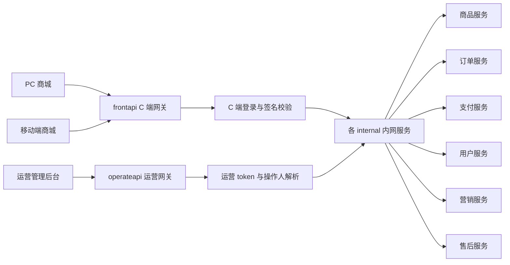
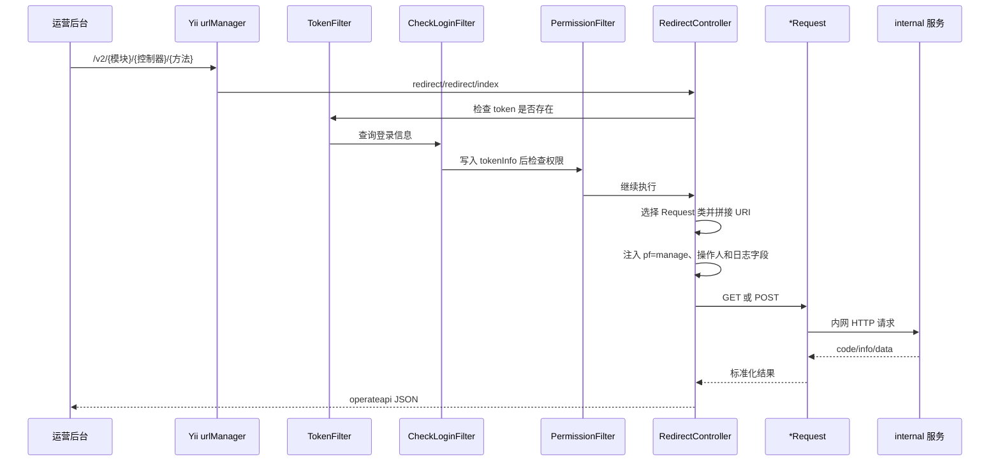
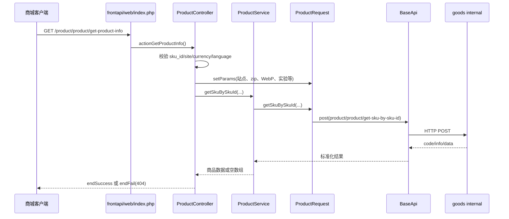

# 商城网关 fecshop 新手上手指南

> 适用仓库：`youngs/fecshop`
>
> 本文只记录能由仓库文件或工作空间项目文档直接证明的事实。仓库没有提供的启动命令、容器配置和部署细节会明确标为“待确认”，不会根据经验补全。

## 1. 先理解它是什么

fecshop 在当前 bm 系统中不是主要业务服务，而是商城 API 网关。仓库根目录 `README.md` 对现状的说明很直接：

- `frontapi/`：处理 C 端接口，负责鉴权，并把请求转发到 internal 内网服务。
- `operateapi/`：处理管理后台接口，把 token 解析为操作人信息，添加公共参数 `pf=manage`，再转发到 internal 内网服务；另外提供上传和下载相关接口。
- README 将其他应用目录称为“无效代码”。因此，新人阅读和开发时应先聚焦 `frontapi/`、`operateapi/`、`common/`、`services/`，不要因为仓库里还有 `appfront/`、`appadmin/` 等目录就认为它们仍是当前主要入口。

可以把它理解为：



网关通常负责：

1. 接收公网 HTTP 请求。
2. 按 Yii2 路由找到 Controller 和 Action。
3. 执行公共参数、签名、登录或后台权限相关过滤器。
4. 补充操作人、平台、来源和链路追踪信息。
5. 调用 `services/http/*Request.php` 向内网服务发起 HTTP 请求。
6. 把内网响应转换为前端约定的 JSON。

核心商品、订单、支付等业务通常由对应 internal 服务实现。不要仅因请求首先进入 fecshop，就默认业务代码也应该写在 fecshop。

## 2. 技术栈与真实版本

版本证据来自仓库的 `composer.json` 和 `composer.lock`：

- PHP：`composer.json` 声明 `>=5.6.0`。
- Yii2：`composer.lock` 锁定 `2.0.39.3`。
- Fecshop：`fancyecommerce/fecshop` 锁定 `2.9.1`。
- 项目模板：包名为 `yiisoft/yii2-app-advanced`，即 Yii2 Advanced Project Template。
- 依赖管理：Composer。
- HTTP：`yiisoft/yii2-httpclient ^2.0`，实际通过自定义 `CurlClient` 使用 curl transport。
- JWT：`lcobucci/jwt 3.3.3`。
- RabbitMQ：`php-amqplib/php-amqplib ^2.12`。
- 测试：Codeception 2.x 时代依赖，以及 `yii2-debug`、`yii2-gii`、`yii2-faker`。
- 其他可见依赖：AWS SDK、Braintree、Klaviyo、DOMPDF 等。

需要区分“Composer 最低约束”和“团队实际运行版本”。仓库能证明 PHP 最低约束为 5.6，但不能仅据此确认本地、测试或生产服务器正在使用哪个 PHP 小版本。工作空间个人环境文档提到 PHP 7.3 和 PHP 8.2 容器，但没有直接证明 fecshop 应运行在哪一个容器中，所以实际运行版本仍需团队确认。

## 3. 有效目录与遗留目录

### 3.1 当前重点目录

```text
youngs/fecshop/
├── frontapi/                 C 端网关
│   ├── web/index.php         C 端 HTTP 入口
│   ├── config/               应用配置、模块注册和路由
│   ├── modules/              Product、Order、User、Pay 等模块
│   ├── filters/              公参、签名、登录、JWT 等
│   └── runtime/              运行时缓存和日志位置
├── operateapi/               运营后台网关
│   ├── web/index.php         运营 HTTP 入口
│   ├── config/               应用配置、模块注册和 v2 路由
│   ├── modules/              显式接口和 Redirect 统一转发
│   ├── filters/              token、登录、权限过滤器
│   └── runtime/              运行时缓存和日志位置
├── common/
│   ├── config/               两个网关共享配置
│   ├── BaseApi.php           内网 HTTP 请求基类
│   ├── RabbitMq.php          RabbitMQ 发送封装
│   └── components/           CurlClient 等共享组件
├── services/
│   ├── http/                 对各 internal 服务的 Request 客户端
│   ├── spu/                  C 端商品编排服务
│   └── operate/              后台登录、图片、权限等服务
├── models/                   MySQL、Redis、MongoDB、Xunsearch 模型
├── console/                  Yii Console 入口和命令配置
├── environments/             Development/Production 初始化模板
├── tests/                    Codeception 模板
├── vendor/                   Composer 依赖
└── yii/Yii.php               项目定制的 Yii 类
```

### 3.2 README 标记为无效的目录

以下目录仍在版本库中，但根 README 明确说除 `frontapi` 和 `operateapi` 外的其他文件夹为无效代码：

- `appadmin/`
- `appapi/`
- `appfront/`
- `apphtml5/`
- `appimage/`
- `appserver/`

这不等同于“可以直接删除”。是否仍被历史脚本、部署配置或外部系统引用，仓库证据不足。新人只应在需求明确涉及它们时进一步核实。

## 4. 安装、初始化与环境变量

### 4.1 仓库能确认的准备工作

仓库根目录存在：

- `composer.json`、`composer.lock`：Composer 依赖定义。
- `init`：Yii Advanced 风格初始化脚本。
- `requirements.php`：PHP 环境要求检查脚本。
- `environments/dev/`、`environments/prod/`：开发和生产配置模板。

`init` 注释提供了非交互参数示例：

```bash
./init --env=Development --overwrite=n
```

脚本会检查这些 PHP 扩展是否加载：

- openssl
- bcmath
- curl
- gd
- mbstring
- mysqli
- pcre
- PDO
- pdo_mysql
- pdo_sqlite
- Reflection
- xmlwriter
- zip

`requirements.php` 的文件注释明确给出了检查方式：

```bash
php requirements.php
```

Composer 项目通常需要安装 lock 文件中的依赖，但仓库 README 没有给出团队专用安装命令。因此可以确认“依赖由 Composer 管理”，不能把某条带镜像、认证或容器前缀的命令写成团队标准。是否直接执行 `composer install`、在哪个容器执行，需要先确认本地环境。

### 4.2 仓库没有提供的内容

fecshop 仓库根目录没有项目自己的 `Dockerfile` 或 `docker-compose.yml`，也没有完整的 Nginx/Apache 虚拟主机配置。因此以下内容不能从本仓库确定：

- 应进入哪个 PHP 容器。
- 容器如何启动。
- Nginx document root 如何映射。
- 本地域名如何写入 hosts。
- 是否需要额外的公司内部 Composer 镜像或认证。

工作空间文档曾使用 `frontapi.bm-local.com` 做本地链路测试，但这不是 fecshop 仓库自身提供的启动配置。执行前应向团队确认。

### 4.3 环境变量

`common/config/main-local.php` 使用以下环境变量：

| 环境变量 | Yii 组件 | 作用 |
|---|---|---|
| `DB_FECSHOP_HOST` | `db` | fecshop MySQL 主机 |
| `DB_FECSHOP_PORT` | `db` | MySQL 端口 |
| `DB_FECSHOP_DATABASE` | `db` | 数据库名 |
| `DB_FECSHOP_USER` | `db` | 数据库用户 |
| `DB_FECSHOP_PASSWORD` | `db` | 数据库密码 |
| `ADS_DB_HOST` | `mysql-ads` | ADS 数据库主机 |
| `ADS_DB_PORT` | `mysql-ads` | ADS 数据库端口 |
| `ADS_DB_DATABASE` | `mysql-ads` | ADS 数据库名 |
| `ADS_DB_USERNAME` | `mysql-ads` | ADS 数据库用户 |
| `ADS_DB_PASSWORD` | `mysql-ads` | ADS 数据库密码 |
| `REDIS_MASTER_HOST` | `redis` | Redis 主机 |
| `REDIS_MASTER_PORT` | `redis` | Redis 端口 |

仓库没有 `.env.example`，也没有说明这些值由 shell、容器编排还是配置中心注入。不要自行填写生产地址或凭据。

## 5. 两个 HTTP 入口与配置合并

### 5.1 frontapi 入口

绝对路径：

`youngs/fecshop/frontapi/web/index.php`

入口做了这些事：

1. 设置错误报告级别。
2. 根据端口计算 `http` 或 `https` 的 `homeUrl`。
3. 定义 `YII_DEBUG=true`、`YII_ENV=dev`、`FEC_APP=frontapi`。
4. 加载 `vendor/autoload.php`。
5. 加载项目定制的 `yii/Yii.php`。
6. 加载公共 bootstrap 和多层配置。
7. 创建 `fecshop\services\Application`，从而提供 `Yii::$service`。
8. 创建 `yii\web\Application` 并执行 `run()`。

配置按代码中的顺序合并：

```text
common/config/main.php
→ common/config/main-local.php
→ frontapi/config/main.php
→ frontapi/config/main-local.php
→ common/config/fecshop.php
→ frontapi/config/frontapi.php
→ frontapi/config/fecshop_local.php
```

后面的同名配置通常会覆盖前面的配置。排查“为什么组件最终值不是我看到的那个值”时，必须按此顺序检查。

### 5.2 operateapi 入口

绝对路径：

`youngs/fecshop/operateapi/web/index.php`

它定义 `FEC_APP=operateapi`，然后合并：

```text
common/config/main.php
→ common/config/main-local.php
→ operateapi/config/main.php
→ common/config/fecshop.php
→ operateapi/config/operateapi.php
→ operateapi/config/fecshop_local.php
```

与 frontapi 不同，operateapi 入口里 `YII_DEBUG` 的定义被注释掉，但配置仍会引用 `YII_DEBUG`。最终值可能由运行环境或 Yii bootstrap 决定，实际部署方式需要确认。

### 5.3 `Yii::$service`

`youngs/fecshop/yii/Yii.php` 在 Yii 基础上增加 `Yii::$service`。  
`youngs/fecshop/services/Application.php` 是服务容器入口，按配置创建并缓存子服务。

常见调用形式：

```php
Yii::$service->adminService->checkLogin($token);
Yii::$service->imageService->upload($file, $type, $path);
```

这不是 Yii2 原生的 `Yii::$app` 组件调用，阅读时需要区分：

- `Yii::$app`：当前 Yii Web/Console Application。
- `Yii::$service`：Fecshop 项目扩展的业务服务容器。

## 6. frontapi 路由、过滤器、签名和 JWT

### 6.1 路由规则

`frontapi/config/main.php` 开启：

- `enablePrettyUrl=true`
- `enableStrictParsing=false`
- `showScriptName=false`

由于没有启用严格解析，绝大多数接口遵循：

```text
/{module}/{controller}/{action}
```

例如：

```text
/product/product/get-product-info
```

会映射为：

```text
模块：Product
Controller：ProductController
Action：actionGetProductInfo()
```

模块注册位于：

`youngs/fecshop/frontapi/config/modules/Modules.php`

它注册了 `api`、`order`、`home`、`product`、`catalog`、`common`、`market`、`user`、`pay`、`content`、`outer`、`customer-service`、`ads`、`udesk`、`v2`、`store` 等模块。

### 6.2 BaseController 过滤器

`frontapi/modules/BaseController.php::behaviors()`：

1. 记录请求开始时间。
2. OPTIONS 请求直接返回成功。
3. 注册 `CommonParamsFilter`。
4. 注册 `VerifySignatureFilter`。

`CommonParamsFilter::beforeAction()` 当前开头直接 `return true`。文件后半部分的站点、语言、币种设置代码因此不可达。调试公共参数时不要误以为那些代码一定会执行。

### 6.3 签名校验

实现文件：

`youngs/fecshop/frontapi/filters/common/VerifySignatureFilter.php`

可确认行为：

- 从 JSON raw body 或 GET/POST 合并参数中取值。
- 签名字段名为 `__s__`。
- 会移除签名字段和排序辅助字段，再递归按 key 排序。
- 对数值、布尔值和 null 做字符串化处理。
- 对指定接口和指定平台实施拦截。
- 校验失败返回业务码 `37015` 和 `Api security validate error`。
- 失败会写 `verifySignatureEmpty.log` 或 `verifySignatureFail.log`。

本文不展示真实签名密钥或可复用签名值。新增受保护接口前，应检查 `VerifySignatureFilter::$verifyUriList`，并与调用端的排序和序列化实现保持一致。

### 6.4 登录与 JWT

需要登录的 Controller 可以继承：

`youngs/fecshop/frontapi/modules/AuthApiController.php`

它会按路径白名单决定是否添加 `LoginAuthFilter`。

`LoginAuthFilter` 的行为：

- 支持从 GET 或 POST 读取 `token`、`signature`、`language`。
- token 长度大于 32 时，按 JWT 处理。
- 较短 token 从 Redis key `bm:login:{token}` 读取用户 ID。
- JWT 由 `frontapi/filters/Jwt.php` 解析和验签。
- `Jwt` 根据环境加载不同 RSA 密钥文件。

安全要求：

- 不要把 RSA 私钥、token、数据库密码、第三方密钥写入文档、日志或提交内容。
- 不要把“长度大于 32”理解为 token 一定合法；它仍必须通过 JWT 验签。

## 7. operateapi 的 v2 统一转发

operateapi 同时支持显式 Controller 和统一 v2 转发。

`operateapi/config/main.php` 的核心规则：

```text
v2/<controller>/<action>/<method>
    → redirect/redirect/index
```

实际实现：

`youngs/fecshop/operateapi/modules/Redirect/controllers/RedirectController.php`

流程如下：



### 7.1 后台过滤器

`BaseAdminController::behaviors()` 依次追加：

1. `TokenFilter`
2. `CheckLoginFilter`
3. `PermissionFilter`

关键点：

- `TokenFilter` 只检查 token 是否提供，并含一个特殊 token 分支。不要把它视作完整身份认证。
- `CheckLoginFilter` 调用 `Yii::$service->adminService->checkLogin($token)`，成功后写入 `Yii::$app->params['tokenInfo']`。
- `PermissionFilter` 会计算 URL 并查询角色权限，但当前真正返回无权限响应的代码被注释；未命中权限时只写日志后 `return true`。这意味着仓库当前实现并没有在此处强制阻断所有未授权访问，是必须知晓的安全风险。

### 7.2 参数注入

`operateapi/modules/BaseController.php::getParams()` 会合并 GET 和 POST，并添加：

- `admin_id`
- `admin_name`
- `add_id`
- `add_name`
- `ip_address`
- `operator`
- 默认 `pf=manage`
- 默认 `log_str`

因此调试 internal 收到的参数时，不应只看浏览器原始请求，还要检查网关注入。

### 7.3 模块到 internal 客户端的选择

`RedirectController::actionIndex()` 显式支持 Order、Pay、NewPay、User、Site、Product、Search、Market、NewUser、Operate、AfterSale、OldUser、Goods 等映射。

未匹配到 Request 类时返回：

```text
code=9999
该模块暂未支持路由自动转发
```

这类错误通常不是 internal 返回的，而是网关没有配置模块映射。

## 8. BaseApi 与 internal 服务映射

### 8.1 BaseApi 做什么

文件：

`youngs/fecshop/common/BaseApi.php`

所有内网 Request 类通过继承它获得：

- `get()`、`post()` 请求。
- 默认连接和请求超时。
- 强制 IPv4。
- 自定义 `CurlClient`。
- 共享 header 和 curl options。
- HTTP 状态检查。
- 将异常转成 `{code, info, data}`。
- 检查响应是否包含 `code`、`info`、`data`。
- `instance()` 单例获取。
- frontapi 指定白名单接口的 `hm-request-id` 生成与透传。
- `user-agent`、`ip_address`、`partition-for` header 注入。
- SSE 流式 POST 支持。

`CurlClient` 位于：

`youngs/fecshop/common/components/CurlClient.php`

它把 Yii HTTP Client transport 设置为 `yii\httpclient\CurlTransport`。

### 8.2 当前代码中的 internal 映射

| Request 类 | 目标 |
|---|---|
| `ProductRequest`、`GoodsRequest`、`CommonRequest` | goods internal |
| `OrderRequest`、`OrderV3Request` | order internal |
| `PayRequest`、`PaymentRequestRequest` | pay internal |
| `NewPayRequest` | newpay internal |
| `UserRequest` | user internal |
| `NewUserRequest` | newuser internal |
| `OperateRequest`、`AiplRequest` | operate internal |
| `marketRequest` | market internal |
| `AfterSaleRequest` | aftersale internal |
| `SiteRequest`、`FaqRequest`、`AddedServiceRequest` | site internal |
| `ContentRequest` | content internal |
| `StoreRequest` | store internal |
| `DownloadRequest` | 独立下载中心 HTTPS 地址 |

这些地址目前由各 Request 的 `getBaseUrl()` 返回，很多是代码内固定域名，而不是从 fecshop 环境变量读取。本文不列出所有完整域名，以避免把环境相关地址复制为新配置。修改前要确认团队是否正在推进 host 环境变量化。

## 9. 数据库、Redis、RabbitMQ 与日志

### 9.1 数据库

`common/config/main-local.php` 配置：

- `db`：MySQL，使用 `DB_FECSHOP_*`，字符集 `utf8mb4`。
- `mysql-ads`：第二个 MySQL 连接，使用 `ADS_DB_*`。
- `mongodb`：模板中存在本机 MongoDB DSN。

虽然仓库有 `models/mysqldb` 等目录，但当前项目定位是网关。新增业务逻辑前应先判断它是否应该放到 internal 服务，而不是直接在网关 Controller 中操作 Model。

### 9.2 Redis

- 公共 Redis 组件默认 database 0。
- frontapi 的 `redisOperate` 使用 database 10。
- frontapi session 使用 `yii\redis\Session`，key prefix 为 `frontapi_session`。
- C 端短 token 登录信息使用 `bm:login:{token}`。
- console 配置中还存在独立 session/cache database 配置。

不要仅凭 database 编号猜测数据用途；先看调用点和 key prefix。

### 9.3 RabbitMQ

配置读取：

```text
Yii::$app->params['rabbitmq']['host|port|user|pwd']
```

封装：

`youngs/fecshop/common/RabbitMq.php`

`RabbitMq::send()` 使用 `AMQPStreamConnection`，创建 channel，设置 ack/nack handler，并支持延迟参数。真实连接凭据不应出现在开发文档或调试输出中。

### 9.4 日志

frontapi 的 `frontapi/config/main.php` 可确认：

- 应用错误日志：`@runtime/logs/{年月日小时}/app.log`
- Affirm 分类日志：`@frontapi/runtime/logs/affirm.log`
- SSE 流式日志：`@runtime/logs/{年月日}/sse_stream.log`

operateapi 的 `BaseController::writeLog()`：

- 只记录 POST。
- 成功写 `runtime/logs/{年月日}/success.log`。
- 失败写 `runtime/logs/{年月日}/fail.log`。
- 内容包含操作人、URL、code/info、参数和截断后的数据。

其他专项日志：

- `verifySignatureEmpty.log`
- `verifySignatureFail.log`
- `permission_filter.log`

日志可能包含请求参数。排障时不要把 token、个人信息、密码或第三方凭据粘贴到公开工单。

## 10. 响应码与字段差异

这是新手最容易混淆的地方：

| 层 | 成功码 | 消息字段 | 典型结构 |
|---|---:|---|---|
| frontapi `BaseController` | `200` | `message` | `{code, data, message, t}` |
| frontapi `BaseApiController` | `200` | `message` | 可附加 `error`、`request_id` |
| operateapi `BaseController` | `1` | `info` | `{code, data, info}` |
| internal 经 `BaseApi` | 通常 `1` | `info` | `{code, data, info}` |

HTTP 200 不代表业务一定成功；必须同时检查 JSON 的 `code`。反过来，frontapi 的业务成功码 `200` 与 operate/internal 的业务成功码 `1` 也不能混用。

## 11. 真实请求链路一：C 端商品详情

请求路由：

```text
GET /product/product/get-product-info
```

必须参数由 Controller 代码明确检查：

- `sku_id`
- `site`
- `currency`
- `language`

链路：



关键文件和符号：

1. `youngs/fecshop/frontapi/web/index.php`
2. `youngs/fecshop/frontapi/modules/Product/controllers/ProductController.php`
   - `ProductController::actionGetProductInfo()`
3. `youngs/fecshop/services/spu/ProductService.php`
   - `ProductService::getSkuBySkuId()`
4. `youngs/fecshop/services/http/ProductRequest.php`
   - `ProductRequest::setParams()`
   - `ProductRequest::getSkuBySkuId()`
   - `ProductRequest::getBaseUrl()`
5. `youngs/fecshop/common/BaseApi.php`
   - `BaseApi::post()`

## 12. 真实请求链路二：operateapi v2 转发

以如下形态的接口为例：

```text
POST /v2/product/product-manage/page-list
```

链路：

1. `operateapi/web/index.php` 启动 Yii。
2. `operateapi/config/main.php` 把 v2 三段动态路由送到 `redirect/redirect/index`。
3. `BaseAdminController` 执行 token、登录和权限过滤器。
4. `RedirectController::beforeAction()` 读取动态路由参数。
5. `RedirectController::actionIndex()` 根据 `product` 选择 `ProductRequest`。
6. `BaseController::getParams()` 注入 `admin_id`、`operator`、`pf=manage` 等。
7. 根据原请求方法调用 `ProductRequest::post()` 或 `get()`。
8. internal 返回 `code/info/data`。
9. 网关将 internal `code==1` 转为 `endSuccess()`，否则 `endFail()`。

关键文件：

- `youngs/fecshop/operateapi/config/main.php`
- `youngs/fecshop/operateapi/modules/BaseAdminController.php`
- `youngs/fecshop/operateapi/modules/BaseController.php`
- `youngs/fecshop/operateapi/modules/Redirect/controllers/RedirectController.php`
- `youngs/fecshop/services/http/ProductRequest.php`
- `youngs/fecshop/common/BaseApi.php`

## 13. 真实请求链路三：运营图片上传

显式 Controller 接口：

```text
/api/system/upload
```

实现：

- `operateapi/modules/Api/controllers/SystemController.php::actionUpload()`
- 接收 `$_FILES['file_img']`
- 读取 POST 参数 `type` 和 `save_path`
- 调用 `Yii::$service->imageService->upload(...)`
- 服务实现位于 `services/operate/ImageService.php`
- 服务会检查图片类型，并使用 AWS SDK 相关能力处理上传

注意：该 Controller 继承 `BaseController`，不是 `BaseAdminController`。是否由外层网关、菜单或其他设施补充鉴权，单凭该 Controller 无法确认，接入前应进行安全核实。

## 14. 第一次新增接口：建议步骤

### 14.1 先判断代码应放哪里

先回答：

1. 这是 C 端还是运营端？
2. fecshop 只需鉴权和转发，还是确实需要网关编排？
3. 真正业务是否应先在 internal 项目实现？
4. 是否已有对应 `*Request` 方法？
5. 是否需要登录、签名或后台操作人？

### 14.2 新增 frontapi 接口

1. 在 `frontapi/config/modules/Modules.php` 确认模块已注册。
2. 找到 `frontapi/modules/{Module}/controllers/` 中最接近的 Controller。
3. 根据鉴权要求选择父类：
   - `BaseController`：公共参数与签名过滤器。
   - `BaseApiController`：另一套 C 端基础响应实现。
   - `AuthApiController`：通常需要登录过滤器。
4. 新增 `actionXxx()`。Yii 会把 kebab-case URL action 映射到驼峰方法。
5. 复用 `getParams()` 或明确读取 GET/POST。
6. 在 `services/http/*Request.php` 添加明确的 internal 方法。
7. 如有网关编排，放在现有 `services/spu` 等服务层，不要把复杂流程全堆在 Controller。
8. 用 `endSuccess()`、`endFail()` 保持当前网关响应约定。
9. 若接口属于签名保护范围，与调用方确认后更新签名接口列表。
10. 检查日志中是否可能输出敏感参数。

### 14.3 新增 operateapi v2 转发

如果只是把运营接口转发到已存在的 internal 接口：

1. 检查 URL 第一段是否已在 `RedirectController::actionIndex()` 映射到对应 Request。
2. 检查 Request 的 `getBaseUrl()` 是否指向正确服务。
3. 确认拼出的 internal URI 与 internal Controller 路由一致。
4. 确认 GET/POST 与 internal 接口要求一致。
5. 确认 `getParams()` 注入的操作人字段符合 internal 约定。
6. 检查 `PermissionFilter` 使用的权限 URL 是否已配置；同时认识到当前代码只记录未授权日志而不强制阻断。

如果需要上传、下载或网关本地编排，再考虑显式 Controller。

## 15. 第一次调试接口：建议步骤

1. **确认入口**：请求究竟进入 frontapi 还是 operateapi。
2. **确认路由**：将 URL 分解为 module/controller/action，或确认是否命中 operate v2 统一规则。
3. **确认父类**：Controller 继承哪个 Base Controller，决定会执行哪些过滤器。
4. **确认请求格式**：GET、表单 POST、JSON POST 是否与 `request.parsers` 和 Controller 读取方式一致。
5. **确认鉴权**：检查 token 来源、登录过滤器、签名保护列表。
6. **确认参数注入**：operateapi 会追加操作人和 `pf=manage`。
7. **确认转发方法**：定位具体 `*Request` 方法及其 internal URI。
8. **确认 internal 响应**：区分 HTTP 状态码和 JSON `code`。
9. **检查两侧日志**：fecshop 只能证明网关发生了什么，核心业务错误还要到对应 internal 服务排查。
10. **保护敏感信息**：共享日志前遮盖 token、密码、地址、邮箱、支付信息和密钥。

仓库没有给出可直接复制的统一 curl 命令，也没有证明每位开发者的本地域名和容器一致。应依据当前接口、环境和团队本地配置编写测试请求；签名接口还需使用团队已有的签名工具，不能手工猜签名。

## 16. 常见排障

### 16.1 404

依次检查：

- Web server document root 是否指向正确的 `frontapi/web` 或 `operateapi/web`。
- module 是否注册。
- Controller namespace 是否与模块配置一致。
- Action 名与 URL 是否符合 Yii 命名转换。
- operate v2 URL 是否正好三段动态路径。

### 16.2 `9999 该模块暂未支持路由自动转发`

说明请求已到 `RedirectController`，但没有选中 Request 类。检查 v2 第一段与代码支持的 module 名。

### 16.3 frontapi 签名错误 `37015`

检查：

- 是否属于签名保护路径。
- `pf` 和版本是否触发强制校验。
- JSON 与表单解析是否一致。
- 前后端是否使用相同递归排序、类型字符串化和 JSON 序列化方式。
- 查看签名失败专项日志，但不要泄露密钥或完整敏感请求。

### 16.4 C 端返回 401/402

检查：

- token/signature 是否存在。
- token 是 Redis 短 token 还是 JWT。
- Redis 中 `bm:login:{token}` 是否存在。
- JWT 是否使用当前环境对应公钥并仍在有效期。

### 16.5 operateapi 返回 1006

`TokenFilter` 或 `CheckLoginFilter` 认为未登录。检查 token 传递位置以及 `adminService->checkLogin()` 的结果。

### 16.6 internal 请求返回 404

`BaseApi` 在异常时也可能返回业务结构中的 `code=404`。检查：

- `getBaseUrl()`。
- 拼接 URI。
- HTTP 方法。
- 内网 DNS/网络。
- internal 的真实路由和响应内容。

### 16.7 明明权限未配置却仍可调用

检查 `PermissionFilter.php`。当前未授权分支只写 `permission_filter.log` 并返回 true，真正拒绝代码被注释。这是代码现状，不要误判为 RBAC 已强制生效。

### 16.8 配置修改不生效

按入口中的 `ArrayHelper::merge` 顺序查后置覆盖项，尤其是：

- `common/config/main-local.php`
- `{app}/config/main.php`
- `{app}/config/main-local.php`
- `common/config/fecshop.php`
- `{app}/config/fecshop_local.php`

## 17. 安全风险与开发禁区

1. 仓库配置文件包含历史第三方凭据。不得复制到文档、聊天、工单或测试脚本。
2. `PermissionFilter` 当前没有真正阻断未授权请求，应视为明确风险，而不是“权限已完成”。
3. `TokenFilter` 的特殊 token 分支存在绕过常规 token 检查的行为，使用范围和外层保护需团队确认。
4. 上传接口的父类和鉴权边界需单独核实。
5. frontapi 签名使用固定服务端规则；本文刻意不展示真实 secret。
6. 日志可能记录 GET/POST 和操作信息，生产日志需限制访问。
7. 多个 internal host 仍硬编码在 Request 类中，环境切换时有误连风险。
8. 不要在网关 Controller 中直接堆复杂业务和数据库操作；优先由 internal 提供业务 API。
9. 工作空间规则禁止在 master 分支直接开发和擅自提交。
10. 线上问题排查应遵守“数据先行、代码验证”，但功能实现期不得使用生产 MCP 做验证。

## 18. 第一周阅读路线

### 第 1 天：建立整体认识

1. `README.md`
2. `composer.json`
3. `composer.lock` 中 Yii2/Fecshop 版本
4. `frontapi/web/index.php`
5. `operateapi/web/index.php`

目标：能解释两个网关分别服务谁，以及应用如何启动。

### 第 2 天：理解 Yii 路由和模块

1. `frontapi/config/main.php`
2. `frontapi/config/frontapi.php`
3. `frontapi/config/modules/Modules.php`
4. `frontapi/modules/Product/Module.php`
5. `frontapi/modules/Product/controllers/ProductController.php`

目标：能从 URL 找到 Controller 和 Action。

### 第 3 天：理解过滤器和鉴权

1. `frontapi/modules/BaseController.php`
2. `frontapi/modules/BaseApiController.php`
3. `frontapi/modules/AuthApiController.php`
4. `frontapi/filters/LoginAuthFilter.php`
5. `frontapi/filters/common/VerifySignatureFilter.php`
6. `frontapi/filters/Jwt.php`

目标：能判断一个 C 端接口是否需要登录和签名。

### 第 4 天：理解内网调用

1. `common/BaseApi.php`
2. `common/components/CurlClient.php`
3. `services/http/ProductRequest.php`
4. `services/http/OrderRequest.php`
5. `services/spu/ProductService.php`

目标：能从网关 Action 追到 internal URI。

### 第 5 天：理解运营统一转发

1. `operateapi/config/main.php`
2. `operateapi/modules/BaseController.php`
3. `operateapi/modules/BaseAdminController.php`
4. `operateapi/filters/TokenFilter.php`
5. `operateapi/filters/CheckLoginFilter.php`
6. `operateapi/filters/PermissionFilter.php`
7. `operateapi/modules/Redirect/controllers/RedirectController.php`

目标：能解释 `/v2/...` 如何被鉴权、补参和转发。

### 第 6 天：理解基础设施

1. `common/config/main-local.php`
2. `common/config/params.php`（只看键和结构，不传播密钥）
3. `common/RabbitMq.php`
4. `frontapi/config/main.php` 的 log/redis/session
5. `operateapi/modules/BaseController.php::writeLog()`

目标：知道数据库、Redis、MQ 和日志从哪里配置。

### 第 7 天：完整跟两条链路

完整手工跟踪：

1. 商品详情：`ProductController → ProductService → ProductRequest → BaseApi`。
2. 运营 v2：`urlManager → filters → RedirectController → *Request → internal`。

目标：拿到任意接口 URL 后，能在代码中画出调用链并列出输入、注入参数和响应转换。

## 19. 术语表

| 术语 | 含义 |
|---|---|
| 网关 | 公网客户端与内网业务服务之间的入口，负责路由、认证、补参和转发 |
| frontapi | 面向 PC、移动端等 C 端客户端的网关应用 |
| operateapi | 面向运营管理后台的网关应用 |
| internal | 内网业务服务，例如商品、订单、支付、用户、营销和售后 |
| Yii Application | `yii\web\Application` 或 `yii\console\Application`，负责请求生命周期 |
| Module | Yii2 的功能模块，是路由第一段常见归属 |
| Controller | 接收请求并选择处理动作的类 |
| Action | Controller 中形如 `actionGetProductInfo()` 的可路由方法 |
| behavior/filter | Action 前后执行的过滤器，用于鉴权、签名和公共处理 |
| Pretty URL | 不含 `index.php?r=` 的路径式 URL |
| `Yii::$app` | 当前 Yii Application 及其组件容器 |
| `Yii::$service` | 本项目扩展的 Fecshop 服务容器 |
| BaseApi | fecshop 内网 HTTP 请求基类，不是 Controller 基类 |
| Request 类 | 封装某个 internal 服务地址和接口方法的客户端 |
| `pf` | 平台/来源参数；operateapi 默认注入 `manage` |
| `tokenInfo` | 后台 token 登录校验成功后写入的操作人信息 |
| `hm-request-id` | 指定 frontapi 链路使用的请求追踪 ID |
| business code | JSON 中的 `code`，与 HTTP 状态码不是同一概念 |
| runtime | Yii 应用运行时目录，通常存放缓存和日志 |
| v2 统一转发 | operateapi 将 `/v2/{模块}/{控制器}/{方法}` 统一交给 RedirectController |

## 20. 待确认事项

1. 仓库没有 `AGENTS.md`，虽然工作空间项目表称应存在。fecshop 专属规范需确认。
2. 团队当前要求的 PHP 精确版本是什么。
3. fecshop 应运行在本地哪个 PHP 容器中。
4. 当前 Nginx/vhost 配置和本地域名初始化方法。
5. 环境变量由哪套文件、容器或配置平台注入。
6. `composer install` 的团队标准执行位置、镜像和认证方式。
7. frontapi/operateapi 当前是否有独立、有效的 Codeception 测试套件。
8. README 标记的遗留应用目录是否仍被任何部署或脚本引用。
9. operateapi `PermissionFilter` 何时恢复强制拦截，以及当前是否有外层权限保护。
10. 特殊 token 分支的业务用途和网络边界。
11. 上传接口当前实际鉴权方式。
12. internal host 环境变量化是否已排期或部分完成。
13. MongoDB 和 Xunsearch 配置是否仍用于当前有效网关。
14. RabbitMQ 配置是否仍由 `common/config/params.php` 直接提供，还是部署时会覆盖。
15. frontapi 的 `CommonParamsFilter` 不可达代码是否属于待清理遗留。

---

## 关键文件索引

- `youngs/fecshop/README.md`
- `youngs/fecshop/composer.json`
- `youngs/fecshop/composer.lock`
- `youngs/fecshop/init`
- `youngs/fecshop/requirements.php`
- `youngs/fecshop/frontapi/web/index.php`
- `youngs/fecshop/operateapi/web/index.php`
- `youngs/fecshop/common/config/main-local.php`
- `youngs/fecshop/frontapi/config/main.php`
- `youngs/fecshop/operateapi/config/main.php`
- `youngs/fecshop/frontapi/modules/BaseController.php`
- `youngs/fecshop/frontapi/modules/AuthApiController.php`
- `youngs/fecshop/frontapi/filters/LoginAuthFilter.php`
- `youngs/fecshop/frontapi/filters/common/VerifySignatureFilter.php`
- `youngs/fecshop/operateapi/modules/Redirect/controllers/RedirectController.php`
- `youngs/fecshop/common/BaseApi.php`
- `youngs/fecshop/common/RabbitMq.php`
- `youngs/fecshop/services/http/ProductRequest.php`
- `youngs/fecshop/services/spu/ProductService.php`
