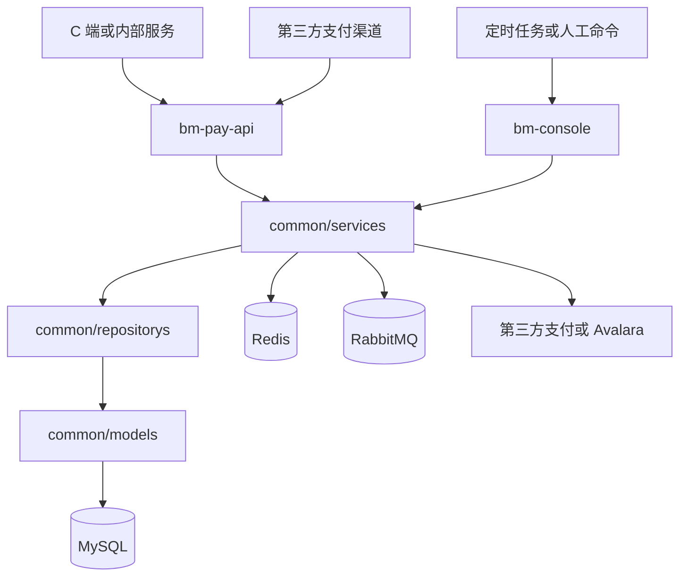
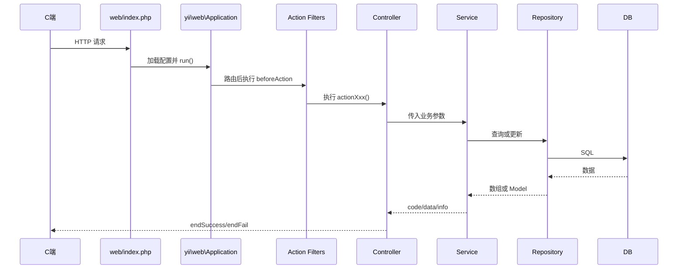
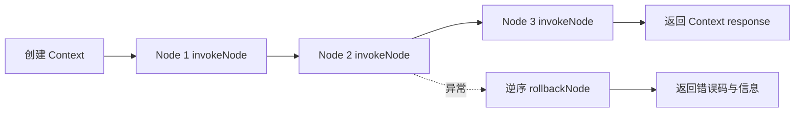
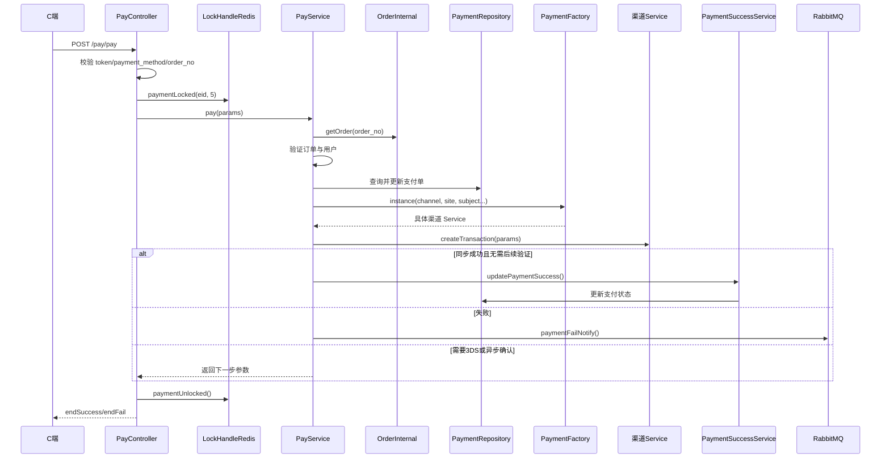
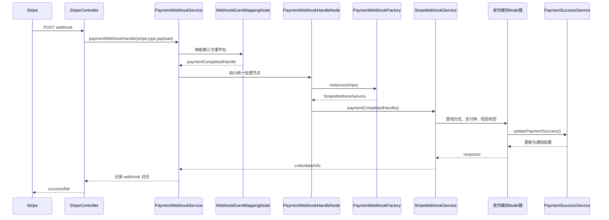
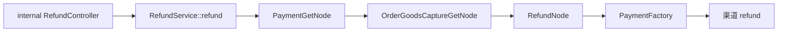

# 支付服务新手上手指南

> 本文面向第一次接触 PHP、Yii2 和支付系统的开发者。
>
> 对应代码仓库：`youngs/pay.internal.bm.com`
>
> 本文依据仓库中的真实代码、`AGENTS.md`、`README.md`、`composer.json` 和环境配置编写。支付系统持续演进，文末“待确认项”列出了不能仅靠当前代码安全下结论的内容。

## 1. 先建立整体认识

`pay.internal.bm.com` 是一个基于 PHP 7.x 与 Yii2 Advanced Template 的支付微服务。它不只是“调用第三方支付接口”，还承担：

- 为 C 端返回可用支付方式及支付参数；
- 创建支付意向和第三方交易；
- 处理授权、3DS、capture（捕获/扣款）；
- 接收 Stripe、PayPal、Airwallex、Worldpay、Afterpay、PingPong、Useepay 等渠道回调；
- 处理同步及异步退款；
- 记录支付过程、失败原因和请求响应；
- 通过 RabbitMQ 通知订单、ERP、售后等内部系统；
- 使用 Avalara 进行美国站点的税费预估、申报和退税；
- 提供 Console 脚本执行运维、数据修复、定时任务和受控调试。

核心依赖可以在以下文件中确认：

- `youngs/pay.internal.bm.com/composer.json`
- `youngs/pay.internal.bm.com/composer.lock`

主要依赖包括 Yii2、Yii2 Redis、php-amqplib、Braintree、Stripe、Klarna、Afterpay 和 Avalara AvaTax SDK。

### 1.1 最重要的心智模型

对新手而言，可以先把系统分成三条线：

1. **同步请求线**：浏览器或内部服务请求 Controller，Service 编排业务，Repository 读写数据库，支付渠道 Service 调第三方。
2. **异步事件线**：第三方 Webhook 或 RabbitMQ 消息触发后续状态更新、通知、退款和税务任务。
3. **运维任务线**：Console Controller 执行定时任务、补偿、迁移或调试。

不要把“用户页面显示支付成功”与“支付系统最终状态成功”理解为同一件事。支付最终状态可能来自同步返回，也可能稍后由 Webhook、轮询或 MQ 补偿确认。

---

## 2. 双应用结构

仓库顶层结构：

```text
pay.internal.bm.com/
├── bm-pay-api/     # Yii Web Application：HTTP API
├── bm-console/     # Yii Console Application：命令行任务
├── common/            # 两个应用共享的业务代码和基础设施
├── composer.json
├── composer.lock
├── README.md
├── AGENTS.md
└── yii                # Console 启动入口
```

### 2.1 Web 应用：bm-pay-api

入口文件：

`youngs/pay.internal.bm.com/bm-pay-api/web/index.php`

它负责：

1. 读取 `YII_ENV`；
2. 设置 `YII_DEBUG`；
3. 加载 Composer autoload；
4. 加载 Yii；
5. 加载应用 bootstrap 与合并后的配置；
6. 创建 `yii\web\Application`；
7. 执行路由匹配、Filter、Controller Action 并输出响应。

Controller 按调用来源继续分类：

| 目录 | 主要调用方 | 示例 |
|---|---|---|
| `bm-pay-api/controllers/` | C 端或通用 API | `PayController`、`TaxController` |
| `bm-pay-api/controllers/internal/` | 订单、售后等内部服务 | `internal/PayController`、`internal/RefundController` |
| `bm-pay-api/controllers/outer/` | 第三方支付渠道回调 | `outer/StripeController` |
| `bm-pay-api/controllers/storeapi/` | 门店系统 | `storeapi/PaymentMethodController` |

### 2.2 Console 应用：bm-console

入口文件：

`youngs/pay.internal.bm.com/yii`

它创建 `yii\console\Application`。常见命令形式：

```bash
php yii <controller-route>/<action> --option=value
```

Console Controller 主要分布在：

- `bm-console/controllers/pay/`：支付运维；
- `bm-console/controllers/tax/`：税务任务；
- `bm-console/controllers/test/`：受控调试脚本；
- `bm-console/controllers/once/`：一次性迁移或修复；
- `bm-console/controllers/CaptureController.php`：capture 相关任务。

Console 与 Web 应用共享 `common/services`、`common/repositorys` 和 `common/models`，所以业务逻辑原则上应该放在 Service，而不是复制到 Controller。

### 2.3 common 共享层

```text
common/
├── api/                  # 调用其他内部服务的 HTTP Wrapper
├── config/               # 公共及分环境配置
├── enums/                # 枚举和业务常量
├── factory/              # 支付渠道与 Webhook 工厂
├── libraries/App/Utils/  # 配置、日志、Node 引擎等工具
├── models/               # ActiveRecord Model
├── redis/                # Redis 封装
├── repositorys/          # 数据访问层（仓库历史拼写）
├── services/             # 业务服务
└── wrappers/             # 其他请求包装
```

注意：仓库目录使用历史拼写 `repositorys`，新增代码应遵循现有目录，不要自行改成 `repositories`。

### 2.4 双应用关系图



---

## 3. 环境、启动与配置

### 3.1 环境选择

Web 和 Console 入口都通过环境变量读取环境：

```php
getenv('YII_ENV') ?: 'dev'
```

通常有：

- `dev`：开发；
- `test`：测试；
- `pre`：预发布；
- `prod`：生产。

公共环境常量定义于：

`youngs/pay.internal.bm.com/common/config/bootstrap.php`

包括 `BM_ENV_DEV`、`BM_ENV_TEST` 和 `BM_ENV_PROD`。

仓库中没有 `.env` 文件。数据库、Redis、RabbitMQ、Elasticsearch、邮件、支付渠道与 Avalara 凭据均应由部署环境注入，不能把真实值写入代码或文档。

### 3.2 配置合并顺序

Web 应用的配置合并逻辑位于：

`youngs/pay.internal.bm.com/bm-pay-api/config/bootstrap.php`

主配置合并顺序：

```text
common/config/main.php
→ common/config/{YII_ENV}/main.php
→ bm-pay-api/config/main.php
```

参数配置合并顺序：

```text
common/config/params.php
→ common/config/{YII_ENV}/params.php
→ bm-pay-api/config/{YII_ENV}/params.php
→ bm-pay-api/config/params.php
```

后合并的配置会覆盖前面的同名项。排查“为什么配置不是预期值”时，必须按这个顺序逐层检查。

### 3.3 基础设施配置

`common/config/main.php` 注册了多个 Yii Component：

| Component | 作用 |
|---|---|
| `dbFecshop` | 主业务数据库 |
| `dbFecshopSlave` | 从库 |
| `bmNew` | 另一业务库 |
| `mallGa` | GA 数据库 |
| `redisBmMaster` | Redis 主连接 |
| `cache` | Yii FileCache |
| `elastic_product` | 商品 Elasticsearch |
| `elastic_content` | 内容 Elasticsearch |
| `elastic_order` | 订单 Elasticsearch |

调用方式通常是 `Yii::$app->dbFecshop` 或在 Repository 的 `getConnection()` 中返回对应 Component。

### 3.4 三类配置来源

#### A. 环境变量

稳定且敏感的基础设施、渠道账号和密钥通常通过 `getenv()` 读取，再放入 `Yii::$app->params`。

支付渠道配置集中在：

`youngs/pay.internal.bm.com/common/config/params.php`

例如 Stripe、PayPal、Airwallex 等按站点或支付主体组织配置。本文只说明结构，不展示任何真实值。

#### B. Nacos 动态配置

全局函数：

```php
g_config(string $module, string $key, $default = null)
```

定义链：

- `youngs/pay.internal.bm.com/common/libraries/App/fun_helpers.php`
- `youngs/pay.internal.bm.com/common/libraries/App/Utils/ConfigHelper.php`

`ConfigHelper` 从以下目录读取对应模块的 ini 文件：

```text
{NACOS_CONFIG_DIR 或 /data/www/nacos-config}/{module}.ini
```

模块名应使用 `ConfigHelper::$PAY`、`ConfigHelper::$MALL_COMMON` 等常量，不要手写 `'pay'` 字符串。读取动态配置时应给出安全、合理的默认值。

#### C. 数据库业务配置

支付主体、支付方式、参数等也可能来自数据库，由 `PaymentSubjectService`、`PaymentMethodService`、对应 Repository 管理。不要误以为所有支付方式开关都在 PHP 配置文件中。

### 3.5 支付主体和密钥如何关联

新主体逻辑的核心入口：

`common\services\pay\PayService::getPaymentChannelConfig()`

过程：

1. 根据站点、支付方式与主体类型判断是否使用新主体；
2. 调 `PaymentSubjectService::getPaymentSubjectInfo()` 查询主体信息；
3. 从主体信息取得 `client_id`；
4. 在 `Yii::$app->params[$paymentCompany . '_account']` 中查找对应账号配置；
5. 将该配置传给 `PaymentFactory` 和具体渠道 Service。

这意味着“选择支付渠道”和“选择哪个商户账号”是两个不同问题：

- 渠道：Stripe、PayPal、Airwallex 等；
- 主体/账号：某站点、某支付方式最终使用该渠道下的哪个商户账号。

---

## 4. Yii2 请求生命周期

以普通 API 请求为例：



### 4.1 BaseWebController

文件：

`youngs/pay.internal.bm.com/common/BaseWebController.php`

职责：

- 初始化当前平台 `REQUEST_PLATFORM`；
- 设置语言；
- 初始化 AB 实验数据；
- 使用 `endSuccess()`、`endFail()`、`endJson()` 输出统一 JSON；
- 对部分核心 Controller 记录请求响应；
- 根据错误码和语言文件格式化提示。

统一返回结构通常为：

```json
{
  "code": 1,
  "data": {},
  "info": ""
}
```

仓库约定 `code = 1` 表示成功。

### 4.2 BaseApiController

文件：

`youngs/pay.internal.bm.com/bm-pay-api/controllers/BaseApiController.php`

它在 `BaseWebController` 上增加：

- 将 GET 和 POST 合并到 `$requestParams`，同名字段以 POST 为准；
- 注册 `TokenFilter`；
- 注册 `CheckLoginFilter`；
- 注册 `ApiRequestResponseLogger`。

注意：当前 `TokenFilter::beforeAction()` 本身只是占位实现。不能仅凭类名断言接口已经完成鉴权；实际权限边界必须结合 `CheckLoginFilter`、网关、路由和部署配置确认。

---

## 5. Controller / Service / Repository / Model 四层架构

项目 README 明确规定：

```text
Controller（业务编排、返回格式化）
→ Service（业务逻辑）
→ Repository（数据库操作）
→ Model（ActiveRecord 映射）
```

### 5.1 Controller：接收和转换请求

Controller 应负责：

- 获取请求参数；
- 做轻量、明确的参数校验；
- 调用 Service；
- 捕获异常并转换为对外响应；
- 使用 `endSuccess()` / `endFail()`；
- 避免泄露堆栈、渠道响应和敏感字段。

Controller 不应：

- 直接操作 Model；
- 拼复杂 SQL；
- 承担可复用业务规则；
- 直接调用第三方支付 SDK；
- 直接 curl 其他内部服务。

### 5.2 Service：业务规则和流程编排

基类：

`youngs/pay.internal.bm.com/common/BaseService.php`

常见调用：

```php
PayService::instance()->pay($params);
```

`instance()` 通过 Yii DI 容器注册并获取单例。Service 通常返回：

```php
[
    'code' => 1,
    'data' => $data,
    'info' => '',
]
```

复杂 Service 可以：

- 调多个 Repository；
- 调 `common/api` 内网 Wrapper；
- 选择支付渠道；
- 调 Node 引擎；
- 写 Redis 或 MQ；
- 组织领域级返回值。

### 5.3 Repository：数据访问边界

基类：

`youngs/pay.internal.bm.com/common/BaseRepository.php`

职责：

- 封装查询条件；
- 调用 ActiveRecord 或 Query Builder；
- 指定数据库连接；
- 管理软删除条件；
- 屏蔽表结构细节。

项目目录使用 `repositorys`。README 还规定：返回对象的方法名应体现 `Obj`/`Object`，避免调用方误判返回类型。

### 5.4 Model：表映射

示例：

`youngs/pay.internal.bm.com/common/models/pay/Payment.php`

`Payment` 是 `payment` 表的 ActiveRecord，字段包括：

- 支付单号与业务单号；
- 站点、币种和金额；
- 支付状态；
- 支付方式和渠道公司；
- 第三方交易 ID；
- capture 状态；
- 创建、更新时间和 `del_flag`。

Model 应以表映射、字段规则和基础关系为主。业务编排不要塞进 Model。

### 5.5 调用其他内部系统

必须使用 `common/api/` 下的 Wrapper，例如：

- `OrderInternal`；
- `AfterInternal`；
- `UserInternal`；
- `GoodsInternal`；
- `PayInternal`。

示例：`PayService::pay()` 通过 `OrderInternal::getOrder()` 获取订单，而不是在 Service 内直接写 HTTP 请求。

---

## 6. Node 执行引擎

文件：

`youngs/pay.internal.bm.com/common/libraries/App/Utils/NodeExecutionEngine.php`

支付、退款、capture 和 Webhook 都包含较长流程。如果全部写进一个 Service 方法，会产生巨大且难测试的函数。仓库将复杂流程拆成：

- **Context**：在节点之间传递数据；
- **Node**：只处理一个步骤；
- **Node Chain**：定义执行顺序；
- **Engine**：依次执行，并在失败时逆序调用回滚。

### 6.1 执行模型



核心约定：

```php
$result = NodeExecutionEngine::instance()
    ->executeEngine($context, $nodeChain);
```

每个节点继承 `common\BaseNode`，实现：

- `invokeNode($context)`：执行；
- `rollbackNode($context)`：补偿或回滚。

### 6.2 为什么不能把它当数据库事务

Node 回滚不是数据库事务的同义词：

- 调第三方渠道通常不可自动回滚；
- MQ 已发送后可能无法撤回；
- 每个 Node 的 `rollbackNode()` 可能为空；
- 网络超时可能出现“本地认为失败，但第三方已成功”。

因此，新节点必须明确回答：

1. 该步骤是否可重入？
2. 重复执行会怎样？
3. 失败后能否回滚？
4. 无法回滚时如何补偿？
5. Context 中哪些字段是前置条件？

### 6.3 真实 Node 链示例

退款创建 `RefundService::refundCreate()`：

```text
GetPaymentNode
→ RefundVerifyNode
→ RefundCreateNode
→ AddRefundHandleMqNode
```

capture `PayService::capture()`：

```text
PaymentGetNode
→ PaymentCaptureCheckNode
→ PaymentCaptureNode
→ OrderGoodsCaptureCreateNode
```

Stripe 支付成功 Webhook：

```text
PaymentMethodGetNode
→ PaymentGetDetailNode
→ PaymentSuccessInfoCheckNode
→ PaymentSuccessNotifyNode
```

---

## 7. 支付方式、渠道公司与工厂

### 7.1 三个容易混淆的概念

1. **payment_method（支付方式）**：用户看到或系统使用的方式，例如 Stripe 信用卡、PayPal Pay Later。
2. **payment_channel_company（渠道公司）**：真正提供支付能力的公司，例如 Stripe、PayPal。
3. **payment_subject（支付主体）**：收款商户主体或账号。

这些定义集中在：

`youngs/pay.internal.bm.com/common/repositorys/pay/PaymentRepository.php`

`PaymentRepository::$payChannelMappings` 把支付方式映射到渠道公司。解析入口：

```php
PayService::getPayChannelByMethod($paymentMethod)
```

### 7.2 PaymentFactory

文件：

`youngs/pay.internal.bm.com/common/factory/payment/PaymentFactory.php`

调用形式：

```php
PaymentFactory::instance(
    $paymentCompany,
    $site,
    $cardInfo,
    $paymentSubject,
    $paymentMethod,
    $paymentSubjectType
);
```

工厂的工作：

1. 根据支付主体解析渠道账号配置；
2. 根据 `$paymentCompany` 选择 Service；
3. 初始化站点、账号、卡参数等；
4. 返回实现了 `PaymentInterface` 的实例。

当前真实渠道包括：

- Braintree；
- Klarna；
- Affirm；
- Airwallex；
- Stripe；
- Worldpay；
- Bank Transfer；
- PayPal；
- Afterpay；
- PingPong；
- Useepay；
- Other Pay。

### 7.3 PaymentInterface

文件：

`youngs/pay.internal.bm.com/common/factory/payment/PaymentInterface.php`

它统一描述渠道能力，包括：

- `getPaymentParameters()`：获取支付参数；
- `createTransaction()`：创建交易；
- `capture()`：捕获金额；
- `getPaymentDetail()`：查询支付详情；
- `createOrder()`：创建意向单；
- `refund()`：退款；
- `authorizeOrder()`：3DS/授权处理；
- `confirmPayment()`：确认支付；
- 支付凭证创建、查询、更新、删除；
- 争议查询、上传证据、接受或上诉；
- 线下终端支付和取消；
- 卡信息 lookup。

默认实现：

`youngs/pay.internal.bm.com/common/services/payment/DefaultPaymentService.php`

它对未支持的方法返回统一“不支持”错误。因此新渠道通常继承 `DefaultPaymentService`，只重写自己支持的能力。

### 7.4 渠道能力不是完全一致的

虽然接口统一，但各渠道有差异：

- 有的同步成功，有的必须等待 Webhook；
- 有的先授权后 capture；
- 有的支持部分退款，有的限制更多；
- 金额单位可能是元，也可能是最小货币单位；
- 3DS 与 redirect 流程不同；
- 凭证保存、争议和终端能力不同。

调用方必须根据统一返回字段处理，而不能假设所有渠道行为一致。

---

## 8. 真实链路一：C 端统一支付

入口：

`AppPayApi\controllers\PayController::actionPay()`

文件：

`youngs/pay.internal.bm.com/bm-pay-api/controllers/PayController.php`

### 8.1 总体时序



### 8.2 逐步追踪

#### 第 1 步：参数与渠道判断

`PayController::actionPay()` 检查 `token`、`payment_method`，调用：

```text
PayService::getPayChannelByMethod()
```

Klarna 有兼容逻辑：可能通过 `payment_no` 反查业务订单号。

#### 第 2 步：Redis 防重复提交

符号：

```text
LockHandleRedis::paymentLocked()
```

锁键主要来自 `eid`。成功获得防重复控制后才进入支付。异常路径应释放锁，避免用户长时间无法重试。

#### 第 3 步：保存账单地址

符号：

```text
BillAddressService::billAddressSave()
```

随后调用：

```text
PayService::pay($params)
```

#### 第 4 步：读取订单

`PayService::pay()` 调：

```text
OrderInternal::getOrder($orderNo)
```

绝对路径：

`youngs/pay.internal.bm.com/common/api/OrderInternal.php`

它请求订单内部服务，而不是直接查询订单服务数据库。

#### 第 5 步：验证并确定支付单

Service 检查：

- 订单是否已经支付；
- 用户与 token 是否匹配；
- 当前订单状态是否允许支付；
- 原始支付单与支付意向参数；
- 支付方式和渠道映射。

主要 Repository：

```text
PaymentRepository::getByPaymentNo()
PaymentRepository::updateByPaymentId()
PaymentMethodParameterRepository::getByOrderNo()
```

#### 第 6 步：选择支付主体和渠道 Service

先调用：

```text
PaymentSubjectService::getPaymentSubjectName()
```

再调用：

```text
PaymentFactory::instance(...)->createTransaction($createParams)
```

如果渠道是 Stripe，最终进入：

```text
common\services\payment\StripeService::createTransaction()
```

#### 第 7 步：处理结果

成功后：

- 处理支付过程事件；
- 如果渠道表示不需要等待后续确认，构造 `UpdatePaymentSuccessInput`；
- 调 `PaymentSuccessService::updatePaymentSuccess()`；
- 更新支付单并通知内部系统；
- 删除响应中的第三方原始信息，避免对外暴露。

失败后：

- 格式化错误；
- 通过 `MqService::paymentFailNotify()` 发送支付失败事件；
- 返回可用于前端处理的统一错误信息。

Controller 在日志前主动移除 `card_info`。新增敏感字段时也必须同步脱敏或删除。

### 8.3 关键符号索引

| 符号 | 绝对路径 |
|---|---|
| `PayController::actionPay` | `youngs/pay.internal.bm.com/bm-pay-api/controllers/PayController.php` |
| `PayService::pay` | `youngs/pay.internal.bm.com/common/services/pay/PayService.php` |
| `OrderInternal::getOrder` | `youngs/pay.internal.bm.com/common/api/OrderInternal.php` |
| `PaymentRepository` | `youngs/pay.internal.bm.com/common/repositorys/pay/PaymentRepository.php` |
| `PaymentFactory::instance` | `youngs/pay.internal.bm.com/common/factory/payment/PaymentFactory.php` |
| `PaymentSuccessService::updatePaymentSuccess` | `youngs/pay.internal.bm.com/common/services/pay/PaymentSuccessService.php` |

---

## 9. Webhook 架构与 Stripe 真实链路

Webhook 是第三方渠道主动调用本服务的 HTTP 请求。它常用于确认：

- 支付成功、失败或处理中；
- capture 完成；
- 退款状态；
- 争议变化；
- 终端支付结果；
- 支付凭证验证结果。

### 9.1 两级工厂与事件映射

Webhook 的统一入口 Service：

`common\services\pay\PaymentWebhookService`

文件：

`youngs/pay.internal.bm.com/common/services/pay/PaymentWebhookService.php`

它维护第三方事件名到内部方法名的映射，例如 Stripe：

```text
payment_intent.succeeded
→ paymentCompletedHandle
```

节点链：

```text
WebhookEventMappingNode
→ PaymentWebhookHandleNode
```

`PaymentWebhookHandleNode` 调用：

```text
PaymentWebhookFactory::instance($paymentCompany)
```

得到具体的 `StripeWebhookService`、`PaypalWebhookService` 等，再动态执行内部事件处理方法。

### 9.2 Stripe 支付成功链路

入口：

`AppPayApi\controllers\outer\StripeController::actionWebhook()`



`StripeWebhookService::paymentCompletedHandle()` 创建 Context，并执行：

```text
PaymentMethodGetNode
→ PaymentGetDetailNode
→ PaymentSuccessInfoCheckNode
→ PaymentSuccessNotifyNode
```

其中 `PaymentSuccessInfoCheckNode` 用于校验状态、金额和交易 ID；`PaymentSuccessNotifyNode` 会先检查支付单是否已经支付，避免重复通知，然后调用：

```text
PaymentSuccessService::updatePaymentSuccess()
```

### 9.3 3DS 回调补充

Stripe 3DS 回调入口：

```text
StripeController::actionConfirmCallback()
```

处理流程：

1. 读取 `payment_intent`；
2. 通过 `PaymentMethodParameterRepository` 查支付参数；
3. 调 `PayService::confirmPaymentByCompanyCallback()`；
4. 使用 `PaymentRedis::setPayStatus()` 写入结果；
5. 前端轮询读取结果。

### 9.4 Webhook 安全原则

Webhook 不能只凭 payload 中的事件名更新支付状态。必须考虑：

- 校验渠道签名、时间戳和来源；
- 使用原始 body 参与验签时，不要先做破坏性转换；
- 通过支付单号和第三方交易 ID 关联；
- 校验币种和金额；
- 对重复事件幂等；
- 保存可审计日志，但必须脱敏；
- 未知事件应安全忽略或返回明确结果；
- 处理超时后，渠道可能重试，不能产生重复扣款或重复通知。

仓库各渠道验签实现并不完全一致。修改前必须阅读该渠道 Controller、Webhook Service 和底层 SDK 调用，不能照搬其他渠道。

### 9.5 关键符号索引

| 符号 | 绝对路径 |
|---|---|
| `StripeController::actionWebhook` | `youngs/pay.internal.bm.com/bm-pay-api/controllers/outer/StripeController.php` |
| `PaymentWebhookService::paymentWebhookHandle` | `youngs/pay.internal.bm.com/common/services/pay/PaymentWebhookService.php` |
| `PaymentWebhookFactory::instance` | `youngs/pay.internal.bm.com/common/factory/webhook/PaymentWebhookFactory.php` |
| `PaymentWebhookHandleNode::invokeNode` | `youngs/pay.internal.bm.com/common/services/pay/nodes/webhook/PaymentWebhookHandleNode.php` |
| `StripeWebhookService::paymentCompletedHandle` | `youngs/pay.internal.bm.com/common/services/webhook/StripeWebhookService.php` |
| `PaymentSuccessNotifyNode::invokeNode` | `youngs/pay.internal.bm.com/common/services/pay/nodes/pay/PaymentSuccessNotifyNode.php` |

---

## 10. 退款

仓库同时存在较新的统一退款链路和部分历史异步退款链路。阅读时应先确认调用入口。

### 10.1 内网统一退款

入口：

```text
AppPayApi\controllers\internal\RefundController::actionRefund()
```

它调用：

```text
RefundService::refund(
    $paymentNo,
    $amount,
    $currency,
    $handler,
    $refundNo
)
```

Node 链：

```text
PaymentGetNode
→ OrderGoodsCaptureGetNode
→ RefundNode
```

`RefundNode`：

1. 检查支付单是否存在；
2. 对必须先 capture 的支付方式检查 capture 记录；
3. 提取 capture ID；
4. 使用 `PaymentFactory` 创建原渠道实例；
5. 调用渠道 `refund()`；
6. 将第三方 refund ID、处理中状态等写入 Context response。



### 10.2 退款申请与异步处理

普通 `RefundController::actionApplyRefund()` 调 `RefundService::refundCreate()`。

Node 链：

```text
GetPaymentNode
→ RefundVerifyNode
→ RefundCreateNode
→ AddRefundHandleMqNode
```

对部分原路退款方式，`AddRefundHandleMqNode` 调：

```text
RefundService::addRefunHandleMq()
```

消息写入 `refund_handle_mq`，失败后按次数延迟重试，并通过企业微信告警。历史逻辑中还存在 `RefundByPayMethodNode`，处理 Braintree/Affirm 等旧支付方式。

### 10.3 退款必须检查的规则

- 退款单是否存在；
- 支付单是否已支付；
- 第三方交易 ID 是否存在；
- 退款币种是否与支付一致；
- 本次金额是否大于零；
- 累计成功退款金额是否超过实付金额；
- 是否已退款成功或已取消；
- 渠道是否要求 capture ID；
- 是否支持部分退款；
- 重试是否会导致重复退款；
- 第三方超时后如何查询最终状态；
- MQ 重试次数和人工补偿入口。

金额累计代码中可见 `bcadd()`、`bcsub()`，说明金额精度不能用普通浮点运算。

关键文件：

- `youngs/pay.internal.bm.com/bm-pay-api/controllers/RefundController.php`
- `youngs/pay.internal.bm.com/bm-pay-api/controllers/internal/RefundController.php`
- `youngs/pay.internal.bm.com/common/services/pay/RefundService.php`
- `youngs/pay.internal.bm.com/common/services/pay/nodes/refund/RefundNode.php`
- `youngs/pay.internal.bm.com/common/services/pay/nodes/refund/RefundByPayMethodNode.php`

---

## 11. Avalara 税务模块

项目使用 `avalara/avataxclient`。税务入口：

`youngs/pay.internal.bm.com/bm-pay-api/controllers/TaxController.php`

主要能力：

| Action | Service | 含义 |
|---|---|---|
| `actionGetEstimateTaxInfo` | `TaxService::orderEstimateTaxInfo()` | 结算页预估税 |
| `actionCommitTransaction` | `CommitTransactionService::startCommit()` | 记录实收数据，不直接向第三方申报 |
| `actionCommitTransactionActual` | `CommitActualTransactionService::startCommit()` | 记录并调用 Avalara 申报 |
| `actionRefundCalculate` | `TaxCalculateService::refundCalculate()` | 计算退税 |
| `actionRefundTransaction` | 相关退税 Service | 执行退税交易 |

### 11.1 预估税流程

`TaxService::orderEstimateTaxInfo()` 大致执行：

1. 格式化用户和地址；
2. 根据用户 ID、邮箱、地址关联登录用户；
3. 调 `ParamsVerifyService` 校验参数；
4. 检查站点是否允许；
5. 设置站点时区；
6. 合并同 SKU 商品；
7. 调预估交易 Service；
8. 记录税务请求日志。

`TaxBaseService::ALLOW_SITE` 当前代码只包含 `us`。这不意味着未来永远只支持美国，应以代码和业务配置共同确认。

### 11.2 税务配置

分环境参数位于：

```text
common/config/dev/params.php
common/config/test/params.php
common/config/pre/params.php
common/config/prod/params.php
```

`ava_tax` 配置包括：

- Avalara 环境；
- 应用标识；
- 账号和许可证引用；
- 公司主体配置；
- 线下主体切换时间；
- 差额告警阈值。

所有账号和许可证只应通过环境变量引用。不要在日志、文档或测试数据中输出真实值。

### 11.3 税务 Console 与 MQ

Console 目录：

`youngs/pay.internal.bm.com/bm-console/controllers/tax/`

真实示例：

```bash
php yii tax/avalara/download-tax-rates-by-region --state_code=...
```

MQ 配置中存在 `tax_declare_mq`，用于延迟税费申报或任务处理。税务模块还有任务表与补偿 Service，不能把 HTTP 返回成功等同于 Avalara 最终申报成功。

---

## 12. DB、Redis、MQ 和日志

### 12.1 数据库

Repository 决定连接和查询方式。支付域核心表可从 Model 与 Repository 看到：

- `payment`；
- `payment_method_parameter`；
- `payment_credential`；
- `refund` 与退款商品；
- `order_goods_capture`；
- 支付过程与第三方日志；
- webhook 日志；
- Avalara 税务申报、明细和任务表。

数据库开发规则：

- Controller/Service 不直接操作 Model；
- 查询必须考虑 `del_flag = 0`；
- 删除使用 `UPDATE del_flag = 1`；
- 时间使用 Unix 时间戳 int；
- 新表包含 `created_at`、`updated_at`、`del_flag`；
- 金额字段应使用数据库 decimal/string 语义，不使用二进制浮点数保存。

### 12.2 Redis

Redis 封装目录：

`youngs/pay.internal.bm.com/common/redis/`

重要类：

| 类 | 用途 |
|---|---|
| `LockHandleRedis` | 支付、开始支付等防重锁 |
| `PaymentRedis` | 支付状态，如 3DS 回调后给前端轮询 |
| `OrderRedis` | 订单缓存 |
| `TaxRedis` | 税务缓存 |
| `ConfigRedis` | 配置缓存 |
| `MqRedis` | MQ 相关辅助状态 |

使用锁时必须设计：

- 唯一且稳定的 lock key；
- 合理 TTL；
- `finally` 或所有异常路径释放；
- 只由锁持有者释放；
- 锁超时与第三方请求耗时的关系；
- Redis 故障时是否允许继续。

### 12.3 RabbitMQ

底层封装：

```text
App\Utils\RabbitMq
```

业务封装：

`youngs/pay.internal.bm.com/common/services/common/MqService.php`

主要配置位于 `common/config/params.php`：

| 配置键 | 作用 |
|---|---|
| `payment_paid_notify_mq` | 支付完成通知 |
| `order_pay_success_delay_mq` | 延迟通知订单/ERP |
| `refund_handle_mq` | 异步退款 |
| `refund_success_internal_notify_mq` | 退款成功内网通知重试 |
| `payment_process_notify` | 支付过程事件 |
| `payment_fail_notify` | 支付失败 |
| `start_payment_notify` | 开始支付事件 |
| `dispute_change_mq` | 争议变更 |
| `tax_declare_mq` | 税务申报 |

API 侧 MQ 消费入口：

`youngs/pay.internal.bm.com/bm-pay-api/controllers/MqConsumeController.php`

消息设计必须考虑：

- 至少一次投递导致的重复消费；
- 消息唯一键；
- 消费幂等；
- 重试和死信；
- 延迟时间单位；
- 消费失败时的告警；
- schema 兼容；
- 敏感字段不得进入消息。

### 12.4 日志

统一函数：

```php
g_log_info($filename, $message, $context);
g_log_warning($filename, $message, $context);
g_log_error($filename, $message, $context);
```

定义于：

- `youngs/pay.internal.bm.com/common/libraries/App/fun_helpers.php`
- `youngs/pay.internal.bm.com/common/libraries/App/Utils/LogHelper.php`

日志文件由：

`youngs/pay.internal.bm.com/common/components/LogFileTarget.php`

输出到按日期组织的 runtime 日志目录。是否记录受 Nacos 的 `IS_RECORD_LOG` 控制。

必须避免记录：

- 完整卡号；
- CVV；
- 渠道 secret、private key、webhook secret；
- 完整 access token；
- 未脱敏邮箱、电话、地址；
- 第三方原始响应中可能包含的敏感字段。

当前代码中仍可见少量历史 `Yii::error()` 和过度记录上下文的写法。新代码必须使用 `g_log_*`，历史风险只在专项治理时处理，不要在功能需求中顺手大范围重构。

---

## 13. 金额、幂等、锁与密钥安全

### 13.1 金额精度

PHP `float` 是二进制浮点数，不能安全表示所有十进制金额。例如 `0.1 + 0.2` 不一定精确等于 `0.3`。

支付系统应：

- 使用 BCMath：`bcadd`、`bcsub`、`bcmul`、`bccomp`；
- 明确每个渠道的金额单位；
- 转换最小货币单位时明确舍入规则；
- 不使用宽松比较判断金额；
- 同时校验 amount 与 currency；
- 汇率计算明确精度和舍入位置；
- 日志中保留计算前后值，但不记录敏感支付数据。

### 13.2 幂等

典型幂等键：

- 支付：支付单号或渠道 idempotency key；
- Webhook：渠道 event ID；
- 退款：退款单号；
- MQ：业务单号 + 事件类型；
- capture：支付单号 + capture 批次/商品。

常见策略：

- 数据库唯一索引；
- 状态机前置判断；
- Redis 锁；
- 原子更新；
- 第三方幂等 API；
- 处理日志表记录 event ID。

只加 Redis 锁不等于完成幂等：锁过期、进程崩溃、重复消息和跨服务重试都可能绕过锁。

### 13.3 状态机

`PaymentRepository` 定义的支付状态包括：

- 未支付；
- 已支付；
- 已关闭；
- 已支付待审核；
- 处理中。

还有 capture 状态和内部通知状态。修改状态前必须检查合法迁移，避免：

- 已支付被失败回调覆盖；
- 已关闭支付单重新成功；
- 重复 capture；
- 重复退款；
- “第三方成功、本地失败”无人补偿。

### 13.4 密钥安全

必须：

- 从 env 或受控 Nacos 配置读取；
- 按环境、站点、主体隔离；
- 禁止提交真实值；
- 禁止在异常、日志、MQ 或 API 响应中输出；
- 测试使用沙箱账号；
- 轮换后验证旧 webhook 与进行中交易的兼容；
- 限制生产配置访问权限。

仓库存在历史硬编码敏感配置风险。本文不复制其值。新开发遇到时应登记安全治理项并与负责人确认轮换，不能只删除代码而不处理线上兼容与凭据轮换。

---

## 14. 第一次新增支付渠道检查表

### 14.1 需求与渠道能力

- [ ] 明确支持站点、币种和国家；
- [ ] 明确支付方式名称、渠道公司常量和展示名称；
- [ ] 明确同步/异步、授权/capture、3DS/redirect；
- [ ] 明确全额/部分退款、退款时限和退款回调；
- [ ] 明确争议、凭证、Apple Pay/Google Pay 等能力；
- [ ] 明确金额单位、最小/最大金额和舍入规则；
- [ ] 明确沙箱和生产 endpoint；
- [ ] 明确幂等键、超时、重试和限流。

### 14.2 代码接入

- [ ] 在 `PaymentRepository` 增加渠道和支付方式常量；
- [ ] 更新 `$payChannelMappings`；
- [ ] 如需风控/capture，检查 params 中对应 method list；
- [ ] 新增继承 `DefaultPaymentService` 的渠道 Service；
- [ ] 实现必要的 `PaymentInterface` 方法；
- [ ] 更新 `PaymentFactory::instance()`；
- [ ] 新增支付主体与账号配置映射；
- [ ] 配置走 env/Nacos，不写真实密钥；
- [ ] 如有 webhook，新增 outer Controller；
- [ ] 新增 Webhook Service；
- [ ] 更新 `PaymentWebhookFactory`；
- [ ] 更新 `PaymentWebhookService::$eventList`；
- [ ] 实现签名验证和 event ID 幂等；
- [ ] 需要复杂编排时新增 Context/Node；
- [ ] 增加错误码和多语言文本；
- [ ] 所有日志脱敏。

### 14.3 数据与发布

- [ ] 明确需要的表字段、索引和唯一约束；
- [ ] DDL 包含时间戳与 `del_flag`；
- [ ] 明确支付方式、主体和站点的初始化数据；
- [ ] 明确 Nacos 配置键与默认值；
- [ ] 明确生产密钥注入和轮换流程；
- [ ] 明确灰度开关、回滚开关和主体切换时间；
- [ ] 明确监控、告警和人工补偿入口；
- [ ] 验证旧支付方式不受影响。

### 14.4 测试

- [ ] 正常支付；
- [ ] 重复点击支付；
- [ ] 第三方超时；
- [ ] 同步成功但本地更新失败；
- [ ] Webhook 先于同步响应；
- [ ] Webhook 重复、乱序、伪造；
- [ ] 3DS 成功、失败、取消；
- [ ] 全额与部分退款；
- [ ] 重复退款和退款超额；
- [ ] capture 成功、失败、重复；
- [ ] 不同币种和金额边界；
- [ ] 沙箱与生产配置隔离；
- [ ] 日志、响应、MQ 无敏感字段。

---

## 15. 第一次新增接口检查表

- [ ] 确定 API 属于 C 端、internal、outer 还是 storeapi；
- [ ] 选择正确 Controller 基类；
- [ ] 确认网关、登录和服务间鉴权要求；
- [ ] 参数校验失败返回稳定错误码；
- [ ] Controller 只做请求适配和响应；
- [ ] 业务逻辑进入 Service；
- [ ] DB 操作进入 Repository；
- [ ] 跨服务请求进入 `common/api` Wrapper；
- [ ] 枚举进入 `common/enums`；
- [ ] 使用 `endSuccess` / `endFail`；
- [ ] 使用 `g_log_*`，并脱敏；
- [ ] 检查并发、幂等和重试；
- [ ] 检查超时和异常是否泄露第三方信息；
- [ ] 提供 HTTP 测试和必要的 Console 测试入口；
- [ ] 验证错误路径，而不只验证成功路径。

---

## 16. 调试、测试与排障

### 16.1 本地初始化

基础依赖安装：

```bash
composer install
```

启动前需要准备开发环境变量和依赖服务。不要使用生产账号测试。实际启动命令、容器和域名以团队本地环境文档为准。

### 16.2 Yii Debug 与 Gii

在 dev 环境，`bm-pay-api/config/bootstrap.php` 会启用：

- Yii Debug；
- Gii；
- DB、Router、Request、Log、Timeline、HTTP Client 等面板。

Debug/Gii 配置允许范围较宽，只能在受控开发环境使用，不能暴露到公网或生产。

### 16.3 Console 调试

仓库已有：

`youngs/pay.internal.bm.com/bm-console/controllers/test/`

可用于参考如何构造支付、Webhook 和过程事件测试。但现有脚本可能包含历史业务数据示例，执行前必须：

1. 阅读完整 action；
2. 确认环境；
3. 替换为沙箱测试单；
4. 确认不会操作生产渠道；
5. 确认是否写库、发 MQ 或发企业微信。

### 16.4 自动化测试现状

`composer.json` 含 Codeception、PHPUnit 和 Faker 等开发依赖，但仓库当前没有完整的 `tests/` 目录。不能声称已有充分自动化覆盖。

支付改动至少应提供：

- Service/金额算法单元测试（若现有框架可用）；
- HTTP 接口测试；
- Console 脚本测试；
- 沙箱端到端支付与回调测试；
- 重复回调和异常路径测试；
- 对数据库、Redis、MQ 状态的断言。

### 16.5 通用排障顺序

支付问题不能只读代码猜测。建议按以下顺序：

1. **确认环境**：dev/test/pre/prod 是否一致；
2. **确认输入**：订单号、支付单号、退款单号、渠道交易 ID；
3. **查数据库**：支付、参数、capture、退款、过程和 webhook 日志；
4. **查请求响应日志**：注意脱敏；
5. **查第三方状态**：只使用对应环境渠道后台/API；
6. **查 Redis**：锁是否残留、3DS 状态是否写入；
7. **查 MQ**：是否发送、消费、重试或进入死信；
8. **查内部通知**：订单/售后系统是否接收；
9. **对照状态机**：是否出现乱序或非法迁移；
10. **再读代码**：沿实际数据进入的分支追踪。

### 16.6 常见故障速查

#### 用户频繁操作

检查：

- `LockHandleRedis` 的键；
- 是否异常路径未解锁；
- TTL 是否过长；
- 同一 `eid` 是否被多个订单复用。

#### 第三方已成功，本地仍未支付

检查：

- 同步响应是否超时；
- Webhook 是否到达并验签；
- `PaymentSuccessInfoCheckNode` 是否因金额或交易 ID 拒绝；
- `PaymentSuccessService` 是否更新失败；
- 内部通知是否失败；
- 是否有 MQ/Console 补偿。

#### 重复退款

检查：

- 退款单号是否唯一；
- 本地状态是否在调第三方前后正确更新；
- 渠道是否支持 idempotency key；
- MQ 是否重复消费；
- 第三方超时后是否直接重试而未先查询。

#### 支付方式不展示

检查：

- 支付方式数据库配置；
- 站点、国家、币种、页面来源；
- 金额上下限；
- AB 实验；
- 支付主体配置；
- Nacos 动态开关；
- 渠道账号配置是否能解析。

#### Avalara 结果异常

检查：

- 当前站点是否在 `ALLOW_SITE`；
- 地址、ZIP、州和商品税码；
- 是否合并了相同 SKU；
- 公司主体类型；
- Avalara 环境和请求日志；
- 预估、实收、实报阶段是否混淆。

---

## 17. 第一周阅读计划

### 第 1 天：Yii2 与启动流程

阅读：

1. `README.md`
2. `AGENTS.md`
3. `composer.json`
4. `bm-pay-api/web/index.php`
5. `bm-pay-api/config/bootstrap.php`
6. `common/config/bootstrap.php`
7. `common/config/main.php`
8. `common/BaseWebController.php`
9. `bm-pay-api/controllers/BaseApiController.php`

目标：能解释请求如何进入 Action、配置如何合并、响应如何输出。

### 第 2 天：四层架构

阅读：

1. `PayController::actionPay`
2. `PayService::pay`
3. `PaymentRepository`
4. `models/pay/Payment.php`
5. `common/api/OrderInternal.php`

目标：能说清 Controller、Service、Repository、Model 和内网 Wrapper 的边界。

### 第 3 天：渠道抽象

阅读：

1. `PaymentInterface.php`
2. `DefaultPaymentService.php`
3. `PaymentFactory.php`
4. `StripeService.php` 的构造与一个核心方法
5. `PaymentSubjectService.php`
6. `PayService::getPaymentChannelConfig`

目标：能从 payment_method 追到具体渠道账号和 Service。

### 第 4 天：Node 与 Webhook

阅读：

1. `NodeExecutionEngine.php`
2. `BaseNode.php`
3. `PaymentWebhookService.php`
4. `PaymentWebhookFactory.php`
5. `StripeWebhookService::paymentCompletedHandle`
6. 四个支付成功 Node

目标：手画 Stripe webhook 时序图，并指出幂等检查位置。

### 第 5 天：退款、税务和异步系统

阅读：

1. `RefundService.php`
2. `RefundNode.php`
3. `MqService.php`
4. `MqConsumeController.php`
5. `TaxController.php`
6. `TaxService.php`
7. `TaxBaseService.php`
8. `bm-console/controllers/tax/`

目标：区分同步调用、Webhook、MQ 和 Console 补偿。

### 第一周实践任务

- 用测试数据画出一条支付状态流，不执行真实支付；
- 找到一个支付方式对应的渠道、主体和配置引用；
- 追踪一次重复 Webhook 如何被短路；
- 写一份退款超时排障清单；
- 检查一个日志调用是否可能泄露敏感信息；
- 在导师确认的开发环境执行一个只读 Console 命令。

---

## 18. 术语表

| 术语 | 含义 |
|---|---|
| Payment | 本系统支付单 |
| Payment Method | 用户选择的支付方式 |
| Payment Channel/Company | 提供支付能力的渠道公司 |
| Payment Subject | 收款主体/商户账号 |
| Payment Intent | 第三方支付意向，尚不一定完成扣款 |
| Transaction ID | 第三方交易 ID |
| Authorization | 授权额度，未必已经实际扣款 |
| Capture | 对已授权金额进行捕获/收款 |
| Settlement | 渠道侧结算 |
| 3DS | 银行卡强认证流程 |
| Webhook | 第三方主动推送的 HTTP 回调 |
| Refund | 退款 |
| Partial Refund | 部分退款 |
| Dispute | 持卡人争议/拒付 |
| Credential | 保存的支付凭证或卡 token |
| Idempotency | 同一请求重复执行仍只产生一次业务效果 |
| Context | Node 链共享的数据对象 |
| Node | Node 引擎中的单一业务步骤 |
| Rollback/Compensation | 失败后的回滚或补偿 |
| MQ | RabbitMQ 异步消息 |
| Delayed Message | 延迟一段时间后消费的消息 |
| Nacos | 动态配置中心，本项目以同步后的 ini 文件读取 |
| Avalara/AvaTax | 第三方税务计算与申报平台 |
| Estimate Tax | 结算页预估税 |
| Commit Transaction | 向税务系统记录/提交交易 |
| Soft Delete | 用 `del_flag=1` 标记删除，不物理 DELETE |
| Repository | 封装数据库访问的层 |
| ActiveRecord | Yii2 中表与 PHP 对象的映射模式 |

---

## 19. 待确认项

以下内容不能仅凭当前仓库安全确定，开始相关开发前应向负责人确认：

1. 当前生产实际启用的支付渠道、支付方式与站点矩阵；
2. 哪些历史 Braintree/Affirm 退款链路仍在使用；
3. `refund_handle_mq` 的实际消费者部署在哪个服务；
4. 网关和服务间鉴权规则，以及 `TokenFilter` 占位实现的真实安全边界；
5. 各渠道 Webhook 签名校验是否全部在本仓库完成，还是部分在网关完成；
6. 当前支付主体切换规则及数据库配置来源；
7. 本地开发环境的标准 Docker/域名/依赖启动方式；
8. RabbitMQ 死信、重试次数和告警的生产配置；
9. 支付、退款、Webhook 表的唯一索引和正式幂等约束；
10. 自动化测试框架的团队现行标准；
11. Avalara 当前公司主体和离线门店切换规则；
12. 历史硬编码敏感配置的轮换与治理进度；
13. 哪些 Console `test/` 与 `once/` 命令仍允许执行；
14. 支付日志的保存周期、访问权限与脱敏标准；
15. 第三方接口超时后，各渠道的查询补偿与人工处理 SOP。

---

## 20. 最后记住的十条规则

1. 先确认环境，禁止用生产渠道验证开发实现。
2. Controller 不直接操作 Model，跨系统请求走 `common/api`。
3. 金额使用十进制精度函数，不直接用 float 运算。
4. 同步返回、Webhook、MQ 都可能重复或乱序。
5. Redis 锁是并发保护，不是完整幂等方案。
6. 更新支付状态前校验支付单、交易 ID、币种和金额。
7. 密钥只从 env/Nacos 读取，任何日志和响应都不能出现真实值。
8. 复杂流程按 Context + Node 拆分，同时设计回滚与补偿。
9. 排障必须数据先行：数据库、日志、渠道、Redis、MQ，再读代码验证。
10. 支付、退款、税务改动必须覆盖失败、超时、重复与补偿路径。
