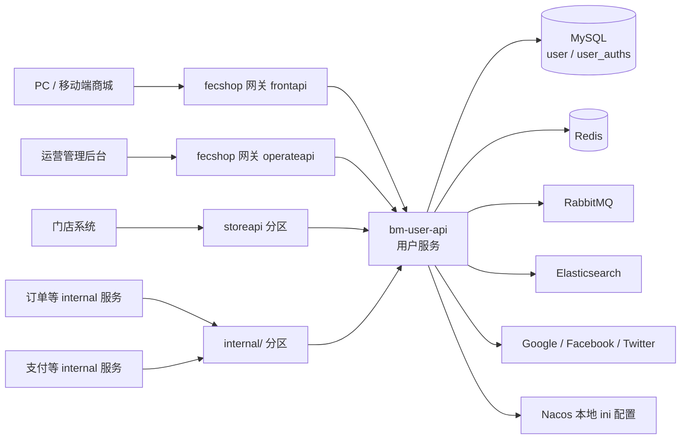

# 用户服务 user.internal.bm.com 新手上手指南

> 适用仓库：`youngs/user.internal.bm.com`
>
> 本文面向 **PHP / Yii2 完全新手**。只记录能由仓库文件直接证明的事实。仓库没有提供的 Docker、Nginx、本地域名、生产部署细节会明确标为「待确认」，不会根据经验编造命令或目录。
>
> 本仓库 **没有 `AGENTS.md`**。根目录 `README.md` 极简，主要只写了：`composer install`，以及模块划分说明。

---

## 1. 定位与系统关系

### 1.1 它是什么

`user.internal.bm.com` 是 bm 体系中的 **用户内网服务**。根 README 的原文概括是：

> 用户模块的业务逻辑

业务模块目录名为 `bm-user-api`，README 说明它包含：

- 用户订阅
- 注册
- 登录
- 第三方登录
- 用户积分

Controller 按调用来源分层（README 原文）：

- `admin/`：管理后台逻辑
- `client/`：C 端逻辑
- `internal/`：供其他内网服务调用

可以把它理解为：**不直接面向公网的用户域微服务**。公网请求通常先经商城网关（fecshop 的 `frontapi` / `operateapi`），再由网关转发到本服务；订单、支付、售后等 internal 服务也会直接调用本服务的 `internal/` 接口查用户、地址、订阅状态等。

### 1.2 在整体系统中的位置



### 1.3 新手先建立的三条心智模型

1. **HTTP 同步线**：请求进入 `bm-user-api/web/index.php` → Filter → Controller → Service →（Node 责任链）→ Repository → Model → JSON 响应。
2. **登录态线**：本服务 **不用 Yii Session 作为登录态**；登录成功后签发 JWT（`JwtService`），后续请求带 `token`，由过滤器解析用户 ID。
3. **异步线**：登录 / 注册成功后会向 RabbitMQ 发消息（如 `direct.combine_data`、`direct.user_register`），其它系统消费后做合并数据、订阅等副作用。

---

## 2. 技术栈与版本

版本证据来自仓库根目录 `composer.json`（以及必要时对照 `composer.lock`）。

### 2.1 核心约束

| 项目 | 证据 | 说明 |
|------|------|------|
| PHP | `composer.json`：`"php": "^7.0"` | 最低约束是 7.0；本机/容器实际小版本 **待确认** |
| Yii2 | `composer.json`：`"yiisoft/yii2": "~2.0.14"` | Advanced Project Template（包名 `yiisoft/yii2-app-advanced`） |
| 依赖管理 | Composer | README 唯一明确的安装步骤是 `composer install` |

### 2.2 与用户域强相关的依赖（`composer.json` require）

以下均能在 `composer.json` 的 `require` 中直接看到：

- `yiisoft/yii2-redis`：Redis
- `yiisoft/yii2-queue`：队列
- `php-amqplib/php-amqplib`：RabbitMQ
- `yiisoft/yii2-elasticsearch`：Elasticsearch
- `yiisoft/yii2-authclient`：OAuth 客户端基座
- `google/apiclient`：Google
- `facebook/graph-sdk`、`facebook/php-business-sdk`：Facebook
- `richweber/yii2-twitter`：Twitter
- `lcobucci/jwt`：JWT（登录态）
- `sensorsdata/sa-sdk-php`：神策埋点
- 其它可见依赖：AWS SDK、Braintree、Klaviyo、PHPExcel、libphonenumber 等

### 2.3 开发期依赖（`require-dev`）

- `yiisoft/yii2-debug`
- `yiisoft/yii2-gii`
- `yiisoft/yii2-faker`
- `codeception/base`、`phpunit/phpunit`、`codeception/verify`

注意：仓库根目录 **没有 `tests/` 目录**。`require-dev` 里有测试框架，并不等于项目已有可运行测试套件。

### 2.4 与支付服务对比时的重要差异

同为 internal 微服务时，支付仓通常有 `bm-console`。本仓根目录有 `yii` 脚本，但它 `require` 的是：

```text
bm-console/config/bootstrap.php
```

而仓库里 **不存在 `bm-console/` 目录**。因此：

- 根目录 `yii` **当前不可用**（缺 Console 应用目录）
- 不要照搬支付服务文档里的 `php yii ...` 命令到本仓

---

## 3. 目录地图

### 3.1 仓库顶层（真实存在）

```text
youngs/user.internal.bm.com/
├── bm-user-api/          # Yii Web 应用（用户 HTTP API）
├── common/                  # 共享业务、模型、配置、基础设施
├── composer.json
├── composer.lock
├── README.md                # 极简说明
├── yii                      # Console 入口脚本（缺 bm-console，不可用）
├── .gitignore
└── .gitlab-ci.yml
```

**不存在（已核对）：**

- `AGENTS.md`
- `bm-console/`
- `tests/`
- 仓库内 Docker / Nginx 配置文件（未见 `Dockerfile`、`docker-compose*`、nginx 配置；部署方式 **待确认**）

### 3.2 Web 应用：`bm-user-api/`

```text
bm-user-api/
├── web/
│   └── index.php            # HTTP 入口（唯一已确认的 Web 入口）
├── config/
│   ├── bootstrap.php        # 定义 BM_APP_ID、合并配置
│   ├── main.php             # 应用级配置（id、components、urlManager…）
│   └── params.php
├── controllers/             # 控制器（见第 6 节分区）
├── filters/                 # TokenFilter、CheckLoginFilter、LoginAuthFilter 等
├── forms/                   # 表单校验（如 LoginForm、RegisterForm）
├── lib/
├── messages/                # 多语言文案
├── views/
└── web/assets/
```

`controllerNamespace` 在 `bm-user-api/config/main.php` 中配置为：

```text
AppUserApi\controllers
```

对应路径别名 `@AppUserApi` → `bm-user-api/`（在 `common/config/bootstrap.php`）。

### 3.3 共享代码：`common/`（新人应重点读）

```text
common/
├── config/                  # 环境配置合并源
│   ├── bootstrap.php
│   ├── main.php             # DB / Redis / ES / mail 等组件
│   ├── params.php
│   ├── queue.php
│   ├── dev/                 # YII_ENV=dev
│   ├── test/
│   ├── pre/
│   └── prod/
├── libraries/App/
│   ├── fun_helpers.php      # g_config、g_log_*（Composer files 自动加载）
│   └── Utils/
│       ├── ConfigHelper.php # Nacos 本地 ini 读取
│       ├── BaseFunction.php
│       ├── LogHelper.php
│       ├── NodeExecutionEngine.php
│       └── UserSensitiveFormat.php  # PII 加解密
├── BaseWebController.php
├── AuthApiController.php
├── BaseService.php
├── BaseNode.php
├── BaseRepository.php
├── BaseRedis.php
├── models/user/             # User、UserAuths、UserAddress…
├── repositorys/user/        # Repository 层（注意目录名是 repositorys）
├── redis/
│   ├── common/VerifyCodeRedis.php
│   └── user/AuthRedis.php、UserRedis.php…
├── services/
│   ├── LoginService.php                 # C 端登录主链（Node）
│   ├── RegisterService.php              # C 端注册主链（Node）
│   ├── nodes/login/                     # 登录 Node
│   ├── nodes/register/                  # 注册 Node
│   ├── user/LoginService.php            # 含 quickLogin 的旧链
│   ├── user/JwtService.php              # JWT 签发与校验
│   ├── user/AuthService.php             # 下单等场景二次验证
│   ├── user/rsa/、user/rsat/            # JWT 密钥文件目录（勿泄露）
│   └── login/                           # 另一套 login 相关服务（历史并存）
├── filters/
├── components/
├── enums/                   # 如 LoginChannel
└── credentials/             # 凭据相关目录（勿把内容写进文档/聊天）
```

### 3.4 Yii 路径别名（阅读代码时很有用）

`common/config/bootstrap.php` 里设置了多个别名，其中与本仓直接相关：

- `@common` → `common/`
- `@AppUserApi` → `bm-user-api/`
- `@AppConsole` → `bm-console/`（目录缺失，别名仍存在）

同时还保留了其它服务别名（如 `@AppPayApi`、`@AppGoodsApi`），这通常来自多服务共用的 common 模板拷贝；**本仓库目录里并没有对应的 bm-*-api 目录**，不要误以为本仓同时跑多个服务。

---

## 4. 安装与环境变量

### 4.1 仓库能确认的安装步骤

README 唯一写明：

```bash
# 前置条件：已安装满足 composer.json 约束的 PHP（^7.0）与 Composer
# 工作目录：仓库根目录
cd youngs/user.internal.bm.com

composer install
```

`composer.json` 的 `autoload.files` 会自动加载：

```text
common/libraries/App/fun_helpers.php
```

因此 `g_config()`、`g_log_info()`、`g_log_warning()`、`g_log_error()` 在依赖安装后即可用，无需手动 `require`。

### 4.2 Web 入口如何启动（能证明 vs 待确认）

**能证明的入口文件：**

```text
youngs/user.internal.bm.com/bm-user-api/web/index.php
```

它会：

1. 读取 `YII_ENV`（`getenv('YII_ENV')`，缺省为 `dev`）
2. 设置 `YII_DEBUG`（`YII_ENV === 'dev'` 时为 true）
3. 加载 Composer autoload 与 Yii
4. 加载 `bm-user-api/config/bootstrap.php`（合并配置）
5. 创建 `yii\web\Application` 并 `run()`

**待确认（仓库无证据）：**

- 本地是否用 Docker / 哪一个 PHP 容器
- Nginx / Apache 的 document root 是否指向 `bm-user-api/web`
- 本地域名、端口、是否经 fecshop 网关转发
- 生产 / 测试的真实部署拓扑

在团队给出本地域名之前，不要假定某个 URL 一定可访问。调试时可先向同事确认「用户服务在本机如何被访问」。

### 4.3 Console 现状（重要）

根目录 `yii` 内容依赖：

```text
require __DIR__ . '/bm-console/config/bootstrap.php';
```

仓库无 `bm-console/`，因此：

```bash
# 当前会失败（缺目录），不要当作可用命令
php yii ...
```

运维脚本、定时任务如何在本服务执行：**待确认**（可能已迁移到其它仓，或本仓尚未完整拆分 Console）。

### 4.4 环境变量清单（来自 `common/config` 中的 `getenv`）

以下变量名出现在配置文件中。**只列变量名，不写任何真实值。**

#### 数据库

| 前缀 / 变量族 | 用途（从配置组件名推断） |
|---------------|--------------------------|
| `DB_FECSHOP_HOST/PORT/DATABASE/USER/PASSWORD` | 主库组件（如 `dbFecshop`） |
| `SLAVE_DB_FECSHOP_*` | 从库组件 |
| `DB_bm_NEW_*` | 另一套 bm 库连接 |
| `DB_GA_*` | GA 相关库连接 |

用户主表 `user` / `user_auths` 的 ActiveRecord 使用 `dbFecshop`（见 Model 的 `getDb()`）。

#### Redis

| 变量 | 用途 |
|------|------|
| `REDIS_MASTER_HOST` | Redis 主机 |
| `REDIS_MASTER_PORT` | 端口 |
| `REDIS_MASTER_PASSWORD` | 密码（配置中部分位置被注释，是否启用 **待确认**） |

配置里注册了 `redisBmMaster`、`redisUserDetail` 等 Yii Redis Connection 组件。

#### Elasticsearch

| 变量族 | 用途 |
|--------|------|
| `ES_PRODUCT_SKU_HOST/USER/PASSWORD` | 商品 SKU ES |
| `ES_ORDER_HOST/USER/PASSWORD` | 订单 ES |

#### RabbitMQ

| 变量 | 用途 |
|------|------|
| `RABBITMQ_HOST` | 主机 |
| `RABBITMQ_PORT` | 端口 |
| `RABBITMQ_USER` | 用户名 |
| `RABBITMQ_PASSWORD` | 密码 |

#### 邮件

| 变量 | 用途 |
|------|------|
| `EMAIL_HOST` / `EMAIL_PORT` / `EMAIL_ENCRYPTION` | SMTP |
| `EMAIL_USERNAME` / `EMAIL_PASSWORD` | 账号 |
| `EMAIL_FROM` / `EMAIL_FROM_NAME` | 发件人 |

#### 第三方登录

| 变量族 | 用途 |
|--------|------|
| `TWITTER_KEY` / `TWITTER_SECRET` / `TWITTER_CALLBACK` / `TWITTER_M_CALLBACK` | Twitter |
| `GOOGLE_CLIENT_ID` / `GOOGLE_SECRET` | Google |
| `FACEBOOK_APP_ID` / `FACEBOOK_SECRET` / `FACEBOOK_VERSION` | Facebook |

#### Nacos 本地配置目录

| 变量 | 用途 |
|------|------|
| `NACOS_CONFIG_DIR` | 本地 ini 配置根目录；缺省回退 `/data/www/nacos-config` |

#### 运行环境

| 变量 | 用途 |
|------|------|
| `YII_ENV` | `dev` / `test` / `pre` / `prod` 等；入口缺省 `dev` |

### 4.5 如何确认环境变量是否齐（思路，非仓库命令）

仓库没有提供 `.env.example` 或一键检查脚本。新人可以：

1. 打开 `common/config/main.php` 与 `common/config/{YII_ENV}/params.php`
2. 搜索 `getenv(`
3. 与团队本地环境文档（工作空间的 `LOCAL_ENV.md` 等）对照

**禁止**把真实密码、Token、密钥粘贴到本文、聊天、截图外发渠道。

---

## 5. 配置合并与 Nacos

### 5.1 应用 ID 与环境常量

`bm-user-api/config/bootstrap.php`：

```php
defined('BM_APP_ID') or define('BM_APP_ID', 'BM_USER_API');
```

`common/config/bootstrap.php` 根据 `YII_ENV` 定义：

- `BM_ENV_DEV`
- `BM_ENV_TEST`
- `BM_ENV_PROD`

### 5.2 配置合并顺序（必须记住）

Web 入口经 bootstrap 后的合并逻辑（简化）：

```text
common/config/main.php
  + common/config/{YII_ENV}/main.php
  + bm-user-api/config/main.php

params 同理：
common/config/params.php
  + common/config/{YII_ENV}/params.php
  + bm-user-api/config/params.php
```

后合并的文件会覆盖同名键。排查「配置改了不生效」时，按这个顺序从后往前查。

### 5.3 `YII_ENV` 如何影响加载目录

入口：

```php
defined('YII_ENV') or define('YII_ENV', getenv('YII_ENV') ? getenv('YII_ENV') : 'dev');
```

因此：

- 未设置环境变量 → 加载 `common/config/dev/`
- 设置为 `prod` → 加载 `common/config/prod/`
- 同理 `pre`、`test`

### 5.4 Dev 下的 debug / gii

当 `BM_ENV_DEV` 为 true 时，`bm-user-api/config/bootstrap.php` 会注册：

- `yii\debug\Module`（`allowedIPs => ['*']`）
- `yii\gii\Module`（`allowedIPs => ['*']`，model 生成默认连 `dbFecshop`）

这对本地开发方便，但意味着 **dev 环境调试模块对 IP 未做收紧**。生产切勿误开 `YII_ENV=dev`。

### 5.5 Nacos：`g_config` 与 `ConfigHelper`

业务开关、动态配置不写死在 PHP 里，而是读本地 ini：

1. 代码调用 `g_config($module, $key, $default)`
2. `g_config` 转调 `ConfigHelper::config(...)`
3. `ConfigHelper` 读取：

```text
{NACOS_CONFIG_DIR}/{module}.ini
```

若 `NACOS_CONFIG_DIR` 为空，默认目录为：

```text
/data/www/nacos-config
```

#### 允许的 module 常量（禁止手写字符串）

`ConfigHelper` 定义了静态常量，例如：

- `ConfigHelper::$MALL_COMMON` → `mall_common`
- `ConfigHelper::$USER` → `user`
- `ConfigHelper::$PAY` → `pay`
- `ConfigHelper::$ORDER` → `order`
- …以及 `content` / `goods` / `market` / `operate` / `site` / `aftersale`

**正确写法：**

```php
g_config(ConfigHelper::$USER, 'some_key', $default);
```

**错误写法（团队红线）：**

```php
g_config('user', 'some_key', $default); // 不要手写模块名字符串
```

非生产环境若传入无效 module，`ConfigHelper` 会抛异常；生产环境则回退 default。

### 5.6 配置文件中的明文密钥风险

`common/config/**/params.php`、`bm-user-api/config/main.php` 等处可能出现：

- cookieValidationKey
- 第三方 API key
- 其它硬编码凭据

**本文故意不摘录任何真实值。** 新人看到这些文件时：

1. 不要复制到文档或聊天
2. 不要提交到公开仓库
3. 本地调试优先用环境变量 / 团队密钥管理系统（具体方式 **待确认**）

---

## 6. Controller 分区与过滤器

### 6.1 Yii2 路由到 Action 的命名规则（新手必读）

Yii2 默认 pretty URL 下：

| URL | Controller | Action 方法 |
|-----|------------|-------------|
| `/login/email-login` | `LoginController` | `actionEmailLogin` |
| `/third/web-google-login` | `ThirdController` | `actionWebGoogleLogin` |
| `/register/email-register` | `RegisterController` | `actionEmailRegister` |
| `/internal/user/get-user-by-id` | `internal\UserController` | `actionGetUserById` |
| `/client/oauth/google-login` | `client\OauthController` | `actionGoogleLogin` |
| `/mq-consume/receive` | `MqConsumeController` | `actionReceive` |

规则口诀：

- URL 用短横线小写
- 类名是大驼峰 + `Controller`
- 方法名是 `action` + 大驼峰

### 6.2 分区一览

#### A. 根目录 Controllers（`bm-user-api/controllers/`）

| 文件 | 基类 | 典型职责 |
|------|------|----------|
| `LoginController.php` | `BaseApiController` | 邮箱登录、验证码登录、Apple / Firebase 等 |
| `RegisterController.php` | `BaseApiController` | 邮箱注册 |
| `ThirdController.php` | `AuthApiController` | Web Google / Twitter / Facebook 登录 |
| `UserController.php` | `AuthApiController` | 用户信息、快捷登录、重置密码、订阅等 |
| `AuthController.php` | `BaseWebController` | 下单等场景的二次身份验证 |
| `PointsController.php` | （见源码） | 积分相关 |
| `MqConsumeController.php` | `BaseApiController` | MQ 消费 HTTP 入口 |
| `SiteController.php` | （见源码） | 站点 / 错误页等 |
| `TestController.php` | （见源码） | **测试/调试接口，生产风险** |

#### B. `client/`

| 文件 | 基类 | 说明 |
|------|------|------|
| `ClientBaseController.php` | `BaseWebController` | 解析参数、按 site 切时区 |
| `OauthController.php` | `ClientBaseController` | Google redirect / Google login |
| `CodeController.php` 等 | 见目录 | 验证码等 C 端能力 |

#### C. `internal/`

| 文件 | 基类 | 说明 |
|------|------|------|
| `InternalBaseController.php` | `BaseWebController` | **无登录 Filter**，依赖内网隔离 |
| `UserController.php` | `InternalBaseController` | `get-user-by-id`、创建用户、地址等 |
| `UserAddressController.php` 等 | 见目录 | 内网查询 |

#### D. `admin/`

管理后台相关（`AdminBaseController`、`PointsController`、`UserDeviceController` 等）。

#### E. `storeapi/`

门店侧 API（目录内有 `ApiController.php` 与 `readme.md`）。

### 6.3 基类继承关系

```text
yii\web\Controller
  └── common\BaseWebController
        ├── common\AuthApiController          (+ LoginAuthFilter)
        ├── AppUserApi\controllers\BaseApiController
        │     (+ TokenFilter + CheckLoginFilter + ApiRequestResponseLogger)
        ├── AppUserApi\controllers\client\ClientBaseController
        ├── AppUserApi\controllers\internal\InternalBaseController
        └── AuthController 等直接挂在 BaseWebController 上的控制器
```

### 6.4 `BaseWebController` 做了什么

文件：

```text
youngs/user.internal.bm.com/common/BaseWebController.php
```

`init()` 中会处理公共参数思路（简化理解）：

- 从 GET/POST 取 `pf`，定义为 `REQUEST_PLATFORM`
- 解析 `language` / `site`，设置 `\Yii::$app->language`
- 后台 `pf=manage` 时语言倾向中文
- 解析 `version`

响应统一经 `endSuccess` / `endFail` → `endJson`，结构见第 9 节。

### 6.5 `AuthApiController` + `LoginAuthFilter`

文件：

```text
youngs/user.internal.bm.com/common/AuthApiController.php
youngs/user.internal.bm.com/common/filters/LoginAuthFilter.php
```

行为：

1. 默认要求请求携带可解析的 `token`
2. 用 `BaseFunction::getUserId($token)` 校验
3. 失败时返回类似 `code=401` 的 JSON 并结束请求
4. **白名单 action 可免登录**（源码硬编码）：当 controller id 属于 `user` / `test` / `third`，且 action id 在下列集合中时直接放行：
   - `check-email`
   - `test`
   - `quick-login`
   - `reset-password`
   - `send`
   - `web-google-login`
   - `web-facebook-login`
   - `web-twitter-login`
   - `subscribe`
   - `email-check-password`
   - `get-login-user-id-by-user-info`

因此 `ThirdController` 的第三方登录本身在白名单内，可以未登录调用。

### 6.6 `BaseApiController` + Token / CheckLogin / Logger

文件：

```text
youngs/user.internal.bm.com/bm-user-api/controllers/BaseApiController.php
```

`behaviors()` 挂载：

1. `AppUserApi\filters\TokenFilter`
2. `AppUserApi\filters\CheckLoginFilter`
3. `common\services\logger\ApiRequestResponseLogger`

`LoginController` / `RegisterController` 继承它。这意味着登录/注册接口也会走这两层 Filter——具体哪些 action 被放行，必须以 Filter 源码的例外列表为准（阅读 `bm-user-api/filters/*.php`）。

### 6.7 `internal` 无登录依赖内网隔离

`InternalBaseController` **没有**挂 `LoginAuthFilter` / `TokenFilter`。它只是合并 GET/POST 参数。

安全模型是：

> 接口本身不校验登录 → 必须依赖网络层只允许内网调用

新人切勿把 `internal/` 接口暴露到公网，也切勿在公网网关无差别转发这些路径。

---

## 7. JWT 与 `user_auths`

### 7.1 为什么不是 Session 登录

虽然 `bm-user-api/config/main.php` 里配置了 `yii\redis\Session` 组件，但业务登录态主路径是：

1. 登录 / 注册成功
2. `JwtService` 签发 token
3. 客户端后续请求带 `token`
4. Filter / `BaseFunction::getUserId` 解析出 `user_id`

`AuthApiController` 注释与 Filter 实现都指向「token 登录」，而不是 Yii `user` 组件的 Session Identity（相关 `user` 组件配置在 main.php 中是注释掉的）。

### 7.2 `JwtService` 关键事实

文件：

```text
youngs/user.internal.bm.com/common/services/user/JwtService.php
```

要点：

- 使用 `lcobucci/jwt`
- token 默认有效期注释为 **180 天**
- claim 至少包含 `user_id`；可选 `identity_type`、`is_login`
- 密钥从文件读取：
  - 默认：`common/services/user/rsa/pri.key`、`pub.key`
  - 当 `getenv('YII_ENV') == 'dev'` 时改用：`common/services/user/rsat/pri.key`、`pub.key`

**禁止**把 `rsa/`、`rsat/` 下密钥内容写入文档、日志外发或截图。

### 7.3 表：`user` 与 `user_auths`

| 表名 | Model | 连接组件 | 含义 |
|------|-------|----------|------|
| `user` | `common\models\user\User` | `dbFecshop` | 用户主档 |
| `user_auths` | `common\models\user\UserAuths` | `dbFecshop` | 多身份绑定（邮箱/手机/三方） |

`UserAuthsRepository` 中的身份类型常量（节选）：

| 常量 | 值 | 含义 |
|------|----|------|
| `IDENTITY_TYPE_EMAIL` | 1 | 邮箱 |
| `IDENTITY_TYPE_PHONE` | 2 | 手机 |
| `IDENTITY_TYPE_TWITTER` | 3 | Twitter |
| `IDENTITY_TYPE_GOOGLE` | 4 | Google |
| `IDENTITY_TYPE_FACEBOOK` | 5 | Facebook |
| `IDENTITY_TYPE_APPLE` | 6 | Apple |
| `IDENTITY_TYPE_WEB_APPLE` | 7 | Web Apple |

一个 `user` 可以对应多条 `user_auths`（例如既绑邮箱又绑 Google）。登录校验常查的是「某 identity_type + identifier 是否已绑定」。

### 7.4 敏感字段加解密

工具类：

```text
App\Utils\UserSensitiveFormat
```

Repository（如 `UserRepository`、`UserAuthsRepository`）在读写时会调用：

- `fieldEncrypt($data)`：写入前加密
- `fieldDecrypt($info)`：读出后解密
- `searchConditionFormat(...)`：按加密规则构造查询条件
- `selectFieldsFormat(...)`：字段选择格式化

**含义：** 你在数据库里直接看到的 email / identifier 等，可能是密文。排查问题要用业务代码或团队提供的加解密工具，不要假设明文 SQL 一定能查到。

### 7.5 软删除：`del_flag = 0`

`User` Model 注释明确：`del_flag` 删除标志，`0` 正常，`1` 删除。

团队数据库红线：

- 禁止物理删除
- 查询必须带 `del_flag = 0`（或等价条件）
- 删除用 `UPDATE ... SET del_flag = 1`

阅读 Repository 时，留意是否遗漏该条件——遗漏会导致「已删除用户又被查出来」。

---

## 8. 分层与 Node 责任链

### 8.1 推荐理解的分层

```text
Controller（入参、Form 校验、endSuccess/endFail）
  → Service（编排业务流程）
    → Node 责任链（可插拔步骤，共享 Context）
      → Repository（DB 访问、加解密、del_flag）
        → Model / ActiveRecord
  → Redis 封装 / MQ 发送 / 外部 OAuth SDK
```

目录名注意：本仓是 `common/repositorys`（少一个 e），不是常见拼写 `repositories`。

### 8.2 Node 责任链怎么跑

核心类：

- `common\BaseNode`
- `App\Utils\NodeExecutionEngine`
- Context：如 `common\services\contexts\LoginContext`、`RegisterContext`

Service 组装 `$nodeChain` 数组，调用：

```php
NodeExecutionEngine::instance()->executeEngine($context, $nodeChain);
```

每个 Node 做一件事；失败时通过统一 `code/info` 向上返回。这对新人的好处是：

- 读登录/注册时可以 **按 Node 文件逐个读**，不必一次吞完整 Service
- 改某一校验规则时，通常只改对应 Node

### 8.3 C 端登录主链（`common\services\LoginService`）

文件：

```text
youngs/user.internal.bm.com/common/services/LoginService.php
```

`login($params)` 要求 `channel_type`，然后执行：

```text
SetThirdInfoNode
  → LoginCheckNode
  → LoginRegisterNode
  → LoginNode
  → ReturnDataFormatNode
```

对应目录：

```text
common/services/nodes/register/SetThirdInfoNode.php   # 复用注册侧「设置三方信息」Node
common/services/nodes/login/LoginCheckNode.php
common/services/nodes/login/LoginRegisterNode.php
common/services/nodes/login/LoginNode.php
common/services/nodes/login/ReturnDataFormatNode.php
```

`LoginNode` 内会向 MQ 发送 `direct.combine_data`（见第 9 节）。

谁在调用这条主链？例如：

- `LoginController::actionEmailLogin` → `\common\services\LoginService::instance()->login(...)`
- `ThirdController::actionWebGoogleLogin` → 同上
- `client\OauthController::actionGoogleLogin` → 同上

### 8.4 C 端注册主链（`common\services\RegisterService`）

文件：

```text
youngs/user.internal.bm.com/common/services/RegisterService.php
```

`register($params)` 节点：

```text
RegisterParamsCheckNode
  → SetGuestInfoNode
  → SetThirdInfoNode
  → ThirdInfoIsRegisterNode
  → RegisterNode
  → RegisterSubscribeNode
  → ReturnDataFormatNode
```

对应目录：

```text
common/services/nodes/register/
```

`RegisterNode` 内会向 MQ 发送 `direct.user_register`。

谁在调用？例如：

- `RegisterController::actionEmailRegister` → `\common\services\RegisterService::instance()->register(...)`

### 8.5 旧链 / 并存：`common\services\user\LoginService`

文件：

```text
youngs/user.internal.bm.com/common/services/user/LoginService.php
```

其中 `quickLogin($params)` 使用另一套 Node（示意）：

```text
UserWebCheckNode
  → QuickLoginNode
  → UserLoginReturnUserDetailNode
  → UserLoginNode
  → UserSendRabbitMQNode
```

调用入口示例：

- `UserController::actionQuickLogin` → `common\services\user\LoginService::quickLogin`

这是文档第 13 节会强调的「两个 LoginService」坑的一部分。

### 8.6 还有第三套？

仓库中还存在：

```text
common/services/login/LoginService.php
common/services/login/RegisterService.php
```

以及 `common/services/user/RegisterService.php`。

它们与主链并存，属于历史演进痕迹。**改登录/注册前先确认 Controller 实际 `use` 的是哪个命名空间**，不要只靠类名搜索第一个结果就改。

---

## 9. DB / Redis / ES / MQ / 日志 / 响应格式

### 9.1 统一响应格式

`BaseWebController::endJson` 组装的核心字段：

```json
{
  "code": 1,
  "data": {},
  "info": "",
  "request_id": ""
}
```

约定：

- **成功：`code = 1`**（`endSuccess` 固定传 1）
- 失败：`code` 为业务错误码；可能额外带 `error`、`use_original`
- `request_id` 来自常量 `LOG_STR`（若已定义）

前端 / 网关判断时，要区分：

- HTTP 200 只表示传输成功
- 业务是否成功看 JSON 里的 `code`

### 9.2 数据库

- 组件定义：`common/config/main.php`（及环境覆盖）
- 用户域主连接名：`dbFecshop`
- 另有从库、`dbbmNew`（命名以配置为准）、`DB_GA_*` 对应组件等

ActiveRecord 访问应走 Repository，而不是在 Controller 里直接 `User::find()`（团队分层规范；本仓也已有 Repository 实践）。

### 9.3 Redis

Yii 组件示例（`common/config/main.php`）：

- `redisBmMaster`
- `redisUserDetail`

业务封装类（继承 `common\BaseRedis`）示例：

| 类 | 路径 |
|----|------|
| `VerifyCodeRedis` | `common/redis/common/VerifyCodeRedis.php` |
| `AuthRedis` | `common/redis/user/AuthRedis.php` |
| `UserRedis` | `common/redis/user/UserRedis.php` |
| `UserDetailRedis` | `common/redis/user/UserDetailRedis.php` |

`BaseRedis` 中可见一批 key 前缀约定，例如：

- 登录信息：`bm:login:` + token
- 用户详情：`bm:user:detail:by:id:`
- 邮箱验证码：`bm:email:code:`
- 访问授权：`bm:user:access_token:...`

排障「明明登录成功却判未登录」时，除了 JWT，还要考虑 Redis 短 token / 缓存是否存在（具体以 `BaseFunction::getUserId` 实现为准）。

### 9.4 Elasticsearch

配置在 `common/config/main.php`，依赖 `ES_PRODUCT_SKU_*`、`ES_ORDER_*`。用户主登录链路未必每次都打 ES，但基础设施已接入。是否在某次需求中用到，按具体 Service 搜索确认。

### 9.5 RabbitMQ

发送封装常见于 Node 内调用 `RabbitMq::send(...)`。

与登录/注册强相关的真实调用：

| 场景 | exchange | route key | 出现位置（示例） |
|------|----------|-----------|------------------|
| 登录后合并数据 | `direct.combine_data` | `route_combine_data` | `nodes/login/LoginNode.php` 等 |
| 注册 / 用户变更 | `direct.user_register` | `user_change` | `nodes/register/RegisterNode.php`、部分 Subscribe Node |

消费侧 HTTP 入口示例：

- `MqConsumeController::actionReceive` → 路由 `/mq-consume/receive`

MQ 连接参数来自 `RABBITMQ_*` 环境变量（见 `common/config/params.php`）。

### 9.6 日志

两套常见方式：

1. **统一助手函数（推荐方向）**
   - `g_log_info` / `g_log_warning` / `g_log_error`
   - 实现于 `fun_helpers.php` → `LogHelper`
2. **历史写法仍大量存在**
   - `\Yii::error(...)`
   - `MyFunction::instance()->mLog(...)`

Yii `log` 组件在 `bm-user-api/config/main.php`：

- `app`：error/warning → `@runtime/logs/Ymd/app.log`
- `sql`：dev 下记录 `yii\db\*` → `sql.log`

团队红线倾向使用 `g_log_*`，而不是继续扩散 `\Yii::error()`。新人改代码时优先 `g_log_error`。

日志可能包含请求参数。外发前必须脱敏：token、密码、邮箱、手机号、地址、密钥。

---

## 10. 两条真实链路（绝对路径 + 符号）

本节只描述仓库里能顺着代码读通的调用链。本地域名、网关前缀 **待确认**，因此 URL 只写 Yii 应用内路径。

### 10.1 链路一：Web Google 登录

#### 入口 A（Third 分区，常见 Web）

**路由：** `/third/web-google-login`

**符号链路：**

```text
AppUserApi\controllers\ThirdController::actionWebGoogleLogin()
  → AppUserApi\forms\user\LoginForm::googleIdTokenLoginValidate()
  → 设置 channel_type = LoginChannel::GOOGLE
  → common\services\LoginService::login()
       → NodeExecutionEngine
            → common\services\nodes\register\SetThirdInfoNode
            → common\services\nodes\login\LoginCheckNode
            → common\services\nodes\login\LoginRegisterNode
            → common\services\nodes\login\LoginNode
                 →（成功时）RabbitMq::send('direct.combine_data', 'route_combine_data', ...)
            → common\services\nodes\login\ReturnDataFormatNode
  → BaseWebController::endSuccess / endFail
```

**绝对路径：**

```text
youngs/user.internal.bm.com/bm-user-api/controllers/ThirdController.php
youngs/user.internal.bm.com/bm-user-api/forms/user/LoginForm.php
youngs/user.internal.bm.com/common/services/LoginService.php
youngs/user.internal.bm.com/common/services/nodes/register/SetThirdInfoNode.php
youngs/user.internal.bm.com/common/services/nodes/login/LoginCheckNode.php
youngs/user.internal.bm.com/common/services/nodes/login/LoginRegisterNode.php
youngs/user.internal.bm.com/common/services/nodes/login/LoginNode.php
youngs/user.internal.bm.com/common/services/nodes/login/ReturnDataFormatNode.php
```

过滤器要点：`ThirdController` 继承 `AuthApiController`，但 `web-google-login` 在 `LoginAuthFilter` 白名单中，允许未登录访问。

#### 入口 B（client OAuth）

**路由：** `/client/oauth/google-login`

**符号链路：**

```text
AppUserApi\controllers\client\OauthController::actionGoogleLogin()
  → 设置 channel_type = LoginChannel::GOOGLE
  → common\services\LoginService::login()   # 与入口 A 同一主链
  → endSuccess / endFail
```

**绝对路径：**

```text
youngs/user.internal.bm.com/bm-user-api/controllers/client/OauthController.php
```

同文件还有 `actionGoogleRedirectUri`：先向 Google 换授权 URL（`GoogleService::createdGoogleCredentials`），再由前端跳转；回调后的登录仍落到上述 login 主链（具体前端回调拼装 **待确认**）。

#### 读代码时建议关注的数据落点

1. Google identity 如何写入 / 查询 `user_auths`（`IDENTITY_TYPE_GOOGLE = 4`）
2. 未注册时 `LoginRegisterNode` 是否自动注册
3. `LoginNode` 如何签发 JWT、写 Redis
4. MQ `direct.combine_data` 消费者在哪个系统（本仓外，**待确认**）

### 10.2 链路二：邮箱注册

**路由：** `/register/email-register`

**符号链路：**

```text
AppUserApi\controllers\RegisterController::actionEmailRegister()
  → AppUserApi\forms\user\RegisterForm::emailValidate()
  → 补充 user_agent、channel_type=EMAIL、identity_type=EMAIL、subscribe_source 等
  → common\services\RegisterService::register()
       → NodeExecutionEngine
            → RegisterParamsCheckNode
            → SetGuestInfoNode
            → SetThirdInfoNode
            → ThirdInfoIsRegisterNode
            → RegisterNode
                 →（成功时）RabbitMq::send('direct.user_register', 'user_change', ...)
            → RegisterSubscribeNode
            → ReturnDataFormatNode
  → endSuccess / endFail
```

**绝对路径：**

```text
youngs/user.internal.bm.com/bm-user-api/controllers/RegisterController.php
youngs/user.internal.bm.com/bm-user-api/forms/user/RegisterForm.php
youngs/user.internal.bm.com/common/services/RegisterService.php
youngs/user.internal.bm.com/common/services/nodes/register/RegisterParamsCheckNode.php
youngs/user.internal.bm.com/common/services/nodes/register/SetGuestInfoNode.php
youngs/user.internal.bm.com/common/services/nodes/register/SetThirdInfoNode.php
youngs/user.internal.bm.com/common/services/nodes/register/ThirdInfoIsRegisterNode.php
youngs/user.internal.bm.com/common/services/nodes/register/RegisterNode.php
youngs/user.internal.bm.com/common/services/nodes/register/RegisterSubscribeNode.php
youngs/user.internal.bm.com/common/services/nodes/register/ReturnDataFormatNode.php
youngs/user.internal.bm.com/common/repositorys/user/UserRepository.php
youngs/user.internal.bm.com/common/repositorys/user/UserAuthsRepository.php
```

#### 对照：邮箱登录（不是注册，但常一起看）

**路由：** `/login/email-login`

```text
LoginController::actionEmailLogin()
  → channel_type=EMAIL, identity_type=EMAIL
  → common\services\LoginService::login()   # 登录主链，不是 RegisterService
```

绝对路径：

```text
youngs/user.internal.bm.com/bm-user-api/controllers/LoginController.php
```

### 10.3 内网查询示例（辅助理解分区）

**路由：** `/internal/user/get-user-by-id`

```text
AppUserApi\controllers\internal\UserController::actionGetUserById()
  →（无登录 Filter）
  → 业务 Service / Repository 查 user
```

绝对路径：

```text
youngs/user.internal.bm.com/bm-user-api/controllers/internal/UserController.php
youngs/user.internal.bm.com/bm-user-api/controllers/internal/InternalBaseController.php
```

### 10.4 Auth 二次验证（下单等场景）

**Controller：** `AuthController`

- `/auth/check-require-auth` → `AuthService::checkRequireAuth`
- `/auth/auth` → `AuthService::auth`

绝对路径：

```text
youngs/user.internal.bm.com/bm-user-api/controllers/AuthController.php
youngs/user.internal.bm.com/common/services/user/AuthService.php
```

它从 token 解析 userId，再结合 `eid`、`business_type`、`business_no`、验证码等做安全验证。与「登录」不同，这是 **已登录用户在敏感操作前的二次校验**。

---

## 11. 第一次改接口：建议步骤

假设你要改「邮箱登录失败文案」或「Google 登录多返回一个字段」。按下面做，比直接全局搜索更安全。

### 步骤 1：确认调用入口

1. 问清楚完整 URL（是否经 fecshop 网关、前缀是什么）——网关部分见 `02-mall-gateway-fecshop.md`
2. 把路径映射到本仓 Controller/Action（第 6.1 节规则）
3. 打开对应 Controller，看它 `use` 的是哪个 Service 命名空间

### 步骤 2：确认过滤器会不会拦你

- 继承 `AuthApiController`？看 `LoginAuthFilter` 白名单
- 继承 `BaseApiController`？读 `TokenFilter` / `CheckLoginFilter`
- `internal/`？确认只在内网调用

### 步骤 3：区分主链与旧链

| 目标 | 优先打开的文件 |
|------|----------------|
| C 端登录主链 | `common/services/LoginService.php` + `common/services/nodes/login/*` |
| C 端注册主链 | `common/services/RegisterService.php` + `common/services/nodes/register/*` |
| quickLogin | `common/services/user/LoginService.php` |

### 步骤 4：改 Form / Node / Repository，而不是堆在 Controller

- 参数校验 → `bm-user-api/forms/...`
- 业务步骤 → 对应 Node
- SQL / 加解密 → `common/repositorys/user/...`

Controller 只负责：取参、调 Service、`endSuccess`/`endFail`。

### 步骤 5：读写用户数据时自检清单

- [ ] 查询是否带 `del_flag = 0`
- [ ] 写入 email/identifier 是否走 `UserSensitiveFormat::fieldEncrypt`
- [ ] 读取后是否 `fieldDecrypt`
- [ ] 是否误用了另一个 `LoginService`
- [ ] 日志是否用 `g_log_*`，是否避免打印明文 PII / token
- [ ] Nacos 配置是否用 `ConfigHelper::$USER` 等常量

### 步骤 6：本地验证（命令需满足前置条件）

```bash
# 前置条件：已 composer install；已配置好 DB/Redis 等环境变量；
# 且团队已告知本机访问用户服务的方式（域名/端口/是否经网关）——后两者待确认

# 仅示例形态，主机名请替换为团队真实值
curl -X POST 'http://<待确认主机>/login/email-login' \
  -H 'Content-Type: application/json' \
  -d '{"email":"<测试邮箱>","password":"<测试密码>","pf":"pc","language":"en","site":"us"}'
```

观察：

- HTTP 是否通
- JSON `code` 是否为 1
- `request_id` 便于搜日志
- runtime 日志目录：`bm-user-api/runtime/logs/`（若 Web 进程有写权限）

### 步骤 7：涉及配置 / DDL 时

若改动需要 Nacos 开关或表结构变更，按工作空间 OpenSpec / 部署文档规范另写交付说明（本仓无 `AGENTS.md`，以工作空间 `rules/` 为准）。

---

## 12. 调试排障

### 12.1 404 Not Found

检查顺序：

1. Web 服务器 document root 是否指向 `bm-user-api/web`（**待确认**）
2. pretty URL / rewrite 是否开启（`urlManager.enablePrettyUrl = true`）
3. Controller 是否在正确命名空间 `AppUserApi\controllers` 或其子命名空间
4. Action 名与 URL 短横线转换是否匹配
5. 是否其实打到了 fecshop 网关，而网关未转发到用户服务

### 12.2 `code = 401` 或登录态失效

检查：

1. 请求是否带了 `token`（POST 或 GET，Filter 两边都会看）
2. token 是否被 `JwtService` 正确解析（注意 dev 用 `rsat`，非 dev 用 `rsa`）
3. `BaseFunction::getUserId` 是否还依赖 Redis 登录缓存
4. 是否打到了需要登录的 action，却不在白名单

### 12.3 注册/登录返回业务错误码（非 1）

1. 先看 Controller 进入的是哪条 Service
2. 再看 Node 链中哪个 Node 返回了该 code
3. 查 `messages/` 多语言包中错误码文案
4. 查 `mLog` / `g_log_*` / `runtime/logs`

### 12.4 「数据库有用户但登录说不存在」

高频原因：

1. 邮箱在库中是密文，裸 SQL 用明文比对失败
2. 查询漏了 `del_flag = 0`
3. 查错库（`dbFecshop` vs 其它组件）
4. 身份在 `user_auths` 未绑定对应 `identity_type`

### 12.5 MQ 发出去但下游没反应

1. 确认 Node 是否真的执行到发送分支（登录失败不会发）
2. 确认 exchange / route key 字符串是否写对
3. 确认 `RABBITMQ_*` 指向的环境是否与消费者一致
4. 消费者不一定在本仓——到对应服务继续查（**待确认**具体消费者清单）

### 12.6 配置不生效

1. 确认进程的 `YII_ENV`
2. 按合并顺序检查后写覆盖
3. Nacos：确认 `NACOS_CONFIG_DIR` 下存在 `{module}.ini`，且 key 名正确
4. PHP 进程是否需要重启才能清静态缓存（`ConfigHelper` 使用静态变量缓存已读 ini）

### 12.7 根目录 `php yii` 报错

预期现象：缺少 `bm-console`。这不是你的环境配错独有问题，而是仓库现状。不要在本仓强行编造 Console 命令。

### 12.8 Dev 下 debug/gii

`allowedIPs = ['*']`。若你的 `YII_ENV=dev` 服务意外暴露到不可信网络，存在信息泄露风险。本地仅绑定到可信网卡（具体运维做法 **待确认**）。

---

## 13. 安全红线与常见坑

### 13.1 安全红线（必须遵守）

1. **PII 加解密**：邮箱、手机、identifier 等走 `UserSensitiveFormat`；禁止绕过加密直接写库。
2. **软删除**：只用 `del_flag`；查询带 `del_flag = 0`。
3. **JWT 密钥**：`rsa/`、`rsat/` 私钥严禁提交到聊天、文档、工单附件。
4. **params 明文密钥**：配置文件里的 key/secret 只用于本地理解结构，禁止外传真实值。
5. **internal 无登录**：安全依赖内网隔离；禁止公网暴露。
6. **TestController**：存在 `actionLogin`、`actionEmail`、`actionPoints*`、`actionCheckPassword` 等调试能力，**生产环境风险**；不要依赖它做正式功能，上线前确认是否可达。
7. **日志脱敏**：token、密码、验证码、地址、证件号不要明文外发。
8. **Nacos 模块名**：使用 `ConfigHelper::$USER` 等常量，禁止手写 `'user'` 字符串（团队规范）。

### 13.2 常见坑：两个（其实更多）LoginService

| 类 | 路径 | 典型用途 |
|----|------|----------|
| `common\services\LoginService` | `common/services/LoginService.php` | C 端登录 **主链**（Node：SetThirdInfo→…→ReturnDataFormat） |
| `common\services\user\LoginService` | `common/services/user/LoginService.php` | **quickLogin** 等旧链 |
| `common\services\login\LoginService` | `common/services/login/LoginService.php` | 另一套 login 目录实现，历史并存 |

**坑的表现：**

- IDE 自动 import 导错命名空间
- 你改了主链 Node，但线上流量走的是 quickLogin 旧链
- 搜索 `LoginService` 改错文件

**正确做法：** 从 Controller 的 `use` 语句和实际调用的 FQCN 反查。

同理注意多个 `RegisterService`。

### 13.3 其它常见坑

1. **Google 登录有两个入口**（`/third/web-google-login` 与 `/client/oauth/google-login`），改一处不够，先确认产品走哪条。
2. **Session 组件存在 ≠ 登录态用 Session**；别在用户服务里按传统 Yii Session 登录模型思考。
3. **dev / 非 dev JWT 密钥目录不同**（`rsat` vs `rsa`）；跨环境拿 token 互刷会失败。
4. **Composer PHP 约束是 ^7.0**，不代表生产就是 7.0；以团队运行环境为准（**待确认**）。
5. **无 tests/**：改完要靠接口联调与日志，不能幻想有现成 PHPUnit 保驾。
6. **目录名 `repositorys`**：复制其它项目路径时容易写错。
7. **白名单免登录**：新增敏感 action 时若忘了从白名单移除或误加，会造成未授权访问。

---

## 14. 第一周阅读路线

面向完全新手，按天推进。每天以「能画出来/能说清楚」为完成标准。

### Day 1：建立地图

- [ ] 读根 `README.md`
- [ ] 浏览顶层目录，确认没有 `AGENTS.md`、没有 `bm-console`、没有 `tests/`
- [ ] 打开 `bm-user-api/web/index.php` 与 `bm-user-api/config/bootstrap.php`
- [ ] 画出配置合并顺序
- [ ] 搞清 `BM_APP_ID = BM_USER_API`

### Day 2：Controller 与过滤器

- [ ] 列出根目录 / client / internal / admin / storeapi 各有哪些 Controller
- [ ] 读 `BaseWebController`、`AuthApiController`、`BaseApiController`
- [ ] 读 `LoginAuthFilter` 白名单
- [ ] 用一张表记录：哪个入口要登录、哪个免登录、哪个靠内网

### Day 3：用户模型与安全

- [ ] 读 `User`、`UserAuths` Model
- [ ] 读 `UserRepository`、`UserAuthsRepository` 中加解密与 `del_flag`
- [ ] 读 `JwtService`（只理解流程，不打开私钥内容）
- [ ] 读 `ConfigHelper` + `g_config`

### Day 4：登录主链精读

- [ ] 从 `ThirdController::actionWebGoogleLogin` 或 `LoginController::actionEmailLogin` 往下读
- [ ] 按顺序打开 5 个登录 Node
- [ ] 标出 JWT 签发点、DB 写入点、MQ 发送点

### Day 5：注册主链精读

- [ ] 从 `RegisterController::actionEmailRegister` 往下读
- [ ] 按顺序打开 7 个注册 Node
- [ ] 对比登录主链与注册主链的异同（尤其 `SetThirdInfoNode` 被两边复用）

### Day 6：旧链与二次验证

- [ ] 读 `UserController::actionQuickLogin` → `user\LoginService::quickLogin`
- [ ] 读 `AuthController` + `user\AuthService`
- [ ] 写一段笔记：「什么时候改主链，什么时候不能动旧链」

### Day 7：联调与排障演练

- [ ] 向同事确认本地如何访问用户服务（Docker/Nginx/域名，**待确认项**）
- [ ] 尝试打通一个只读 internal 查询或一个测试环境登录（遵守安全规范）
- [ ] 练习根据 `request_id` / 日期目录找 `runtime/logs`
- [ ] 复习第 12、13 节清单

---

## 15. 术语表与待确认项

### 15.1 术语表

| 术语 | 含义 |
|------|------|
| `bm-user-api` | 本仓 Yii Web 应用目录 / 用户 HTTP 服务 |
| `BM_APP_ID` | 应用标识常量，值为 `BM_USER_API` |
| `YII_ENV` | Yii 环境名；入口缺省 `dev` |
| internal | 给其它内网服务调用的 Controller 分区；无登录 Filter |
| client | C 端相关 Controller 分区 |
| admin | 管理后台相关 Controller 分区 |
| storeapi | 门店系统相关 Controller 分区 |
| JWT | 登录态令牌，由 `JwtService` 签发 |
| `user` | 用户主表 |
| `user_auths` | 用户多身份绑定表 |
| `identity_type` | 身份类型（邮箱/手机/Google…） |
| Node / 责任链 | 把登录注册拆成可组合步骤的执行单元 |
| `LoginContext` / `RegisterContext` | Node 链共享的上下文对象 |
| `g_config` | 读 Nacos 本地 ini 的全局函数 |
| `ConfigHelper::$USER` | 用户模块配置名常量（`user`） |
| `UserSensitiveFormat` | PII 字段加解密与查询条件格式化 |
| `del_flag` | 软删除标记，`0` 正常，`1` 删除 |
| `endSuccess` / `endFail` | Controller 统一输出 JSON 的方法 |
| `code=1` | 业务成功 |
| `direct.combine_data` | 登录后发送的 MQ exchange 之一 |
| `direct.user_register` | 注册/用户变更相关 MQ exchange |
| `LoginAuthFilter` | AuthApi 登录校验过滤器（含白名单） |
| Auth 二次验证 | 下单等场景的额外身份安全校验（`AuthController`） |
| fecshop 网关 | 公网入口网关，常转发到本用户服务 |

### 15.2 待确认项（仓库无法单独证明）

| 编号 | 事项 | 为什么待确认 |
|------|------|--------------|
| 1 | 本地 Docker 镜像 / compose 怎么起用户服务 | 仓库无 Docker 文件 |
| 2 | Nginx document root 与本地域名 | 仓库无 Nginx 配置 |
| 3 | 是否必须经 fecshop 才能访问，以及转发 URI 前缀 | 本仓无网关配置 |
| 4 | 生产实际 PHP 小版本 | `composer.json` 只约束 `^7.0` |
| 5 | `bm-console` 是否已迁移到其它仓库 | 本仓缺目录但 `yii` 仍引用 |
| 6 | RabbitMQ 各消息的消费者服务清单 | 本仓只见发送点 |
| 7 | Redis 密码是否在各环境启用 | 配置中有注释掉的 password 行 |
| 8 | TestController 在各环境的可达性与是否应下线 | 需结合网关/运维策略 |
| 9 | 团队本地环境变量的标准投放方式 | 无 `.env.example` |
| 10 | Google 登录产品主路径是 `/third/...` 还是 `/client/oauth/...` | 两条入口并存 |

### 15.3 你读完本文后应该能回答的问题

1. 用户服务在系统中的位置是什么？和 fecshop、其它 internal 如何协作？
2. Web 入口文件在哪？配置如何按 `YII_ENV` 合并？
3. 为什么根目录 `yii` 现在不能用？
4. Controller 分区各自给谁用？internal 为什么危险？
5. JWT 密钥为什么分 `rsa` 和 `rsat`？
6. `user` 和 `user_auths` 分别存什么？
7. 登录主链 5 个 Node 各自大概干什么？
8. 为什么改登录前必须先确认是哪个 `LoginService`？
9. 成功响应的 `code` 是多少？
10. 哪些事情仓库没写、必须标「待确认」？

---

## 附录 A：README 原文要点（避免误读）

根 README 能确认的只有：

1. 这是用户内网服务，承载用户模块业务逻辑
2. 初始化：`composer install`
3. 功能模块：`bm-user-api`（订阅、注册、登录、第三方登录、积分）
4. Controller 分层：`admin` / `client` / `internal`

它 **没有** 提供：

- 如何配置 Nginx
- 如何启动 Docker
- 如何跑测试
- 如何执行 Console
- 环境变量清单

因此本文第 4、12、15 节对缺失部分一律标「待确认」。

## 附录 B：与支付服务文档的差异速查

| 点 | 支付服务（对照记忆） | 本用户服务 |
|----|----------------------|------------|
| `AGENTS.md` | 通常有 | **无** |
| `bm-console` | 有 | **无**（`yii` 不可用） |
| `tests/` | 视仓库而定 | **无** |
| 登录态 | 支付侧重交易与回调 | 用户侧重 JWT + `user_auths` |
| 主业务编排 | 多为 Service 直调 | 登录注册大量 Node 责任链 |

## 附录 C：建议收藏的绝对路径清单

```text
youngs/user.internal.bm.com/README.md
youngs/user.internal.bm.com/composer.json
youngs/user.internal.bm.com/bm-user-api/web/index.php
youngs/user.internal.bm.com/bm-user-api/config/bootstrap.php
youngs/user.internal.bm.com/bm-user-api/config/main.php
youngs/user.internal.bm.com/common/config/main.php
youngs/user.internal.bm.com/common/config/bootstrap.php
youngs/user.internal.bm.com/common/libraries/App/fun_helpers.php
youngs/user.internal.bm.com/common/libraries/App/Utils/ConfigHelper.php
youngs/user.internal.bm.com/common/BaseWebController.php
youngs/user.internal.bm.com/common/AuthApiController.php
youngs/user.internal.bm.com/common/filters/LoginAuthFilter.php
youngs/user.internal.bm.com/common/services/LoginService.php
youngs/user.internal.bm.com/common/services/RegisterService.php
youngs/user.internal.bm.com/common/services/user/LoginService.php
youngs/user.internal.bm.com/common/services/user/JwtService.php
youngs/user.internal.bm.com/common/services/user/AuthService.php
youngs/user.internal.bm.com/common/models/user/User.php
youngs/user.internal.bm.com/common/models/user/UserAuths.php
youngs/user.internal.bm.com/common/repositorys/user/UserRepository.php
youngs/user.internal.bm.com/common/repositorys/user/UserAuthsRepository.php
```

---

> 文档结束。若后续仓库补齐 `bm-console`、Docker 或 `AGENTS.md`，应回写本文对应章节，并把「待确认」改为可执行步骤。
