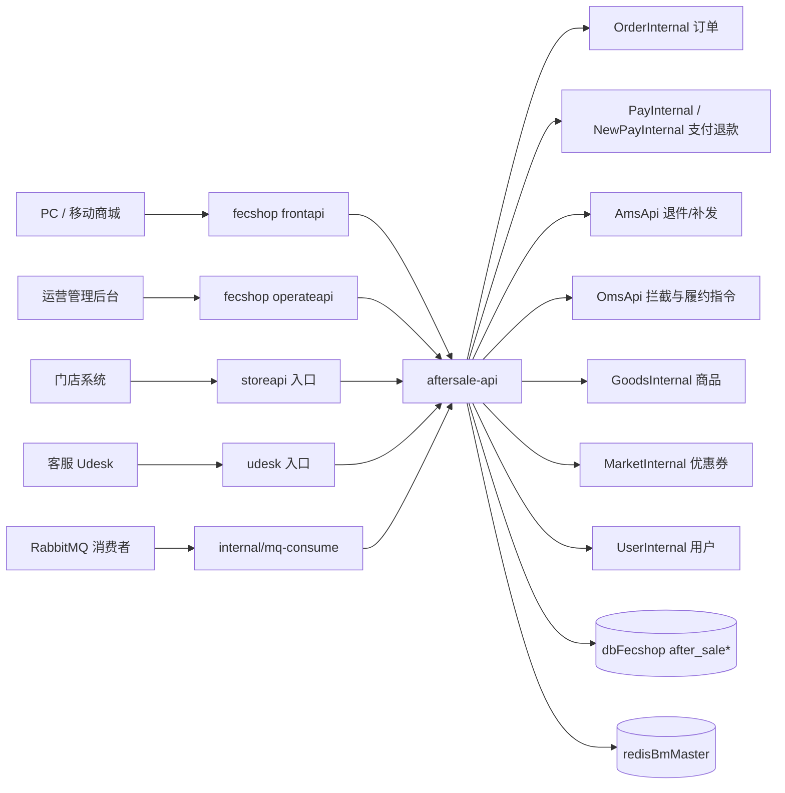
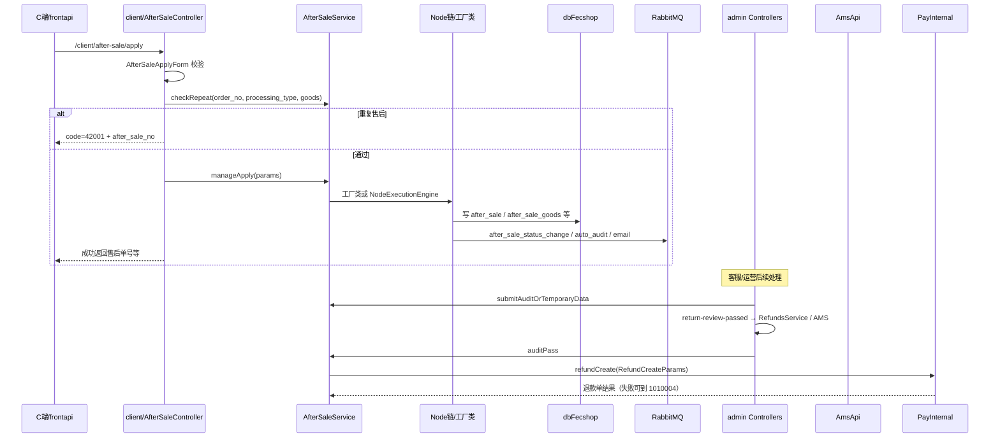
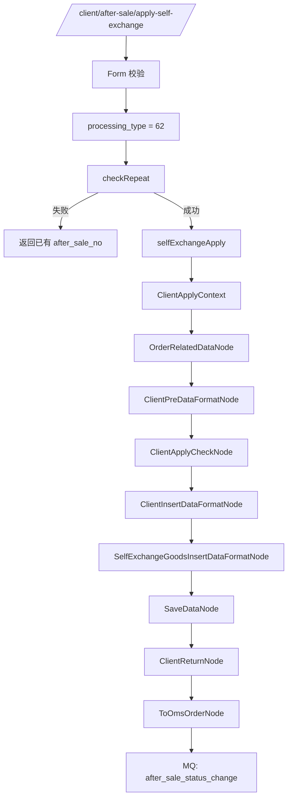

# 售后服务 aftersale.internal.bm.com 新手上手指南

> 适用仓库：`youngs/aftersale.internal.bm.com`
>
> 本文只记录能由仓库文件直接证明的事实。仓库没有提供的启动命令、容器配置和部署细节会明确标为“待确认”，不会根据经验补全。
>
> 本仓库**没有** `AGENTS.md`。分层与 Controller 分区规范以根目录 `README.MD` 为准；业务背景可参考 `document/`。

## 1. 先理解它是什么

`aftersale.internal.bm.com` 是 bm 售后域的内网业务服务，不是公网网关。

可以把它理解为：



它通常负责：

1. 接收来自网关、门店、Udesk、内网其他服务或 MQ 回调的 HTTP 请求。
2. 按 Yii2 Pretty URL 路由到 `admin/`、`client/`、`internal/`、`storeapi/`、`udesk/`、`test/` 下的 Controller。
3. 在 Controller 中做入参校验（Form），再调用 Service。
4. 按处理方案（`processing_type`）走 **Node 责任链** 或 **工厂类 `AfterSaleHandleService`**。
5. 读写 `dbFecshop` 中的售后主表与明细表，并调用订单、支付、AMS、OMS 等外部系统。
6. 通过 RabbitMQ 发送状态变更、自动审核、邮件等异步事件。

不要把它当成“只负责退款的小服务”。仓库里同时覆盖：取消订单、退货退款、换货、补差价、补发、保养、退税费、修改收货方式、修改安装服务、争议单限制、OMS 拦截工单等完整售后生命周期。

根目录 `README.MD` 对分层约定写得很明确：

1. Controller 按来源分：`admin`（管理后台）、`client`（用户 C 端）、`internal`（其他内网请求）。
2. 调用方式：`controller`（业务编排 + VO 返回格式化）→ `service`（业务编写）→ `repository`（数据库操作）→ `model`（脚本生成）。
3. 请求其他内网接口，请在 `common/api` 写 wrapper，不要在 Service 里直接拼 HTTP。
4. 枚举值写入 `common/enums`。
5. 数据库存时间戳（数字）；展示用字符串时，原字段名加 `_str`，不要覆盖源字段。
6. Controller 的操作类 action 推荐 `try...catch`，避免异常信息泄漏到其他系统。

## 2. 技术栈与真实版本

版本证据来自仓库的 `composer.json`：

| 项 | 仓库证据 |
|---|---|
| 项目模板 | `yiisoft/yii2-app-advanced` |
| PHP | `^7.0` |
| Yii2 | `~2.0.14` |
| Redis | `yiisoft/yii2-redis ~2.0.0` |
| RabbitMQ | `php-amqplib/php-amqplib >=2.8.1` |
| Elasticsearch | `yiisoft/yii2-elasticsearch ~2.0.0` |
| 队列 | `yiisoft/yii2-queue ^2.3` |
| HTTP | `yiisoft/yii2-httpclient`、`linslin/yii2-curl`、`php-http/curl-client` |
| 支付 SDK | `braintree/braintree_php 5.4.0`、`stripe/stripe-php ^9.8`、`klarna/kco_rest v4.2.3` |
| 枚举 | `yii2mod/yii2-enum` |
| JWT | `lcobucci/jwt 3.3.3` |
| 神策 | `sensorsdata/sa-sdk-php v1.10.5` |
| 其他可见依赖 | AWS SDK、Klaviyo、Google API、Facebook SDK、PHPExcel、二维码/条码库、libphonenumber 等 |
| 测试/开发 | Codeception、PHPUnit ~6.5.5、`yii2-debug`、`yii2-gii`、`yii2-faker` |

需要区分“Composer 最低约束”和“团队实际运行版本”。仓库能证明 PHP 最低约束为 7.0，但不能仅据此确认本地、测试或生产服务器正在使用哪个 PHP 小版本。实际运行版本仍需团队确认。

## 3. 目录结构（有效重点）

```text
youngs/aftersale.internal.bm.com/
├── README.MD                         分层与 Controller 分区规范（本仓库规范入口）
├── composer.json / composer.lock     依赖定义
├── yii                               Console 入口：php yii ...
├── bm-aftersale-api/              Web API 应用
│   ├── web/index.php                 HTTP 入口
│   ├── config/                       应用配置、params（含工厂类处理方案列表）
│   ├── controllers/                  admin / client / internal / storeapi / udesk / test
│   ├── forms/                        入参校验 Form
│   ├── messages/                     应用级 i18n
│   └── views/                        少量视图（错误页等）
├── bm-console/                    Console 应用配置与控制器
│   ├── config/
│   └── controllers/
├── common/                           共享业务核心
│   ├── api/                          外部系统 HTTP wrapper（Order/Pay/AMS/OMS/...）
│   ├── config/                       公共组件：db、redis、es、mail、params、按环境目录
│   ├── enums/                        AfterSaleProcessTypeEnum / Type / Status 等
│   ├── models/                       after_sale*、to_oms_order 等 AR Model
│   ├── repositorys/                  Repository 层（注意目录名是 repositorys）
│   ├── redis/                        LockHandleRedis、AfterSaleDeliveryRedis、ExchangeRateRedis
│   ├── services/                     核心业务
│   │   ├── AfterSaleService.php      申请/审核/提交等主编排
│   │   ├── AuditService.php
│   │   ├── ExchangeService.php
│   │   ├── audit/RefundsService.php  退件审核等
│   │   ├── payment/RefundService.php
│   │   ├── ams/ReturnOrderService.php
│   │   ├── oms/InterceptService.php / ToOmsOrderService.php
│   │   ├── processingType/           工厂编排入口
│   │   │   ├── AfterSaleHandleService.php
│   │   │   └── concrete/*            各处理方案具体类
│   │   ├── nodes/                    Node 责任链节点
│   │   └── contexts/                 申请/审核等上下文对象
│   ├── libraries/App/                助手函数、日志、邮件、MQ 等
│   ├── components/                   LogFileTarget 等
│   ├── filters/                      LogStrFilter 等
│   └── BaseWebController.php         Web Controller 基类
└── document/                         业务文档与流程图
    ├── 220927售后标准化.md
    ├── 售后主流程.puml
    └── plantUML/
```

新人阅读顺序建议：

1. `README.MD`
2. `bm-aftersale-api/web/index.php` + `bm-aftersale-api/config/main.php`
3. `common/enums/AfterSaleProcessTypeEnum.php`、`AfterSaleTypeEnum.php`、`AfterSaleStatusEnum.php`
4. `bm-aftersale-api/config/params.php`（工厂类处理方案名单）
5. `common/services/AfterSaleService.php`（`manageApply` / `selfExchangeApply` / `auditPass`）
6. `document/` 下流程图，作为业务背景，不替代代码真相

## 4. 安装、初始化与环境变量

### 4.1 仓库能确认的准备工作

仓库根目录存在：

- `composer.json`、`composer.lock`：Composer 依赖定义。
- `yii`：Console bootstrap。
- `bm-aftersale-api/web/index.php`：Web bootstrap。
- `common/config/main.php`：数据库、Redis、ES、邮件组件。
- `common/config/params.php`：RabbitMQ、邮件、售后相关 MQ 路由等。
- `common/config/dev|test|pre|prod/`：按 `YII_ENV` 加载的环境配置目录。

仓库根目录**没有** `.env`、`.env.example`，也**没有**项目自有 `Dockerfile` / `docker-compose.yml`。因此以下内容不能从本仓库确定：

- 应进入哪个 PHP 容器。
- 容器如何启动。
- Nginx document root 如何映射到 `bm-aftersale-api/web`。
- 本地域名如何写入 hosts。
- 是否需要额外的公司内部 Composer 镜像或认证。

Composer 项目通常需要安装 lock 文件中的依赖，但 README 没有给出团队专用安装命令。是否直接执行 `composer install`、在哪个容器执行，需要先确认本地环境。

### 4.2 Web 入口

绝对路径：

`youngs/aftersale.internal.bm.com/bm-aftersale-api/web/index.php`

入口做了这些事：

1. `YII_ENV`：优先 `getenv('YII_ENV')`，否则默认 `dev`。
2. `YII_ENV_TEST=false`：屏蔽 Yii 框架内部对 test 环境的特殊处理。
3. `YII_DEBUG`：仅当 `YII_ENV === 'dev'` 时为 `true`。
4. 非 `dev` 时调整 `error_reporting`。
5. 加载 `vendor/autoload.php`、Yii 框架、`bm-aftersale-api/config/bootstrap.php`。
6. 创建 `yii\web\Application` 并 `run()`。

`bm-aftersale-api/config/bootstrap.php` 会按环境合并：

```text
common/config/{YII_ENV}/main.php
→ common/config/main.php（及同类公共配置）
→ bm-aftersale-api 应用配置
→ common/config/{YII_ENV}/params.php
→ bm-aftersale-api/config/params.php
```

排查“为什么 params 最终值不是我看到的那个值”时，必须按合并顺序检查。尤其注意：工厂类处理方案名单在 `bm-aftersale-api/config/params.php`。

### 4.3 Console 入口

绝对路径：

`youngs/aftersale.internal.bm.com/yii`

典型调用形态：

```bash
php yii <controller>/<action>
```

Console 使用 `bm-console/config/bootstrap.php`，同样按 `YII_ENV` 合并配置。仓库没有在 README 中列出必须常驻的 console 命令清单，具体有哪些定时任务需要结合 `bm-console/controllers/` 与运维文档确认。

### 4.4 环境变量（无真实密钥）

`common/config/main.php` 与 `common/config/params.php` 使用以下环境变量。下表只列变量名与用途，**不要**在文档、日志或提交内容中写入真实连接串、密码或第三方密钥。

| 环境变量 | Yii 组件 / 配置 | 作用 |
|---|---|---|
| `YII_ENV` | 入口常量 | `dev` / `test` / `pre` / `prod` 等；默认 `dev` |
| `DB_FECSHOP_HOST` | `dbFecshop` | 售后主库 MySQL 主机 |
| `DB_FECSHOP_PORT` | `dbFecshop` | 端口 |
| `DB_FECSHOP_DATABASE` | `dbFecshop` | 库名 |
| `DB_FECSHOP_USER` | `dbFecshop` | 用户 |
| `DB_FECSHOP_PASSWORD` | `dbFecshop` | 密码 |
| `SLAVE_DB_FECSHOP_HOST` | `dbFecshopSlave` | 从库主机 |
| `SLAVE_DB_FECSHOP_PORT` | `dbFecshopSlave` | 从库端口 |
| `SLAVE_DB_FECSHOP_DATABASE` | `dbFecshopSlave` | 从库库名 |
| `SLAVE_DB_FECSHOP_USER` | `dbFecshopSlave` | 从库用户 |
| `SLAVE_DB_FECSHOP_PASSWORD` | `dbFecshopSlave` | 从库密码 |
| `REDIS_MASTER_HOST` | `redisBmMaster` | Redis 主机 |
| `REDIS_MASTER_PORT` | `redisBmMaster` | Redis 端口 |
| `ES_ORDER_HOST` | `elastic_order` | 订单 ES 地址 |
| `ES_ORDER_USER` | `elastic_order` | ES 用户 |
| `ES_ORDER_PASSWORD` | `elastic_order` | ES 密码 |
| `EMAIL_HOST` | `qqMailer` | SMTP 主机 |
| `EMAIL_USERNAME` | `qqMailer` | SMTP 用户 |
| `EMAIL_PASSWORD` | `qqMailer` | SMTP 密码 |
| `EMAIL_PORT` | `qqMailer` | SMTP 端口 |
| `EMAIL_ENCRYPTION` | `qqMailer` | 加密方式 |
| `EMAIL_FROM` / `EMAIL_FROM_NAME` | `qqMailer.messageConfig` | 发件人 |
| `RABBITMQ_HOST` / `PORT` / `USER` / `PASSWORD` | `params.rabbitmq` | MQ 连接 |
| `USPS_CLIENT_ID` / `USPS_CLIENT_SECRET` | `params.usps` | USPS API |

另外代码中还可见 `YII_ENV_PRE`、`SERVER_IP`、`NACOS_CONFIG_DIR`、`EMAIL_BACKUP`、`TRANSLATE_INTO_FILES_DIR` 等，用途分散在工具类里。仓库没有统一 `.env.example`，注入方式（shell / 容器 / 配置中心）待确认。

### 4.5 RabbitMQ params（名称级）

`common/config/params.php` 声明了多组 MQ 配置（只记录名称，不记录任何密钥）：

| params key | 用途（由注释/命名推断） |
|---|---|
| `after_sale_status_change` | 售后状态变更通知 |
| `aftersale_auto_audit_mq` | 售后自动提交审核 |
| `aftersale_event_push` | 售后事件上报 |
| `email_send` | 发送邮件 |
| `email_send_handle_mq` | 邮件发送处理 |
| `extend_create_order_mq` | extend 创建订单（保养等，由其他系统处理后回灌） |
| `extend_cancel_order_mq` | extend 取消订单 |
| `extend_protection_plan_update` | extend 保养计划更新 |
| `aftersale_extend_create_order_mq` | 售后侧处理 extend 创建结果 |
| `aftersale_extend_update_mq` | 售后侧处理 extend 更新 |
| `aftersale_extend_cancel_order_mq` | 售后侧处理 extend 取消 |
| `commit_transaction_mq` | 税费实收请求 |
| `commit_transaction_actual_mq` | 税费实报请求 |
| `public_direct_mq` / `public_delay_mq` | 公用直连 / 延迟队列 |

消费入口常见位于 `bm-aftersale-api/controllers/internal/MqConsumeController.php`，例如 extend 创建/取消等 action。

## 5. 处理方案、类型与状态机

售后系统有两套容易混淆的“类型”，再加上一套状态。新人必须先分清三者。

### 5.1 `processing_type`：处理方案（主分支键）

枚举：`common/enums/AfterSaleProcessTypeEnum.php`

| 常量 | 值 | 中文（`$list`） |
|---|---|---|
| `UNCONFIRMED` | 60 | 未确认 |
| `ONLY_REFUND` | 61 | 取消订单 |
| `EXCHANGE_GOODS` | 62 | 换货 |
| `RETURN_GOODS_REFUND` | 63 | 退货退款 |
| `COMPENSATION` | 64 | 其他退款（留单补偿） |
| `MODIFY_ORDER_INFORMATION` | 65 | 修改信息 |
| `OFFSET_ORDER` | 66 | 补差价 |
| `OFFSET_ORDER_REFUND` | 69 | 补差售后单退款 |
| `RECEIPT_METHOD` | 70 | 修改收货方式 |
| `REISSUE` | 71 | 补发 |
| `PROTECTION` | 72 | 修改保养服务 |
| `TAX_REBATE` | 73 | 退税费 |
| `EXCHANGE_NONSALE_SKU` | 74 | 换货（非销售 SKU） |
| `REFUND_AFTER_SALE_PAYMENT` | 75 | 退售后款项 |
| `MODIFY_INSTALLATION_SERVICE` | 76 | 修改安装服务 |

`processing_type` 决定：

1. 申请时走工厂类还是 Node 链。
2. `manageApply` / `auditPass` 等主编排如何分支。
3. 与 OMS/AMS/支付的后续联动方式。

### 5.2 `type`：售后类型（另一套口径）

枚举：`common/enums/AfterSaleTypeEnum.php`

| 常量 | 值 | 中文 |
|---|---|---|
| `UNCONFIRMED` | 0 | 未确认 |
| `UNDELIVERED_REFUND` | 1 | 整单退款（注释称后续会删） |
| `ONLY_REFUND` | 2 | 仅退款 |
| `RETURN_GOODS_REFUND` | 3 | 退货退款 |
| `EXCHANGE_GOODS` | 4 | 换货 |
| `MODIFY_ORDER_INFORMATION` | 5 | 修改信息 |
| `REISSUE` | 7 | 补发 |

主表 `after_sale.type` 的模型注释还提到历史字段含义（如补差售后单退款等）。**不要**把 `type` 的数字与 `processing_type` 的 61/62/63 直接等同。读代码时以字段名与枚举类为准。

### 5.3 `status`：售后状态

枚举：`common/enums/AfterSaleStatusEnum.php`

文件注释给出了状态分段原则：

- `0-10`：基础状态
- `10-20`：换货状态
- `20-30`：退货退款状态
- `30-40`：退款状态
- `50-60`：第三方同步状态
- `70-80`：修改订单信息状态

简易流转（文件注释）：

```text
用户申请指定状态 → 40(待分配) → 分配处理人 → 41(待处理) → 暂存数据 → 7(待确认售后内容)
```

常用状态摘录：

| 常量 | 值 | 含义 |
|---|---|---|
| `WAIT_FOR_DISTRIBUTION` | 40 | 待分配处理人 |
| `PENDING` | 41 | 待处理 |
| `CONSULT` | 7 | 等待确认售后内容 |
| `TO_AUDIT` | 0 | 待审核 |
| `HIGH_VALUE_TO_AUDIT` | 30 | 大额退款待审核 |
| `REFUNDING` | 31 | 退款中 |
| `REFUND_FAILD` | 32 | 退款失败 |
| `STATUS_REFUND` | 33 | 退款成功 |
| `WAIT_FOR_REFUND` | 34 | 待退款 |
| `CUSTOMER_SERVICE_REVIEW` | 35 | 等待客服介入 |
| `WAITING_FOR_DELIVERY_OF_GOODS` | 1 | 等待填写退货物流 |
| `WAITING_FOR_WAREHOUSE_RECEIVE_GOODS` | 2 | 等待仓库收货 |
| `REFUND_RETURN_REVIEW` | 22 | 待退件审核 |
| `PENDING_REFUND_REVIEW` | 25 | 待退款审核 |
| `EXCHANGE_WAITING_FOR_USER_INPUT` | 8 | 待用户录入换货商品 |
| `SELF_EXCHANGE_CONFIRMED` | 19 | 自主换货待确认 |
| `CANCEL_INTERCEPT` | 50 | 取消拦截中 |
| `SYNC_OMS_ING` | 55 | 同步 OMS 中 |
| `CANCEL` | 4 | 已取消 |
| `DONE` | 6 | 已完成 |

`getAllTypeStatusMapping()` 按 `AfterSaleTypeEnum` 给出了各类型允许的状态集合。排查“为什么这个状态下拉没有某选项”时，先看这里。

### 5.4 工厂类 vs Node 链：分流名单

`bm-aftersale-api/config/params.php`：

```php
'processing_through_the_factory_class' => [
    AfterSaleProcessTypeEnum::REISSUE,                    // 71 补发
    AfterSaleProcessTypeEnum::PROTECTION,                 // 72 保养
    AfterSaleProcessTypeEnum::TAX_REBATE,                 // 73 退税费
    AfterSaleProcessTypeEnum::OFFSET_ORDER_REFUND,        // 69 补差单退款
    AfterSaleProcessTypeEnum::EXCHANGE_NONSALE_SKU,       // 74 非销售SKU换货
    AfterSaleProcessTypeEnum::REFUND_AFTER_SALE_PAYMENT,  // 75 退售后款项
    AfterSaleProcessTypeEnum::MODIFY_INSTALLATION_SERVICE,// 76 修改安装服务
],
```

命中该列表时：

```text
AfterSaleHandleService::getConcreteClass(processing_type)
→ concrete/*.php 中 processingTypeValue 匹配的类
→ apply() / auditPass() / ...
```

未命中时：

```text
ManageApplyContext / ClientApplyContext / AuditContext
→ NodeExecutionEngine::executeEngine(context, nodeChain)
```

`AfterSaleHandleService` 通过扫描 `concrete/*.php` 的类属性 `processingTypeValue` 做反射匹配。新增工厂类处理方案时，必须同时：

1. 在 `AfterSaleProcessTypeEnum` 增加常量与 `$list`。
2. 在 `concrete/` 下实现类，并设置正确的 `processingTypeValue`。
3. 把该常量加入 `processing_through_the_factory_class`。
4. 按需补数据库 `after_sale_process_method` 等配置数据（模型注释提示处理类型参考该表）。

## 6. Controller 分区

### 6.1 分区总览

| 目录 | 基类 | 典型调用方 | 特点 |
|---|---|---|---|
| `controllers/admin/` | `AdminBaseController` | 运营后台经网关 | 强制 `pf=manage`，语言 `zh` |
| `controllers/client/` | `ClientBaseController` | C 端经 frontapi | 处理 site/language |
| `controllers/internal/` | `InternalBaseController` | 内网服务 / MQ 回调 | 支持 JSON body |
| `controllers/storeapi/` | （见目录内基类） | 门店系统 | 门店售后相关 |
| `controllers/udesk/` | （见目录） | Udesk 客服 | 客服侧操作封装 |
| `controllers/test/` | （见目录） | 测试 | 勿在生产路径依赖 |

README 最初写“三个来源”，仓库实际还有 `storeapi`、`udesk`、`test`。新人接到需求时，先问清楚入口属于哪一类，再找对应 Controller。

### 6.2 基类行为

**`common/BaseWebController`**

- 所有 Web Controller 的共同父类。
- `init()` 读取 `pf`、`version`，定义 `REQUEST_PLATFORM`。
- 统一 `endSuccess` / `endFail` 返回风格；响应中可带 `request_id`（若已定义 `LOG_STR`）。

**`AdminBaseController`**

- 合并 GET/POST 到 `$requestParams`（同名以 POST 为准）。
- 设置 `$requestParams['pf'] = 'manage'`。
- 设置语言为中文。

**`ClientBaseController`**

- 合并 GET/POST。
- 读取 `site`，对 `us`/`ca` + `en` 做 `usa` 语言映射。
- 通过 `BaseFunction::getFormatLanguage()` 设置 `\Yii::$app->language`。

**`InternalBaseController`**

- 合并 GET/POST。
- `getParams()`：若 `Content-Type` 含 `application/json`，则解析 raw body 覆盖 `$requestParams`。

### 6.3 路由

`bm-aftersale-api/config/main.php`：

- `enablePrettyUrl = true`
- `showScriptName = false`
- 未启用严格解析时，路径通常映射为：

```text
/{controller目录段}/{controller}/{action}
```

Yii2 会把 `after-sale` 映射到 `AfterSaleController`，把 `audit-pass` 映射到 `actionAuditPass`。

仓库与注释中可直接看到的示例：

| URL 示例 | Controller::action |
|---|---|
| `/client/after-sale/apply` | `client\AfterSaleController::actionApply` |
| `/client/after-sale/apply-self-exchange` | `client\AfterSaleController::actionApplySelfExchange` |
| `/admin/after-sale/audit-pass` | `admin\AfterSaleController::actionAuditPass` |
| `/admin/after-sale/submit-audit-or-temporary-data` | `admin\AfterSaleController::actionSubmitAuditOrTemporaryData` |
| `/admin/refund/return-review-passed` | `admin\RefundController::actionReturnReviewPassed` |
| `/internal/mq-consume/...` | `internal\MqConsumeController` 各 action |

完整域名如何拼接到本地或测试环境（例如 `aftersale.internal.bm.com`）属于部署配置，仓库本身无法证明本地 hosts 写法，标为待确认。

### 6.4 admin 下主要 Controller

| 文件 | 职责线索 |
|---|---|
| `AfterSaleController.php` | 管理端申请、提交审核/暂存、指定处理人、审核通过/拒绝/大额审核等 |
| `RefundController.php` | 退件审核、物流试算、仓库 SKU 等退货退款链路 |
| `ExchangeController.php` | 换货相关后台操作 |
| `InterceptController.php` | 拦截相关 |
| `ProtectionController.php` | 保养相关 |
| `DisputeController.php` | 争议相关 |
| `ToOmsOrderController.php` | OMS 工单相关 |
| `WarehouseController.php` | 仓库侧确认等 |
| `AfterSaleQueryController.php` | 查询类接口 |
| `AfterSaleStickerController.php` / `AfterSaleTextController.php` / `RejectReasonController.php` | 文案、贴纸、拒绝原因等配置型能力 |

### 6.5 client / internal 要点

client：

- `AfterSaleController`：申请、自主换货、查询售后数据等。
- `ExchangeController`：C 端换货流程。
- `AfterSaleQueryController`：查询。

internal：

- `MqConsumeController`：extend 创建/取消、自动审核、状态相关消费入口。
- `RefundController` / `ExchangeController` / `ToOmsController` / `ReissueController`：内网回调与协同。
- `EmailController`：邮件相关内网触发。

## 7. 分层与两种编排模型

### 7.1 README 规定的标准分层

```text
Controller
  → Form 校验（可选但常见）
  → Service 业务
    → Repository 数据库
      → Model (ActiveRecord)
    → common/api/* 外部 HTTP
    → Redis / MQ / Email 辅助能力
```

注意：本仓库 Repository 目录名为 `common/repositorys`（少了一个 e）。按现有命名搜索，不要凭直觉写 `repositories`。

Repository 命名约定（README）：获取对象的方法名加 `obj`，例如 `getObjByOrderNo`、`getObjsByOrderNo`。

### 7.2 编排模型 A：Node 责任链

适用：未进入 `processing_through_the_factory_class` 的处理方案，以及 C 端申请、自主换货等。

核心组件：

- Context：`ManageApplyContext`、`ClientApplyContext`、`AuditContext` 等，挂载过程数据。
- Node：`common/services/nodes/**`，每个 Node 做一件事。
- Engine：`NodeExecutionEngine::executeEngine($context, $nodeChain)`。

`manageApply` 默认链（节选，见 `AfterSaleService::getManageApplyNodeChain`）：

```text
OrderRelatedDataNode
→ AfterSaleDataNode
→ ManageApplyCheckNode
→ PreDataFormatNode
→ GoodsInsertDataFormatNode
→ InsertDataFormatNode
→ SaveDataNode
→ UpdateTaxDetailNode
→ WarehouseSkuNode
→ ToOmsOrderNode
→ AutoSubmitAuditNode
```

不同 `processing_type` 会替换链路，例如：

- 留单补偿（64）：到 `SaveDataNode` 为止。
- 补差价（66）：保存后创建支付单 `CreatePaymentNode`。
- 修改信息（65）：保存后 `ToOmsOrderNode` + `AutoSubmitAuditNode`。
- 换货（62）：含 `AfterSaleDataNode`、`ToOmsOrderNode`、`AutoSubmitAuditNode`。

### 7.3 编排模型 B：工厂类

适用：`processing_through_the_factory_class` 名单内方案。

入口：

```text
new AfterSaleHandleService($params)
  ->getConcreteClass($processingType)
  ->apply() / auditPass() / ...
```

`concrete/` 下已有（仓库可见）例如：

- `Reissue.php`
- `Protection.php` 及 `protection/AppendProtection.php`、`CancelProtection.php`
- `TaxRebate.php`
- `OffsetOrderRefund.php`
- `ExchangeNonSaleSku.php`
- `RefundAfterSalePayment.php`
- `ModifyInstallationServcice.php`（文件名拼写如此）
- `ReturnGoodsRefund.php`、`ExchangeGoods.php`、`CancelOrder.php` 等（部分也可能被 Node 链或其他入口使用，改动前先看调用点）
- `installation/AppendInstallation.php`、`CancelInstallation.php`

工厂类内部往往**仍然组合 Node**。例如非销售 SKU 换货会调用 `OrderRelatedDataNode`、`ToOmsOrderNode`。工厂模式解决的是“按处理方案选择不同主编排类”，不是完全抛弃 Node。

### 7.4 核心 Service 地图

| Service | 作用 |
|---|---|
| `AfterSaleService` | 申请、重复校验、提交审核/暂存、审核通过/拒绝、主编排 |
| `AuditService` | 审核通过后的状态流转与退款触发细节 |
| `audit/RefundsService` | 退件审核通过/拒绝等 |
| `audit/CancelOrderService` | 取消订单（61）专用审核逻辑，含大额判断 |
| `ExchangeService` | 换货确认、推荐商品等 |
| `ams/ReturnOrderService` | AMS 退货单 |
| `oms/InterceptService` / `ToOmsOrderService` | 拦截与 OMS 工单 |
| `payment/RefundService` | 组装退款参数并调用支付 |
| `processingType/*` | 工厂方案实现 |
| `nodes/*` | 可组合的原子步骤 |
| `DisputeService` | 争议单限制 |
| `system/ConfigService` | 汇率换算（缺失会告警） |

## 8. 外部系统边界

README 要求：外部内网接口统一写在 `common/api`。

| API 类 | 基类/方式 | 代码中的 base host 或入口形态 | 典型用途 |
|---|---|---|---|
| `OrderInternal` | `BaseApi` | `http://order.internal.bm.com/` | 订单、商品行、地址等 |
| `PayInternal` | `BaseApi` | `http://pay.internal.bm.com/` | 支付单、退款申请 `refund/apply-refund` |
| `NewPayInternal` | `BaseApi` | `http://newpay.internal.bm.com/` | 新支付服务协同 |
| `GoodsInternal` | `BaseApi` | `http://goods.internal.bm.com/` | SKU、活动等信息 |
| `MarketInternal` | `BaseApi` | `http://market.internal.bm.com/` | 售后发券等 |
| `UserInternal` | `BaseApi` | `http://newuser.internal.bm.com/` | 用户信息 |
| `OperateInternal` | `BaseApi` | `http://operate.internal.bm.com/` | 运费/禁售等运营配置 |
| `AmsApi` | `ErpApi` | ERP `ec_host` + `/api/ec-ams-api/...` | 退件、补发等到 AMS |
| `OmsApi` | `ErpApi` | ERP `ec_host` + `/ec-oms-api/mall/order/command` | 拦截/改地址等履约指令 |
| `TmsApi` | 继承 `OmsApi` | ERP `ec_host` + `/api/ec-tms-api/...` | 物流轨迹 |
| `UspsApi` | 独立 Guzzle | 测试 `apis-tem.usps.com` / 生产 `apis.usps.com` | 地址校验、物流下单/跟踪 |

边界纪律：

1. 不要在 Service 中直接 `new Client()` 访问订单/支付（AMS/OMS 因历史原因在 `ErpApi` 体系内封装，也不要在业务里复制一套签名）。
2. 支付退款创建走 `PayInternal::refundCreate(RefundCreateParams)`；失败路径在处理方案基类里可抛出业务码 `1010004`。
3. ERP 相关配置在 `ErpApi::EC_CONFIG`。文档与提交内容**禁止**复制其中的 client secret、账号密码等真实密钥；本地排障时只在受控环境查看。

### 8.1 核心数据表（dbFecshop）

`AfterSale::getDb()` 返回 `Yii::$app->get('dbFecshop')`。

| Model | 表名 | 作用 |
|---|---|---|
| `AfterSale` | `after_sale` | 售后主单 |
| `AfterSaleGoods` | `after_sale_goods` | 售后商品行 |
| `AfterSaleDelivery` | `after_sale_delivery` | 退货物流等 |
| `AfterSaleLog` | `after_sale_log` | 操作日志 |
| `AfterSaleExchangeGoods` | `after_sale_exchange_goods` | 换货商品 |
| `AfterSaleGoodsWarehouseSku` | `after_sale_goods_warehouse_sku` | 退货仓库 SKU |
| `oms\ToOmsOrder` | `to_oms_order` | OMS 指令工单 |
| `oms\ToOmsOrderLog` | `to_oms_order_log` | OMS 工单日志 |

此外还有贴纸、拒绝原因、咨询标签、试算记录、汇率表等辅助表。主链路排障优先看 `after_sale` + `after_sale_goods` + `after_sale_log` + `to_oms_order`。

主表关键字段（读模型注释即可建立直觉）：

- `after_sale_no`：售后单号
- `order_no`：原订单号
- `type` / `processing_type` / `status`
- `apply_amount` / `amount` / `usd_*` / `cny_*`
- `to_usd_rate` / `to_cny_rate`
- `refund_finance_review`：是否需要财务审核
- `is_dispute`：是否争议单
- `is_intercept`：拦截相关标记
- `operator_*` / `add_*`：处理人与创建人

## 9. 基础设施：Redis、日志、锁

### 9.1 Redis

组件名：`redisBmMaster`（注意不是默认的 `redis`）。

| 类 | 用途 |
|---|---|
| `LockHandleRedis` | 请求互斥锁；`lock($key, $expire)`，提交审核场景常见 `expire=5` 秒 |
| `AfterSaleDeliveryRedis` | 退货物流相关缓存 |
| `ExchangeRateRedis` | 汇率 hash：`bm:common:exchange:rate:hash` |

`LockHandleRedis::lock()` 语义：

- 用 `INCR` + `EXPIRE`。
- 返回 `true` 表示**已经有锁**（请求频繁）。
- 返回 `false` 表示**本次拿到锁**。

因此 `admin/after-sale/submit-audit-or-temporary-data` 中：

```php
$lock = LockHandleRedis::instance()->lock($redisKey, 5);
if ($params['handle_action'] == 'SubmitAudit' && $lock) {
    throw new \Exception('请求频繁，请稍后再试', 810507);
}
```

读这段时不要把返回值理解反了。

### 9.2 日志

统一助手：`g_log_info` / `g_log_warning` / `g_log_error`（`common/libraries/App/fun_helpers.php`）。

实际写入由 `LogHelper` 完成，路径形态：

```text
{runtimePath}/logs/{Ymd}/{filename}.log
```

例如 Web 应用 runtime 下：

```text
bm-aftersale-api/runtime/logs/20260716/client_after_sale.log
bm-aftersale-api/runtime/logs/20260716/after_sale.log
bm-aftersale-api/runtime/logs/20260716/create_refund.log
```

Yii 组件日志还配置了：

- `@runtime/logs/{Ymd}/app.log`
- `@runtime/logs/{Ymd}/sql.log`（仅 `YII_DEBUG`）
- `@runtime/slog/{Ymd}.log`

链路标识：

- `LogStrFilter` / `LogFileTarget` 会定义 `LOG_STR`。
- `BaseWebController` 成功/失败响应可带 `request_id`（值为 `LOG_STR`）。
- 部分外部请求会传递 `hm-request-id` / `hm_request_id`。

排障时优先按售后单号 `after_sale_no` 与日期目录检索，而不是只看 PHP 错误页。

## 10. 两条真实主链路

### 10.1 链路 A：C 端申请 → 审核 → 退款

入口：`POST /client/after-sale/apply`

代码路径：

```text
client\AfterSaleController::actionApply
→ AfterSaleApplyForm::userApplyValidate
→ AfterSaleService::checkRepeat
→ AfterSaleService::convertData
→ AfterSaleService::manageApply
   ├─ 工厂类：AfterSaleHandleService→concrete::apply
   └─ Node 链：ManageApplyContext + getManageApplyNodeChain
→ 成功后：pushAfterSaleStatusChange MQ、邮件等
```

后续后台关键步骤（退货退款典型）：

```text
/admin/after-sale/submit-audit-or-temporary-data   # 提交审核或暂存
/admin/refund/return-review-passed                # 退件审核通过（AMS 相关）
/admin/after-sale/audit-pass                      # 售后审核通过
→ AuditService / payment 路径
→ PayInternal::refundCreate
```



阅读这条链路时建议打开的文件：

1. `bm-aftersale-api/controllers/client/AfterSaleController.php`
2. `common/services/AfterSaleService.php`（`checkRepeat`、`manageApply`、`auditPass`）
3. `common/services/nodes/apply/*`
4. `bm-aftersale-api/controllers/admin/RefundController.php`
5. `common/services/audit/RefundsService.php`
6. `common/api/PayInternal.php`（`refundCreate`）

### 10.2 链路 B：自主换货

入口：`POST /client/after-sale/apply-self-exchange`

代码路径：

```text
client\AfterSaleController::actionApplySelfExchange
→ AfterSaleApplyForm::userApplyValidate
→ 强制 processing_type = 62 (EXCHANGE_GOODS)
→ checkRepeat
→ AfterSaleService::selfExchangeApply
   → ClientApplyContext
   → Node 链：
      OrderRelatedDataNode
      → ClientPreDataFormatNode
      → ClientApplyCheckNode
      → ClientInsertDataFormatNode
      → SelfExchangeGoodsInsertDataFormatNode
      → SaveDataNode
      → ClientReturnNode
      → ToOmsOrderNode
→ pushAfterSaleStatusChange（文案：自主换货售后申请）
```



注意：自主换货虽然 `processing_type=62`，但**不走** `manageApply` 的换货默认链，而是专用 `selfExchangeApply`。后续确认、补差支付、OMS 回调等还会进入 `ExchangeService` 与 `internal/mq-consume` 的相关分支。

## 11. 第一次改一个处理方案，应该怎么做

假设需求是“调整某个已有 processing_type 的申请校验”，按下面顺序，避免上来就改 Controller。

### 11.1 先定位分流

1. 打开 `AfterSaleProcessTypeEnum`，确认常量值。
2. 打开 `bm-aftersale-api/config/params.php`，看它是否在工厂名单。
3. 若在名单：打开对应 `concrete/*.php`。
4. 若不在名单：打开 `AfterSaleService::getManageApplyNodeChain` / `clientApply` / `selfExchangeApply`，找 node 列表。

### 11.2 再找入口与返回

1. 问清请求来自 admin / client / internal / storeapi / udesk。
2. 在对应 Controller 搜 action 名称。
3. 看 Form 校验字段；很多“参数不对”其实死在 Form，而不是 Service。
4. 确认成功/失败返回是否走 `endSuccess` / `endFail`，业务码是什么。

### 11.3 改动纪律（与 README 对齐）

1. 业务写在 Service；Controller 只编排。
2. DB 读写走 Repository；方法命名遵循 `obj` 约定。
3. 外呼走 `common/api`。
4. 新枚举放 `common/enums`。
5. 时间字段继续用 int 时间戳；展示字段用 `*_str`。
6. 操作类 action 包 `try...catch`，并写 `g_log_*`。
7. 涉及金额、退款、OMS 指令的改动，先在测试环境用一条真实售后单号把状态走通，再谈合并。

### 11.4 如果是“新增”处理方案

最小清单：

1. 枚举常量 + `$list`（必要时 `$msgType`、`$refundProcessTypeList`）。
2. 决定走工厂还是 Node 链；工厂则加 concrete 类并登记 params。
3. 申请/暂存/审核/取消/支付回调等生命周期方法是否都要覆盖。
4. 表结构或 `after_sale_process_method` 配置是否需要数据变更。
5. 是否需要新的 MQ、邮件模板、神策事件。
6. 与 OMS/AMS/支付的时序是否有依赖（先拦截再改单、先退件审核再退款等）。

## 12. 调试与排障手册

### 12.1 先固定四个身份字段

对任意售后问题，先拿到：

1. `after_sale_no`
2. `order_no`
3. `processing_type`
4. `status`

没有这四个字段，不要直接猜链路。

### 12.2 查库顺序

1. `after_sale`：主状态、金额、汇率、争议标记、财务审核标记。
2. `after_sale_goods`：行数量、退款金额拆分。
3. `after_sale_log`：谁在什么时候做了什么。
4. `to_oms_order` / `to_oms_order_log`：拦截与改地址指令是否成功。
5. 如退货：`after_sale_delivery`、`after_sale_goods_warehouse_sku`、AMS 相关日志表。

### 12.3 查日志顺序

1. 按日期进入 `runtime/logs/{Ymd}/`。
2. client 申请看 `client_after_sale.log`。
3. admin 操作看 `after_sale.log`、`return_review_passed` 等。
4. 退款看 `create_refund.log`。
5. OMS 看 `pushOmsOrder`、`toOmsOrderNotice` 等文件名。
6. 用 `after_sale_no` 或 `LOG_STR` / `request_id` 串起来。

### 12.4 常见断点

| 现象 | 优先检查 |
|---|---|
| 申请直接失败且带已有单号 | `checkRepeat`，业务码 `42001` |
| 提交审核提示频繁 | `LockHandleRedis` 5 秒锁，业务码 `810507` |
| 审核通过但没退款 | 是否大额（`usd_refund_amount > 2000`）、是否现金支付需财务审核、是否仍待退件审核 |
| 退款创建失败 | `PayInternal::refundCreate` 返回；处理方案可能抛 `1010004` |
| OMS 状态长期 50/55 | `to_oms_order.command_status` / `work_status`，以及 OMS 回调是否到达 internal |
| 金额异常 | `to_usd_rate` 是否为空；`ConfigService` 汇率告警 |
| C 端语言/站点不对 | `ClientBaseController` 的 site/language 映射 |

### 12.5 本地如何“跟”一次请求

在无法方便打断点时，最小手工跟踪法：

1. 从 URL 找到 Controller action。
2. 记下 Form 校验方法名。
3. 进入 Service 方法后，先看 `processing_type` 分流。
4. 若 Node 链：把 node 类名按顺序列到纸上，逐个看 `invokeNode`。
5. 每个写库点对应一张表；每个外呼点对应一个 `common/api` 方法。
6. 最后用同一 `after_sale_no` 回查 DB 与日志是否一致。

## 13. 业务风险清单（改代码前必读）

这些不是风格问题，而是真实钱货风险点，仓库代码里有明确痕迹。

### 13.1 重复售后：`checkRepeat`

`AfterSaleService::checkRepeat` 会拦截：

1. 同一 `processing_type` 下，同一商品存在未完结售后。
2. 修改信息/修改收货方式/未确认，与未完结取消订单或未确认冲突。
3. 取消/换货/退货退款/其他退款/未确认 之间的未完结退款类冲突。
4. 换货已占用数量达到购买数量。

失败常见业务码：`42001`（及换货数量相关 `43001` 文案场景）。

### 13.2 争议单限制

主表有 `is_dispute`、`dispute_id`、`dispute_kind`。  
提交审核链路有 `DisputeNode` / `DataCheckNode::disputeCheck`；`DisputeService` 对争议单操作有限制。  
争议相关改动必须同步理解支付与订单侧争议状态，不能只改售后展示。

### 13.3 高价值审核：`usd_refund_amount > 2000`

多处逻辑以美元退款金额 `2000` 为阈值：

- `CancelOrderService`：大于 2000 走大额路径。
- `AuditHandleNode`：普通审核通过与大额审核通过按金额分流。

不要把“审核通过”按钮当成唯一终态入口；大额有独立 action（如 `actionAuditHighPass`）。

### 13.4 现金支付财务审核

`InsertDataFormatNode` 在组装入库数据时：

```text
refund_finance_review = (payment_method == CASH_PAYMENT) ? 1 : 0
```

现金支付退款需要财务审核。排障时若退款单一直不创建，检查该字段与支付侧 `refund_finance_review` 传参。

### 13.5 OMS 时序

改地址、拦截、取消拦截、同步 OMS 等状态（50/55/70/75/73）依赖 `ToOmsOrderNode` / `ToOmsOrderService` 与 OMS 回调。  
常见风险是：售后单已前进，但 OMS 工单失败或回调乱序。改这些逻辑时必须同时看 `to_oms_order`。

### 13.6 退款失败码 `1010004`

`processingType/ProcessingType.php` 在创建退款单失败时抛出：

```text
单号 {after_sale_no} 创建退款单失败：...
code = 1010004
```

看到该码时，优先查 `create_refund` 日志与支付服务返回，而不是先改售后状态机。

### 13.7 并发锁 5 秒

提交审核使用 `LockHandleRedis::lock($after_sale_no, 5)`。  
并发双开审核窗口可能导致第二次直接 `810507`。这是保护，不是偶发网络错误。

### 13.8 汇率缺失告警

`ConfigService` 读取汇率时，若入参为空或 DB/Redis 无汇率，会企业微信告警（`trade_core`）并可能抛 `System exception exchange rate`。  
售后金额依赖 `to_usd_rate` / `to_cny_rate`，汇率异常会放大成退款金额异常。

## 14. 第一周学习路线

目标：一周后能独立把“一个售后单从申请到退款/换货”在代码里画清楚。

### Day 1：建立地图

1. 读完 `README.MD`。
2. 浏览目录树，只记 `bm-aftersale-api`、`common/services`、`common/api`、`common/enums`、`common/models`。
3. 打开三个枚举文件，手抄 `processing_type` 与常用 `status`。
4. 打开 `params.php` 的工厂名单，记住“哪些不走默认 Node 链”。

### Day 2：跟通链路 A 的申请段

1. 从 `/client/after-sale/apply` 读到 `manageApply`。
2. 把默认 Node 链每个类的一句话职责写下来。
3. 在测试环境（若已具备）申请一单，记下 `after_sale_no`，对照 DB。

### Day 3：跟通审核与退款

1. 读 `submit-audit-or-temporary-data`、`return-review-passed`、`audit-pass`。
2. 找到 `PayInternal::refundCreate`。
3. 故意在日志里搜索一次 `create_refund`，理解成功/失败长什么样。

### Day 4：跟通链路 B 自主换货

1. 对比 `apply` 与 `apply-self-exchange` 的差异。
2. 重点看 `SelfExchangeGoodsInsertDataFormatNode` 与 `ToOmsOrderNode`。
3. 画出换货后续可能的确认/补差/回调分叉（读 `ExchangeService` 方法列表即可，不必一次看完实现）。

### Day 5：工厂类方案抽样

任选补发或退税费：

1. 从工厂名单进入 concrete 类。
2. 看 `apply` / `auditPass` 是否再次组合 Node。
3. 列出它依赖的外部 API。

### Day 6：基础设施与风险

1. 自己走一遍 Redis 锁代码。
2. 自己走一遍汇率读取代码。
3. 把第 13 节风险清单对照到具体文件行，形成个人笔记。

### Day 7：做一个只读小任务

例如：

- 给团队输出某 `after_sale_no` 的全链路说明；或
- 画一张某 `processing_type` 的状态迁移草图；或
- 梳理一个 admin action 的入参 Form 字段表。

不要第一周就改退款金额计算。

## 15. 术语表

| 术语 | 含义 |
|---|---|
| 售后域 / aftersale | 本仓库对应的内网售后业务服务 |
| processing_type | 处理方案，主业务分支键，见 `AfterSaleProcessTypeEnum` |
| type | 另一套售后类型口径，见 `AfterSaleTypeEnum`，勿与 processing_type 混用 |
| status | 售后单状态，见 `AfterSaleStatusEnum` |
| Node 链 | 多个 `BaseNode` 按数组顺序执行的责任链 |
| 工厂类 / AfterSaleHandleService | 按 processing_type 反射选择 concrete 处理类 |
| ManageApplyContext | 管理端/通用申请上下文 |
| ClientApplyContext | C 端申请/自主换货上下文 |
| checkRepeat | 重复售后校验 |
| dbFecshop | 售后主库连接组件 |
| redisBmMaster | 售后使用的 Redis 连接组件 |
| LOG_STR / request_id | 请求链路日志标识 |
| AMS | 仓储/退件/补发相关外部系统（经 AmsApi） |
| OMS | 履约与拦截指令系统（经 OmsApi） |
| TMS | 物流轨迹系统（经 TmsApi） |
| PayInternal | 支付内网，退款创建入口 |
| refund_finance_review | 是否需要财务审核退款 |
| 高价值审核 | `usd_refund_amount > 2000` 的大额路径 |
| Pretty URL | 不含 `index.php?r=` 的路径式路由 |
| pf=manage | 管理后台来源标识，AdminBaseController 默认注入 |
| repositorys | 本仓库 Repository 目录的实际拼写 |

## 16. 待确认事项

1. 团队当前要求的 PHP 精确运行版本（composer 仅约束 `^7.0`）。
2. 本地应使用哪个 PHP 容器 / 本地域名 / Nginx 根目录映射。
3. 环境变量由 shell、容器编排还是 Nacos/配置平台注入。
4. `composer install` 的标准执行位置、镜像与私有包认证方式。
5. Console 常驻命令与 MQ 消费者的标准启动方式（本仓库可见 HTTP 消费入口，但运维侧进程模型未在 README 写明）。
6. 测试环境如何安全地打通 Order/Pay/AMS/OMS，避免误伤真实履约。
7. `document/` 中 PRD/ONES 链接是否仍有效，以及是否有更新的售后状态机文档。
8. `storeapi`、`udesk` 的鉴权与网关路径约定（本仓库可见控制器，但外层鉴权可能在网关）。
9. `AfterSaleTypeEnum` 与 `processing_type` 在报表、C 端展示、后台筛选项上的最终产品口径。
10. ERP `EC_CONFIG` 与各环境 host 的轮换方式；密钥不得写入学习笔记公开区。
11. 是否仍有基于 `bm-console` 的定时对账/补偿任务需要新人掌握。
12. 神策上报在当前环境是否默认开启，以及测试环境如何避免污染分析数据。

## 17. 安全提醒（写代码与写文档时）

1. 禁止把数据库密码、Redis 密码、MQ 密码、USPS secret、ERP client secret、cookieValidationKey、erp_secret 等写入学习文档或提交到公开仓库。
2. 日志中注意脱敏：邮箱、电话、退款账号、地址。
3. 不要在生产 MCP 或生产库上“试改”售后状态来验证学习结论；学习验证应使用开发/测试环境。
4. 涉及退款、拦截、改地址的接口，即使是测试，也要确认订单是测试单。

## 18. 你读完本文后应能回答的问题

1. 售后服务在整体架构里处于网关之后的哪一层？
2. `processing_type` 和 `type` 有什么区别？
3. 哪些处理方案走工厂类？如何证明？
4. C 端申请与自主换货的代码入口分别是什么？节点链有何不同？
5. 退货退款从申请到 `PayInternal::refundCreate` 大致经过哪些 admin 接口？
6. 重复售后、大额退款、现金财务审核、5 秒锁分别在哪里实现？
7. 日志文件落在什么路径？如何用 `after_sale_no` 排查？
8. 新增一个处理方案时，最少要改哪些位置？

如果以上问题都能结合具体文件路径回答，说明已经具备在售后仓库进行受监督开发的入门条件。

---

## 附录 A：`manageApply` 分流伪代码（便于记忆）

```text
manageApply(params):
  if processing_type in (修改信息, 补发):
      地址校验 AddressService.applyAfterSaleCheckAddress

  if processing_type in processing_through_the_factory_class:
      handle = AfterSaleHandleService.getConcreteClass(processing_type)
      result = handle.apply()
      成功则 pushAfterSaleStatusChange
  else:
      context = ManageApplyContext(params)
      result = NodeExecutionEngine.execute(context, getManageApplyNodeChain(context))
      成功则 MQ状态变更 + 争议上报 + 申请邮件

  若有 calculate_log_list，则写 after_sale_log
  return result
```

## 附录 B：`auditPass` 分流伪代码

```text
auditPass(params):
  afterSale = 按 after_sale_no 查询

  if processing_type == 61 取消订单:
      return CancelOrderService.pass(...)

  if processing_type in processing_through_the_factory_class:
      return concrete.auditPass()

  else:
      context = AuditContext(params)
      context.handleAction = AUDIT_PASS
      nodes = [GetAuditDataNode, PaymentGetNode, AuditCheckNode, AuditHandleNode]
      return NodeExecutionEngine.execute(...)
```

## 附录 C：申请侧常用 Node 速查

| Node | 一句话 |
|---|---|
| `OrderRelatedDataNode` | 拉取订单、商品、支付、地址等关联数据 |
| `AfterSaleDataNode` | 组装订单已有售后相关数据 |
| `ManageApplyCheckNode` | 管理端申请校验（含重复校验调用） |
| `ClientApplyCheckNode` | C 端申请校验 |
| `PreDataFormatNode` / `ClientPreDataFormatNode` | 入库前预处理（含汇率等） |
| `GoodsInsertDataFormatNode` / `ClientGoodsInsertDataFormatNode` | 售后商品行数据 |
| `InsertDataFormatNode` / `ClientInsertDataFormatNode` | 售后主单数据 |
| `SelfExchangeGoodsInsertDataFormatNode` | 自主换货商品行 |
| `SaveDataNode` | 落库 |
| `WarehouseSkuNode` | 退货仓库 SKU |
| `ToOmsOrderNode` | 写/推 OMS 指令 |
| `AutoSubmitAuditNode` | 触发自动提交审核 MQ |
| `ClientReturnNode` | 整理 C 端返回 |
| `CreatePaymentNode` | 补差价等场景创建支付单 |

## 附录 D：与网关文档的对照阅读建议

若你正在按系列文档学习：

1. 先读 `02-mall-gateway-fecshop.md`，理解请求如何进入 internal。
2. 再读本文，理解售后 internal 内部如何编排。
3. 退款落地后，再对照支付服务文档（若已有 `04-pay-service.md`），看 `refund/apply-refund` 之后发生什么。

售后仓库是“状态机 + 外部协同”密集区。宁可多花时间画链路，也不要在没看懂 `processing_type` 分流前直接改金额或状态。
