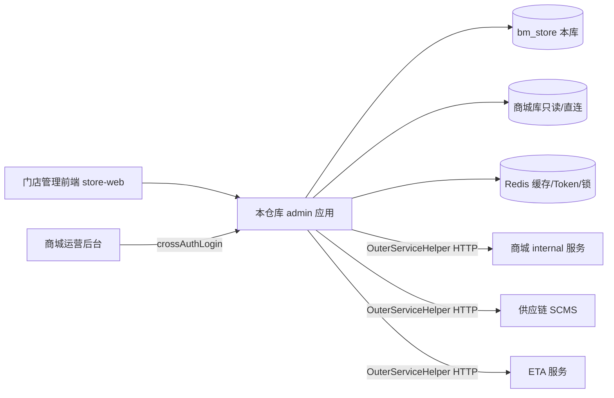
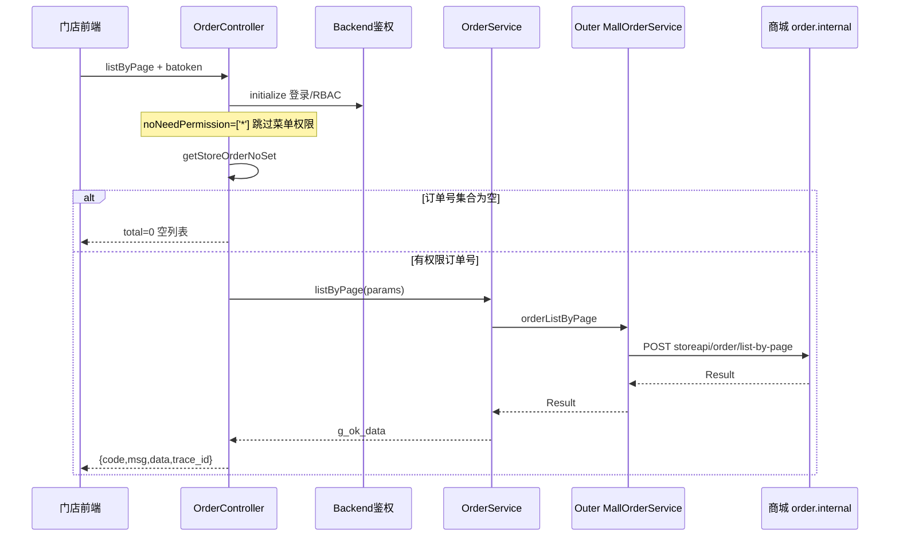
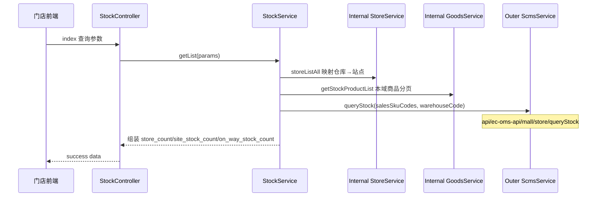

# 门店管理后端 API（bm-store-manage-api）新手上手指南

> 适用仓库：`youngs/bm-store-manage-api`
>
> 本文只记录能由仓库文件直接证明的事实。仓库没有提供的 Docker/Nginx 部署细节、crontab 具体条目、Nacos 真实内容、本地域名约定会明确标为「待确认」，不会根据经验补全。
>
> **安全声明**：`.env-example`、`config/database.php`、`config/outer.php`、`config/buildadmin.php` 中存在默认主机、账号或凭据占位。本文**只描述键名与风险**，**绝不复制真实密码、secret、token 值**。本地配置请向团队索取，不要把示例文件当生产凭据。

---

## 1. 先理解它是什么

`bm-store-manage-api` 是 bm **门店管理系统的后端 API**，不是 C 端商城网关，也不是运营后台 `operate.bm.com` 的 Yii2 服务。

可以把它理解为：



核心职责：

1. 给门店管理前端提供后台 HTTP API（默认应用名 `admin`）。
2. 用 BuildAdmin 体系做管理员登录、RBAC 菜单权限。
3. 用业务角色 `AdminRoleType` 做门店/总部数据范围控制。
4. 本库存门店、员工、佣金、折扣授权等「门店侧」数据。
5. 订单、支付、用户、售后等大量能力通过 HTTP 调用商城 internal（`MALL_*_URL`）。
6. 库存数量等能力再调用供应链 SCMS。

仓库根目录 **没有 `AGENTS.md`**。根 `README.md` 不是安装说明，而是 **smvc 开发规范清单**（Controller / Service / Model / Validate / 错误码等约定）。新人应把 README 当编码规范，把本文当上手地图。

与 Yii2 商城后端（`internal.bm.com`、`fecshop`）对比时，请记住三点：

- 框架是 **ThinkPHP 8 + BuildAdmin**，不是 Yii2。
- 分层是 **Controller → Service → Model/OuterService**，**没有独立 Repository 层**。
- 很多「看起来像本服务业务」的接口，实际只是编排后转发到商城或 SCMS。

---

## 2. 技术栈与真实版本

版本证据来自仓库 `composer.json`（`composer.lock` 存在，但本机未必已 `composer install`；下文以 `composer.json` 约束为主）：

| 项 | 仓库证据 |
|---|---|
| PHP | `>=8.2` |
| 框架 | `topthink/framework` **8.1.1**（ThinkPHP 8） |
| ORM | `topthink/think-orm` 3.0.33 |
| 多应用 | `topthink/think-multi-app` 1.1.1 |
| 限流 | `topthink/think-throttle` 2.0.2 |
| 迁移 | `topthink/think-migration` 3.1.1 |
| 后台骨架 | 包名 `wonderful-code/buildadmin`（BuildAdmin） |
| HTTP 客户端 | `guzzlehttp/guzzle ^7.8.1` |
| Redis 客户端 | `predis/predis ^3.2` |
| Excel | `phpoffice/phpspreadsheet ^5.3` |
| PDF | `dompdf/dompdf ^3.1` |
| 对象存储等 | `aws/aws-sdk-php ^3.368` |
| 雪花 ID | `godruoyi/php-snowflake ^3.2` |
| 飞书 | `antcool/easy-lark ^1.5` |
| 加密 | `defuse/php-encryption ^2.4` |
| XSS | `voku/anti-xss` |
| 全局函数自动加载 | `composer.json` `autoload.files` → `app/fun_helpers.php` |

PHP 扩展声明：`ext-bcmath`、`ext-iconv`、`ext-json`、`ext-gd`。

开发依赖：`symfony/var-dumper`、`topthink/think-trace`、`topthink/think-ide-helper`。

README 额外约定技术理解标准：**PHP 8.2、ThinkPHP 8、ThinkORM 3、MySQL 8**；并明确要求「严格使用 ThinkPHP 8 相关方法和约定，不混用 Laravel 或其他框架写法」。

---

## 3. 目录结构（新人该看哪里）

```text
bm-store-manage-api/
├── public/index.php          HTTP 入口
├── think                     CLI 入口（php think ...）
├── composer.json / lock
├── .env-example              环境变量模板（含敏感占位，勿外传）
├── README.md                 smvc 开发规范（非安装手册）
├── CHANGELOG.md
├── app/
│   ├── Application.php       扩展 think\App：启动时加载 Nacos ini
│   ├── fun_helpers.php       全局 g_* 函数（必须熟读）
│   ├── common.php            项目公共函数（含 get_auth_token）
│   ├── middleware.php        全局中间件
│   ├── event.php             事件：SQL / Redis / Outer 调用日志
│   ├── provider.php / provider/  容器服务注册（Mall/SCMS/Redis 等）
│   ├── errorCode/            错误码（必须全局唯一）
│   ├── exception/            业务异常
│   ├── listener/             RecordServiceLogListener
│   ├── command/              控制台命令（定时/同步任务）
│   ├── admin/                默认后台应用（门店管理 API 主战场）
│   │   ├── controller/       控制器（只做分发）
│   │   ├── validate/         参数校验
│   │   ├── model/            BuildAdmin 系统模型（admin/group/rule 等）
│   │   ├── service/          系统侧 Service（如 AdminService）
│   │   ├── library/Auth.php  登录与 RBAC
│   │   ├── middleware.php    admin 应用中间件
│   │   └── lang/             多语言（含 errorCode 翻译）
│   ├── api/                  另一应用（对外/安装/部分接口）
│   └── common/               禁止 URL 直接访问的公共层
│       ├── controller/       Backend / Api / Frontend 基类
│       ├── service/          业务 Service（order/store/stock/...）
│       ├── model/            业务 Model（StoreBaseModel / MallBaseModel）
│       ├── middleware/       跨域、日志、Redis 锁释放等
│       ├── library/helper/   InternalServiceHelper / OuterServiceHelper
│       ├── library/outerService/  调商城/SCMS/ETA 的 HTTP 封装
│       ├── datascope/        DTO
│       └── enum/             枚举（AdminRoleType、ConfigEnum 等）
├── config/                   应用配置（database/cache/outer/app/...）
├── database/migrations/      think-migration 迁移
├── extend/                   扩展（含 ba 组件）
└── （无 Dockerfile）
```

### 3.1 重点目录（README 原话级约定）

| 目录 | 职责 |
|---|---|
| `app/admin/controller` | 控制器层，只做请求分发 |
| `app/common/service/store`、`product` | 服务层风格重点参考 |
| `app/common/model` | 数据层 |
| `app/admin/validate` | 参数校验层 |
| `app/common/middleware` | 中间件 |
| `app/errorCode` | 错误码，必须全局唯一 |
| `app/common/datascope` | DTO |
| `app/common/enum` | 枚举 |
| `app/fun_helpers.php` | 全局函数，优先复用 |

### 3.2 多应用要点

`config/app.php`：

- `default_app` = `admin`（默认进后台应用）。
- `deny_app_list` = `['common']`（`common` **禁止 URL 访问**，只能被代码引用）。
- 另有 `app/api` 应用，用于部分对外/安装类接口；日常门店后台开发以 `admin` 为主。

### 3.3 仓库明确没有的东西

- **无 `AGENTS.md`**
- **无 `Dockerfile`**
- **无自定义 `Route` 路由表文件业务规则**（`config/route.php` 是框架路由开关配置；`url_route_must` 为 `false`，实际走 pathinfo 自动解析）
- **无 RabbitMQ / Kafka 等消息队列 Composer 依赖**；异步靠控制台命令（见第 11 节）

---

## 4. 安装、初始化与环境变量

### 4.1 仓库能确认的准备步骤

1. 克隆仓库到本地。
2. 安装 PHP >= 8.2 及扩展（至少 bcmath、iconv、json、gd；实际还需 pdo_mysql、redis 相关能力，以团队环境为准）。
3. 在仓库根目录执行 Composer 安装：

```bash
cd youngs/bm-store-manage-api
composer install
```

`composer.json` 的 `post-autoload-dump` 会执行：

```text
php think service:discover
php think vendor:publish
```

因此首次安装需要 `think` 可运行，且依赖装完后会自动发现/发布服务。

4. 复制环境模板：

```bash
cp .env-example .env
```

然后按团队提供的真实值修改（**不要把 `.env` 提交到 Git**；也不要把示例密码贴到文档/聊天）。

5. 确认 Web 服务器 document root 指向 `public/`（仓库本身无 Nginx 配置文件，具体 vhost **待确认**）。

6. CLI 入口已存在：根目录 `think`。

```bash
php think
# 或执行已注册命令，例如：
php think sync:mallAdminUser
```

7. 数据库迁移相关命令在 `config/terminal.php` 中有示例字符串：

```text
php think migrate:run
php think migrate:rollback
php think migrate:breakpoint
```

是否在新环境必须跑全量 migration、以及是否已有现成库，需团队确认。

### 4.2 `.env-example` 能证明的键（不写值）

| 类别 | 键名（示例） | 含义 |
|---|---|---|
| 应用 | `APP_DEBUG`、`APP_ENV` | 调试与环境（`dev` 等） |
| 免登录 | `DEV_ADMIN_NO_LOGIN`、`DEV_ADMIN_LOGIN_ID` | 仅 `APP_ENV=dev` 且开关为 1 时后台免登录 |
| 时区语言 | `DEFAULT_TIMEZONE`、`DEFAULT_LANG` | 默认 Asia/Shanghai、zh-cn |
| 本库 DB | `database_host`、`database_name`、`database_username`、`database_password`、`database_port` | 示例 host 指向 `mysql.infra.dev.mall`，库名 `bm_store` |
| 商城库 | `mall_database_*` | 另一套 MySQL 连接，用于 `mysql_mall` |
| Redis | `redis_host`、`redis_port` | 示例 host `redis.infra.dev.mall` |
| 商城 URL | `MALL_SITE_URL`、`MALL_AFTERSALE_URL`、`MALL_GOODS_URL`、`MALL_ORDER_URL`、`MALL_PAY_URL`、`MALL_USER_URL`、`MALL_MARKET_URL`、`MALL_NEW_PAY_URL`、`MALL_NEW_USER_URL` | OuterService 基址 |
| 供应链 | `SCMS_URL` | SCMS 基址 |
| 对外 token | `OUTER_CALLER_API_TOKEN` | 调用外部时的 caller token 配置键 |
| ETA | `EAT_URL`（注意示例拼写） | ETA 相关；`config/outer.php` 另用 `ETA_URL`/`ETA_SECRET` |

另外，`Application::initialize` 还会尝试从环境变量 **`NACOS_CONFIG_DIR`** 读取 `bm-store-base.ini` 并 load 进 env（见第 5 节）。该目录内容不在本仓库内。

### 4.3 本地快速自检清单

- [ ] `vendor/` 已生成
- [ ] `.env` 已存在且非空
- [ ] `php think` 能列出命令
- [ ] MySQL 能连上 `bm_store`
- [ ] Redis 能连上（缓存用 DB14，Token 用 DB15）
- [ ] 若依赖 Nacos：`NACOS_CONFIG_DIR` 指向可读目录且存在 `bm-store-base.ini`
- [ ] 商城 `MALL_ORDER_URL` 等内网地址在本地可达（否则订单类接口会失败）

---

## 5. 入口与请求生命周期

### 5.1 HTTP 入口：`public/index.php`

流程概要：

1. 部分条件下会检测安装锁 / 是否存在前端 `index.html`（BuildAdmin 遗留逻辑）。
2. `require vendor/autoload.php`
3. `new Application()`（注意是 **`app\Application`**，不是原生 `think\App`）
4. `$http->run()` → `send()` → `end()`

### 5.2 CLI 入口：`think`

```php
(new Application())->console->run();
```

同样走自定义 `Application`，因此 CLI 也会尝试加载 Nacos base ini。

### 5.3 `app\Application` 与 Nacos

`app/Application.php` 在 `initialize()` 中：

1. 调用 `loadEnv(ConfigEnum::BASE->value . '.ini', getenv('NACOS_CONFIG_DIR'))`
2. 即读取：`{NACOS_CONFIG_DIR}/bm-store-base.ini`
3. 文件存在则 `$this->env->load(...)`
4. 再 `parent::initialize()`

`ConfigEnum::BASE` 的值为字符串 **`bm-store-base`**。

业务代码还可通过 `g_config(ConfigEnum $module, string $key, mixed $default = null)` 读各模块配置（`bm-store-goods`、`bm-store-order` 等）。**模块名必须用枚举，不要手写魔法字符串**（与工作空间 Yii 项目里禁止手写 `g_config` 模块名是同一类纪律）。

若 `NACOS_CONFIG_DIR` 未设置或文件不存在：启动不一定立刻崩溃，但依赖 Nacos 注入的配置会缺失——这是真实风险（见安全节）。

### 5.4 一次典型 HTTP 请求的阶段

```text
Web Server → public/index.php
  → Application 初始化（.env + Nacos base ini）
  → 多应用识别（默认 admin）
  → 全局中间件
  → 应用中间件（admin）
  → 路由解析（pathinfo）
  → Controller::initialize（Backend 鉴权）
  → Action
  → Service / Model / OuterService
  → 统一 JSON 响应 {code,msg,time,data,trace_id}
```

---

## 6. 路由与中间件

### 6.1 没有业务自定义 Route 表

`config/route.php` 关键点：

- `url_route_must` = `false`（不强制路由定义）
- `controller_suffix` = `true`（控制器类名带 `Controller` 后缀）
- `default_route_pattern` 允许控制器段含点号（`[\w\.]+`），因此支持 `order.Order` 这种「目录.控制器」写法

实际 URL 形态是 **pathinfo**：

```text
/admin/{控制器路径}/{方法}
```

真实例子（仓库代码注释/调用可印证）：

| URL | 控制器 | 方法 |
|---|---|---|
| `/admin/index/login` | `app\admin\controller\IndexController` | `login` |
| `/admin/order.Order/listByPage` | `app\admin\controller\order\OrderController` | `listByPage` |
| `/admin/stock.Stock/index` | `app\admin\controller\stock\StockController` | `index` |
| `/admin/stock.Stock/config` | 同上 | `config` |

理解规则：

- 第一段 `admin` = 应用名
- `order.Order` = `controller/order/OrderController.php`
- `listByPage` = 方法名（驼峰）

本地调试时，若使用 PHP 内置服务器，通常还需要把请求指到 `public/index.php`（具体 rewrite **待确认**）。

### 6.2 全局中间件（`app/middleware.php`）

1. `app\common\middleware\RedisLockAutoRelease`  
   请求结束自动释放本请求登记的 Redis 锁，避免业务异常返回时漏解锁；最终兜底仍依赖 Redis TTL。
2. `think\middleware\Throttle`  
   限流（具体规则见 `config/throttle.php`）。

### 6.3 admin 应用中间件（`app/admin/middleware.php`）

1. `AllowCrossDomain` — 跨域
2. `AdminLog` — 管理员操作日志
3. `think\middleware\LoadLangPack` — 语言包
4. `RequestAndResponseLog` — 请求/响应日志，并生成 `requestId`（即响应里的 `trace_id`）

### 6.4 鉴权不在中间件里完成

登录校验、RBAC、`DEV_ADMIN_NO_LOGIN` 主要在 **`Backend::initialize()`** 完成，而不是单独的 Auth 中间件。排查「为什么没登录也能进」时，先看 Controller 是否继承 `Backend`，以及 `$noNeedLogin` / `$noNeedPermission`。

---

## 7. smvc 分层与双 Service 体系

### 7.1 smvc 是什么

README 定义的分层：

```text
Controller（Backend）
  → Validate（check / checkService）
  → Service（BaseService::instance() 单例）
      → Model（BaseModel / StoreBaseModel / MallBaseModel）
      → OuterService（HTTP 调外部）
      → InternalServiceHelper（调本项目其他域 Service）
  → 统一响应 success / error / serviceResult
```

**没有独立 Repository 层。** 这与 Yii2 internal 项目「Controller → Service → Repository → Model」不同：这里 Model 直接承担数据访问；复杂联表可用 Join 类封装。

### 7.2 Controller 规范（必须遵守）

Controller 只负责：

1. 接收请求参数
2. 调用 Validate 校验
3. 调用 Service 执行业务
4. 返回统一响应

禁止：

- 在 Controller 写复杂业务逻辑
- 在 Controller 写复杂数据库查询
- 在 Controller 直接承担事务编排

基类常用能力：

- `$this->success()` / `$this->error()` / `$this->serviceResult()`
- `$this->auth`（登录管理员）
- `$this->getStoreOrderNoSet()`（订单数据权限）
- `parsePageParams()`（分页参数 trait）

### 7.3 Service 规范

- 继承 `app\common\service\BaseService`（使用 `Singleton` trait，常用 `OrderService::instance()`）。
- 负责业务规则、多模型协同、事务、DTO 组装、调用 helper。
- 参数以数组或基础类型为主。
- 返回统一结构：`g_ok_data()` / `g_err_data()`（`code/msg/data`）。

### 7.4 Model 规范

- 业务门店表：优先 `StoreBaseModel`（连接 `mysql_store`，软删除字段 `del_flag`，时间字段 `created_at`/`updated_at`）。
- 商城库表：`MallBaseModel`（连接 `mysql_mall`）。
- BuildAdmin 系统表：`app\admin\model\*`，默认连接 `mysql`，表前缀 `system_`（见 database 配置）。
- `$schema` 是字段语义重要依据。
- 业务规则不要堆进 Model。

### 7.5 双 Service：Internal vs Outer（极其重要）

| Helper | 含义 | 典型用途 |
|---|---|---|
| `InternalServiceHelper` | 调用**本仓库内**各域 `ApiService` | 门店、商品本地表、站点、系统管理员等 |
| `OuterServiceHelper` | 调用**外部 HTTP**（商城/SCMS/ETA） | 订单列表、支付、用户、库存数量等 |

例如：

```php
// 本库门店
InternalServiceHelper::StoreService()->storeListAll();

// 商城订单 HTTP
OuterServiceHelper::MallOrderService()->orderListByPage($params);

// 供应链库存 HTTP
OuterServiceHelper::ScmsService()->queryStock($params);
```

新人常见错误：在「订单 Service」里直接查本库以为能得到全量订单——实际上列表主数据来自商城 `MALL_ORDER_URL`。

`OuterServiceHelper` 提供的门面包括（不完全列表）：

- `MallSiteService` / `MallGoodsService` / `MallOrderService` / `MallPayService` / `MallNewPayService`
- `MallUserService` / `MallNewUserService` / `MallMarketService` / `MallAfterSaleService`
- `ScmsService` / `EtaService`

容器绑定在 `app/provider/*ServiceProvider.php`。

---

## 8. 认证、RBAC 与业务数据权限

### 8.1 Token 从哪里来

`get_auth_token()`（`app/common.php`）会按多种分隔符从 header / param / server 读取，兼容：

- Header：`batoken`、`ba-token`
- Param：`batoken`、`ba-token`、`ba_token`
- Server：`http_ba_token`

前端通常在 Header 带 `batoken` 或 `ba-token`。

### 8.2 Token 存在哪里

`config/buildadmin.php` → `token.stores.redis`：

- 驱动：Redis
- **DB index = 15**
- key 前缀：`tk:`
- 另有加密 `key`/`algo` 配置（**本文不复制具体密钥值**；仓库默认值有泄露风险，见安全节）

管理员 token type 为 `Auth::TOKEN_TYPE = 'admin'`。

默认保持时间：`admin_token_keep_time` = 3 天（可在 buildadmin 配置修改）。

注意：业务缓存 Redis 使用 **DB 14**、前缀 `tk:`（`config/cache.php`）。Token 与缓存分库，但前缀相同，排查 key 时务必看 select DB。

### 8.3 登录入口

`IndexController`：

- `$noNeedLogin = ['logout', 'login', 'crossAuthLogin']`
- `login()`：用户名密码登录；成功后 `Auth::login`，返回 `userInfo`（含 token）
- `crossAuthLogin()`：用商城后台 `cross_auth_token`，经 `AuthService` 调商城校验，再 `Auth::loginByMall`
- `logout()`：删除 refreshToken 并 logout

未登录时 `Backend` 返回：

- 业务 code **303**（`Auth::LOGIN_RESPONSE_CODE`），并带 `type = need login`
- Token 过期：**409**，消息 Token expiration

权限不足：code **401**。

### 8.4 开发免登录

条件（必须同时满足）：

1. `g_env_is_dev()` 为真（`APP_ENV=dev`）
2. `config('app.dev_admin_no_login') === 1`（来自 `DEV_ADMIN_NO_LOGIN`）
3. 当前 action 需要登录但尚未登录

然后 `Auth::initDevLogin(DEV_ADMIN_LOGIN_ID)`：

- **不写 Redis token**
- **不更新登录时间/IP**
- 仍按该管理员 ID 做后续权限与数据权限

生产/预发误开此开关是严重事故；代码已用 `APP_ENV=dev` 双保险，但仍需配置纪律。

### 8.5 RBAC（BuildAdmin 菜单权限）

系统表在默认 `mysql` 连接上，前缀 **`system_`**，对应模型如：

- `Admin`
- `AdminGroup`
- `AdminRule`
- 以及 `admin_group_access` 等关联

`Backend::initialize()` 在已登录且当前 action **不在** `$noNeedPermission` 时：

```text
$routePath = controllerPath + '/' + action
Auth::check($routePath)
```

失败则 401。

### 8.6 验收期风险：订单模块权限放开

`OrderController` 源码注释写明：

```text
//验收阶段先用*
protected array $noNeedPermission = ['*'];
```

这意味着：**只要登录，就不再做 RBAC 菜单权限校验**（仍要登录，除非免登录）。同类 `['*']` 在报价、发票、部分用户/支付控制器也出现。新人必须把这当成**已知安全债**，不要误以为「有 Auth::check 就等于所有模块都强校验」。

数据范围仍可能由 `getStoreOrderNoSet()` 限制（见下）。

### 8.7 业务角色 `AdminRoleType`

```text
0 DEFAULT     待分配
1 ROLE_TYPE_HE 总部人员
2 ROLE_TYPE_STORE 门店人员
```

订单可见范围由 `Backend::getStoreOrderNoSet()` 决定：

- 总部：可查全部门店订单（可再按 store/staff 过滤）
- 待分配或 `mall_admin_user_id === 0`：返回空集合 → 列表直接空数据
- 门店人员：根据店长/店员身份拼 type，再调订单服务取订单号集合

这是「RBAC 菜单权限」之外的第二道 **数据权限**。

---

## 9. 核心模块地图

按 `app/admin/controller` 与 `app/common/service` 对照：

| 域 | Controller 目录 | Service 目录 | 数据主要来源 |
|---|---|---|---|
| 登录/系统 | `IndexController`、`auth/`、`security/`、`routine/` | `admin/service/system` | 本库 system_ 表 + Redis token |
| 门店员工 | `store/` | `common/service/store` | 本库 mysql_store |
| 商品 | `product/` | `common/service/product` | 本库 + 可能同步/外调 |
| 库存 | `stock/` | `common/service/stock` | 本库商品 + SCMS 库存 |
| 订单/报价/发票 | `order/` | `common/service/order` | **大量 Outer 商城订单** |
| 支付 | `pay/` | `common/service/pay` | Outer newpay/pay + 本库配置 |
| 用户 | `user/` | `common/service/user` | Outer 用户服务 + 本库跟进 |
| 售后 | `aftersale/` | `common/service/aftersale` | Outer aftersale |
| 营销/活动 | `activity/` 等 | `common/service/market` | 本库折扣 + Outer |
| 概览 | `overview/` | `common/service/overview` | 聚合 |
| 内容/公告 | `content/` | `common/service/content` | 本库 |
| 站点 | `site/` | `common/service/site` | 本库/配置 |
| 飞书 | — | `common/service/feishu` | easy-lark |

另有 `app/api/controller`：安装、部分 store/product/market 接口等，给非后台前端或内部调用；开发新门店后台页面时先确认前端打的是 `/admin/...` 还是 `/api/...`。

---

## 10. 基础设施：多数据库、Redis、日志、响应

### 10.1 四个 MySQL 连接（`config/database.php`）

| 连接名 | 库 | 表前缀 | 典型用途 |
|---|---|---|---|
| `mysql`（default） | `bm_store`（env） | `system_` | BuildAdmin 管理员/权限/系统配置 |
| `mysql_store` | 同一 `bm_store` | 无前缀 | 门店业务表（StoreBaseModel） |
| `mysql_mall` | 商城库（`mall_database_*`） | 可配置 | 直连商城表（MallBaseModel） |
| `read_only_mysql_mall` | 商城只读库 | 可配置 | 只读查询 |

风险：同一进程可触达门店库与商城库。写错 connection 可能读到错误库，甚至在有写权限时误写商城库。新人改 Model 时必须先看 `$connection`。

时间字段：StoreBaseModel 使用 int 风格的 `created_at`/`updated_at` + `del_flag` 软删，与工作空间 Yii 规范方向一致；但 **BuildAdmin 系统表** 有自己的时间戳策略，不要混用假设。

### 10.2 Redis

| 用途 | 配置位置 | DB | 前缀 |
|---|---|---|---|
| 缓存 | `config/cache.php` stores.redis | **14** | `tk:` |
| Token | `config/buildadmin.php` token.stores.redis | **15** | `tk:` |
| 分布式锁 | `RedisLock` + `RedisLockAutoRelease` 中间件 | 经缓存/自定义客户端 | 业务前缀 |

`g_redis()` 通过 provider 拿到封装后的 RedisManager。

### 10.3 无消息队列

`composer.json` 无 php-amqplib / kafka 客户端。异步与批处理依赖 **控制台命令**，由系统 crontab（或同类调度）执行 `php think <命令>`。

`config/console.php` 已注册示例：

- `store:staffCommission`
- `product:mallProductSyncData`
- `store:costInitialization`
- `sync:activity` / `sync:activity:test`
- `sync:mallAdminUser`
- `sync:storeManagerDiscount`
- `store:managerDiscountCalculate`
- `store:managerDiscountAbandonOverdue`
- `store:managerDiscountResetUsedLimit`
- `feishu:notice:test`
- `test` / `test:unit`

仓库内**没有**名为 `Cron` 的单一命令类；团队口语里的「跑 Cron」通常指调度这些 `php think ...` 命令。具体 crontab 条目 **待确认**。

### 10.4 统一响应格式

`Api::result()`：

```json
{
  "code": 1,
  "msg": "...",
  "time": 1710000000,
  "data": {},
  "trace_id": "uuid-or-null"
}
```

约定：

- 成功：`code = 1`（`success` 默认）
- 失败：`code = 0` 或业务错误码（如 10003、60004、70001）
- Service 层用 `g_ok_data` / `g_err_data`；Controller 用 `serviceResult` 自动转换

注意：HTTP 状态码多数仍是 200，业务成败看 JSON `code`。登录态特殊码 303/409 是通过 result 的 `code` 字段表达（同时可能配合 header statusCode）。

### 10.5 日志

| 机制 | 作用 |
|---|---|
| `g_log_info` / `g_log_warning` / `g_log_error` | 业务日志（`fun_helpers.php`） |
| `RequestAndResponseLog` | 记录请求参数/头与响应；生成 `trace_id` |
| `RecordServiceLogListener` | 监听 AppInit、RedisCalled、OuterServiceCalled，记录 SQL / 外部调用等 |

排障时先拿响应 `trace_id`，再在日志中检索。

错误码目录：`app/errorCode/code/*.php`，由 `ErrorCode` 递归加载；重复码会抛异常；要求完整 code（>=10000）。

---

## 11. 两条真实链路（请亲手跟读）

### 链路 A：订单分页列表

**URL**：`GET /admin/order.Order/listByPage`



逐步对应代码：

1. `OrderController::listByPage`
2. `parsePageParams($this->request->get())`
3. `$params['store_order_list'] = $this->getStoreOrderNoSet(...)`  
   - 空则直接 success 空数据
   - 非空则 `json_encode` 后传入
4. `OrderService::instance()->listByPage`
5. `OuterServiceHelper::MallOrderService()->orderListByPage($params)`
6. HTTP：`POST {MALL_ORDER_URL}/storeapi/order/list-by-page`
7. 将商城返回的 `count` 转成对外 `total`

学习目标：能回答「订单列表数据在哪个系统产生？本库只做了什么？」

### 链路 B：库存列表

**URL**：`GET /admin/stock.Stock/index`



要点：

1. 先用门店仓库列表把 `warehouse_code` 映射到 `site_code`；映射失败直接提示请选择门店/仓库。
2. 商品列表来自 **Internal GoodsService**（本服务商品域）。
3. 库存数量来自 **SCMS** `queryStock`；HTTP 失败会 `g_log_error('scmsQueryStock', ...)` 并返回错误文案。
4. `StockController` 的 `$noNeedPermission` 仅包含 `config`、`edit`，**`index` 默认仍走 RBAC**（与订单模块不同）。

学习目标：能区分「商品主数据」与「库存数量」的来源系统。

---

## 12. 第一次新增一个后台接口（逐步教程）

假设要新增：`GET /admin/demo.Hello/ping`，返回当前登录管理员 ID。

### 步骤 1：建 Controller

路径：`app/admin/controller/demo/HelloController.php`

```php
<?php
namespace app\admin\controller\demo;

use app\common\controller\Backend;
use app\common\service\demo\HelloService;

class HelloController extends Backend
{
    // 开发初期若暂未配置菜单权限，可临时放开；上线前必须收敛
    // protected array $noNeedPermission = ['ping'];

    public function ping(): void
    {
        $this->serviceResult(HelloService::instance()->ping($this->auth->id));
    }
}
```

### 步骤 2：建 Service

路径：`app/common/service/demo/HelloService.php`

```php
<?php
namespace app\common\service\demo;

use app\common\service\BaseService;

class HelloService extends BaseService
{
    public function ping(int $adminId): array
    {
        if ($adminId <= 0) {
            return g_err_data(10002);
        }
        return g_ok_data(['admin_id' => $adminId]);
    }
}
```

### 步骤 3：需要入参时加 Validate

参考 `app/admin/validate/BaseValidate.php` 的 `checkService($data, $keys, $requires)`，在 Controller 里：

```php
[, $err] = g_ret_err((new XxxValidate())->checkService($params, ['foo'], ['foo']));
if ($err) {
    $this->serviceResult($err);
}
```

### 步骤 4：需要落库时加 Model

- 门店业务表 → 继承 `StoreBaseModel`，确认表在 `bm_store` 且无 `system_` 前缀。
- 若是权限/管理员相关 → `app/admin/model` + 默认 `system_` 前缀。

### 步骤 5：需要调商城时

在 `app/common/library/outerService/mall/` 增加方法，或复用已有 `OuterServiceHelper::MallXxxService()`，**不要在 Controller 里直接 new Guzzle**。

### 步骤 6：配置 RBAC 菜单/规则

在后台权限管理中增加对应 rule（路径需与 `Auth::check` 使用的 `controllerPath/action` 一致）。若临时 `noNeedPermission`，必须在任务/MR 中写明回收计划。

### 步骤 7：自测

```bash
# 先登录拿 batoken，再：
curl -H 'batoken: <your-token>' \
  'http://<host>/admin/demo.Hello/ping'
```

期望：`code=1` 且 `data.admin_id` 有值；未登录应 `code=303`。

---

## 13. 错误码、Validate、DTO、Enum

### 13.1 错误码

- 定义目录：`app/errorCode/code/`（如 `Base.php`、`Order.php`、`Admin.php`…）
- 加载器：`app/errorCode/ErrorCode.php`
- 规则：完整数字码、全局唯一、重复即抛错
- `g_err_data($errno)` 会通过错误码取默认文案
- 多语言：`app/admin/lang/*/errorCode.php`

`Base` 中已有通用码示例：10002 必填为空、10003/10004 参数错误、10007+ Redis 锁相关等。

### 13.2 Validate

- 基类：`app\admin\validate\BaseValidate`
- 推荐：`checkService` / `checkArrayService`，返回 `g_ok_data`/`g_err_data`，与 Service 风格一致
- 也可用 ThinkPHP 原生 `Validate::rule`（登录接口即如此）
- scene 组织多场景；**不要把主业务逻辑塞进 Validate**

### 13.3 DTO

- 目录：`app/common/datascope`
- 例子：`StaffDataPermissionDto`、`BusinessLogDto`
- 用于跨层传递结构化数据，避免超大关联数组语义不清

### 13.4 Enum

- 目录：`app/common/enum`
- 必记：`AdminRoleType`、`ConfigEnum`
- 订单/报价等子目录还有状态枚举
- 优先枚举替代魔法数字

### 13.5 全局函数速查（`g_*`）

| 函数 | 用途 |
|---|---|
| `g_ok_data` / `g_err_data` | 统一成功/失败结构 |
| `g_ret_err` / `g_check_ret_is_ok` / `g_get_ret_data` | 解构与判断返回 |
| `g_config` | 读 Nacos/配置模块 |
| `g_log_info` / `g_log_warning` / `g_log_error` | 日志 |
| `g_env_is_dev` 等 | 环境判断 |
| `g_redis` / `g_rdkey` | Redis / Rdkey |
| `g_uuid` | 生成 UUID（trace） |

先搜 `fun_helpers.php` 再写工具函数，避免重复造轮子。

---

## 14. 调试与排障手册

### 14.1 404

检查：

1. document root 是否为 `public/`
2. URL 是否包含应用名 `admin`
3. 控制器文件是否在 `app/admin/controller/...` 且类名 `XxxController`
4. 方法名是否与 URL 一致（驼峰）
5. 多级控制器是否使用点号：`order.Order`

### 14.2 303 未登录

检查：

1. 是否带了 `batoken` / `ba-token`
2. Redis DB15 是否有对应 token
3. Token 是否过期（过期是 409）
4. 本地是否误以为开了免登录：需 `APP_ENV=dev` 且 `DEV_ADMIN_NO_LOGIN=1`

### 14.3 409 Token expiration

Token 存在但过期；重新登录。开发免登录开启时，过期 token 不应阻塞（代码会尝试构造 dev 登录态）。

### 14.4 401 无权限

1. 当前 action 是否在 `$noNeedPermission`
2. 管理员是否属于拥有该 rule 的 group
3. 是否超级管理员
4. 订单模块即使 RBAC 放开，仍可能因 `getStoreOrderNoSet` 为空看到「空列表」——那不是 401，而是空数据

### 14.5 订单列表一直为空

1. `role_type` 是否为 0 待分配
2. `mall_admin_user_id` 是否为 0
3. 门店人员是否未绑定门店
4. 外调 `getStoreOrderNoList` 是否失败（失败会直接 error，而不是静默空）

### 14.6 外调商城/SCMS 失败

1. `.env` 中 `MALL_*_URL` / `SCMS_URL` 是否可达
2. 看 `RecordServiceLogListener` / `g_log_error` 外部调用日志
3. 区分：HTTP 网络失败 vs 对方业务 code 失败
4. Outer 返回结构经 `ResultInterface`；订单兜底码如 `60004`

### 14.7 Nacos / 配置异常

1. `echo $NACOS_CONFIG_DIR` 是否设置
2. 是否存在 `bm-store-base.ini`
3. `g_config(ConfigEnum::..., ...)` 读到的是否为默认值
4. 切勿在不知情时把本地 `.env` 提交或覆盖他人环境

### 14.8 SQL 慢/错

1. `APP_DEBUG` 下 `trigger_sql` 可能开启
2. 确认 Model 的 `$connection`
3. 门店表记得软删条件（`del_flag`）
4. 用 `trace_id` 关联请求日志

### 14.9 排障顺序建议

1. 复现请求的完整 URL、方法、关键 Header（可打码 token）
2. 看响应 `code` / `msg` / `trace_id`
3. 用 `trace_id` 搜 requestLog/responseLog
4. 判断失败点：鉴权 → 本库 → Outer HTTP → 对方系统
5. 对照本文链路 A/B 画调用链
6. 分享日志前遮盖 token、密码、PII

---

## 15. 与 Yii2 项目的关键差异

| 维度 | 本仓库 ThinkPHP/BuildAdmin | Yii2（fecshop / internal） |
|---|---|---|
| 框架 | ThinkPHP 8.1.1 | Yii2 |
| 入口 | `public/index.php` + `think` | `{app}/web/index.php` + `yii` |
| 分层 | Controller → Service → Model/Outer | 常为 Controller → Service → Repository → Model |
| Repository | **无** | **有（强制）** |
| 路由 | pathinfo 自动解析，少手写 Route | urlManager rules / module |
| 多应用 | think-multi-app（admin/api/common） | advanced 多应用或多模块 |
| 鉴权 | batoken + Redis DB15 + Backend::initialize | 各项目 JWT/token/filter 不同 |
| 配置中心 | Nacos ini + `ConfigEnum` + `g_config` | Nacos + `ConfigHelper` 常量 |
| 全局函数 | `app/fun_helpers.php` 的 `g_*` | 各项目 helpers / `g_log_*` 等 |
| 后台骨架 | BuildAdmin（system_ 前缀表） | 自研或运营后台分离 |
| 订单实现 | 多转发商城 storeapi | 订单服务本域实现 |
| 消息队列 | **无**（控制台命令） | 常见 RabbitMQ 等 |
| 容器化 | **仓库无 Dockerfile** | 视项目而定 |
| 文档 | README=规范；无 AGENTS.md | 工作空间要求各仓 AGENTS.md |

对已经熟悉 Yii2 的同学：不要把「Service 里再调 Repository」的习惯硬搬过来；这里 Service 直接用 Model，跨系统用 OuterServiceHelper。

---

## 16. 安全红线（只描述风险，不给可利用细节）

1. **多 DB 混用**：同一应用可连门店库与商城库。写代码必须显式确认 connection；禁止「顺手」在商城连接上做写操作。
2. **外部依赖面大**：订单/支付/用户/售后/库存都依赖内网 HTTP。本地或测试环境 URL 配错可能打到错误环境。
3. **Nacos 为空**：`NACOS_CONFIG_DIR` 缺失时 base ini 不加载，行为依赖 `.env` 与代码默认值，容易出现「本地能跑、联调全挂」或静默用了不安全默认。
4. **配置默认凭据风险**：`config/database.php`、`config/outer.php`、`config/buildadmin.php`、`.env-example` 中存在默认主机、账号、secret、token 占位。**禁止复制到文档、MR、聊天、截图**；部署必须用环境注入覆盖；并推动清理仓库内硬编码默认秘密。
5. **订单等模块 `noNeedPermission = ['*']`**：验收期放开菜单权限。登录用户可能调用未在菜单授权的订单接口。上线前应回收，并依赖数据权限与网关/前端双重约束仍不够时要补服务端校验。
6. **`DEV_ADMIN_NO_LOGIN`**：仅限本地 dev；禁止在共享测试环境长期开启。
7. **Token 与缓存同前缀不同 DB**：运维清理 Redis 时不要误清 DB15 导致全员掉线，也不要误清 DB14 影响缓存。
8. **日志含请求头与参数**：`RequestAndResponseLog` 可能记录敏感字段；日志访问需鉴权，对外分享必须脱敏。
9. **禁止在 master 直接开发/擅自提交**（工作空间 Git 红线）。
10. **OpenSpec 实现期禁止用生产 MCP 验证**；本服务联调应使用开发环境 URL 与本地/测试库。

---

## 17. 第一周阅读路线

### 第 1 天：建立整体认识

1. `README.md`（规范）
2. `composer.json`
3. `public/index.php`、`think`
4. `app/Application.php`
5. `.env-example`（只看键，不传播值）

目标：能说清这是门店后台 API、如何启动、依赖哪些外部系统。

### 第 2 天：目录与分层

1. `app/admin/controller/IndexController.php`
2. `app/common/controller/Backend.php`（前 220 行鉴权）
3. `app/common/service/BaseService.php`
4. `app/fun_helpers.php` 中 `g_ok_data`/`g_err_data`/`g_config`/`g_log_*`
5. `config/app.php`、`config/database.php`、`config/cache.php`

目标：能画出 smvc 与四数据库职责。

### 第 3 天：认证与权限

1. `app/admin/library/Auth.php`
2. `get_auth_token`（`app/common.php`）
3. `config/buildadmin.php` 的 token 段（不抄密钥）
4. `AdminRoleType`
5. `Backend::getStoreOrderNoSet`

目标：能解释 303/409/401 与角色数据范围。

### 第 4 天：双 Service 与外部调用

1. `InternalServiceHelper`
2. `OuterServiceHelper`
3. `app/common/library/outerService/mall/OrderService.php`
4. `config/outer.php`（只看结构）
5. `app/provider/MallServiceProvider.php`

目标：拿到任意外调方法能说出完整 URL 路径。

### 第 5 天：跟读链路 A（订单）

完整打开：

`OrderController::listByPage` → `getStoreOrderNoSet` → `OrderService::listByPage` → `MallOrderService::orderListByPage`

目标：用自己的话复述序列图。

### 第 6 天：跟读链路 B（库存）

完整打开：

`StockController::index` → `StockService::getList` → Store/Goods Internal → `ScmsService::queryStock`

目标：能说明为何库存接口会同时碰本库与 SCMS。

### 第 7 天：动手加一个只读接口

按第 12 节走通 Controller + Service + 登录调用；并刻意制造一次未登录 303、一次校验失败，观察响应与 `trace_id` 日志。

---

## 18. 术语表

| 术语 | 含义 |
|---|---|
| BuildAdmin | 本项目基于的后台框架（`wonderful-code/buildadmin`） |
| smvc | 本仓库约定的分层：Controller/Validate/Service/Model 等 |
| multi-app | ThinkPHP 多应用；默认 `admin`，`common` 禁止 URL 访问 |
| pathinfo | `/应用/控制器/方法` 形式的 URL 解析 |
| batoken | 后台管理员登录令牌（Header/参数多种写法） |
| RBAC | 基于 `system_admin*` / rule 的菜单与路由权限 |
| AdminRoleType | 业务角色：待分配/总部/门店 |
| getStoreOrderNoSet | 按角色计算可见订单号集合的数据权限方法 |
| InternalServiceHelper | 调用本仓库内各域 ApiService 的门面 |
| OuterServiceHelper | 调用商城/SCMS/ETA 等外部 HTTP 的门面 |
| storeapi | 商城侧提供给门店系统的 API 路径前缀 |
| mysql_store | 门店业务库连接（无 system_ 前缀） |
| system_ 前缀 | BuildAdmin 系统表前缀 |
| g_ok_data / g_err_data | Service 层统一返回结构构造器 |
| trace_id | 请求链路 ID，中间件生成并写入响应 |
| Nacos base ini | `bm-store-base.ini`，启动时载入 env |
| ConfigEnum | Nacos/配置模块名枚举 |
| RedisLock | 基于 Redis 的互斥锁；请求结束自动释放 |
| think 命令 | CLI：`php think <command>`，承担定时/同步任务 |
| noNeedLogin | Controller 中声明无需登录的 action 列表 |
| noNeedPermission | 已登录但跳过 RBAC 校验的 action 列表 |

---

## 19. 待确认事项

1. 团队标准本地域名与 Nginx/Caddy 配置如何指向 `public/`。
2. 本地 PHP 是宿主机、容器还是其他；因仓库无 Dockerfile，需确认运行载体。
3. `composer install` 是否需要私有源/镜像认证。
4. 新环境是否必须执行 `php think migrate:run`，还是直接使用已有库结构。
5. `NACOS_CONFIG_DIR` 在开发机上的标准路径与 ini 获取方式。
6. 各 `MALL_*_URL` 在开发/测试/生产的真实地址表（由团队配置中心管理）。
7. crontab 中具体调度了哪些 `php think` 命令、频率如何。
8. 订单等模块 `noNeedPermission=['*']` 的回收时间表与替代方案。
9. 门店前端仓库与本 API 的环境对应关系（哪个前端打哪个 API）。
10. `app/api` 应用哪些接口仍在生产使用，哪些仅安装/遗留。
11. 商城库直连（`mysql_mall`）的写权限是否在账号层已只读收紧。
12. 仓库内配置文件默认凭据清理与密钥轮换是否已排期。
13. 是否计划补 `AGENTS.md` 与安装文档（当前 README 仅为开发规范）。
14. 跨系统 `crossAuthLogin` 的调用方与 token 有效期约定。
15. 日志落盘路径、保留周期与脱敏规范的运维标准。

---

## 关键文件索引

- `youngs/bm-store-manage-api/README.md`
- `youngs/bm-store-manage-api/composer.json`
- `youngs/bm-store-manage-api/.env-example`
- `youngs/bm-store-manage-api/public/index.php`
- `youngs/bm-store-manage-api/think`
- `youngs/bm-store-manage-api/app/Application.php`
- `youngs/bm-store-manage-api/app/fun_helpers.php`
- `youngs/bm-store-manage-api/app/middleware.php`
- `youngs/bm-store-manage-api/app/admin/middleware.php`
- `youngs/bm-store-manage-api/app/common/controller/Backend.php`
- `youngs/bm-store-manage-api/app/common/controller/Api.php`
- `youngs/bm-store-manage-api/app/admin/controller/IndexController.php`
- `youngs/bm-store-manage-api/app/admin/controller/order/OrderController.php`
- `youngs/bm-store-manage-api/app/admin/controller/stock/StockController.php`
- `youngs/bm-store-manage-api/app/common/service/order/OrderService.php`
- `youngs/bm-store-manage-api/app/common/service/stock/StockService.php`
- `youngs/bm-store-manage-api/app/common/library/helper/InternalServiceHelper.php`
- `youngs/bm-store-manage-api/app/common/library/helper/OuterServiceHelper.php`
- `youngs/bm-store-manage-api/app/common/library/outerService/mall/OrderService.php`
- `youngs/bm-store-manage-api/app/common/library/outerService/scms/ScmsService.php`
- `youngs/bm-store-manage-api/app/admin/library/Auth.php`
- `youngs/bm-store-manage-api/app/common/enum/AdminRoleType.php`
- `youngs/bm-store-manage-api/app/common/enum/ConfigEnum.php`
- `youngs/bm-store-manage-api/config/app.php`
- `youngs/bm-store-manage-api/config/database.php`
- `youngs/bm-store-manage-api/config/cache.php`
- `youngs/bm-store-manage-api/config/buildadmin.php`
- `youngs/bm-store-manage-api/config/outer.php`
- `youngs/bm-store-manage-api/config/console.php`
- `youngs/bm-store-manage-api/app/event.php`
- `youngs/bm-store-manage-api/app/errorCode/ErrorCode.php`

---

## 附录：新手常见误区速查

1. **把 README 当安装文档** — 它是 smvc 规范；安装看本文第 4 节 + 团队环境说明。
2. **以为有 Dockerfile 就能一键起** — 仓库没有；运行方式待确认。
3. **在 common 应用写 URL 接口** — `deny_app_list` 禁止访问。
4. **手写路由文件却不生效** — 默认 pathinfo，优先按目录约定放 Controller。
5. **Service 里直接 new Guzzle 调商城** — 应走 OuterServiceHelper。
6. **把 Yii Repository 模式硬搬进来** — 本项目无 Repository 层约定。
7. **忽略 `store_order_list` 空集合** — 会表现为「接口成功但没数据」。
8. **看见订单 Controller 有 Auth 就认为权限完善** — `noNeedPermission=['*']` 已放开菜单校验。
9. **清理 Redis 时不区分 DB14/DB15** — 可能导致缓存与登录态同时事故。
10. **把 `.env-example` 密码当真实生产密码传播** — 绝对禁止。

---

*文档结束。若仓库结构重大变更，请以代码为准并更新本文对应章节。*
