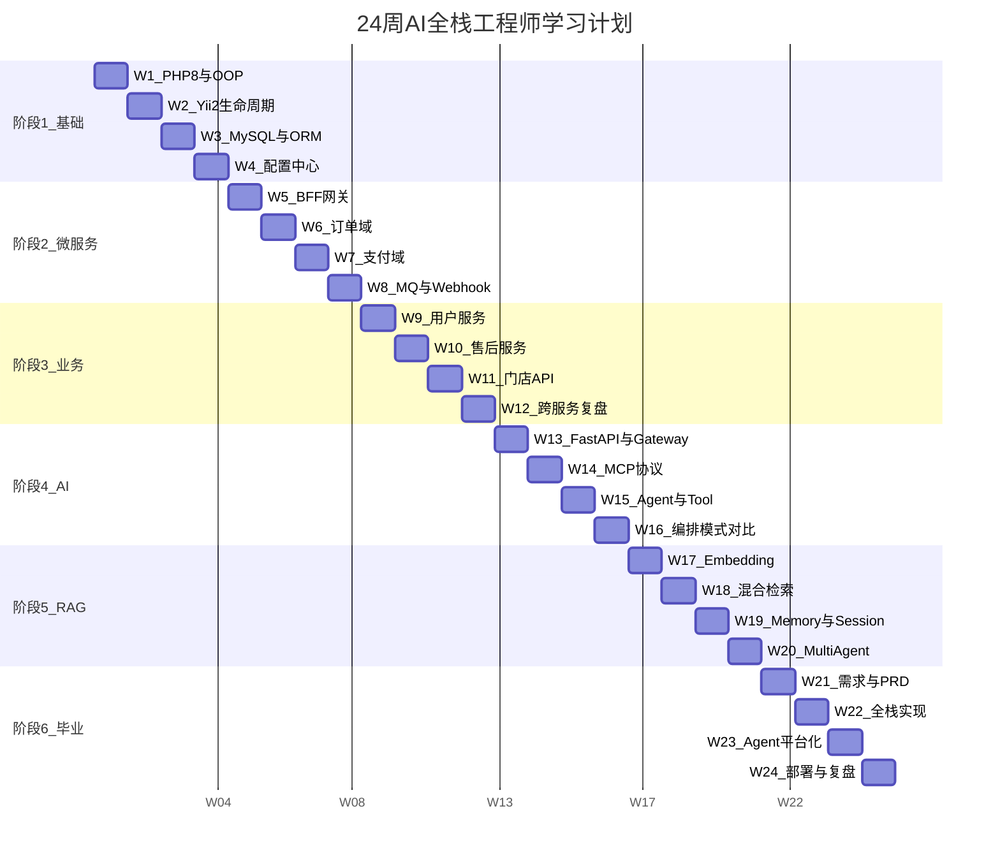

# 24 周 AI 全栈工程师（PHP 方向）学习计划 — 甘特图版 + 每周学习资料推荐

> 面向：10 年前端工程师（Vue/Nuxt/Node 基础）  
> 目标：AI Full Stack Engineer（PHP + AI Native）  
> 强度：约 20h/周 | 框架：Yii2 + ThinkPHP 8 为主，Laravel 20% 对比  
> 方法论：JS/Node.js 类比驱动 | 可公开上传 GitHub

---

## 一、前言

### 1.1 半年目标

24 周结束时，你应具备：

- 独立读懂并修改 Yii2 / ThinkPHP 8 企业级 PHP 后端代码
- 理解 BFF 网关 → 微服务 → 中间件（Redis/MQ）完整架构
- 用 JS/Node 术语向团队解释 PHP 后端设计
- 开发 MCP Server 并被 AI Agent 调用（dev/测试环境）
- 构建 RAG 企业知识库 + Multi-Agent 工作流
- 独立交付 AI Native 全栈产品（Vue3 + PHP + MCP + RAG）
- 使用 AI 完成 80% 以上编码，自己负责架构、Review、测试

### 1.2 学习原则

```
每天 ~3h × 5 天 + 周末 5h ≈ 20h/周

├── 1h    学习（官方文档 / 推荐资料）
├── 1-1.5h 编码或读源码（实仓练习）
├── 30min  AI Review（Cursor / Claude 复盘）
└── 15min  JS 类比笔记（类比日集中写）
```

**AI Native 工作流**：编码默认 Cursor + Claude；你负责需求理解、架构决策、Code Review、接口测试，而非逐行手写。

### 1.3 JS 类比学习法

> 你是前端，JS/Node 是你的母语。每学一个 PHP 概念，立刻问：**「这在 Node 里是什么？」**

每周类比笔记模板：

```
本周概念：___________
Node 等价：___________
差异：_______________
理解自评：1-5
```

### 1.4 统一分层规范（贯穿全计划）

```
Controller → Service → Repository → Model
跨服务：api/*Internal.php
配置：g_config(module, key, default)
日志：g_log_info / g_log_warning / g_log_error
```

**JS 类比**：整体 ≈ 「Express BFF + 多个 NestJS 微服务 + Redis/MQ」，语言换成 PHP。

---

## 二、24 周甘特图



### 里程碑

| 时间 | 里程碑 | 验收 |
|------|--------|------|
| W4 末 | PHP 基础通关 | 独立读通一条 CSR 链路 |
| W8 末 | 微服务架构通关 | 画出结账全链路时序图 |
| W12 末 | 业务域通关 | 能标注每跳等价 Node 哪一层 |
| W16 末 | AI Backend 通关 | MCP 被 Cursor 调用成功 |
| W20 末 | RAG 通关 | FAQ Agent 可问答 |
| W24 末 | 毕业项目交付 | Docker 可启动 + Demo |

---

## 三、每周详情 + 学习资料推荐

---

### W1：PHP 8 + Composer + OOP

**Goal**：建立 PHP 语法与工程化基础

**学习主题**：PHP 8 新特性、Composer、PSR-4/PSR-12、namespace、OOP、Trait、Exception

**实仓任务**：
- 读 `mall-core/common/BaseService.php` — 理解单例模式
- 读 `mall-core/common/BaseRepository.php` — 理解数据访问基类
- 读 `mall-core/composer.json` — 对照你的 `package.json`

**JS 类比**：
1. `composer.json` ≈ `package.json`；`vendor/` ≈ `node_modules/`
2. `namespace` ≈ ES Module 文件作用域
3. `Trait` ≈ composable 函数抽公共逻辑（但 PHP 是语言级混入）

**周末项目**：手写 Todo REST API（CRUD + JSON 响应）

**验收标准**：能解释 PSR-4 autoload 如何把 namespace 映射到目录

**推荐资料**：
| 类型 | 资源 |
|------|------|
| 官方 | [PHP 8.x 手册](https://www.php.net/manual/zh/) |
| 官方 | [Composer 中文文档](https://getcomposer.org/doc/) |
| 规范 | [PSR-12 编码规范](https://www.php-fig.org/psr/psr-12/) |
| 书籍 | 《Modern PHP》Josh Lockhart |
| 视频 | B站搜索「PHP8 新特性」任选一个系列 |
| 源码 | `mall-core/common/BaseService.php` |

---

### W2：Yii2 生命周期与 Filter

**Goal**：理解 Yii2 请求处理全流程

**学习主题**：Yii2 Application 生命周期、Module、Controller、behaviors、Filter、BaseForm

**实仓任务**：
- 读 `mall-gateway/frontapi/modules/AuthApiController.php` — 鉴权基类
- 读 `mall-gateway/frontapi/modules/Pay/controllers/PayController.php` — 薄控制器
- 追踪一个请求从 `web/index.php` 到 `actionMethods` 的路径

**JS 类比**：
1. `behaviors()` ≈ `app.use(middleware)` — 请求进入 action 前的钩子链
2. `BaseForm` 校验 ≈ Zod `.parse(body)` — 失败返回 400
3. `actionXxx` 命名 ≈ Express `router.get('/xxx')` — 框架约定式路由

**Laravel 对比日（2h）**：读 Laravel Routing + Middleware 文档，写对照笔记

**周末项目**：整理网关鉴权白名单 `freeLoginAuthApiList` 中 5 个接口及原因

**验收标准**：能画出 Filter 链：LogStrFilter → UserStatusFilter → TokenFilter

**推荐资料**：
| 类型 | 资源 |
|------|------|
| 官方 | [Yii2 权威指南 — 结构概述](https://www.yiiframework.com/doc/guide/2.0/zh-cn/structure-overview) |
| 官方 | [Yii2 请求处理生命周期](https://www.yiiframework.com/doc/guide/2.0/zh-cn/runtime-overview) |
| 官方 | [Laravel Middleware](https://laravel.com/docs/middleware)（对比用） |
| 源码 | `mall-gateway/frontapi/web/index.php` |
| 源码 | `mall-gateway/frontapi/modules/AuthApiController.php` |

---

### W3：MySQL + Redis + ORM

**Goal**：掌握数据库操作与 ORM 模式

**学习主题**：MySQL 索引与 JOIN、Redis 基础、ActiveRecord、Repository 模式、N+1 问题

**实仓任务**：
- 读 `mall-core/common/repositorys/order/OrderRepository.php`
- 读 `mall-core/common/models/order/Order.php`
- 对照 mall-pc 订单列表页字段，找 Repository 中对应查询

**JS 类比**：
1. `ActiveRecord` ≈ Sequelize `Model` — ORM 把表行映射为对象
2. `Repository` ≈ 自定义 DAO 层 — 把 SQL 调用收口，Service 不直接写 SQL
3. `OrderRedis` ≈ `ioredis.get/set` — 缓存热点数据减少 DB 压力

**Laravel 对比日**：读 Eloquent ORM 文档，对比 `Model::find()` vs `ActiveRecord::findOne()`

**周末项目**：画订单表 ER 图（order、order_goods、order_address 等）

**验收标准**：能解释 N+1 问题及 Yii2 `with()` 预加载

**推荐资料**：
| 类型 | 资源 |
|------|------|
| 官方 | [Yii2 数据库 / ActiveRecord](https://www.yiiframework.com/doc/guide/2.0/zh-cn/db-active-record) |
| 官方 | [Redis 命令参考](https://redis.io/commands/) |
| 书籍 | 《高性能 MySQL》第 4 版（索引章节） |
| 视频 | 「MySQL 索引原理」任一讲解 |
| 源码 | `mall-core/common/repositorys/order/OrderRepository.php` |

---

### W4：配置中心 + 站点 API

**Goal**：理解动态配置与配置中心

**学习主题**：`g_config()`、ConfigHelper、Nacos 概念、配置 vs 硬编码

**实仓任务**：
- 追踪 `site-api/controllers/ConfigController.php` → `ConfigService` → `g_config()`
- 读 `mall-core/common/libraries/App/Utils/ConfigHelper.php`
- 找一个业务开关配置，追踪它如何影响前端展示

**JS 类比**：
1. `g_config('order', 'KEY', default)` ≈ `process.env.KEY ?? default` — 但支持远程热更新
2. 配置中心 ≈ Consul / etcd — 集中管理多服务配置
3. 禁止硬编码 ≈ 禁止在代码里写 `const API_KEY = 'xxx'`

**Laravel 对比日**：读 Laravel Configuration 文档，对比 `config('app.key')` vs `g_config()`

**周末项目**：列一张「配置项清单」（模块、key、默认值、影响范围）

**验收标准**：能区分 DB 静态配置 vs Nacos 动态配置的适用场景

**推荐资料**：
| 类型 | 资源 |
|------|------|
| 概念 | [Nacos 官方文档 — 配置管理](https://nacos.io/docs/latest/guide/user/quick-start/) |
| 源码 | `mall-core/common/libraries/App/fun_helpers.php` |
| 源码 | `site-api/controllers/ConfigController.php` |

**阶段①总结（W4 末）**：你应该能独立读通 `Controller → Service → Repository → Model` 一条链路，并用 Node 术语解释。

---

### W5：BFF 网关架构

**Goal**：理解 API 网关的职责与模式

**学习主题**：BFF 模式、HTTP 转发、鉴权签名、公参注入、模块路由

**实仓任务**：
- 读 `mall-gateway/services/http/PayRequest.php` — 支付 HTTP 客户端
- 读 `mall-gateway/services/http/OrderRequest.php` — 订单 HTTP 客户端
- 读 `mall-gateway/common/BaseApi.php` — HTTP 基类
- 从 mall-pc 找一个支付接口，反查网关 Controller → *Request → 内网服务

**JS 类比**：
1. 网关薄 Controller ≈ Express `proxy` 中间件 — 只做转发，不做业务
2. `PayRequest::instance()` ≈ `axios.create({ baseURL: PAY_SERVICE })` — 预配置 HTTP 客户端
3. 模块路由 `pay/pay/methods` ≈ Express `router.use('/pay', payRouter)`

**Laravel 对比日（2h）**：读 Laravel HTTP Client 文档

**周末项目**：画结账 API 路由表（前端 URL → 网关 → 内网服务）

**验收标准**：能说明「为什么支付逻辑不在网关而在 pay-service」

**推荐资料**：
| 类型 | 资源 |
|------|------|
| 文章 | 「BFF 模式」— Sam Newman 《Building Microservices》相关章节 |
| 官方 | [Laravel HTTP Client](https://laravel.com/docs/http-client)（对比用） |
| 源码 | `mall-gateway/services/http/PayRequest.php` |
| 源码 | `mall-gateway/frontapi/modules/Pay/controllers/PayController.php` |

---

### W6：订单域

**Goal**：深入理解订单业务与后端实现

**学习主题**：下单流程、购物车、Form 校验、分布式锁、订单状态机

**实仓任务**：
- 读 `order-api/controllers/OrderController.php`
- 读 `mall-core/common/services/order/OrderService.php`
- 读 `order-api/forms/OrderConfirmForm.php` — 参数校验
- 对照 mall-pc 结账页，列出前端传的字段与 Form rules 的对应关系

**JS 类比**：
1. `OrderConfirmForm` ≈ 后端 Joi schema — 校验 confirm 接口入参
2. `LockHandleRedis` ≈ `ioredis.set(key, 1, 'NX', 'EX', 30)` — 防重复下单
3. `STATUS_MAPPING` ≈ 前端 `statusMap` 常量 — 状态码到展示文案的映射

**周末项目**：追踪 `trade/confirm → trade/place` 全链路（网关 + 订单服务）

**验收标准**：能对照前端订单详情页字段，指出 Repository 中哪个查询提供数据

**推荐资料**：
| 类型 | 资源 |
|------|------|
| 源码 | `order-api/controllers/OrderController.php` |
| 源码 | `mall-core/common/services/order/OrderService.php` |
| 源码 | `mall-core/common/repositorys/order/OrderRepository.php` |
| 前端对照 | mall-pc `pages/order/` 目录 |

---

### W7：支付域 + Node 流水线

**Goal**：理解支付核心流程与 Node 责任链模式

**学习主题**：PaymentFactory、支付状态机、NodeExecutionEngine、多渠道集成

**实仓任务**：
- 读 `pay-service/common/services/pay/PayService.php` — processPayment 节点链
- 读 `pay-service/common/services/pay/nodes/pay/ProcessPaymentNode.php`
- 读 `pay-service/common/factory/payment/PaymentFactory.php` — 渠道工厂
- 读 `pay-service/pay-api/controllers/PayController.php`

**JS 类比**：
1. `NodeExecutionEngine` ≈ Express 中间件管道 — 按序执行，某步失败则中断
2. `PaymentFactory::instance($company)` ≈ 策略注册表 `const handlers = { stripe: StripeService, ... }`
3. `ProcessPaymentContext` ≈ 贯穿 middleware 的 `req.context` 对象 — 节点间共享状态

**周末项目**：画 processPayment 的 4 个 Node 顺序图 + 数据流

**验收标准**：能口述支付状态机（创建 → 确认 → 捕获 → 完成）及渠道映射

**推荐资料**：
| 类型 | 资源 |
|------|------|
| 官方 | [Stripe API 文档 — PaymentIntent](https://stripe.com/docs/api/payment_intents) |
| 官方 | [Braintree 服务端 SDK](https://developer.paypal.com/braintree/docs/start/hello-server) |
| 设计模式 | 「责任链模式」— Refactoring Guru |
| 源码 | `pay-service/common/services/pay/PayService.php` |
| 源码 | `pay-service/common/factory/payment/PaymentFactory.php` |

---

### W8：MQ + Webhook + Docker

**Goal**：掌握异步消息、Webhook 幂等与容器化

**学习主题**：RabbitMQ、Webhook 处理、幂等设计、Docker 基础

**实仓任务**：
- 读 `pay-service/pay-api/controllers/outer/StripeController.php` — Webhook 入口
- 读 `mall-core/common/libraries/App/Utils/RabbitMq.php` — MQ 工具类
- 读 `pay-service/common/services/pay/nodes/refund/RefundVerifyNode.php` — 退款幂等
- 配置 Docker 环境，进入 PHP 容器读日志

**JS 类比**：
1. `RabbitMq::send(exchange, route, data)` ≈ `channel.publish(exchange, routeKey, Buffer.from(JSON.stringify(data)))`
2. Stripe Webhook ≈ 你在 Node 里用 `stripe.webhooks.constructEvent()` 验签
3. 幂等 key ≈ `if (await redis.get(idempotencyKey)) return cached` — 防重复处理

**Laravel 对比日（2h）**：读 Laravel Queues + Events 文档

**周末项目**：分析退款幂等设计，写 1 页笔记

**验收标准**：能解释 Webhook 为何有网关层 + 服务层两个入口

**推荐资料**：
| 类型 | 资源 |
|------|------|
| 官方 | [RabbitMQ 教程](https://www.rabbitmq.com/tutorials) |
| 官方 | [Stripe Webhooks 指南](https://stripe.com/docs/webhooks) |
| 官方 | [Docker 入门](https://docs.docker.com/get-started/) |
| 官方 | [Laravel Queues](https://laravel.com/docs/queues)（对比用） |
| 源码 | `pay-service/pay-api/controllers/outer/StripeController.php` |

**阶段②总结（W8 末）**：你应该能画出完整结账时序图，并标注每跳等价于 Node 架构的哪一层。

---

### W9：用户服务 + 注册 Node 链

**Goal**：理解用户域与复杂流程编排

**学习主题**：注册/登录、OAuth、Redis 用户缓存、Node 注册链

**实仓任务**：
- 读 `user-service/common/services/user/UserService.php`
- 读 `user-service/common/services/user/RegisterService.php` + `nodes/`
- 读 `user-service/common/redis/user/UserDetailRedis.php`
- 追踪 `UserController::actionQuickLogin()` 全链路

**JS 类比**：
1. 注册 Node 链 ≈ 多步 Express middleware — 每步完成一部分注册逻辑
2. `UserDetailRedis` ≈ `cache.get('user:' + id)` — 减少 DB 查询
3. OAuth 第三方登录 ≈ Passport.js 社交登录策略

**周末项目**：画注册流程 Node 顺序图（至少 5 个 Node）

**验收标准**：能说明用户缓存何时写入、何时失效

**推荐资料**：
| 类型 | 资源 |
|------|------|
| 官方 | [JWT 介绍](https://jwt.io/introduction) |
| 源码 | `user-service/common/services/user/RegisterService.php` |
| 源码 | `user-service/user-api/controllers/UserController.php` |

---

### W10：售后服务 + Console 任务

**Goal**：理解售后策略模式与异步任务

**学习主题**：Strategy 模式、processingType、售后状态机、Console 批处理

**实仓任务**：
- 读 `aftersale-service/common/services/processingType/concrete/ReturnGoodsRefund.php`
- 读 `aftersale-service/common/services/AfterSaleService.php`（浏览结构）
- 读 `aftersale-service/console/controllers/OmsController.php` — 定时任务
- 读 `aftersale-service/common/enums/AfterSaleStatusEnum.php`

**JS 类比**：
1. `processingType` 策略 ≈ 把 `switch(afterSaleType)` 拆成独立 class — 每个 class 实现同一接口
2. Console 命令 ≈ `node scripts/sync-oms.js` — CLI 批处理，不走 HTTP
3. `AfterSaleStatusEnum` ≈ TypeScript `enum AfterSaleStatus` — 有限状态集合

**周末项目**：选一个售后类型（退货退款），画从申请到完成的流程图

**验收标准**：能区分 API 层处理 vs Console 异步补偿的场景

**推荐资料**：
| 类型 | 资源 |
|------|------|
| 设计模式 | [Strategy Pattern — Refactoring Guru](https://refactoring.guru/design-patterns/strategy) |
| 源码 | `aftersale-service/common/services/processingType/concrete/` |
| 源码 | `aftersale-service/console/controllers/` |

---

### W11：ThinkPHP 8 门店 API

**Goal**：理解第二套 PHP 框架的分层差异

**学习主题**：ThinkPHP 8 路由、Validate、ThinkORM、SMVC 分层

**实仓任务**：
- 读 `store-api/app/admin/controller/store/StoreController.php`
- 读 `store-api/app/common/service/store/StoreService.php`
- 读 `store-api/app/admin/validate/store/OfflineStore.php`
- 对照 store-fe 门店列表页

**JS 类比**：
1. ThinkPHP `Validate` scene ≈ Zod 的 `.pick()` / 分组校验 — 不同接口用不同 rules 子集
2. `StoreService::list()` ≈ NestJS Service 方法 — Controller 只调 Service
3. `g_ok_data()` / `g_err_data()` ≈ `res.json({ code: 0, data })` — 统一响应（与 Yii2 的 endSuccess 同理）

**周末项目**：对比 Yii2 CSR 与 TP8 SMVC 的分层差异表（至少 5 项）

**验收标准**：能独立追踪 store-api 一条 CRUD 链路

**推荐资料**：
| 类型 | 资源 |
|------|------|
| 官方 | [ThinkPHP 8 完全开发手册](https://doc.thinkphp.cn/v8_0/preface.html) |
| 官方 | [ThinkORM 文档](https://doc.thinkphp.cn/v8_0/orm.html) |
| 源码 | `store-api/README.md`（开发规范） |
| 源码 | `store-api/app/common/service/store/StoreService.php` |

---

### W12：跨服务协作总复盘

**Goal**：串联全部后端，形成全局架构观

**学习主题**：*Internal.php 跨服务调用、服务编排、全局架构复盘

**实仓任务**：
- 读 `mall-core/common/api/PayInternal.php` — 订单调支付
- 读 `store-api/app/common/library/helper/InternalServiceHelper.php` — 门店调内网
- 画「前端一次结账请求」全链路时序图（含网关、订单、支付、MQ）
- 画「门店查询订单」链路时序图

**JS 类比**：
1. `PayInternal::capture()` ≈ `payServiceClient.post('/internal/pay/capture', data)` — 内网 HTTP 封装
2. 整体架构 ≈ 前端 → BFF(Express) → 多个 NestJS 微服务 → Redis/MQ — 只是语言不同
3. 禁止 Service 直接 HTTP ≈ 禁止 Controller 直接 `fetch()` — 必须走封装层

**Laravel 对比日（2h）**：读 Service Container + Service Providers，写 Yii2 DI 对照笔记

**周末项目**：输出 1 份「全链路架构文档」（可放 GitHub）

**验收标准**：能向他人讲解「一个 API 请求经过几跳、每层做什么」

**推荐资料**：
| 类型 | 资源 |
|------|------|
| 书籍 | 《Building Microservices》Sam Newman — 第 1-4 章 |
| 官方 | [Laravel Service Container](https://laravel.com/docs/container)（对比用） |
| 源码 | 全部后端仓库 README |

**阶段③总结（W12 末）**：你应该具备阅读并修改任何 Yii2/TP8 业务代码的能力。

---

### W13：FastAPI + LLM Gateway

**Goal**：搭建 AI 接口层

**学习主题**：Python FastAPI、异步 HTTP、多 LLM 接入、API Key 管理

**实仓任务**：
- 用 FastAPI 搭建 LLM Gateway，统一接入 OpenAI + Claude
- 实现 `/chat` 接口，支持 model 参数切换
- 用 curl/Postman 测试

**JS 类比**：
1. FastAPI ≈ Express/Fastify — 你有 Node HTTP 经验，语法不同但模式相同
2. `@app.post("/chat")` ≈ `app.post('/chat', handler)`
3. Pydantic Model ≈ Zod schema — 请求体验证

**周末项目**：LLM Gateway 可切换 2 个模型，返回统一 JSON 格式

**验收标准**：Gateway 通过 HTTP 测试，能切换模型

**推荐资料**：
| 类型 | 资源 |
|------|------|
| 官方 | [FastAPI 教程](https://fastapi.tiangolo.com/tutorial/) |
| 官方 | [OpenAI API 文档](https://platform.openai.com/docs/api-reference) |
| 官方 | [Anthropic API 文档](https://docs.anthropic.com/en/api) |
| 教程 | 「FastAPI 入门」— 任一中文教程 |

---

### W14：MCP Protocol + MCP Server

**Goal**：理解 MCP 协议并扩展工具

**学习主题**：MCP 协议、Server/Client、Tool 注册、stdio 传输

**实仓任务**：
- 读 `mcp-server` 子模块结构与现有 Server 实现
- 读 `ai-workspace/mcp.config.example.json` — MCP 配置
- 扩展一个 dev 环境只读查询工具（如查表结构）
- 配置 Cursor MCP，成功调用

**JS 类比**：
1. MCP Tool ≈ OpenAI `tools: [{ type: "function", function: { name, parameters } }]`
2. MCP Server ≈ 一个常驻 Node 进程，暴露 `listTools` + `callTool` 方法
3. stdio 传输 ≈ `child_process.spawn('node', ['server.js'])` — IDE 通过 stdin/stdout 通信

**安全约束**：仅 dev/测试环境，禁止连接生产数据库。

**周末项目**：MCP Server 新增 1 个 Tool，Cursor 可调用并返回结果

**验收标准**：Cursor Agent 对话中能成功调用你的 MCP Tool

**推荐资料**：
| 类型 | 资源 |
|------|------|
| 官方 | [MCP 协议规范](https://modelcontextprotocol.io/docs) |
| 官方 | [MCP TypeScript SDK](https://github.com/modelcontextprotocol/typescript-sdk) |
| 源码 | `mcp-server/` 各子目录 |
| 源码 | `ai-workspace/mcp.config.example.json` |

---

### W15：Agent + Tool Calling

**Goal**：构建能调用工具的 AI Agent

**学习主题**：Agent 架构、Tool Calling、Prompt 工程、错误处理

**实仓任务**：
- 基于 W13 Gateway + W14 MCP，构建「客服 Agent」
- Agent 能识别「查订单」意图，调用 MCP 工具返回结果
- 实现 3 个对话场景：查订单、查商品、FAQ 兜底

**JS 类比**：
1. Tool Calling ≈ LLM 返回 `{ tool: "query_order", args: { orderNo: "xxx" } }`，你的代码执行后把结果喂回 LLM
2. Agent 循环 ≈ `while (!done) { response = await llm(messages); if (response.tool) messages.push(await executeTool(response)) }`
3. System Prompt ≈ Express 全局 middleware 设置的 `req.context` — 影响所有后续处理

**周末项目**：客服 Agent Demo，3 种意图均可正确响应

**验收标准**：Agent 能正确选择 Tool 并格式化返回

**推荐资料**：
| 类型 | 资源 |
|------|------|
| 官方 | [OpenAI Function Calling](https://platform.openai.com/docs/guides/function-calling) |
| 官方 | [Anthropic Tool Use](https://docs.anthropic.com/en/docs/build-with-claude/tool-use) |
| 教程 | 「AI Agent 入门」— LangChain 或 OpenAI Agents SDK 文档 |

---

### W16：编排模式对比

**Goal**：理解不同领域的流程编排模式

**学习主题**：LangGraph State/Node/Edge、对比 PHP NodeExecutionEngine

**实仓任务**：
- 用 LangGraph 实现一个 3 步 Agent 工作流
- 对比 `pay-service` 的 `NodeExecutionEngine` 与 LangGraph 的设计
- 写 1 页「编排模式对比笔记」

**JS 类比**：
1. LangGraph State ≈ Redux store — 节点间共享的可变状态对象
2. LangGraph Node ≈ middleware 函数 — `(state) => newState`
3. PHP `NodeExecutionEngine` ≈ 同一模式的 PHP 实现 — 支付域已在使用

**周末项目**：两种编排模式的伪代码对比 + 3 处异同分析

**验收标准**：能说出 Node 链 vs LangGraph 的适用场景

**推荐资料**：
| 类型 | 资源 |
|------|------|
| 官方 | [LangGraph 文档](https://langchain-ai.github.io/langgraph/) |
| 源码 | `pay-service/common/services/pay/PayService.php`（Node 链） |
| 源码 | `aftersale-service/common/services/nodes/`（售后 Node 链） |

**阶段④总结（W16 末）**：你应该能开发 MCP Server 并构建 Tool Calling Agent。

---

### W17：Embedding + Chunk

**Goal**：构建文档向量化流水线

**学习主题**：Embedding 模型、文档切分策略、向量存储

**实仓任务**：
- 收集项目 README + 开发规范文档（脱敏）
- 实现 Chunk 切分（按标题/段落，500-1000 token）
- 用 OpenAI Embedding API 向量化并存入向量数据库

**JS 类比**：
1. Chunk ≈ `longDoc.split('\n## ')` — 按标题切分为数组
2. Embedding ≈ `await openai.embeddings.create({ input: chunk })` — 文本 → 向量
3. 向量存储 ≈ 特殊的 `Map<chunkId, { vector, text, metadata }>` — 支持相似度搜索

**周末项目**：索引 10+ 文档片段，能按语义召回 Top-3

**验收标准**：输入问题能召回相关文档段落

**推荐资料**：
| 类型 | 资源 |
|------|------|
| 官方 | [OpenAI Embeddings](https://platform.openai.com/docs/guides/embeddings) |
| 工具 | [ChromaDB 文档](https://docs.trychroma.com/) 或 PGVector |
| 教程 | 「RAG 入门」— LangChain RAG 教程 |

---

### W18：Hybrid Search + Rerank

**Goal**：提升检索准确率

**学习主题**：关键词检索 + 语义检索混合、Rerank 模型

**实仓任务**：
- 在 W17 基础上增加 BM25 关键词检索
- 合并两路结果，用 Rerank 模型重排序
- 构建 FAQ Agent 原型（售后政策问答）

**JS 类比**：
1. 混合检索 ≈ `results = [...keywordResults, ...semanticResults].dedupe().sort(byScore)` — 两路合并
2. Rerank ≈ 二次排序函数 — 用更精确的模型重新打分
3. FAQ Agent ≈ 前端搜索组件 + 后端 `/search?q=` — 但返回 LLM 生成的回答

**周末项目**：FAQ Agent 对 10 个测试问题准确率 > 70%

**验收标准**：FAQ 回答有据可查（返回引用段落）

**推荐资料**：
| 类型 | 资源 |
|------|------|
| 论文 | 《Dense Passage Retrieval》— 理解语义检索原理 |
| 工具 | [Cohere Rerank API](https://docs.cohere.com/docs/rerank) |
| 教程 | LangChain Hybrid Search 教程 |

---

### W19：Memory + Session

**Goal**：实现多轮对话上下文管理

**学习主题**：Session 管理、对话历史、上下文窗口、摘要压缩

**实仓任务**：
- 实现 `SessionManager`：`Map<sessionId, Message[]>`
- 支持 3 轮以上对话，上下文不丢失
- 上下文超限时自动摘要压缩

**JS 类比**：
1. Session ≈ `const sessions = new Map()` — 内存中按 sessionId 存消息数组
2. 上下文窗口 ≈ `messages.slice(-20)` — 只保留最近 N 条
3. 摘要压缩 ≈ 长对话时让 LLM 生成 summary 替代完整历史 — 省 token

**周末项目**：多轮客服对话 Demo（至少 5 轮连贯）

**验收标准**：第 5 轮对话仍能引用第 1 轮提到的订单号

**推荐资料**：
| 类型 | 资源 |
|------|------|
| 概念 | [OpenAI Conversation State](https://platform.openai.com/docs/guides/conversation-state) |
| 教程 | LangChain Memory 模块文档 |

---

### W20：Multi-Agent 工作流

**Goal**：构建多 Agent 协作流水线

**学习主题**：Agent 分工、流水线编排、Agent 间通信

**实仓任务**：
- 实现三 Agent 流水线：需求 Agent → 架构 Agent → Review Agent
- 输入一句话需求，输出 Review 报告
- 每个 Agent 有独立 System Prompt 和 Tool 集

**JS 类比**：
1. 多 Agent ≈ 微服务串行调用 — `const arch = await archAgent.run(reqAgent.output)`
2. Agent 间传递 ≈ 函数管道 — `pipeline(reqAgent, archAgent, reviewAgent)(input)`
3. 每个 Agent ≈ 独立的 Express app — 有自己的路由（Tools）和中间件（Prompt）

**周末项目**：三 Agent 协作 Demo，输入需求输出 Review 报告

**验收标准**：Review 报告包含架构建议、风险点、改进建议

**推荐资料**：
| 类型 | 资源 |
|------|------|
| 官方 | [LangGraph Multi-Agent](https://langchain-ai.github.io/langgraph/concepts/multi_agent/) |
| 教程 | 「Multi-Agent Systems」— 任一 AI Agent 教程 |

**阶段⑤总结（W20 末）**：你应该能构建 RAG 知识库 + Multi-Agent 工作流。

---

### W21：需求分析 + PRD

**Goal**：完成毕业项目需求文档

**学习主题**：用户故事、验收标准、API 契约、边界定义

**毕业项目**：**电商运营知识助手**

**实仓任务**：
- 调研运营场景（商品查询、订单查询、政策问答）
- 写 PRD：用户故事 + 验收标准 + API 契约 + 架构图

**JS 类比**：PRD ≈ 你平时写的前端 RFC + 后端 API 契约文档 — 只是范围更大

**周末项目**：PRD v1.0 定稿

**验收标准**：PRD 含接口清单、Agent 能力边界、MCP 工具列表

**推荐资料**：
| 类型 | 资源 |
|------|------|
| 模板 | 「PRD 模板」— 任一产品文档模板 |
| 参考 | skill-library 中 SKILL.md 格式 |

---

### W22：全栈实现

**Goal**：毕业项目 MVP

**实仓任务**：
- Vue3 对话 UI（消息列表 + 输入 + 引用来源）
- PHP 薄 API 层（对话代理 + MCP 调用）
- 接入 MCP dev 工具 + RAG 知识库
- 前后端联调

**JS 类比**：全栈开发 ≈ 你日常的「Vue 页面 + 调 API」— 只是 API 是你自己写的 PHP

**周末项目**：核心对话流程可演示

**验收标准**：能完成「问政策 → 查订单 → 追问详情」完整对话

**推荐资料**：
| 类型 | 资源 |
|------|------|
| 前端 | Vue 3 官方文档 — Composition API |
| 后端 | Yii2 RESTful API 指南 |

---

### W23：Agent 平台化

**Goal**：整理 Prompt/Skill/Workflow

**实仓任务**：
- 整理 3 个 Prompt 模板（客服/查询/FAQ）
- 编写 3 个 Skill 文件（参考 skill-library 格式）
- 设计 Agent Workflow（意图识别 → 路由到对应 Agent）

**JS 类比**：Skill ≈ 可复用的 npm 包 — 每个 Skill 定义一组能力和使用说明

**周末项目**：Skill 可被 Agent 加载并执行

**验收标准**：3 个 Skill 文档完整，Agent 能按 Skill 指引行动

**推荐资料**：
| 类型 | 资源 |
|------|------|
| 参考 | skill-library `*/SKILL.md` 格式 |
| 参考 | ai-workspace `AGENTS.md` 工作流规范 |

---

### W24：部署 + 复盘

**Goal**：项目上线 + 学习总结

**实仓任务**：
- Docker Compose 编排（前端 + PHP + 向量库）
- 编写 README + 部署文档
- 录制 Demo
- 24 周能力矩阵自评 + 下一阶段规划

**JS 类比**：Docker ≈ 前端的 `.nvmrc` + `package-lock.json` — 环境一致性保障

**周末项目**：项目可 `docker compose up` 启动

**验收标准**：他人可按 README 本地启动并体验

**推荐资料**：
| 类型 | 资源 |
|------|------|
| 官方 | [Docker Compose 文档](https://docs.docker.com/compose/) |
| 官方 | [GitHub Actions 入门](https://docs.github.com/en/actions) |

**阶段⑥总结（W24 末）**：恭喜毕业！你已从 Vue 前端转型为 AI 全栈工程师。

---

## 四、每月里程碑与能力矩阵

| 月份 | 周次 | 主题 | 月度项目 | 能力跃迁 |
|------|------|------|----------|----------|
| M1 | W1–W4 | PHP + Yii2 基础 | Todo API + 读懂 CSR 链路 | 前端 → 能读后端的 PHP 开发者 |
| M2 | W5–W8 | 网关 + 微服务 | 结账时序图 + 支付 Node 链 | 能独立分析微服务架构 |
| M3 | W9–W12 | 业务域 + 跨服务 | 全链路架构文档 | 能修改任何业务模块代码 |
| M4 | W13–W16 | AI Backend | Gateway + MCP + Agent | 后端 → AI 后端开发者 |
| M5 | W17–W20 | RAG + Multi-Agent | FAQ Agent + 三 Agent 工作流 | 能构建 AI 知识库产品 |
| M6 | W21–W24 | 毕业项目 | 电商运营知识助手 | AI 全栈工程师 |

---

## 五、附录：仓库代号 + 路径索引

| 代号 | 技术栈 | 关键路径 |
|------|--------|----------|
| mall-gateway | Yii2 BFF | `frontapi/modules/`、`services/http/`、`common/BaseApi.php` |
| mall-core | Yii2 微服务 | `common/services/`、`common/repositorys/`、`order-api/` |
| pay-service | Yii2 微服务 | `common/services/pay/`、`common/factory/payment/`、`nodes/` |
| user-service | Yii2 微服务 | `common/services/user/`、`common/services/user/nodes/` |
| aftersale-service | Yii2 微服务 | `common/services/processingType/`、`console/` |
| store-api | ThinkPHP 8 | `app/common/service/`、`app/admin/controller/` |
| ai-workspace | 文档/配置 | `AGENTS.md`、`rules/`、`mcp.config.example.json` |
| mcp-server | TypeScript | 各 server 子目录 `src/` |
| skill-library | Markdown | `*/SKILL.md` |

---

*文档版本：v1.0 | 配套文档：[表格版](./24周学习计划表格版.md) | [打卡清单版](./24周学习计划打卡清单版.md)*
