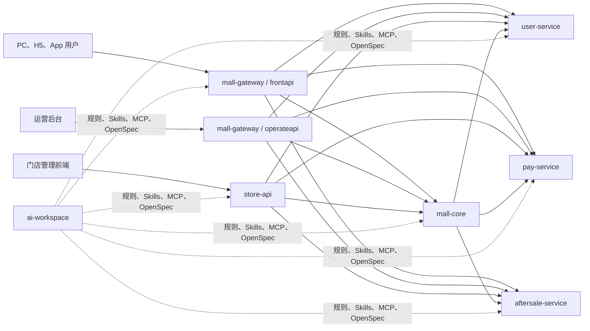
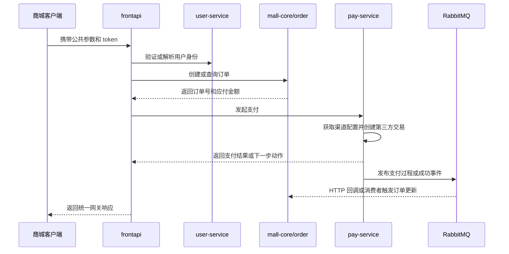
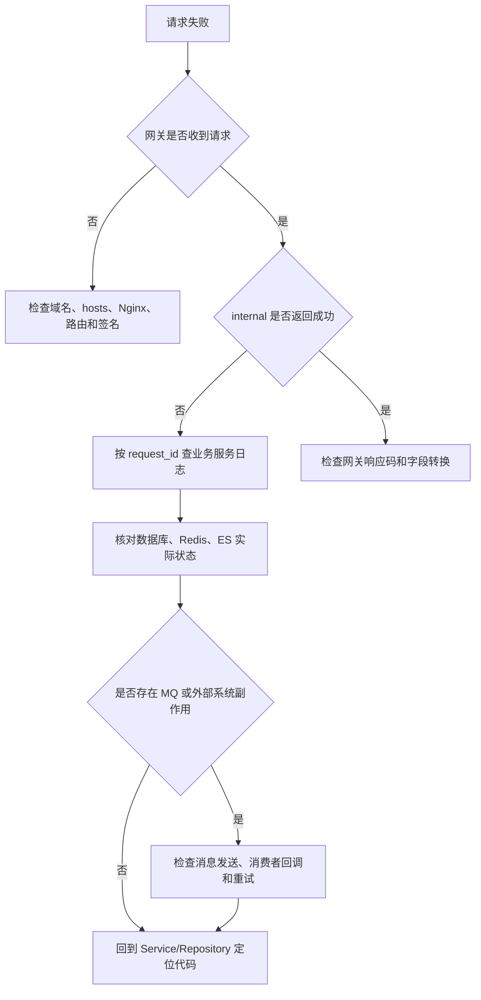

# bm 七仓库新手上手指南

> 面向第一次接触 bm PHP 后端与 AI 开发工作空间的工程师。
>
> 文档基于 2026-07-16 的本地仓库代码只读调研编写。代码、配置与团队流程会持续变化；遇到文档与代码不一致时，以当前分支代码、项目规范和团队确认结果为准。

## 1. 这套文档解决什么问题

这不是一套脱离项目的 PHP 语法教程，而是一张从“完全不了解系统”走到“能够安全修改第一个需求”的地图。读完后，你应该能够回答：

1. 用户请求先到哪个网关，再进入哪个业务服务？
2. Yii2 项目中的 Controller、Service、Repository、Model 分别做什么？
3. `internal.bm.com`、独立用户、独立支付和售后仓库如何分工？
4. 门店 API 为什么与其他 PHP 仓库的代码组织方式不同？
5. DB、Redis、Elasticsearch、RabbitMQ 和 Nacos 分别在哪些链路中出现？
6. 如何使用 AI 工作空间、Skills、MCP 和 OpenSpec，又不会误查生产环境或直接在 `master` 开发？
7. 修改代码前应读什么，修改后应如何验证？

## 2. 文档导航

| 顺序 | 文档 | 对应代号 | 适合先解决的问题 |
|---|---|---|---|
| 1 | [AI 开发工作空间](01-ai-workspace.md) | `ai-workspace` | 如何初始化项目路径、遵守规则、使用 Skills/MCP/OpenSpec |
| 2 | [商城 API 网关 fecshop](02-mall-gateway-fecshop.md) | `mall-gateway` | C 端和运营端请求如何鉴权、签名并转发 |
| 3 | [商城核心服务 internal](03-mall-core-internal.md) | `mall-core` | 商品、订单、营销、站点等核心模块如何组织 |
| 4 | [支付服务](04-pay-service.md) | `pay-service` | 支付渠道、回调、退款、税务和幂等如何协作 |
| 5 | [用户服务](05-user-service.md) | `user-service` | 登录、注册、JWT、多身份绑定和隐私数据如何处理 |
| 6 | [售后服务](06-aftersale-service.md) | `aftersale-service` | 售后状态、审核、退款、退件和换货如何流转 |
| 7 | [门店管理 API](07-store-api.md) | `store-api` | ThinkPHP 8/BuildAdmin 项目如何开发和联调 |

建议按表中顺序阅读。若你只负责单一业务域，也至少先读第 1 篇和第 2 篇，再进入目标服务。

## 3. 七个仓库的关系

### 3.1 一句话理解每个仓库

- `mall-gateway`：请求入口层。负责公共参数、登录/签名、运营人员信息和内网 HTTP 转发，不应堆积核心业务。
- `mall-core`：历史核心服务集群。一个仓库中包含商品、订单、营销、内容、站点、运营等多个 Yii2 应用，共享 `common`。
- `pay-service`：独立支付域。处理支付渠道、交易、异步回调、退款、税务和支付通知。
- `user-service`：独立用户域。处理登录、注册、多身份绑定、JWT、验证码和用户隐私数据。
- `aftersale-service`：独立售后域。处理取消、退货退款、换货、补发、补偿、退件和跨系统状态流转。
- `store-api`：门店管理后端。使用 PHP 8.2、ThinkPHP 8 与 BuildAdmin，代码结构和其余 Yii2 项目不同。
- `ai-workspace`：开发协作层。保存路径映射、规则、Skills、MCP 配置生成器和 OpenSpec 方案，不承载商城运行时业务。

## 4. 技术栈差异

| 仓库类型 | 主要框架 | 典型分层 | 重要提醒 |
|---|---|---|---|
| 网关 | Yii2 + Fecshop 2.9.1 | Controller → `*Request`/网关 Service → internal HTTP | `frontapi` 成功码与 internal 不同 |
| 核心/用户/支付/售后 | PHP 7.x + Yii2 Advanced | Controller → Service → Repository → Model | 历史代码较多，不应机械套用 PHP 8.3 写法 |
| 门店 API | PHP 8.2+ + ThinkPHP 8 + BuildAdmin | Controller → Service → Model/Outer Service | 没有统一 Repository 层，遵循该仓库 smvc 规范 |
| AI 工作空间 | Node.js 脚本 + Markdown + submodule | setup → 路径/技能/MCP/OpenSpec | 它是开发工具仓库，不是 PHP 服务 |

`php-pro.md` 可以作为代码质量思考清单，但其中 PHP 8.3、Laravel、Symfony、PHPStan Level 9 和 80% 覆盖率等内容不是这些历史仓库的既有事实。改造时应先确认运行时版本和团队计划，不能直接使用不兼容语法。

## 5. 一次典型请求如何穿过系统

下面以“登录用户提交订单并支付”为概念性示意。具体接口和分支请以各仓库真实链路章节为准。

排障时不要只盯一个仓库。应从请求入口开始，依次确认网关日志、internal 响应、业务服务日志、数据库状态和异步消息状态。

## 6. 所有新手必须先记住的红线

以下是跨仓库最重要的安全边界，详细规则见 AI 工作空间文档：

1. 禁止直接在 `master` 分支开发或提交。
2. 未得到明确指令，不得擅自 `git commit` 或推送。
3. 创建开发分支前按团队流程更新本地 `master`。
4. 禁止物理删除业务数据，使用 `del_flag = 1` 软删除。
5. 查询可软删除表时必须考虑 `del_flag = 0`。
6. 新表必须包含 `created_at`、`updated_at`、`del_flag`，时间字段使用 Unix 时间戳 `int`。
7. Yii2 业务项目中，Controller/Service 不直接操作 Model，应通过 Repository。
8. 跨服务 HTTP 调用走仓库已有的 API/Request/Outer Service 封装，不散落手写 `curl`。
9. 新业务日志使用团队统一日志函数，不直接调用 `\Yii::error()`。
10. `g_config` 使用 `ConfigHelper` 模块常量，不手写模块字符串。
11. 支付金额禁止使用浮点数直接计算，必须使用项目约定的高精度方法。
12. 用户邮箱、电话、姓名等隐私字段必须通过既有加解密层处理。
13. OpenSpec 实现期禁止使用生产数据库、Redis、ELK 或 Grafana MCP 做功能验证。
14. 文档、日志、截图和代码评审中不得复制真实 token、密码、私钥或用户数据。

## 7. 新手推荐学习路径

### 第 0 天：准备环境

1. 阅读 [AI 开发工作空间](01-ai-workspace.md)。
2. 确认 `workspace.config.json` 中目标项目路径有效。
3. 阅读目标仓库的 README/AGENTS 以及工作空间规则。
4. 阅读个人 `LOCAL_ENV.md`，确认本机 Docker、域名和运行时版本。
5. 只执行文档中已由仓库验证的安装/检查命令；缺失的 Nginx、Docker 或环境变量向团队确认。

### 第 1 天：只跟请求，不改代码

1. 从一个已知 URL 找到网关 Controller。
2. 找到对应 `*Request` 或 Redirect 转发逻辑。
3. 在目标业务仓找到 Controller action。
4. 顺着 Service、Repository、Model 跟到数据表。
5. 标出 Redis、ES、MQ 和外部 HTTP 副作用。
6. 找到成功与失败日志位置。

### 第 2～3 天：理解一个业务域

- 商品/订单开发：读 mall-core 的两条示例链路。
- 支付开发：先理解 PaymentFactory、Webhook 和幂等，再看某个渠道实现。
- 用户开发：先理解 `user` 与 `user_auths`，再看登录/注册 Node 链。
- 售后开发：先看处理方案与状态机，再看审核和退款。
- 门店开发：先看 Backend、Auth、Internal/Outer Service，再进入订单或库存。

### 第 4～5 天：完成第一个低风险改动

1. 明确需求涉及的仓库和完整调用链。
2. 按 Git 规范创建分支。
3. 若需求复杂，先走 OpenSpec propose/apply 流程。
4. 遵循目标仓库原有架构，不做无关重构。
5. 用 HTTP 接口和 Console 测试脚本验证主路径、失败路径和副作用。
6. 检查日志是否脱敏，查询是否带软删除条件。
7. 提交前查看完整 diff，并让评审者能够复现验证步骤。

## 8. 遇到问题时的通用排查顺序

推荐记录以下信息再求助：

- 请求 URL、HTTP 方法、脱敏后的参数；
- 环境、时间、`request_id`；
- 网关和业务服务各自的返回码；
- 关键数据库记录的业务主键与状态，不包含隐私数据；
- 是否经过 Redis 锁、MQ、第三方支付、OMS/AMS/SCMS 等外部系统；
- 已执行的验证步骤和结果。

## 9. 事实、推断和待确认项

本套文档采用以下表达约定：

- “代码现状”表示能在当前仓库入口、配置、类或方法中验证。
- “团队规则”表示来自 `bm-ai-workspace/AGENTS.md` 或 `rules/`。
- “建议”表示为新手提供的学习或排障顺序，不代表运行时强制逻辑。
- “待确认”表示仓库缺少 Docker、Nginx、环境变量模板、测试账号或部署说明，不能凭经验补写。

常见待确认事项包括：

1. 各服务当前实际 PHP-FPM 版本；
2. 本地 Docker Compose 与 Nginx vhost 所在位置；
3. 完整环境变量和 Nacos ini 的获取方式；
4. 部分历史模块是否仍在生产流量中；
5. 自动化测试的真实执行入口和覆盖范围；
6. 开发、测试与生产环境的域名和访问权限。

## 10. 快速术语表

| 术语 | 含义 |
|---|---|
| BFF | 面向特定客户端的后端入口；本系统网关承担部分 BFF 职责 |
| internal | 内网微服务及其 HTTP API，不应直接暴露给公网 |
| Yii2 Advanced | 多应用共享 `common` 和 `vendor` 的 Yii2 项目模板 |
| Repository | 封装数据库/ES 数据访问的层 |
| Node 链 | 将复杂业务流程拆成有顺序、可回滚或可扩展的节点 |
| AR | ActiveRecord，模型对象与数据库表映射 |
| Nacos | 配置中心；项目通过本地同步的 ini 和 `g_config` 读取 |
| MQ | 消息队列；本系统主要使用 RabbitMQ，部分消息由 broker 转为 HTTP 回调 |
| Webhook | 第三方系统主动回调本系统的 HTTP 接口 |
| 幂等 | 同一请求重复执行时不产生重复扣款、退款或状态推进 |
| OpenSpec | 先明确 proposal、design、spec、tasks，再实施与归档的变更流程 |
| MCP | AI 编辑器调用外部能力的协议；不同环境工具必须严格区分 |
| BuildAdmin | 门店 API 使用的 ThinkPHP 后台框架 |

## 11. 阅读后的自测问题

在开始修改代码前，尝试不看答案回答：

1. `frontapi`、`operateapi` 和 internal 的成功码有什么差异？
2. 为什么 `mall-core` 的 Service 不能直接访问其他服务？
3. 支付异步成功后，哪个入口处理 Webhook，如何防止重复处理？
4. 用户第三方账号如何与用户主记录关联？
5. 售后“处理方案”和“售后类型”为什么不能混为一谈？
6. `store-api` 为什么不照搬 Yii2 项目的 Repository 规则？
7. OpenSpec 实现阶段为什么不能用生产 MCP 验证功能？
8. 一条请求成功返回但订单状态没更新时，应继续检查什么？

无法回答时，回到对应仓库文档的“真实调用链”“风险”和“排障”章节。
