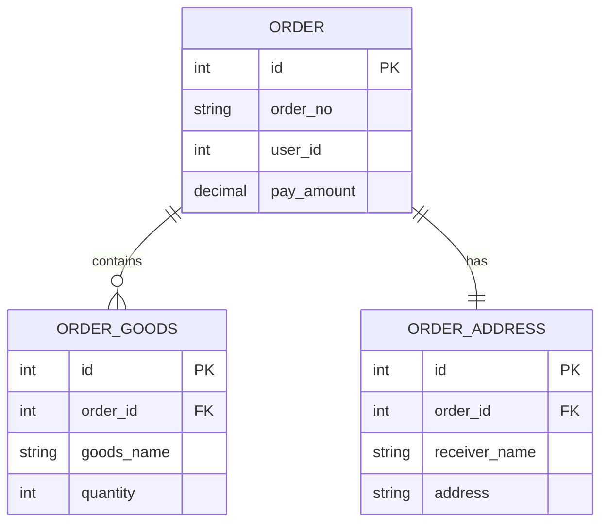
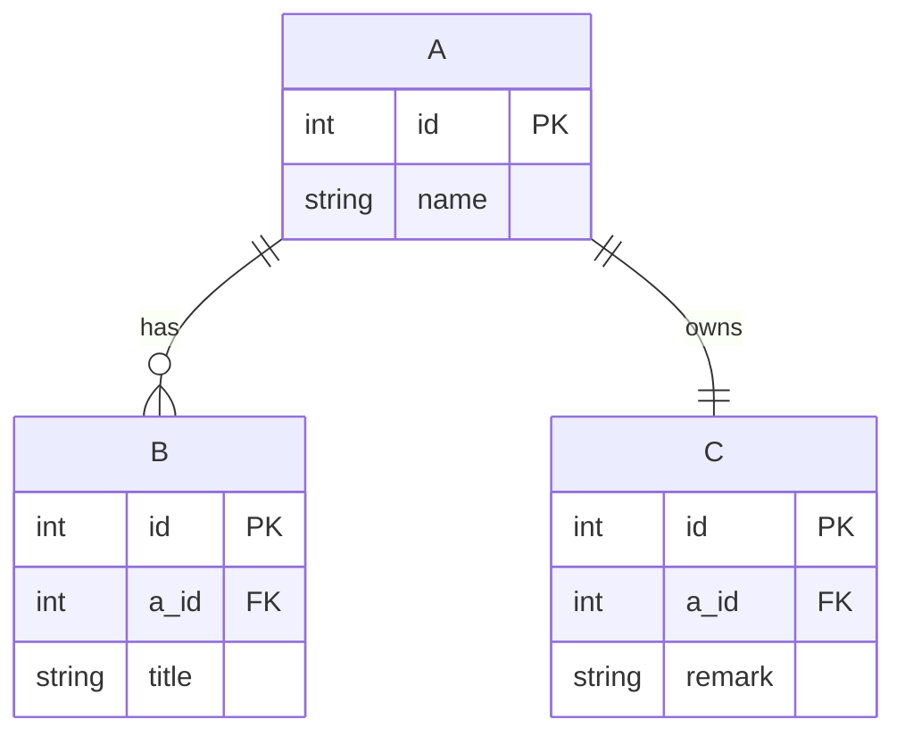
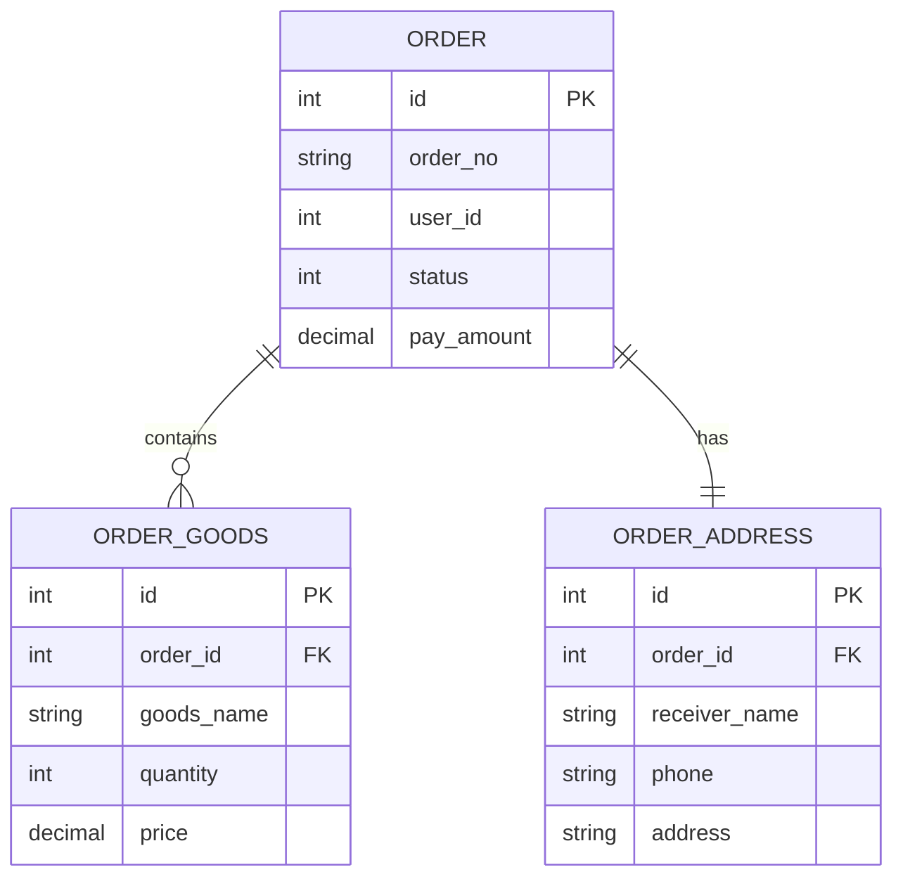

# ER 图 10 分钟入门手册

> 目标：10 分钟内看懂并画出最常见的数据库 ER 图，能用 Mermaid 写出自己的第一张表关系图。

---

## 0. ER 图是什么（30 秒）

ER 图，全称 **Entity Relationship Diagram**，中文一般叫**实体关系图**。

你可以把它理解成：

- **表结构地图**
- **字段关系说明书**
- **数据库设计草图**

ER 图最重要的不是“画得漂亮”，而是回答这 3 个问题：

1. 系统里有哪些表？
2. 表和表之间怎么关联？
3. 主键、外键、字段大概是什么？

---

## 1. 先记住 3 个核心概念（1 分钟）

### 1.1 实体（Entity）

实体通常就是一张表。

例如：

- `order`
- `order_goods`
- `order_address`

在 ER 图里，它们通常画成一个个“表块”。

### 1.2 属性（Attribute）

属性就是表里的字段。

例如 `order` 表里的：

- `id`
- `order_no`
- `user_id`
- `pay_amount`

### 1.3 关系（Relationship）

关系表示表和表之间怎么连接。

例如：

- 一个订单有多个订单商品
- 一个订单有一个订单地址快照

---

## 2. 最常见的 3 种关系（2 分钟）

### 2.1 一对一

例子：一个订单对应一条订单地址快照。

```text
order 1 ----- 1 order_address
```

常见判断方法：

- 子表里有 `order_id`
- 同一个订单只允许有一条地址记录

### 2.2 一对多

例子：一个订单有多条商品记录。

```text
order 1 ----- n order_goods
```

常见判断方法：

- `order_goods` 里有 `order_id`
- 多行商品可以指向同一个订单

### 2.3 多对多

例子：一个订单可以参加多个活动，一个活动也可以关联多个订单。

```text
order n ----- n promotion
```

这种关系通常不会直接存，而是拆成**中间表**：

```text
order
order_promotion
promotion
```

也就是把多对多拆成两个一对多。

---

## 3. 主键和外键怎么看（1 分钟）

### 主键（PK）

主键是这张表里**唯一标识一行数据**的字段。

最常见就是：

```text
id
```

### 外键（FK）

外键是**指向别的表主键**的字段，用来建立关系。

例如：

```text
order_goods.order_id  ->  order.id
order_address.order_id -> order.id
```

一句话理解：

- `id`：我是我自己
- `order_id`：我属于哪个订单

---

## 4. 用订单例子快速看懂 ER 图（2 分钟）

订单场景很适合入门，因为关系很直观：

- `order`：订单主表，存订单整体信息
- `order_goods`：订单商品表，存一个订单里的每件商品
- `order_address`：订单地址表，存下单时的地址快照

如果用文字表达：

```text
一个 order
  可以有多条 order_goods
  可以有一条 order_address
```

如果写成关系：

```text
order.id -> order_goods.order_id
order.id -> order_address.order_id
```

---

## 5. 用 Mermaid 画 ER 图（2 分钟）

Markdown 里这样写：

```markdown

```

渲染出来后，就是一张标准的订单 ER 图。

---

## 6. `erDiagram` 关系符号速记（1 分钟）

Mermaid 里最常见的是下面几个：

| 写法 | 含义 |
|---|---|
| `||--||` | 一对一 |
| `||--o{` | 一对多 |
| `}o--o{` | 多对多 |

你当前阶段记住这个就够了：

- `ORDER ||--o{ ORDER_GOODS` = 一个订单，对应多条商品
- `ORDER ||--|| ORDER_ADDRESS` = 一个订单，对应一条地址

如果你觉得符号难记，可以先只记中文含义，不必一开始就死背。

---

## 7. 读 ER 图的正确顺序（1 分钟）

看到一张 ER 图，不要一上来盯字段，按这个顺序读：

1. 先看有哪些表
2. 再看表之间怎么连
3. 再看主键、外键
4. 最后看字段明细

以订单图为例：

1. 表有 `ORDER`、`ORDER_GOODS`、`ORDER_ADDRESS`
2. `ORDER` 连到另外两张表
3. 关联键是 `order.id`
4. 再看商品名、数量、收货地址这些业务字段

这样不容易乱。

---

## 8. 常见错误（1 分钟）

### 错误 1：把业务字段当关系字段

例如把：

```text
order.order_no
```

当成和 `order_goods` 的关联条件。

入门阶段先优先看：

```text
id / order_id / user_id / goods_id
```

这类“像外键”的字段。

### 错误 2：把一对多看成一对一

如果 `order_goods` 里一张订单能有多行，那它一定不是一对一。

### 错误 3：只看字段，不看业务含义

比如 `order_address` 为什么单独存？

因为它保存的是**下单时的地址快照**，不是用户当前最新地址。

ER 图不仅是表关系，也是在表达业务设计。

---

## 9. 10 分钟练习模板

你可以直接复制下面这段，改成自己的表名：



练习步骤：

1. 把 `A/B/C` 改成真实表名
2. 把 `a_id` 改成真实外键名
3. 每张表保留 3 到 5 个核心字段
4. 标清哪个是 `PK`、哪个是 `FK`

---

## 10. 订单 ER 图最小实战

可直接复制到 Markdown 中预览：



---

## 11. 一句话速记

- ER 图 = 表关系图
- 实体 = 表，属性 = 字段，关系 = 表和表之间怎么连
- `id` 常是主键，`xxx_id` 常是外键
- `order -> order_goods` 常见是一对多
- `order -> order_address` 常见是一对一
- Mermaid 里用 `erDiagram` 画 ER 图

---

## 12. 相关学习文件

- `php/week03/day06.md`
- `php/mermaid-10min-quickstart.md`
- `php/week03/common/models/order/Order.php`
- `php/week03/common/models/order/OrderGoods.php`
- `php/week03/common/models/order/OrderAddress.php`

