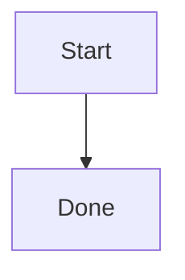
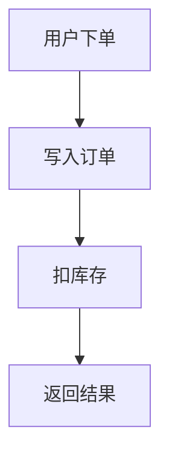
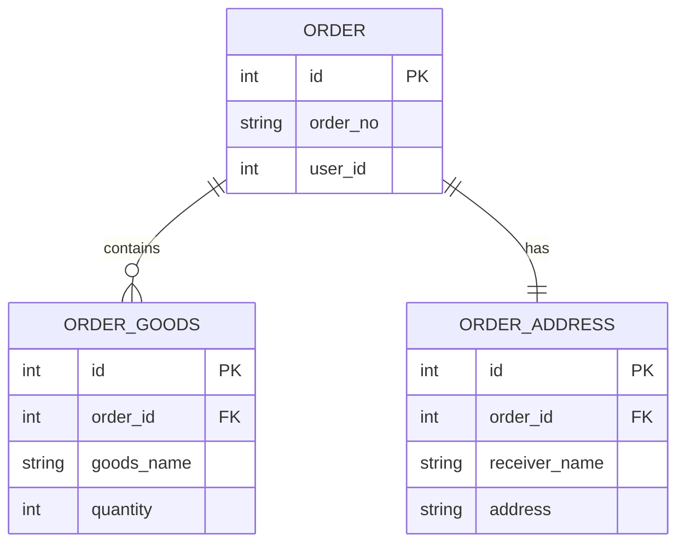
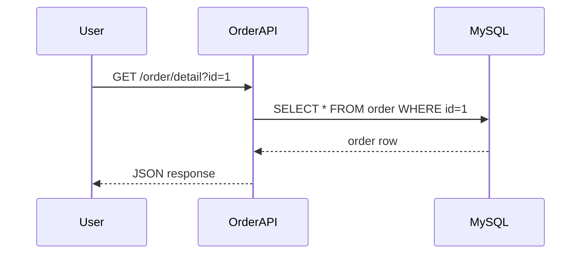
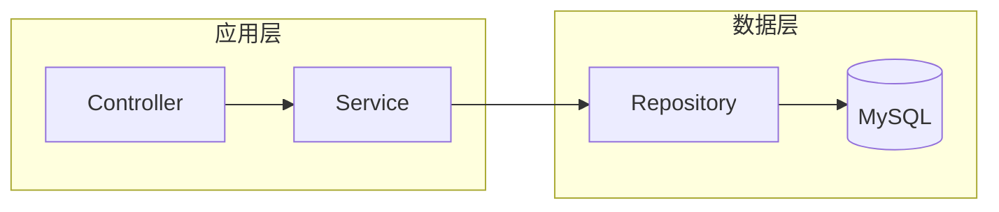
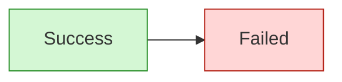
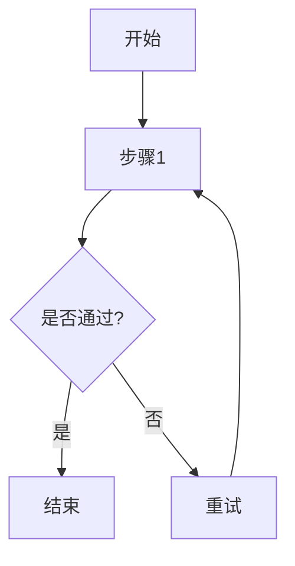
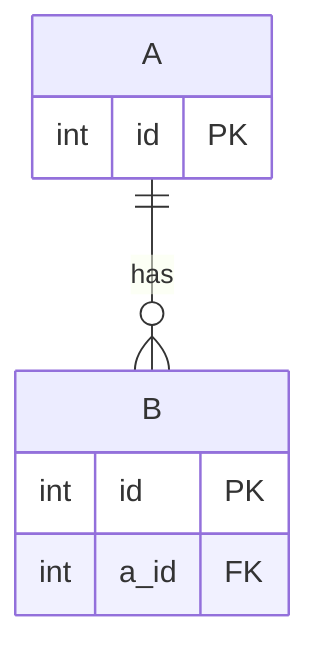
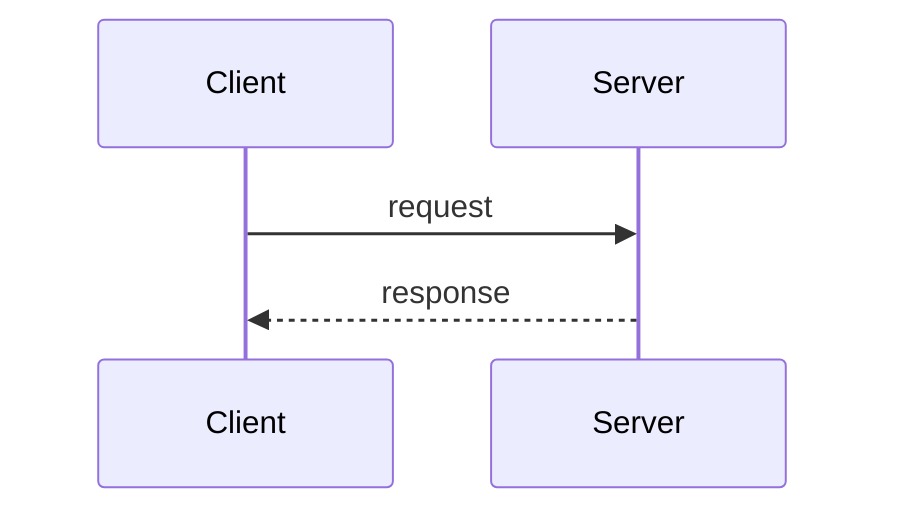

# Mermaid 10 分钟入门手册

> 目标：10 分钟内学会在 Markdown 里画流程图、ER 图和时序图，并能自己排错。

---

## 0. Mermaid 是什么（30 秒）

Mermaid 是一种**用文本画图**的语法。你写代码块，平台渲染成图。

最常见场景：

- 技术文档里的流程图
- 数据库关系图（`erDiagram`）
- 接口调用时序图（`sequenceDiagram`）

---

## 1. 先确认能显示（1 分钟）

在 Markdown 里必须这样写：

```markdown

```

如果看不到图，先检查：

1. 代码块语言是否是 `mermaid`
2. 每一行缩进是否统一（建议空格，不要 Tab）
3. 是否少写了结束的 ``` 

---

## 2. 必学语法 1：流程图（2 分钟）

### 2.1 最小流程图



- `graph TD`：从上到下（Top Down）
- 节点名 `A/B/C` 是内部 ID
- `[]` 里是显示文本
- `-->` 是箭头连线

### 2.2 方向写法

- `TD`：上到下
- `LR`：左到右
- `RL`：右到左
- `BT`：下到上

---

## 3. 必学语法 2：ER 图（2 分钟）

这是你在 Day06 最常用的。



关系符号速记：

- `||--||`：一对一
- `||--o{`：一对多
- `}o--o{`：多对多（通常靠中间表实现）

---

## 4. 必学语法 3：时序图（2 分钟）



- `participant`：参与者
- `->>`：同步调用
- `-->>`：返回

---

## 5. 进阶一点点：子图和样式（1 分钟）

### 5.1 子图（流程分组）



### 5.2 简单样式



---

## 6. 常见报错与排查（1 分钟）

### 报错 1：不渲染

- 检查代码块是不是 `mermaid`
- 检查是否被三引号包裹完整

### 报错 2：Parse error

- 多半是符号写错（如 `-- >` 多空格）
- 节点里含特殊字符时，先简化文本再逐步加回

### 报错 3：中文/标点导致异常

- 尝试把节点文字改成简单中文或英文
- 避免在关系符号旁加全角标点

### 报错 4：图太大挤在一起

- 改方向 `TD`/`LR`
- 拆成多张图（主流程 + 子流程）

---

## 7. 10 分钟练习清单

按顺序做，做完就算入门：

1. 画一个 4 节点流程图（下单流程）
2. 画一个订单 ER 图（`order/order_goods/order_address`）
3. 画一个查询接口时序图
4. 给流程图加一个 `subgraph`
5. 给成功/失败节点加颜色

---

## 8. 可直接复制模板

### 流程图模板



### ER 图模板



### 时序图模板



---

## 9. 一句话速记

- Mermaid = 文本即图
- `graph TD` 画流程，`erDiagram` 画表关系，`sequenceDiagram` 画调用顺序
- 写不出来时先用最小示例，逐行加内容

