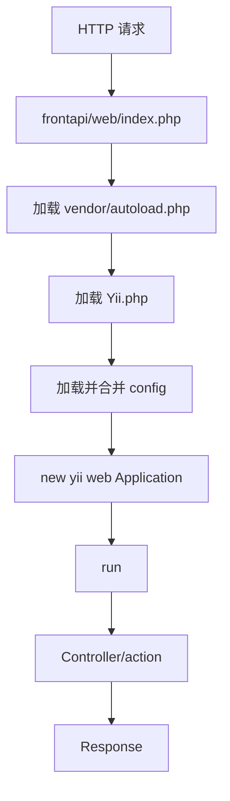

# Week 02 Day 01：Yii2 入口与启动

> 所属周：Week 02：Yii2 生命周期与 Filter  
> 阶段：第一阶段：PHP + Yii2/TP 基础  
> 主仓库/项目：`mall-gateway`  
> 类型：概念入门  
> 建议时长：约 3h  
> 学习方法：PHP 后端主线 + JS/Node.js 类比 + AI Review

---

## 今日目标

理解 Yii2 项目请求入口 `web/index.php` 做了什么，知道 Yii2 Application 是如何被创建和启动的，并能看懂配置文件是如何被合并加载的。

今天你要真正掌握这一句话：

> Yii2 的 `web/index.php` 类似 Node/Express 项目的启动入口：它加载 Composer autoload、加载 Yii 框架、合并配置、创建 Application，最后调用 `run()` 处理请求。

---

## 0. 今日学习路线

建议按下面顺序学习：

1. 先理解 Yii2 是什么
2. 理解什么是入口脚本 `web/index.php`
3. 复习 Composer autoload 在 Yii2 中的作用
4. 理解 `Yii.php` 框架引导文件
5. 理解配置文件 config 是什么
6. 理解配置合并：公共配置 + 环境配置 + 应用配置
7. 理解 `new yii\web\Application($config)`
8. 理解 `$application->run()`
9. 阅读 `mall-gateway/frontapi/web/index.php`
10. 画出 Yii2 启动流程图
11. 用 Express/Nuxt/Nest 启动流程做类比
12. 完成今日自测和 AI Review

---

## 1. 学习内容

### 1.1 Yii2 是什么？

Yii2 是一个 PHP Web 框架。

它帮你处理很多 Web 项目通用问题：

- 请求入口
- 路由解析
- Controller/action 调用
- 配置管理
- 请求对象 Request
- 响应对象 Response
- 日志
- 数据库连接
- 组件管理
- Filter / middleware

你可以先这样类比：

| PHP / Yii2 | Node/JS 类比 |
|---|---|
| Yii2 Framework | Express / NestJS / Koa |
| `web/index.php` | `server.js` / `main.ts` |
| Application | Express app / Nest application |
| Controller | Controller / route handler |
| action | handler function |
| config | `.env` + config files |
| components | app-level services / plugins |

---

### 1.2 什么是入口脚本？

入口脚本就是所有 Web 请求最先进入的 PHP 文件。

Yii2 Web 项目常见入口：

```text
web/index.php
```

比如用户访问：

```text
https://example.com/pay/pay/methods
```

在 Nginx/Apache 配置下，请求最终会交给：

```text
frontapi/web/index.php
```

然后 Yii2 再根据 URL 去找对应 Module、Controller、action。

小白理解：

> `index.php` 就像门卫，所有请求先经过它，再由 Yii2 分发到具体业务代码。

---

### 1.3 Yii2 入口脚本通常长什么样？

一个简化版 Yii2 `web/index.php`：

```php
<?php

defined('YII_DEBUG') or define('YII_DEBUG', true);
defined('YII_ENV') or define('YII_ENV', 'dev');

require __DIR__ . '/../vendor/autoload.php';
require __DIR__ . '/../vendor/yiisoft/yii2/Yii.php';

$config = require __DIR__ . '/../config/web.php';

(new yii\web\Application($config))->run();
```

这几行就是今天重点。

拆开看：

| 代码 | 作用 |
|---|---|
| `define('YII_DEBUG', true)` | 是否开启调试模式 |
| `define('YII_ENV', 'dev')` | 当前环境，比如 dev/prod |
| `require vendor/autoload.php` | 加载 Composer 自动加载器 |
| `require Yii.php` | 加载 Yii2 框架核心 |
| `$config = require ...` | 加载配置 |
| `new yii\web\Application($config)` | 创建 Yii Web 应用 |
| `->run()` | 开始处理请求 |

---

### 1.4 `YII_DEBUG` 是什么？

`YII_DEBUG` 用来控制是否开启调试模式。

开发环境可能是：

```php
defined('YII_DEBUG') or define('YII_DEBUG', true);
```

生产环境通常应该是：

```php
defined('YII_DEBUG') or define('YII_DEBUG', false);
```

为什么生产不建议开 debug？

因为 debug 可能暴露：

- 文件路径
- SQL 信息
- 配置细节
- 调用栈
- 业务内部信息

这对安全不友好。

---

### 1.5 `YII_ENV` 是什么？

`YII_ENV` 表示当前运行环境。

常见值：

```text
dev
prod
test
```

示例：

```php
defined('YII_ENV') or define('YII_ENV', 'dev');
```

它类似 Node 里的：

```js
process.env.NODE_ENV
```

对比：

| Yii2 | Node.js |
|---|---|
| `YII_ENV` | `NODE_ENV` |
| `dev` | `development` |
| `prod` | `production` |
| 根据环境加载不同配置 | 根据环境加载不同 config/env |

---

### 1.6 `vendor/autoload.php` 在 Yii2 中的作用

Week 01 你已经学过 Composer autoload。

Yii2 项目入口里通常会有：

```php
require __DIR__ . '/../vendor/autoload.php';
```

作用：

> 让 PHP 能自动加载 Composer 依赖和项目类。

没有它，Yii2 相关类、第三方包、项目自己的类都可能找不到。

例如：

```php
new yii\web\Application($config)
```

这里的 `yii\web\Application` 也需要自动加载支持。

---

### 1.7 `Yii.php` 是什么？

Yii2 入口通常还会加载：

```php
require __DIR__ . '/../vendor/yiisoft/yii2/Yii.php';
```

它的作用是引入 Yii 框架核心。

你可以把它理解为：

```text
启动 Yii2 框架本体
```

类比 Node：

```js
import express from 'express';
const app = express();
```

PHP/Yii2：

```php
require Yii.php;
$app = new yii\web\Application($config);
```

---

### 1.8 配置文件 config 是什么？

Yii2 的配置通常是 PHP 数组。

例如：

```php
return [
    'id' => 'frontapi',
    'basePath' => dirname(__DIR__),
    'components' => [
        'request' => [
            'cookieValidationKey' => 'xxx',
        ],
        'db' => [
            'class' => yii\db\Connection::class,
            'dsn' => 'mysql:host=localhost;dbname=test',
        ],
    ],
];
```

你可以把 Yii2 config 理解成：

```text
应用启动参数 + 组件注册表
```

它会告诉 Yii2：

- 应用 ID 是什么
- 根目录在哪里
- 有哪些组件
- 数据库怎么连接
- 日志怎么写
- Module 怎么注册
- URL 规则是什么

---

### 1.9 什么是 components？

Yii2 config 里经常有：

```php
'components' => [
    'request' => [...],
    'response' => [...],
    'db' => [...],
    'cache' => [...],
]
```

这些就是应用级组件。

常见组件：

| 组件 | 作用 | Node 类比 |
|---|---|---|
| `request` | 请求对象 | Express `req` |
| `response` | 响应对象 | Express `res` |
| `db` | 数据库连接 | Prisma/Sequelize connection |
| `cache` | 缓存 | Redis client |
| `log` | 日志 | logger |
| `urlManager` | URL 路由规则 | router |

Yii2 中可以通过：

```php
Yii::$app->request
Yii::$app->response
Yii::$app->db
```

访问这些组件。

---

### 1.10 配置为什么要合并？

真实企业项目配置通常不会只有一个文件。

可能会拆成：

```text
common/config/main.php
common/config/main-local.php
frontapi/config/main.php
frontapi/config/main-local.php
```

原因：

- 公共配置给多个应用共享
- 本地配置不提交 git
- dev/test/prod 环境配置不同
- 敏感信息单独管理
- 前台 API、后台 API、console 使用不同配置

Yii2 项目里经常会看到类似：

```php
$config = yii\helpers\ArrayHelper::merge(
    require __DIR__ . '/../../common/config/main.php',
    require __DIR__ . '/../../common/config/main-local.php',
    require __DIR__ . '/../config/main.php',
    require __DIR__ . '/../config/main-local.php'
);
```

意思是把多个配置数组合并成一个最终配置。

---

### 1.11 配置合并类比 Node

Node 项目里你可能会这样写：

```js
const baseConfig = require('./config/base');
const envConfig = require(`./config/${process.env.NODE_ENV}`);

const config = {
  ...baseConfig,
  ...envConfig,
};
```

Yii2 类似：

```php
$config = ArrayHelper::merge($baseConfig, $localConfig, $appConfig);
```

对比：

| Yii2 | Node.js |
|---|---|
| `ArrayHelper::merge()` | object spread / lodash merge |
| `main.php` | base config |
| `main-local.php` | local env config |
| `YII_ENV` | `NODE_ENV` |

---

### 1.12 `new yii\web\Application($config)` 是什么？

这行代码创建 Yii2 Web 应用：

```php
$application = new yii\web\Application($config);
```

它会根据 `$config` 初始化应用。

包括：

- 设置应用 ID
- 设置 basePath
- 注册 components
- 注册 modules
- 准备 request/response
- 准备 errorHandler/log 等核心组件

你可以类比：

```js
const app = express();
app.use(...);
app.listen(...);
```

但 Yii2 更偏配置驱动。

---

### 1.13 `$application->run()` 是什么？

```php
$application->run();
```

这是真正开始处理请求。

大概流程：

```text
接收 Request
  ↓
解析 URL
  ↓
找到 route
  ↓
创建 Controller
  ↓
执行 action
  ↓
生成 Response
  ↓
发送给客户端
```

你今天先不用深入 route/action 细节，Week 02 后面会继续学。

---

### 1.14 Yii2 启动流程总图

今天你要能画出这个图：

```text
HTTP 请求
  ↓
Nginx/Apache 转发
  ↓
frontapi/web/index.php
  ↓
require vendor/autoload.php
  ↓
require Yii.php
  ↓
加载并合并 config
  ↓
new yii\web\Application($config)
  ↓
$application->run()
  ↓
路由到 Controller/action
  ↓
返回 Response
```

---

## 2. 源码阅读

- `mall-gateway/frontapi/web/index.php`

> 说明：路径均为公开代号 + 相对路径。学习时按你的本地仓库映射查找对应文件。

---

### 2.1 阅读顺序

打开 `index.php` 后，不要一上来逐字死磕，按下面顺序找：

1. 有没有定义 `YII_DEBUG`
2. 有没有定义 `YII_ENV`
3. 有没有 `require vendor/autoload.php`
4. 有没有 `require Yii.php`
5. 有没有加载 config
6. 有没有 `ArrayHelper::merge`
7. 有没有 `new yii\web\Application($config)`
8. 有没有 `run()`

---

### 2.2 记录表

| 观察点 | 实际代码 | 我的理解 |
|---|---|---|
| `YII_DEBUG` |  |  |
| `YII_ENV` |  |  |
| autoload |  |  |
| Yii.php |  |  |
| 配置文件列表 |  |  |
| 配置合并方式 |  |  |
| Application 类 |  |  |
| run() |  |  |

---

### 2.3 你要回答的问题

读完后，尝试回答：

1. `index.php` 是不是请求入口？
2. 它加载了哪些文件？
3. 它从哪里读取配置？
4. 最终创建了什么 Application？
5. `run()` 之前完成了哪些准备？

如果你能回答这些，今天就达标。

---

## 3. 练习任务

### 练习 1：画启动流程图

画出：

```text
请求
 ↓
index.php
 ↓
autoload
 ↓
Yii.php
 ↓
config merge
 ↓
Application
 ↓
run
 ↓
Controller/action
 ↓
Response
```

建议你用 Mermaid：



---

### 练习 2：写 Express 启动类比

写一个 Express 示例：

```js
import express from 'express';
import config from './config.js';

const app = express();

app.get('/health', (req, res) => {
  res.json({ ok: true });
});

app.listen(config.port);
```

再写 Yii2 对应：

```php
require __DIR__ . '/../vendor/autoload.php';
require __DIR__ . '/../vendor/yiisoft/yii2/Yii.php';

$config = require __DIR__ . '/../config/web.php';

(new yii\web\Application($config))->run();
```

总结差异：

| 对比项 | Express | Yii2 |
|---|---|---|
| 入口 | `server.js` | `web/index.php` |
| 框架加载 | `import express` | `require Yii.php` |
| 依赖加载 | Node resolver | Composer autoload |
| 配置 | JS object/env | PHP config array |
| 启动 | `app.listen()` | `Application->run()` |

注意：Web 模式下 Yii2 不一定像 Node 一样长驻监听端口，传统 PHP-FPM 是每个请求进入入口脚本处理。

---

### 练习 3：追踪 config 加载链

在 `index.php` 里找所有 `require` 配置的地方。

记录：

| 顺序 | 配置文件 | 作用猜测 |
|---|---|---|
| 1 |  | 公共配置？ |
| 2 |  | 本地配置？ |
| 3 |  | frontapi 配置？ |
| 4 |  | 环境配置？ |

然后回答：

```text
最终 $config 是由哪些文件合并出来的？
后面的配置会不会覆盖前面的配置？
哪些配置不应该提交到公开仓库？
```

---

### 练习 4：写一段伪代码解释 Yii2 启动

用自己的话写：

```text
1. 用户请求进入 frontapi/web/index.php
2. index.php 设置调试和环境常量
3. 加载 Composer autoload
4. 加载 Yii2 框架核心
5. 加载多个配置文件并合并
6. 用配置创建 yii\web\Application
7. 调用 run() 开始处理请求
8. Yii2 根据 URL 找 Controller/action
9. action 执行后返回 Response
```

---

## 4. JS/Node.js 类比

| Yii2 概念 | Node/Express 类比 | 差异 |
|---|---|---|
| `web/index.php` | `server.js` / `main.ts` | PHP Web 请求通常由 Web Server/PHP-FPM 触发 |
| `vendor/autoload.php` | Node module resolver | Composer 显式生成 autoload |
| `Yii.php` | `import express` | 加载框架核心 |
| config PHP array | JS config object | Yii2 更配置驱动 |
| `ArrayHelper::merge()` | object spread / lodash merge | 深度合并规则要注意 |
| `Application` | Express app / Nest app | Yii2 Application 管更多组件 |
| `run()` | request handling / listen callback | Yii2 run 处理当前请求 |
| components | plugins/services | 通过 `Yii::$app->xxx` 访问 |

---

## 5. AI Review 提问

完成流程图和源码阅读记录后，把内容贴给 AI，然后问：

```text
我正在学习 Yii2 入口与启动流程。

我阅读了 frontapi/web/index.php，并画了启动流程图。
请你按资深 PHP/Yii2 后端工程师标准帮我检查：

1. 我对 index.php 职责的理解是否正确？
2. 我对 vendor/autoload.php 和 Yii.php 的区别是否理解正确？
3. 我画的 config 加载链是否准确？
4. 我把 index.php 类比为 Express server.js 是否会误导？
5. 下一步学习 Module/Controller/action 前，我还需要补哪些概念？

请用中文输出：问题清单、修正建议、下一步练习。
```

---

## 6. 今日产出

今天结束前，你应该产出：

- [ ] `frontapi/web/index.php` 阅读笔记
- [ ] Yii2 启动流程图
- [ ] config 加载链表格
- [ ] Yii2 vs Express 启动对比表
- [ ] 用自己的话写出的 Yii2 启动伪代码
- [ ] 今日 AI Review 记录

---

## 7. 今日完成标准

- [ ] 能说出 `web/index.php` 是 Yii2 Web 请求入口
- [ ] 能解释 `vendor/autoload.php` 的作用
- [ ] 能解释 `Yii.php` 的作用
- [ ] 能解释配置文件为什么要合并
- [ ] 能说出 `new yii\web\Application($config)` 做什么
- [ ] 能说出 `run()` 是开始处理请求
- [ ] 能画出 Yii2 启动流程图
- [ ] 能用 Express 启动流程做类比并说出差异

---

## 8. 今日自测题

### 8.1 Yii2 的 Web 入口通常是什么文件？

参考答案：

> 通常是 `web/index.php`。

---

### 8.2 `vendor/autoload.php` 在 Yii2 入口中做什么？

参考答案：

> 它加载 Composer 自动加载器，让 Yii2 类、第三方依赖和项目类可以被自动加载。

---

### 8.3 `Yii.php` 的作用是什么？

参考答案：

> 它加载 Yii2 框架核心，让项目可以使用 Yii2 的基础类和功能。

---

### 8.4 Yii2 配置为什么要合并？

参考答案：

> 因为真实项目通常有公共配置、本地配置、环境配置和应用配置，需要合并成最终 `$config` 后再创建 Application。

---

### 8.5 `new yii\web\Application($config)` 是什么？

参考答案：

> 它根据配置创建 Yii2 Web 应用对象，并初始化组件、模块、请求响应等能力。

---

### 8.6 `$application->run()` 大概做什么？

参考答案：

> 它开始处理当前 HTTP 请求，解析路由，执行 Controller/action，并返回 Response。

---

### 8.7 `index.php≈server.js` 这个类比有什么局限？

参考答案：

> 它们都是入口，但 Node 的 `server.js` 通常启动一个长驻服务监听端口；传统 PHP/Yii2 常由 Nginx/PHP-FPM 把每个请求交给 `index.php` 处理。

---

## 9. 学习记录

| 记录项 | 内容 |
|--------|------|
| 今日最清楚的概念 |  |
| 今日最卡的概念 |  |
| JS/Node 类比是否帮助理解 |  |
| 实际耗时 |  |
| 明日要补的问题 |  |

---

## 10. AI Review 提示词

```text
我正在进行 Week 02 Day 01：Yii2 入口与启动 的学习。
请你扮演资深 PHP 后端工程师，帮我检查：
1. 今日理解是否正确
2. JS/Node 类比是否准确
3. 练习任务是否遗漏关键风险
4. 真实企业项目中还需要注意什么

请用中文输出：问题清单、修正建议、下一步练习。
```

---

## 返回本周

- [返回 Week 02 README](./README.md)
