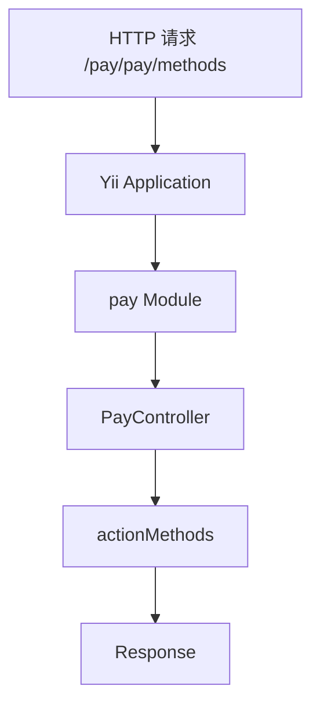

# Week 02 Day 02：Module 与路由

> 所属周：Week 02：Yii2 生命周期与 Filter  
> 阶段：第一阶段：PHP + Yii2/TP 基础  
> 主仓库/项目：`mall-gateway`  
> 类型：源码阅读  
> 建议时长：约 3h  
> 学习方法：PHP 后端主线 + JS/Node.js 类比 + AI Review

---

## 今日目标

掌握 Yii2 的 Module、Controller、action 命名约定与 URL 路由映射，能从一个 URL 推导出它大概率会进入哪个 Module、哪个 Controller、哪个 action。

今天你要真正掌握这一句话：

> Yii2 的路由通常可以理解为 `module/controller/action`，例如 `pay/pay/methods` 大概率表示进入 `Pay` 模块、`PayController` 控制器、`actionMethods()` 方法。

---

## 0. 今日学习路线

建议按下面顺序学习：

1. 先复习 Day 01 的 Yii2 启动流程
2. 理解什么是 Module
3. 理解为什么企业项目要拆 Module
4. 理解 Controller 是什么
5. 理解 action 是什么
6. 学会 Yii2 `actionXxx()` 命名约定
7. 学会 URL 如何映射到 Module / Controller / action
8. 阅读 `frontapi/config/modules/Modules.php`
9. 解释 `pay/pay/methods` 这类路由
10. 写 3 个 URL 路由映射表
11. 用 Express Router / Nest Module 做类比
12. 完成今日自测和 AI Review

---

## 1. 学习内容

### 1.1 先回顾 Yii2 请求大图

Day 01 你已经知道 Yii2 启动流程：

```text
HTTP 请求
  ↓
web/index.php
  ↓
加载 autoload / Yii.php / config
  ↓
new yii\web\Application($config)
  ↓
run()
  ↓
解析路由
  ↓
Controller/action
  ↓
Response
```

今天重点就是中间这一步：

```text
解析路由 → 找到 Module / Controller / action
```

---

### 1.2 什么是 Module？

Module 可以理解为「功能模块」或「子应用」。

大型项目通常不会把所有 Controller 都放在一起，而是按业务拆开：

```text
Pay Module
Order Module
User Module
Goods Module
Cart Module
```

每个 Module 下面可以有自己的：

- Controller
- Form
- Service 调用
- 配置
- 子目录结构

小白理解：

> Module 就像一个业务分组，把同一类 API 放到一起。

---

### 1.3 Module 类比 Express Router

Express 里你可能会这样拆：

```js
app.use('/pay', payRouter);
app.use('/order', orderRouter);
app.use('/user', userRouter);
```

Yii2 里可能是：

```php
'pay' => [
    'class' => 'frontapi\modules\Pay\Module',
],
'order' => [
    'class' => 'frontapi\modules\Order\Module',
],
```

类比：

| Yii2 | Express/Nest 类比 |
|---|---|
| Module | Router module / Nest Module |
| Module ID | URL 前缀 |
| Module class | 模块入口类 |
| Controller | 路由处理类 |
| action | handler 方法 |

---

### 1.4 什么是 Controller？

Controller 是控制器，负责接收请求、取参数、调用业务逻辑、返回响应。

Yii2 Controller 常见命名：

```text
PayController.php
OrderController.php
UserController.php
```

类名：

```php
class PayController extends Controller
{
}
```

小白理解：

> Controller 就像 Express 里的 route handler 集合，也像 NestJS 的 Controller。

---

### 1.5 什么是 action？

在 Yii2 中，Controller 里的一个可访问接口方法通常叫 action。

方法命名约定：

```php
public function actionMethods()
{
}

public function actionCreate()
{
}

public function actionDetail()
{
}
```

URL 中的 action 名通常会映射到方法名：

| URL action | PHP 方法 |
|---|---|
| `methods` | `actionMethods()` |
| `create` | `actionCreate()` |
| `detail` | `actionDetail()` |
| `order-list` | `actionOrderList()` |

重点：

> Yii2 通过 `action` 前缀识别可被路由访问的方法。

---

### 1.6 Yii2 路由基本格式

常见格式：

```text
module/controller/action
```

例如：

```text
pay/pay/methods
```

可以拆成：

| 片段 | 含义 | 可能对应代码 |
|---|---|---|
| `pay` | Module ID | `Pay` 模块 |
| `pay` | Controller ID | `PayController` |
| `methods` | action ID | `actionMethods()` |

所以：

```text
pay/pay/methods
→ Pay Module
→ PayController
→ actionMethods()
```

---

### 1.7 Controller ID 如何变成类名？

Yii2 约定：

```text
pay → PayController
order → OrderController
user → UserController
```

如果 controller ID 是短横线：

```text
order-goods
```

大概率对应：

```text
OrderGoodsController
```

规则类似：

```text
kebab-case → PascalCase + Controller
```

前端类比：

```text
order-goods → OrderGoodsController
```

就像你把路由名转成组件名：

```text
order-goods → OrderGoods.vue
```

---

### 1.8 action ID 如何变成方法名？

Yii2 约定：

```text
methods → actionMethods
create → actionCreate
detail → actionDetail
order-list → actionOrderList
```

规则：

```text
action ID 转 PascalCase，然后前面加 action
```

例子：

| action ID | 方法名 |
|---|---|
| `methods` | `actionMethods()` |
| `pay-result` | `actionPayResult()` |
| `order-list` | `actionOrderList()` |
| `quick-login` | `actionQuickLogin()` |

---

### 1.9 URL 规则可能会改变默认映射

真实项目里 Yii2 可能配置了 URL rules。

例如：

```php
'urlManager' => [
    'enablePrettyUrl' => true,
    'rules' => [
        'pay/methods' => 'pay/pay/methods',
    ],
]
```

这表示用户访问：

```text
/pay/methods
```

内部可能映射到：

```text
pay/pay/methods
```

所以读真实项目时要注意：

1. 先看 Module 注册
2. 再看 URL rules
3. 再找 Controller/action

---

### 1.10 为什么网关项目喜欢拆 Module？

`mall-gateway` 这类 BFF/API 网关通常会对外暴露很多接口。

如果全部 Controller 放一起，会很乱。

按模块拆可以让结构更清楚：

```text
frontapi/modules/
├── Pay/
│   └── controllers/
│       └── PayController.php
├── Order/
│   └── controllers/
│       └── OrderController.php
└── User/
    └── controllers/
        └── UserController.php
```

好处：

- 支付接口放 Pay 模块
- 订单接口放 Order 模块
- 用户接口放 User 模块
- 路由和业务边界更清晰
- 权限/Filter 也更容易分组管理

---

## 2. 源码阅读

- `mall-gateway/frontapi/config/modules/Modules.php`

> 说明：路径均为公开代号 + 相对路径。学习时按你的本地仓库映射查找对应文件。

---

### 2.1 阅读目标

今天读 `Modules.php` 的目标不是看懂所有业务，而是回答：

1. 项目注册了哪些 Module？
2. 每个 Module 的 ID 是什么？
3. 每个 Module 对应哪个 class？
4. Module ID 和 URL 第一段有什么关系？
5. 能否找到 Pay 模块？

---

### 2.2 记录 Module 表

打开 `Modules.php` 后，整理成表格：

| Module ID | Module class | 业务含义 | URL 前缀猜测 |
|---|---|---|---|
| `pay` |  | 支付 | `/pay/...` |
| `order` |  | 订单 | `/order/...` |
| `user` |  | 用户 | `/user/...` |

如果真实文件里名称不一样，以真实文件为准。

---

### 2.3 找 Pay 模块

重点找类似：

```php
'pay' => [
    'class' => 'frontapi\modules\Pay\Module',
],
```

你要记录：

| 项 | 记录 |
|---|---|
| Module ID |  |
| Module class |  |
| 目录位置 |  |
| 可能 URL 前缀 |  |

---

### 2.4 推导 `pay/pay/methods`

假设 route 是：

```text
pay/pay/methods
```

推导：

| 路由片段 | 推导结果 |
|---|---|
| 第一个 `pay` | Module ID = pay |
| 第二个 `pay` | Controller ID = pay |
| 第三个 `methods` | action ID = methods |
| Controller 类 | `PayController` |
| 方法名 | `actionMethods()` |

你要能写出完整句子：

> `pay/pay/methods` 表示请求进入 pay 模块，找到 PayController，然后执行 actionMethods 方法。

---

## 3. 练习任务

### 练习 1：列出已注册 Module

阅读 `Modules.php`，写表：

| 序号 | Module ID | Module class | 业务含义 |
|---|---|---|---|
| 1 | `api` | `\fecshop\app\frontapi\modules\Api\Module` | 通用 API 接口 |
| 2 | `order` | `\fecshop\app\frontapi\modules\Order\Module` | 订单业务 |
| 3 | `home` | `\fecshop\app\frontapi\modules\Home\Module` | 首页业务 |
| 4 | `product` | `\fecshop\app\frontapi\modules\Product\Module` | 商品业务 |
| 5 | `catalog` | `\fecshop\app\frontapi\modules\Catalog\Module` | 商品分类业务 |
| 6 | `common` | `\fecshop\app\frontapi\modules\Common\Module` | 公共功能 |
| 7 | `market` | `\fecshop\app\frontapi\modules\Market\Module` | 营销活动业务 |
| 8 | `user` | `\fecshop\app\frontapi\modules\User\Module` | 用户业务 |
| 9 | `pay` | `\fecshop\app\frontapi\modules\Pay\Module` | 支付业务 |
| 10 | `content` | `\fecshop\app\frontapi\modules\Content\Module` | 内容业务 |
| 11 | `outer` | `\fecshop\app\frontapi\modules\Outer\Module` | 外部接口或第三方集成 |
| 12 | `customer-service` | `\fecshop\app\frontapi\modules\CustomerService\Module` | 客户服务业务 |
| 13 | `ads` | `\fecshop\app\frontapi\modules\Ads\Module` | 广告业务 |
| 14 | `udesk` | `\fecshop\app\frontapi\modules\Udesk\Module` | Udesk 客服系统集成 |
| 15 | `v2` | `\fecshop\app\frontapi\modules\V2\Module` | V2 版本接口 |
| 16 | `store` | `\fecshop\app\frontapi\modules\Store\Module` | 店铺业务 |

至少列 5 个。

---

### 练习 2：解释 `pay/pay/methods`

写出你的解释：

```text
pay/pay/methods

第 1 段 pay：
第 2 段 pay：
第 3 段 methods：
可能进入的 Controller：
可能执行的方法：
```

参考：

```text
第 1 段 pay：pay Module
第 2 段 pay：PayController
第 3 段 methods：actionMethods()
```

---

### 练习 3：写 3 个路由推导表

找 3 个真实或计划中的路由，写表：

| URL / route | Module | Controller | action | 方法名 |
|---|---|---|---|---|
| `pay/pay/methods` | pay | pay | methods | `actionMethods()` |
|  |  |  |  |  |
|  |  |  |  |  |

---

### 练习 4：手写 Yii2 路由转换规则

写出：

```text
module/controller/action
→ Module ID
→ Controller ID + Controller 后缀
→ action + ActionName
```

再写 3 个例子：

| route | Controller 类 | action 方法 |
|---|---|---|
| `user/login/quick-login` | `LoginController` | `actionQuickLogin()` |
| `order/order/detail` | `OrderController` | `actionDetail()` |
| `pay/pay/methods` | `PayController` | `actionMethods()` |

注意：真实项目路由是否完全如此，要结合 URL rules 和目录结构验证。

---

### 练习 5：画 Module 路由图

画图：

```text
HTTP 请求 /pay/pay/methods
  ↓
Yii Application
  ↓
Module: pay
  ↓
Controller: PayController
  ↓
actionMethods()
  ↓
Response
```

Mermaid：



---

## 4. JS/Node.js 类比

| Yii2 概念 | Node/Express/Nest 类比 | 差异 |
|---|---|---|
| Module | Express Router 前缀 / Nest Module | Yii2 Module 是框架级子模块 |
| Controller | route handler class / Nest Controller | Yii2 用 Controller 类承载多个 action |
| action | handler function | Yii2 方法名前缀通常是 `action` |
| `pay/pay/methods` | `/pay/pay/methods` route | Yii2 会按约定映射类和方法 |
| `Modules.php` | router registry / module registry | Yii2 用 PHP 配置注册模块 |
| URL rules | Express router 映射 | Yii2 规则可能重写默认 route |

---

## 5. AI Review 提问

完成 Module 表和路由推导后，把内容贴给 AI，然后问：

```text
我正在学习 Yii2 Module 与路由映射。

我阅读了 frontapi/config/modules/Modules.php，并整理了 Module 表和 3 个路由推导。
请你按资深 Yii2 后端工程师标准帮我检查：

1. 我列出的 Module ID 和 class 是否理解正确？
2. 我对 pay/pay/methods 的路由推导是否准确？
3. Module / Controller / action 的类比是否会误导？
4. Yii2 URL rules 是否可能改变我的推导？
5. 下一步学习 Controller 和 Filter 前，我还要补什么？

请用中文输出：问题清单、修正建议、下一步练习。
```

---

## 6. 今日产出

今天结束前，你应该产出：

- [ ] `Modules.php` 阅读笔记
- [ ] 已注册 Module 清单，至少 5 个
- [ ] `pay/pay/methods` 路由解释
- [ ] 3 个 URL / route 推导表
- [ ] Module 路由流程图
- [ ] Yii2 Module vs Express Router 类比表
- [ ] 今日 AI Review 记录

---

## 7. 今日完成标准

- [ ] 能解释 Yii2 Module 是什么
- [ ] 能说出为什么企业项目要拆 Module
- [ ] 能解释 Controller 是什么
- [ ] 能解释 action 是什么
- [ ] 能把 `methods` 推导成 `actionMethods()`
- [ ] 能解释 `pay/pay/methods` 的三段含义
- [ ] 能阅读 `Modules.php` 并列出 Module
- [ ] 能推导至少 3 个 URL 对应的 Controller/action
- [ ] 能说明 Module 和 Express Router 的类比与差异

---

## 8. 今日自测题

### 8.1 Yii2 Module 是什么？

参考答案：

> Module 是 Yii2 中的业务模块或子应用，用来把同一类 Controller、配置和业务接口组织到一起。

---

### 8.2 `pay/pay/methods` 三段分别表示什么？

参考答案：

> 第一个 `pay` 通常表示 Module，第二个 `pay` 表示 Controller，第三个 `methods` 表示 action。

---

### 8.3 `methods` 通常对应哪个 PHP 方法？

参考答案：

```php
public function actionMethods()
```

---

### 8.4 Controller ID `order-goods` 大概率对应哪个 Controller 类？

参考答案：

```text
OrderGoodsController
```

---

### 8.5 action ID `quick-login` 大概率对应哪个方法？

参考答案：

```text
actionQuickLogin()
```

---

### 8.6 `Modules.php` 主要用来看什么？

参考答案：

> 用来看项目注册了哪些 Module、Module ID 是什么、对应的 Module class 是什么。

---

### 8.7 为什么 URL rules 可能影响路由推导？

参考答案：

> 因为 URL rules 可以把外部 URL 映射到内部 route，所以看到的 URL 不一定就是最终的 `module/controller/action`。

---

## 9. 学习记录

| 记录项 | 内容 |
|--------|------|
| 今日最清楚的概念 |  |
| 今日最卡的概念 |  |
| JS/Node 类比是否帮助理解 |  |
| 实际耗时 |  |
| 明日要补的问题 |  |

---

## 10. AI Review 提示词

```text
我正在进行 Week 02 Day 02：Module 与路由 的学习。
请你扮演资深 PHP 后端工程师，帮我检查：
1. 今日理解是否正确
2. JS/Node 类比是否准确
3. 练习任务是否遗漏关键风险
4. 真实企业项目中还需要注意什么

请用中文输出：问题清单、修正建议、下一步练习。
```

---

## 返回本周

- [返回 Week 02 README](./README.md)
