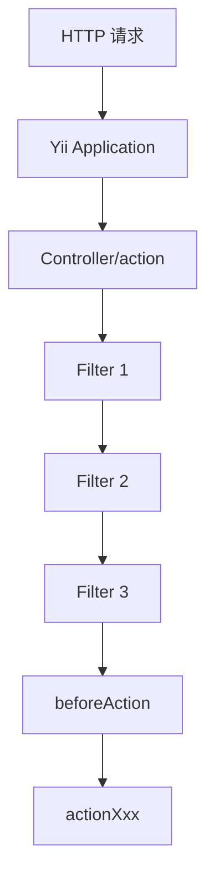

# Week 02 Day 03：behaviors 与 Filter

> 所属周：Week 02：Yii2 生命周期与 Filter  
> 阶段：第一阶段：PHP + Yii2/TP 基础  
> 主仓库/项目：`mall-gateway`  
> 类型：编码练习  
> 建议时长：约 3h  
> 学习方法：PHP 后端主线 + JS/Node.js 类比 + AI Review

---

## 今日目标

理解 Yii2 中 `behaviors()`、Filter、`beforeAction()` 的执行机制，能画出请求进入 Controller action 前经历了哪些前置处理，并能用 Express middleware 链来类比。

今天你要真正掌握这一句话：

> Yii2 的 behaviors/Filter 类似 Express middleware：请求真正进入 action 前，会先经过日志、鉴权、用户状态、参数校验等前置链路；其中某个 Filter 返回 false，就可以中断后续 action 执行。

---

## 0. 今日学习路线

建议按下面顺序学习：

1. 复习 Yii2 请求到 Controller/action 的路径
2. 理解为什么需要 Filter
3. 理解 `behaviors()` 是什么
4. 理解 Filter 是什么
5. 理解 `beforeAction()` 的执行时机
6. 理解 Filter 如何中断请求
7. 阅读 `AuthApiController.php`
8. 找出它声明了哪些 behaviors
9. 画出 Filter 执行链
10. 选择一个 Filter 读源码
11. 和 Express middleware 做类比
12. 完成今日自测和 AI Review

---

## 1. 学习内容

### 1.1 为什么需要 Filter？

一个接口真正执行业务前，通常要先做很多公共检查：

- 记录访问日志
- 校验 token
- 判断用户是否登录
- 判断用户状态是否正常
- 校验签名
- 检查接口是否在白名单
- 统一处理异常

如果每个 action 都手写这些逻辑，会非常重复。

例如不好的写法：

```php
public function actionDetail(): array
{
    // 1. 记录日志
    // 2. 校验 token
    // 3. 检查用户状态
    // 4. 真正业务逻辑
}

public function actionList(): array
{
    // 1. 记录日志
    // 2. 校验 token
    // 3. 检查用户状态
    // 4. 真正业务逻辑
}
```

Filter 就是把这些公共前置逻辑抽出来。

---

### 1.2 Express middleware 类比

Express 里常见：

```js
app.use(logger);
app.use(auth);
app.use(checkUserStatus);

router.get('/orders', orderHandler);
```

请求顺序：

```text
request
  ↓
logger
  ↓
auth
  ↓
checkUserStatus
  ↓
orderHandler
```

Yii2 里类似：

```text
request
  ↓
Filter 1
  ↓
Filter 2
  ↓
Filter 3
  ↓
actionXxx()
```

---

### 1.3 behaviors() 是什么？

在 Yii2 Controller 中，经常会看到：

```php
public function behaviors(): array
{
    return [
        'log' => [
            'class' => LogFilter::class,
        ],
        'auth' => [
            'class' => TokenFilter::class,
        ],
    ];
}
```

你可以先这样理解：

> `behaviors()` 是 Controller 声明自己要挂载哪些行为/Filter 的地方。

也就是告诉 Yii2：

```text
这个 Controller 的 action 执行前，请先跑这些 Filter。
```

---

### 1.4 Filter 是什么？

Filter 是一种在 action 前后执行的组件。

它常见作用：

| Filter 类型 | 作用 |
|---|---|
| 日志 Filter | 记录请求参数、响应、耗时 |
| Token Filter | 校验登录 token |
| UserStatus Filter | 检查用户是否禁用 |
| AccessControl | 权限控制 |
| VerbFilter | 限制 HTTP 方法 |

Yii2 内置也有一些 Filter，例如：

- `yii\filters\AccessControl`
- `yii\filters\VerbFilter`

企业项目也会写自己的 Filter。

---

### 1.5 beforeAction() 是什么？

`beforeAction()` 会在 action 执行前调用。

简化示例：

```php
public function beforeAction($action): bool
{
    if (!parent::beforeAction($action)) {
        return false;
    }

    // 你的前置逻辑

    return true;
}
```

重点：

- 返回 `true`：继续执行 action
- 返回 `false`：中断 action

这和 Express middleware 中不调用 `next()` 很像。

Express：

```js
function auth(req, res, next) {
  if (!req.user) {
    res.status(401).json({ message: 'Unauthorized' });
    return;
  }

  next();
}
```

Yii2：

```php
public function beforeAction($action): bool
{
    if (!$this->isLogin()) {
        Yii::$app->response->statusCode = 401;
        return false;
    }

    return parent::beforeAction($action);
}
```

---

### 1.6 Filter 如何中断请求？

假设 token 不合法：

```php
public function beforeAction($action): bool
{
    if (!$this->checkToken()) {
        Yii::$app->response->data = [
            'code' => 401,
            'message' => 'token invalid',
        ];

        return false;
    }

    return true;
}
```

当返回 `false` 时，Yii2 不会继续执行目标 action。

这就是鉴权 Filter 的核心价值。

---

### 1.7 behaviors 和 beforeAction 的关系

三者属于不同层次：

```text
behaviors()：配置层，声明 Controller 挂载哪些 Behavior/Filter
Filter::beforeAction()：过滤器执行层，真正执行某一项公共检查
Controller::beforeAction()：生命周期层，Controller 执行 action 前的统一入口
```

需要注意，Behavior 不一定是 Filter；Filter 是专门过滤 action 请求的一类 Behavior。

#### `behaviors()`：声明要挂载什么

```php
public function behaviors()
{
    return [
        'loginAuthFilter' => [
            'class' => LoginAuthFilter::class,
        ],
    ];
}
```

这段配置告诉 Yii2：当前 Controller 需要使用 `LoginAuthFilter`。它负责声明和组装，不直接实现 token 校验逻辑。

#### `Filter::beforeAction()`：执行具体检查

```php
class LoginAuthFilter extends ActionFilter
{
    public function beforeAction($action): bool
    {
        // 检查 token 和用户登录状态
        return true;
    }
}
```

Filter 的返回值决定请求能否继续：

- 返回 `true`：允许后续 Filter 和目标 action 继续执行
- 返回 `false`：中断当前 action

#### `Controller::beforeAction()`：进入 action 前的控制器入口

`AuthApiController` 中的实现是：

```php
public function beforeAction($action)
{
    if (in_array(strtolower(\Yii::$app->request->getPathInfo()), $this->freeLoginAuthApiList)) {
        $this->loginAuth = false;
    }

    return parent::beforeAction($action);
}
```

它先执行当前 Controller 自己的白名单判断，再把控制权交给父类：

```php
return parent::beforeAction($action);
```

其中：

- `parent` 首先指向当前类的父类 `BaseApiController`；如果它没有重写该方法，PHP 会继续沿继承链调用祖先实现
- `$action` 是 Yii2 即将执行的目标 action 对象
- `return` 会把父类的布尔结果交还给 Yii2

不能随意省略 `return`。如果方法最终返回 `null`，Yii2 会把它当作假值，目标 action 可能不会执行。

#### 当前类中的实际关系

在 `AuthApiController` 这段代码里，可以按下面的顺序理解：

```text
Yii Application
  ↓
找到 Controller/action
  ↓
调用 AuthApiController::beforeAction($action)
  ↓
判断路由白名单，设置 $loginAuth
  ↓
调用 parent::beforeAction($action)
  ↓
触发 action 前置事件并使用 behaviors
  ↓
执行已挂载 Filter 的 beforeAction()
  ↓
所有检查都返回 true
  ↓
执行 actionXxx
```

因此，两个同名方法不要混淆：

> `Controller::beforeAction()` 是生命周期入口；`Filter::beforeAction()` 是某个过滤器收到前置事件后执行的检查逻辑。

这里先设置 `$loginAuth` 再调用父类，是为了让后续 behaviors 根据该值决定是否挂载 `LoginAuthFilter`。如果任意父类前置逻辑或 Filter 返回 `false`，请求都会在进入业务 action 前终止。

---

### 1.8 常见 Filter 链示例

在网关项目中，你可能看到类似链路：

```text
LogStrFilter
  ↓
UserStatusFilter
  ↓
TokenFilter
  ↓
actionXxx()
```

含义：

| Filter | 可能职责 |
|---|---|
| LogStrFilter | 记录请求日志、链路 ID、耗时 |
| UserStatusFilter | 检查用户状态是否正常 |
| TokenFilter | 校验登录态/token |

你今天要做的，就是在 `AuthApiController.php` 中找到类似配置，并画出来。

---

## 2. 源码阅读

- `mall-gateway/frontapi/modules/AuthApiController.php`

> 说明：路径均为公开代号 + 相对路径。学习时按你的本地仓库映射查找对应文件。

---

### 2.1 阅读目标

今天阅读这个文件，重点回答：

1. 它是哪个 Controller 的基类？
2. 它有没有 `behaviors()`？
3. `behaviors()` 返回了哪些 Filter？
4. Filter 的顺序是什么？
5. 有没有 `beforeAction()`？
6. 哪些接口可以免登录？
7. token 是在哪里解析的？

---

### 2.2 找 behaviors()

搜索：

```php
public function behaviors()
```

或者：

```php
behaviors()
```

看到后整理：

| 顺序 | behavior 名称 | class | 作用猜测 |
|---|---|---|---|
| 1 |  |  |  |
| 2 |  |  |  |
| 3 |  |  |  |

---

### 2.3 找 beforeAction()

搜索：

```php
beforeAction
```

记录：

| 观察点 | 记录 |
|---|---|
| 是否调用 parent::beforeAction |  |
| 是否判断登录态 |  |
| 是否读取 token |  |
| 是否写入用户信息 |  |
| 返回 false 的场景 |  |

---

### 2.4 找免登录白名单

很多网关基类会有免登录接口列表，例如：

```php
freeLoginAuthApiList
```

或者类似命名。

你要记录 5 个免登录接口：

| 接口 | 为什么可能免登录 |
|---|---|
|  |  |
|  |  |
|  |  |
|  |  |
|  |  |

常见免登录原因：

- 登录接口本身不能要求已登录
- 注册接口不能要求已登录
- 支付回调来自第三方
- 公共配置接口给未登录首页使用
- 商品详情等公开内容

---

### 2.5 `AuthApiController.php` 阅读笔记

#### 这个类负责什么？

```php
class AuthApiController extends BaseApiController
```

`AuthApiController` 是一个带“登录认证 + 请求签名校验”能力的 Controller 基类。业务 Controller 继承它后，不需要在每个 action 中重复配置这些公共检查。

这个文件本身没有业务 action，主要完成三件事：

1. 根据请求路径判断当前接口是否免登录
2. 动态挂载登录认证和签名校验 Filter
3. 提供获取客户端 IP 的辅助方法

#### 两个认证 Filter

| behavior key | Filter class | 挂载条件 | 从命名推断的职责 |
|---|---|---|---|
| `loginAuthFilter` | `LoginAuthFilter` | `$loginAuth === true` | 检查用户是否已经登录 |
| `VerifySignature` | `VerifySignatureFilter` | 始终挂载 | 校验请求签名，防止参数被篡改或伪造 |

这里要特别区分：

> “免登录”只是不挂载 `LoginAuthFilter`，并不代表请求可以跳过 `VerifySignatureFilter`。

`parent::behaviors()` 还可能返回 `BaseApiController` 中声明的其他 Filter。只阅读当前文件，不能断言完整 Filter 链只有上面两个。

#### 白名单如何生效？

默认值为：

```php
private $loginAuth = true;
```

请求进入 Controller 后，`beforeAction()` 读取当前请求路径：

```php
strtolower(\Yii::$app->request->getPathInfo())
```

如果小写后的路径存在于 `$freeLoginAuthApiList` 中，就执行：

```php
$this->loginAuth = false;
```

随后调用 `parent::beforeAction($action)`。Yii2 在处理 Controller 的 action 前置事件时会使用 behaviors；此时 `behaviors()` 发现 `$loginAuth` 为 `false`，便不会添加 `LoginAuthFilter`。

简化流程：

```text
HTTP 请求
  ↓
创建 AuthApiController 的子类
  ↓
beforeAction() 读取并转为小写的 pathInfo
  ↓
路径是否在 freeLoginAuthApiList 中？
  ├─ 是：loginAuth = false，不挂载 LoginAuthFilter
  └─ 否：loginAuth = true，挂载 LoginAuthFilter
  ↓
始终挂载 VerifySignatureFilter
  ↓
所有前置检查通过
  ↓
执行目标 action
```

#### 典型免登录接口

| 接口 | 可能免登录的原因 |
|---|---|
| `user/code/login` | 登录接口本身不能要求用户已经登录 |
| `user/code/verify` | 登录/注册验证码验证发生在建立登录态之前 |
| `pay/pay/worldpay-webhook` | Webhook 由第三方支付平台回调 |
| `pay/pay/stripe-confirm-callback` | 支付确认回调可能不是由已登录浏览器直接发起 |
| `market/coupon/get-subscribe-coupon-setting` | 未登录访客也可能需要读取订阅券配置 |

这些原因是根据路由名称做的合理推断。真实放权依据仍需结合对应 action、产品需求和 Filter 源码确认。

#### `in_array()` 在这里做什么？

```php
in_array($path, $this->freeLoginAuthApiList)
```

它判断完整路由字符串是否出现在白名单数组中。这里是精确匹配，不是前缀匹配。例如白名单中存在：

```text
user/code/login
```

并不会自动放行：

```text
user/code/login-by-email
```

代码没有传入第三个参数 `true`，因此使用 PHP 的宽松比较。当前数组和待比较值都是字符串，通常不会造成问题；认证白名单更稳妥的写法仍是使用严格比较：

```php
in_array($path, $this->freeLoginAuthApiList, true)
```

#### 为什么既有 `::class` 又有 `className()`？

```php
LoginAuthFilter::class
VerifySignatureFilter::className()
```

两者都用于得到完整类名字符串。

- `LoginAuthFilter::class` 是 PHP 原生语法
- `VerifySignatureFilter::className()` 是 Yii2 较旧代码中常见的写法

在现代 PHP/Yii2 代码中通常优先统一使用 `::class`，但这里的两种写法不影响理解 Filter 配置。

#### `getRealIp()` 阅读

该方法先读取代理转发头，再回退到直接连接地址：

```text
HTTP_X_FORWARDED_FOR
  ↓ 为空时
REMOTE_ADDR
  ↓
按逗号拆分
  ↓
取第一个 IP 并去除首尾空格
```

`HTTP_X_FORWARDED_FOR` 可能长这样：

```text
203.0.113.10, 10.0.0.8, 10.0.0.9
```

当前实现会返回 `203.0.113.10`。

需要注意：客户端可以伪造 `X-Forwarded-For`。只有在请求一定经过可信代理，并且代理会清理、重写该请求头时，才能把第一个值当作真实客户端 IP。Yii2 项目通常应结合可信代理配置读取 `Yii::$app->request->userIP`。

#### 阅读后需要继续确认的问题

1. `BaseApiController::behaviors()` 还注册了哪些 Filter？这决定完整执行链和实际顺序。
2. `LoginAuthFilter` 如何读取 token、如何写入用户信息、失败时返回什么响应？当前文件没有答案。
3. `VerifySignatureFilter` 是否对所有白名单路由都适用，第三方 webhook 如何完成签名校验？
4. 白名单中 `order/order/get-order-info` 重复出现，功能上影响不大，但说明列表需要维护和去重。
5. `$loginAuth` 的值依赖 `beforeAction()` 在 behaviors 真正生效前完成修改；如果其他代码提前读取并初始化 behaviors，需要结合 Yii2 实际生命周期确认行为。

#### 一句话总结

> `AuthApiController` 先用路由白名单决定是否挂载登录 Filter，再让所有请求继续经过签名 Filter；免登录不等于免签名，也不等于接口完全公开。

---

## 3. 练习任务

### 练习 1：列出 behaviors

整理表格：

| 序号 | behavior key | Filter class | 作用 | 是否可能中断请求 |
|---|---|---|---|---|
| 1 |  |  |  |  |
| 2 |  |  |  |  |
| 3 |  |  |  |  |

---

### 练习 2：画 Filter 顺序图

画出你看到的真实顺序：

```text
HTTP 请求
  ↓
index.php
  ↓
Yii Application
  ↓
Module / Controller / action
  ↓
Filter A
  ↓
Filter B
  ↓
Filter C
  ↓
Controller beforeAction
  ↓
actionXxx()
```

Mermaid 模板：



---

### 练习 3：读一个 Filter 源码

从 behaviors 中选一个 Filter，打开它的 class 文件。

记录：

| 观察点 | 记录 |
|---|---|
| Filter 类名 |  |
| namespace |  |
| 继承哪个类 |  |
| 是否有 beforeAction |  |
| 主要判断逻辑 |  |
| 返回 false 的场景 |  |
| JS middleware 类比 |  |

---

### 练习 4：写一个伪 Filter

不用放进项目，写一个帮助理解的伪代码：

```php
<?php

declare(strict_types=1);

class TokenFilter
{
    public function beforeAction($action): bool
    {
        $token = $_SERVER['HTTP_AUTHORIZATION'] ?? '';

        if ($token === '') {
            echo json_encode([
                'code' => 401,
                'message' => 'token required',
            ]);

            return false;
        }

        return true;
    }
}
```

重点理解：

> Filter 的职责不是写业务，而是决定请求能不能继续进入业务 action。

---

### 练习 5：写 Express middleware 对照

```js
function tokenMiddleware(req, res, next) {
  const token = req.headers.authorization;

  if (!token) {
    res.status(401).json({ code: 401, message: 'token required' });
    return;
  }

  next();
}
```

写出对照：

| Yii2 Filter | Express middleware |
|---|---|
| `beforeAction()` | middleware function |
| `return true` | `next()` |
| `return false` | 不调用 `next()` 并直接响应 |
| `Yii::$app->request` | `req` |
| `Yii::$app->response` | `res` |

---

## 4. JS/Node.js 类比

| Yii2 概念 | Express/Nest 类比 | 差异 |
|---|---|---|
| `behaviors()` | `app.use()` / decorator guard list | Yii2 在 Controller 中声明 |
| Filter | middleware / guard | Yii2 Filter 是类，常有 `beforeAction` |
| `beforeAction()` | middleware 前置逻辑 | 返回 bool 控制是否继续 |
| `return true` | `next()` | 继续执行 action |
| `return false` | 不调用 `next()` | 中断 action |
| 免登录白名单 | public routes | 需要小心维护 |
| TokenFilter | auth middleware | 鉴权逻辑前置 |

---

## 5. AI Review 提问

完成 Filter 链图后，把你的 behaviors 表和流程图贴给 AI，然后问：

```text
我正在学习 Yii2 behaviors 与 Filter。

我阅读了 AuthApiController.php，整理了 behaviors 表，并画了 Filter 执行链。
请你按资深 Yii2 后端工程师标准帮我检查：

1. 我列出的 Filter 顺序是否正确？
2. 我对 behaviors() 的理解是否准确？
3. 我对 beforeAction 返回 true/false 的理解是否正确？
4. 我和 Express middleware 的类比是否会误导？
5. 免登录白名单有哪些安全风险需要注意？

请用中文输出：问题清单、修正建议、下一步练习。
```

---

## 6. 今日产出

今天结束前，你应该产出：

- [ ] `AuthApiController.php` 阅读笔记
- [ ] behaviors 列表
- [ ] Filter 执行顺序图
- [ ] 一个 Filter 源码阅读表
- [ ] 免登录接口清单，至少 5 个
- [ ] Yii2 Filter vs Express middleware 对照表
- [ ] 今日 AI Review 记录

---

## 7. 今日完成标准

- [ ] 能解释为什么需要 Filter
- [ ] 能解释 `behaviors()` 是什么
- [ ] 能解释 Filter 是什么
- [ ] 能解释 `beforeAction()` 什么时候执行
- [ ] 能说出 `return true` 和 `return false` 的区别
- [ ] 能画出 Filter 执行链
- [ ] 能读懂一个 Filter 的大概逻辑
- [ ] 能说出至少 3 种常见 Filter 职责
- [ ] 能用 Express middleware 类比 Yii2 Filter
- [ ] 能说明免登录白名单的安全风险

---

## 8. 今日自测题

### 8.1 Yii2 的 `behaviors()` 是什么？

参考答案：

> `behaviors()` 是 Controller 声明要挂载哪些行为或 Filter 的地方，请求进入 action 前 Yii2 会执行这些 Filter。

---

### 8.2 Filter 主要解决什么问题？

参考答案：

> Filter 用来抽取日志、鉴权、权限、用户状态检查等公共前置/后置逻辑，避免每个 action 重复写。

---

### 8.3 `beforeAction()` 返回 `true` 表示什么？

参考答案：

> 表示前置检查通过，可以继续执行目标 action。

---

### 8.4 `beforeAction()` 返回 `false` 表示什么？

参考答案：

> 表示中断请求，不继续执行目标 action，通常已经设置了错误响应。

---

### 8.5 Yii2 Filter 和 Express middleware 最大相似点是什么？

参考答案：

> 都是在真正业务 handler/action 前执行公共逻辑，并可以决定是否继续往下执行。

---

### 8.6 免登录白名单为什么有风险？

参考答案：

> 如果误把敏感接口加入免登录白名单，未登录用户也能访问，可能造成数据泄露或越权操作。

---

### 8.7 常见 Filter 有哪些？

参考答案：

> 日志 Filter、Token 鉴权 Filter、用户状态 Filter、权限 Filter、HTTP 方法限制 Filter。

---

## 9. 学习记录

| 记录项 | 内容 |
|--------|------|
| 今日最清楚的概念 |  |
| 今日最卡的概念 |  |
| JS/Node 类比是否帮助理解 |  |
| 实际耗时 |  |
| 明日要补的问题 |  |

---

## 10. AI Review 提示词

```text
我正在进行 Week 02 Day 03：behaviors 与 Filter 的学习。
请你扮演资深 PHP 后端工程师，帮我检查：
1. 今日理解是否正确
2. JS/Node 类比是否准确
3. 练习任务是否遗漏关键风险
4. 真实企业项目中还需要注意什么

请用中文输出：问题清单、修正建议、下一步练习。
```

---

## 返回本周

- [返回 Week 02 README](./README.md)
