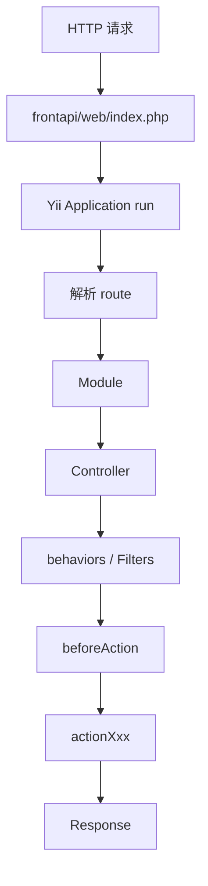

# Week 02 Day 06：鉴权白名单与路径图

> 所属周：Week 02：Yii2 生命周期与 Filter  
> 阶段：第一阶段：PHP + Yii2/TP 基础  
> 主仓库/项目：`mall-gateway`  
> 类型：项目实战  
> 建议时长：约 3h  
> 学习方法：PHP 后端主线 + JS/Node.js 类比 + AI Review

---

## 今日目标

整理至少 5 个免登录接口及其免登录原因，画出一个请求从 `index.php` 到 `action` 的完整路径图，并在路径图中标出 Module、Controller、Filter、beforeAction、action 的位置。

今天你要真正掌握这一句话：

> 鉴权白名单不是“跳过安全”，而是“某些公开接口不走用户登录态校验，但仍然需要其他保护”；读懂白名单和请求路径图，是理解 Yii2 网关鉴权链路的关键。

---

## 0. 今日学习路线

建议按下面顺序学习：

1. 复习 Yii2 启动流程：`index.php → Application → route`
2. 复习 Module / Controller / action 映射
3. 复习 behaviors / Filter / beforeAction
4. 理解什么是鉴权基类
5. 理解什么是登录态 / token 校验
6. 理解什么是免登录白名单
7. 阅读 `AuthApiController.php`
8. 找出白名单相关变量或方法
9. 整理至少 5 个免登录接口及原因
10. 画一条完整请求路径图
11. 标出每个 Filter 执行位置
12. 用 AI Review 检查白名单是否安全

---

## 1. 学习内容

### 1.1 什么是鉴权？

鉴权就是判断当前请求有没有权限访问某个接口。

常见问题：

```text
你是谁？
你登录了吗？
你的 token 有效吗？
你的账号状态正常吗？
你能访问这个接口吗？
```

在 API 网关里，鉴权通常发生在真正业务 action 之前。

例如：

```text
请求 /order/order/detail
  ↓
校验 token
  ↓
校验用户状态
  ↓
通过后进入 actionDetail()
```

---

### 1.2 什么是鉴权基类？

企业项目里经常会有类似：

```text
AuthApiController.php
BaseApiController.php
BaseController.php
```

这些类通常是业务 Controller 的父类。

例如：

```php
class PayController extends AuthApiController
{
}

class OrderController extends AuthApiController
{
}
```

这样 PayController、OrderController 都能复用 AuthApiController 里的鉴权逻辑。

你可以理解为：

> AuthApiController 是所有需要鉴权的 API Controller 的公共父类。

---

### 1.3 鉴权基类通常做什么？

常见职责：

| 职责 | 说明 |
|---|---|
| 声明 behaviors | 挂载日志、token、用户状态等 Filter |
| 处理 token | 从 header 或参数中读取 token |
| 注入用户信息 | 把用户 ID、用户对象放到上下文 |
| 白名单判断 | 判断某些接口是否免登录 |
| 公共参数处理 | 处理语言、站点、渠道等公共参数 |
| 统一错误返回 | 鉴权失败时返回统一 JSON |

---

### 1.4 什么是登录态 / token？

前后端分离项目里，用户登录后通常会拿到一个 token。

前端请求接口时带上 token：

```http
Authorization: Bearer xxxxxx
```

或者项目可能用：

```text
access_token
user_token
token
```

后端拿到 token 后会：

1. 判断 token 是否存在
2. 判断 token 是否有效
3. 找到对应用户
4. 判断用户状态
5. 把用户信息放到请求上下文

---

### 1.5 什么是免登录白名单？

有些接口不能要求登录。

例如：

| 接口类型 | 为什么不能要求登录 |
|---|---|
| 登录接口 | 用户还没登录，不可能有 token |
| 注册接口 | 新用户还没账号 |
| 验证码接口 | 登录前需要验证码 |
| 首页公开配置 | 未登录用户也要看首页 |
| 支付 webhook | 第三方平台回调，不是用户登录请求 |

这些接口会放入「免登录白名单」。

小白理解：

> 白名单里的接口不做用户登录态校验，但不代表完全不做安全校验。

---

### 1.6 白名单不是没有安全

免登录只表示：

```text
不要求用户 token
```

但可能仍然需要：

- 验签
- 限流
- 验证码
- IP 白名单
- 只返回公开字段
- 不允许修改敏感数据

例如支付 webhook：

```text
不走用户登录态
但必须校验 Stripe/PayPal 签名
```

否则别人可以伪造支付成功回调。

---

### 1.7 请求从 index 到 action 的完整路径

你本周已经学过几个点，现在要串起来：

```text
HTTP 请求
  ↓
frontapi/web/index.php
  ↓
Yii Application::run()
  ↓
解析 route
  ↓
找到 Module
  ↓
找到 Controller
  ↓
加载 behaviors / Filters
  ↓
执行 Filter beforeAction
  ↓
执行 Controller beforeAction
  ↓
执行 actionXxx()
  ↓
返回 Response
```

今天你要能把这张图画出来。

---

### 1.8 加上鉴权链路

如果接口需要登录：

```text
请求 /order/order/detail
  ↓
index.php
  ↓
Yii Application
  ↓
Order Module
  ↓
OrderController extends AuthApiController
  ↓
Log Filter
  ↓
Token Filter：校验 token
  ↓
UserStatus Filter：检查用户状态
  ↓
actionDetail()
```

如果接口免登录：

```text
请求 /site/config
  ↓
index.php
  ↓
Yii Application
  ↓
Site Module
  ↓
ConfigController extends AuthApiController
  ↓
Log Filter
  ↓
Token Filter：发现该接口在白名单，跳过登录校验
  ↓
actionXxx()
```

---

## 2. 源码阅读

- `mall-gateway/frontapi/modules/AuthApiController.php`

> 说明：路径均为公开代号 + 相对路径。学习时按你的本地仓库映射查找对应文件。

---

### 2.1 阅读目标

打开 `AuthApiController.php` 后，重点找：

1. class 继承关系
2. `behaviors()`
3. `beforeAction()`
4. token 相关代码
5. 用户信息注入代码
6. 白名单变量或方法
7. 鉴权失败时的返回格式

---

### 2.2 找白名单

搜索这些关键词：

```text
white
free
login
auth
list
public
```

项目里可能叫：

```php
freeLoginAuthApiList
whiteList
noLoginList
allowGuestActions
```

以真实代码为准。

---

### 2.3 白名单记录表

整理至少 5 个：

| 序号 | 接口 / route | 是否免登录 | 免登录原因 | 额外保护建议 |
|---|---|---|---|---|
| 1 |  | 是 |  |  |
| 2 |  | 是 |  |  |
| 3 |  | 是 |  |  |
| 4 |  | 是 |  |  |
| 5 |  | 是 |  |  |

额外保护建议示例：

| 接口类型 | 保护建议 |
|---|---|
| 登录 | 限流、验证码 |
| 注册 | 验证码、风控 |
| 配置 | 只返回公开配置 |
| Webhook | 验签、幂等 |
| 商品公开接口 | 不返回成本价/内部字段 |

---

### 2.4 Filter 记录表

整理：

| 顺序 | Filter | 作用 | 是否可能中断 |
|---|---|---|---|
| 1 |  | 日志？ |  |
| 2 |  | token？ |  |
| 3 |  | 用户状态？ |  |

---

## 3. 练习任务

### 练习 1：列 5 个免登录接口及原因

使用模板：

```markdown
# 鉴权白名单整理

| 接口 | 免登录原因 | 风险点 | 保护措施 |
|---|---|---|---|
| `user/login` | 登录入口 | 暴力尝试 | 限流/验证码 |
| `user/register` | 注册入口 | 批量注册 | 验证码/风控 |
| `site/config` | 首页公开配置 | 泄露敏感配置 | 只返回公开字段 |
| `pay/webhook` | 第三方回调 | 伪造回调 | 验签/幂等 |
| `goods/detail` | 商品公开内容 | 泄露内部字段 | 字段过滤 |
```

注意：上面是示例。你的文档要以真实项目白名单为准。

---

### 练习 2：画 index → action 路径图

画图：

```text
HTTP 请求
  ↓
frontapi/web/index.php
  ↓
Yii Application::run()
  ↓
route = module/controller/action
  ↓
Module
  ↓
Controller
  ↓
behaviors / Filters
  ↓
beforeAction
  ↓
actionXxx()
  ↓
Response
```

Mermaid：



---

### 练习 3：标出 Filter 位置

在图中加上具体 Filter：

```text
Controller
  ↓
LogStrFilter
  ↓
TokenFilter / AuthFilter
  ↓
UserStatusFilter
  ↓
Controller beforeAction
  ↓
actionXxx()
```

如果真实项目 Filter 名称不同，以真实名称为准。

---

### 练习 4：写一个白名单判断伪代码

```php
<?php

declare(strict_types=1);

function isFreeLoginRoute(string $route): bool
{
    $whiteList = [
        'user/login',
        'user/register',
        'site/config',
    ];

    return in_array($route, $whiteList, true);
}

$route = 'user/login';

if (isFreeLoginRoute($route)) {
    echo "skip token check" . PHP_EOL;
} else {
    echo "need token check" . PHP_EOL;
}
```

重点理解：

> 白名单判断要用严格匹配，避免误匹配。

---

### 练习 5：写 public routes 类比

Express：

```js
const publicRoutes = ['/login', '/register', '/site/config'];

function auth(req, res, next) {
  if (publicRoutes.includes(req.path)) {
    next();
    return;
  }

  if (!req.headers.authorization) {
    res.status(401).json({ message: 'Unauthorized' });
    return;
  }

  next();
}
```

对照 Yii2：

```text
freeLoginAuthApiList ≈ publicRoutes
TokenFilter ≈ auth middleware
return true ≈ next()
return false ≈ res.status(...).json(...); return
```

---

## 4. JS/Node.js 类比

| Yii2 网关概念 | Node/Express 类比 | 差异 |
|---|---|---|
| 鉴权基类 | BaseController / auth wrapper | Yii2 常通过继承实现 |
| 白名单 | public routes | 命名和匹配方式因项目而异 |
| TokenFilter | auth middleware | Yii2 返回 false 中断 |
| UserStatusFilter | user status middleware | 检查禁用/冻结等状态 |
| `Yii::$app->request` | `req` | Yii2 通过全局 app 取组件 |
| `Yii::$app->response` | `res` | 响应对象统一管理 |
| route | `req.path` + router match | Yii2 是 module/controller/action |

---

## 5. AI Review 提问

完成白名单文档和路径图后，把内容贴给 AI：

```text
我正在学习 Yii2 网关鉴权白名单和请求路径图。

我阅读了 AuthApiController.php，整理了 5 个免登录接口，并画了 index.php 到 action 的完整路径图。
请你按资深 Yii2 后端工程师和安全工程师标准帮我检查：

1. 我整理的免登录接口原因是否合理？
2. 哪些白名单接口可能存在安全风险？
3. 我的 index.php → Application → Module → Controller → Filter → action 路径图是否准确？
4. Filter 在图中的位置是否正确？
5. 真实项目中白名单还应该如何审查？

请用中文输出：问题清单、风险点、修正建议、下一步练习。
```

---

## 6. 今日产出

- [ ] 白名单接口文档，至少 5 个接口
- [ ] 每个接口的免登录原因
- [ ] 每个接口的风险点
- [ ] 每个接口的保护建议
- [ ] `index.php → action` 完整路径图
- [ ] Filter 执行位置图
- [ ] Yii2 白名单 vs Express public routes 类比表
- [ ] AI Review 记录

---

## 7. 今日完成标准

- [ ] 能解释什么是鉴权
- [ ] 能解释什么是鉴权基类
- [ ] 能解释什么是免登录白名单
- [ ] 能说明白名单不是完全无安全校验
- [ ] 能整理至少 5 个白名单接口及原因
- [ ] 能画出 `index.php → action` 路径图
- [ ] 能在路径图中标出 Filter
- [ ] 能用 Express public routes 类比 Yii2 白名单
- [ ] 能说出白名单接口的常见风险

---

## 8. 今日自测题

### 8.1 什么是鉴权？

参考答案：

> 鉴权是判断当前请求是否有权限访问某个接口，通常包括登录态、token、用户状态、权限等检查。

---

### 8.2 什么是免登录白名单？

参考答案：

> 免登录白名单是一组不要求用户登录态的接口，例如登录、注册、公开配置、第三方回调等。

---

### 8.3 白名单接口是不是完全不需要安全校验？

参考答案：

> 不是。免登录只是不校验用户 token，但可能仍然需要验签、限流、验证码、字段过滤等保护。

---

### 8.4 支付 webhook 为什么通常免登录？

参考答案：

> 因为它来自第三方支付平台，不是用户登录后发起的请求；但必须做签名校验和幂等处理。

---

### 8.5 Yii2 请求从入口到 action 的大概路径是什么？

参考答案：

```text
HTTP 请求 → index.php → Yii Application → Module → Controller → Filter/beforeAction → action → Response
```

---

### 8.6 白名单误配置有什么风险？

参考答案：

> 可能导致未登录用户访问敏感接口，造成数据泄露、越权操作或业务风险。

---

### 8.7 Express 里 public routes 类比 Yii2 什么？

参考答案：

> 类比 Yii2 的免登录白名单，例如 `freeLoginAuthApiList`。

---

## 9. 学习记录

| 记录项 | 内容 |
|--------|------|
| 今日最清楚的概念 |  |
| 今日最卡的概念 |  |
| JS/Node 类比是否帮助理解 |  |
| 实际耗时 |  |
| 明日要补的问题 |  |

---

## 10. AI Review 提示词

```text
我正在进行 Week 02 Day 06：鉴权白名单与路径图 的学习。
请你扮演资深 PHP 后端工程师，帮我检查：
1. 今日理解是否正确
2. JS/Node 类比是否准确
3. 练习任务是否遗漏关键风险
4. 真实企业项目中还需要注意什么

请用中文输出：问题清单、修正建议、下一步练习。
```

---

## 返回本周

- [返回 Week 02 README](./README.md)
