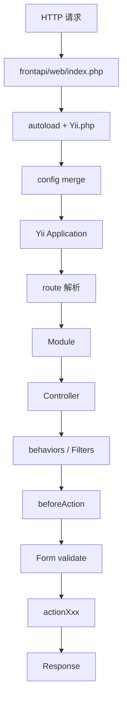

# Week 02 Day 07：验收与预习

> 所属周：Week 02：Yii2 生命周期与 Filter  
> 阶段：第一阶段：PHP + Yii2/TP 基础  
> 主仓库/项目：`mall-gateway`  
> 类型：复盘预习  
> 建议时长：约 3h  
> 学习方法：PHP 后端主线 + JS/Node.js 类比 + AI Review

---

## 今日目标

完成 Week 02 的整体验收、自评和查漏补缺，确认自己能解释 Yii2 从 `index.php` 到 `action` 的请求处理链路，能画出 Filter 链，能理解 Form 校验，并预习 Week 03 的 MySQL、ActiveRecord、Repository。

今天你要真正掌握这一句话：

> Week 02 的核心不是背 Yii2 API，而是建立“请求进入入口 → 匹配模块路由 → 经过 Filter → Form 校验 → 执行 action”的后端请求生命周期心智模型。

---

## 0. 今日学习路线

建议按下面顺序复盘：

1. 回顾 Day 01：Yii2 入口与启动
2. 回顾 Day 02：Module 与路由
3. 回顾 Day 03：behaviors 与 Filter
4. 回顾 Day 04：BaseForm 校验
5. 回顾 Day 05：Laravel Middleware 对比
6. 回顾 Day 06：鉴权白名单与路径图
7. 按 checklist 做 Week 02 验收
8. 画一张完整 Yii2 请求生命周期图
9. 写一页 Week 02 周总结
10. 列出下周学习 MySQL/ActiveRecord/Repository 前的 3 个问题
11. 预习 ActiveRecord 和 Repository 的关系
12. 把总结交给 AI Review

---

## 1. 学习内容

### 1.1 Week 02 你到底学了什么？

Week 02 主题是：

```text
Yii2 生命周期与 Filter
```

也就是要理解一个请求怎么进入 Yii2 项目，怎么被路由到业务 action，以及进入业务前经过哪些前置处理。

完整链路：

```text
HTTP 请求
  ↓
frontapi/web/index.php
  ↓
加载 Composer autoload / Yii.php / config
  ↓
new yii\web\Application($config)
  ↓
Application::run()
  ↓
解析 route
  ↓
Module
  ↓
Controller
  ↓
behaviors / Filter
  ↓
beforeAction
  ↓
Form 校验
  ↓
actionXxx()
  ↓
Response
```

这张图就是 Week 02 的核心成果。

---

### 1.2 Day 01 复盘：Yii2 入口与启动

你应该能解释：

| 概念 | 是否能解释 |
|---|---|
| `web/index.php` 是什么 |  |
| `YII_DEBUG` |  |
| `YII_ENV` |  |
| `vendor/autoload.php` |  |
| `Yii.php` |  |
| config 配置数组 |  |
| config merge |  |
| `new yii\web\Application($config)` |  |
| `$application->run()` |  |

最低要求：

> 你要能说出 `index.php` 加载依赖和配置，创建 Yii Application，然后调用 `run()` 处理请求。

---

### 1.3 Day 02 复盘：Module 与路由

你应该能解释：

| 概念 | 是否能解释 |
|---|---|
| Module 是什么 |  |
| Controller 是什么 |  |
| action 是什么 |  |
| `actionXxx()` 命名约定 |  |
| `module/controller/action` |  |
| `pay/pay/methods` 路由推导 |  |
| URL rules 可能改变默认映射 |  |

最低要求：

> 你要能把 `pay/pay/methods` 推导成：pay Module → PayController → actionMethods()。

---

### 1.4 Day 03 复盘：behaviors 与 Filter

你应该能解释：

| 概念 | 是否能解释 |
|---|---|
| `behaviors()` |  |
| Filter |  |
| `beforeAction()` |  |
| `return true` |  |
| `return false` |  |
| Filter 链 |  |
| Express middleware 类比 |  |

最低要求：

> 你要能画出 Filter 链，并说明某个 Filter 返回 false 会中断 action。

---

### 1.5 Day 04 复盘：BaseForm 校验

你应该能解释：

| 概念 | 是否能解释 |
|---|---|
| 为什么后端必须校验参数 |  |
| Form Model |  |
| BaseForm |  |
| `rules()` |  |
| `validate()` |  |
| `getErrors()` |  |
| `scenarios()` |  |
| Zod/Joi 类比 |  |

最低要求：

> 你要能说出 BaseForm≈后端版 Zod/Joi schema，rules 定义字段校验，scenarios 定义不同接口场景。

---

### 1.6 Day 05 复盘：Laravel Middleware 对比

你应该能解释：

| 概念 | Yii2 | Laravel | Express |
|---|---|---|---|
| 前置处理 | Filter | Middleware | middleware |
| 继续执行 | `return true` | `$next($request)` | `next()` |
| 中断请求 | `return false` | `return response()` | 不调用 `next()` |

最低要求：

> 你要理解：框架不同，模式相同，都是在业务处理前执行公共逻辑。

---

### 1.7 Day 06 复盘：鉴权白名单与路径图

你应该能解释：

| 概念 | 是否能解释 |
|---|---|
| 鉴权 |  |
| token 校验 |  |
| 鉴权基类 |  |
| 免登录白名单 |  |
| 白名单风险 |  |
| `index.php → action` 完整路径 |  |
| Filter 在路径图中的位置 |  |

最低要求：

> 你要能整理至少 5 个免登录接口，写出免登录原因、风险点和保护建议。

---

### 1.8 Week 03 预习：MySQL / ActiveRecord / Repository

Week 03 会进入数据库和 ORM。

你需要先知道三个词：

#### MySQL

关系型数据库，保存业务数据。

例如：

```text
order 表
order_goods 表
user 表
goods 表
```

#### ActiveRecord

Yii2 的 ORM 模式。

你可以先这样理解：

> 一个 Model 类对应一张表，一条对象记录对应表中的一行数据。

例如：

```php
$order = Order::find()->where(['id' => 1])->one();
```

类比 Sequelize：

```js
const order = await Order.findOne({ where: { id: 1 } });
```

#### Repository

Repository 是数据访问封装层。

它负责把复杂查询收口，避免 Service 直接写大量查询逻辑。

```text
Service → Repository → Model/ActiveRecord → DB
```

Week 03 你会重点看：

- `OrderRepository.php`
- `Order.php` Model
- Redis 缓存
- N+1 查询问题

---

## 2. 源码阅读

本日无指定新源码阅读，重点复盘本周内容。

建议回看：

- `mall-gateway/frontapi/web/index.php`
- `mall-gateway/frontapi/config/modules/Modules.php`
- `mall-gateway/frontapi/modules/AuthApiController.php`

预习 Week 03 时可以先浏览：

- `mall-core/common/repositorys/order/OrderRepository.php`
- `mall-core/common/models/order/Order.php`
- `mall-core/common/redis/order/OrderRedis.php`

> 说明：路径均为公开代号 + 相对路径。学习时按你的本地仓库映射查找对应文件。

---

## 3. 练习任务

### 练习 1：完成 Yii2 生命周期验收

勾选：

- [ ] 我能解释 `web/index.php` 的作用
- [ ] 我能解释 Yii Application 的创建
- [ ] 我能解释配置合并
- [ ] 我能解释 Module / Controller / action
- [ ] 我能解释 behaviors / Filter
- [ ] 我能解释 BaseForm 校验
- [ ] 我能解释鉴权白名单

---

### 练习 2：画完整请求生命周期图

画出：

```text
HTTP 请求
  ↓
frontapi/web/index.php
  ↓
Composer autoload + Yii.php
  ↓
config merge
  ↓
Yii Application
  ↓
route 解析
  ↓
Module
  ↓
Controller
  ↓
behaviors / Filters
  ↓
beforeAction
  ↓
Form validate
  ↓
actionXxx
  ↓
Response
```

Mermaid：



---

### 练习 3：写 `pay/pay/methods` 完整路径说明

用自己的话写：

```text
请求 pay/pay/methods：
1. 进入 frontapi/web/index.php
2. Yii Application 启动并解析 route
3. 第一个 pay 匹配 pay Module
4. 第二个 pay 匹配 PayController
5. methods 匹配 actionMethods()
6. action 前执行 behaviors / Filters
7. 如果鉴权通过，执行 actionMethods()
8. 返回 Response
```

---

### 练习 4：整理 Week 02 周总结

模板：

```markdown
# Week 02 周总结：Yii2 生命周期与 Filter

## 本周我学会了什么

1. 
2. 
3. 

## 我能画出的请求链路


## Yii2 Filter 和 Express middleware 的共同点


## Yii2 Filter 和 Laravel Middleware 的差异


## 我整理的免登录接口


## 我最不清楚的概念


## 下周学习数据库前的问题

1. 
2. 
3. 
```

---

### 练习 5：列 OrderRepository 学习计划

为 Week 03 做准备：

| 计划项 | 我要关注什么 |
|---|---|
| `OrderRepository.php` | 方法命名、查询条件、返回结构 |
| `Order.php` | 表字段、ActiveRecord 关系 |
| SQL JOIN | 订单和订单商品如何关联 |
| Redis | 哪些订单数据会缓存 |
| N+1 | 查询性能问题 |

---

## 4. JS/Node.js 类比

| Yii2 生命周期概念 | Node/JS 类比 | 差异 |
|---|---|---|
| `index.php` | `server.js` / `main.ts` | PHP Web 通常由 Web Server/PHP-FPM 触发 |
| Application | Express app / Nest app | Yii2 更配置驱动 |
| Module | Express Router / Nest Module | Yii2 是框架级模块 |
| Controller | Controller / route handler | Yii2 action 命名固定 |
| Filter | middleware / guard | 返回 false 可中断 |
| BaseForm | Zod/Joi schema | PHP class + rules 数组 |
| 白名单 | public routes | 仍需安全保护 |
| Repository | DAO / Prisma repository | Week 03 重点学习 |
| ActiveRecord | Sequelize Model | Yii2 ORM 模式 |

---

## 5. AI Review 提问

完成 Week 02 总结后，把总结、路径图、白名单文档贴给 AI：

```text
我完成了 Week 02：Yii2 生命周期与 Filter 的学习。

我本周学习了：
- Yii2 index.php 入口与启动
- Module / Controller / action 路由
- behaviors / Filter / beforeAction
- BaseForm rules / scenarios
- Laravel Middleware 对比
- 鉴权白名单与完整路径图

请你按资深 Yii2 后端工程师标准帮我做 Week 02 验收：

1. 我的 Yii2 请求生命周期图是否准确？
2. 我对 Module / Controller / action 的理解是否正确？
3. 我对 Filter 和 middleware 的类比是否准确？
4. 我对白名单风险的理解是否足够？
5. 进入 Week 03 学 MySQL / ActiveRecord / Repository 前，我还需要补什么？

请用中文输出：验收结果、问题清单、补课建议、Week 03 学习提醒。
```

---

## 6. 今日产出

- [ ] Week 02 周总结
- [ ] Yii2 完整请求生命周期图
- [ ] `pay/pay/methods` 完整路径说明
- [ ] Filter 链复盘
- [ ] BaseForm 校验复盘
- [ ] 白名单风险复盘
- [ ] OrderRepository 学习计划
- [ ] AI Review 验收记录

---

## 7. 今日完成标准

- [ ] 完成 Week 02 全部笔记回顾
- [ ] 能画出 Yii2 完整请求生命周期图
- [ ] 能解释 Module / Controller / action
- [ ] 能解释 behaviors / Filter / beforeAction
- [ ] 能解释 BaseForm rules / scenarios
- [ ] 能整理白名单风险
- [ ] 能用 Node/Express/Laravel 类比 Yii2 Filter
- [ ] 写出 Week 02 周总结
- [ ] 明确 Week 03 的数据库学习重点

---

## 8. 今日自测题

### 8.1 Week 02 最核心的学习目标是什么？

参考答案：

> 建立 Yii2 请求生命周期心智模型，理解请求如何从 `index.php` 到 Module、Controller、Filter、Form、action。

---

### 8.2 `pay/pay/methods` 通常如何映射？

参考答案：

> pay Module → PayController → actionMethods()。

---

### 8.3 Filter 在 action 前还是后执行？

参考答案：

> 常见前置 Filter 会在 action 前执行，`beforeAction()` 可以决定是否继续执行 action。

---

### 8.4 BaseForm 的作用是什么？

参考答案：

> BaseForm 用于统一请求参数加载、校验和错误返回，是后端参数校验层。

---

### 8.5 Yii2 Filter 和 Express middleware 的共同点是什么？

参考答案：

> 都是在业务处理函数前执行公共逻辑，并可决定是否继续执行。

---

### 8.6 免登录白名单为什么需要安全审查？

参考答案：

> 因为白名单会绕过用户登录态校验，误配置可能导致未授权访问敏感接口。

---

### 8.7 Week 03 将重点学习什么？

参考答案：

> MySQL、ActiveRecord、Repository 模式、Redis 缓存和 N+1 查询问题。

---

## 9. 学习记录

| 记录项 | 内容 |
|--------|------|
| 本周最清楚的概念 |  |
| 本周最卡的概念 |  |
| JS/Node 类比是否帮助理解 |  |
| 路径图是否能独立画出 |  |
| 实际耗时 |  |
| 下周要补的问题 |  |
| 自评分（1-5） |  |

---

## 10. AI Review 提示词

```text
我正在进行 Week 02 Day 07：验收与预习 的学习。
请你扮演资深 PHP 后端工程师，帮我检查：
1. 今日理解是否正确
2. JS/Node 类比是否准确
3. 练习任务是否遗漏关键风险
4. 真实企业项目中还需要注意什么

请用中文输出：问题清单、修正建议、下一步练习。
```

---

## 返回本周

- [返回 Week 02 README](./README.md)
