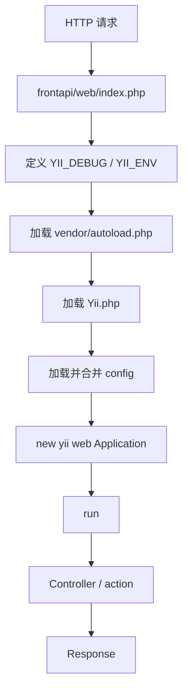

# Yii2 入口脚本与启动流程详解

> 配套：`week02/day01.md` 的入口与启动部分
> 目标：彻底看懂 `web/index.php` 这几行代码，理解 Yii2 应用是怎么被创建和启动的

---

## 1. 一句话理解

Yii2 的 `web/index.php` 是所有 Web 请求的**入口脚本**。它做五件事：

1. 定义调试和环境常量
2. 加载 Composer 自动加载器
3. 加载 Yii2 框架核心
4. 加载并合并配置
5. 创建应用并调用 `run()` 开始处理请求

前端类比：

```text
web/index.php  ≈  server.js / main.ts（应用启动入口）
```

关键差异：Node 的 `server.js` 启动后**长驻内存**监听端口；传统 PHP-FPM 下，**每个请求**都会重新进入一次 `index.php`。

---

## 2. 完整入口代码

一个简化版 Yii2 `web/index.php`：

```php
<?php

defined('YII_DEBUG') or define('YII_DEBUG', true);
defined('YII_ENV') or define('YII_ENV', 'dev');

require __DIR__ . '/../vendor/autoload.php';
require __DIR__ . '/../vendor/yiisoft/yii2/Yii.php';

$config = require __DIR__ . '/../config/web.php';

(new yii\web\Application($config))->run();
```

下面逐行拆解。

---

## 3. `defined(...) or define(...)` 惯用法

```php
defined('YII_DEBUG') or define('YII_DEBUG', true);
```

这是 PHP 常见写法，等价于：

```php
if (!defined('YII_DEBUG')) {
    define('YII_DEBUG', true);
}
```

原理是 `or` 的**短路求值**：

- 如果 `defined('YII_DEBUG')` 返回 `true`（外部已经定义过），`or` 右边不再执行
- 否则才执行 `define('YII_DEBUG', true)`

目的是**允许外部覆盖**。生产环境的入口可以在这行之前先定义：

```php
define('YII_DEBUG', false);  // 先定义
defined('YII_DEBUG') or define('YII_DEBUG', true);  // 这里就不会改回 true
```

> `define()` 定义的是**常量**（不带 `$`），一旦定义不可修改，也不受作用域限制，全局可用。这和普通 `$变量` 不同。

---

## 4. `YII_DEBUG` 与 `YII_ENV`

### 4.1 `YII_DEBUG`

控制是否开启调试模式：

```php
defined('YII_DEBUG') or define('YII_DEBUG', true);   // 开发
defined('YII_DEBUG') or define('YII_DEBUG', false);  // 生产
```

生产环境**不应开 debug**，因为它可能暴露：

- 文件绝对路径
- SQL 语句
- 配置细节
- 完整调用栈
- 业务内部信息

### 4.2 `YII_ENV`

表示运行环境，常见值 `dev` / `prod` / `test`：

```php
defined('YII_ENV') or define('YII_ENV', 'dev');
```

Yii2 还会自动派生几个布尔常量，方便判断：

```php
YII_ENV_DEV   // 当 YII_ENV === 'dev'
YII_ENV_PROD  // 当 YII_ENV === 'prod'
YII_ENV_TEST  // 当 YII_ENV === 'test'
```

前端类比：

| Yii2 | Node.js |
|---|---|
| `YII_ENV` | `process.env.NODE_ENV` |
| `dev` | `development` |
| `prod` | `production` |

---

## 5. 两个 `require`：autoload 与 Yii.php 的分工

```php
require __DIR__ . '/../vendor/autoload.php';         // Composer 自动加载器
require __DIR__ . '/../vendor/yiisoft/yii2/Yii.php'; // Yii 框架核心
```

这两个容易混，区别如下：

| 文件 | 谁生成 | 作用 |
|---|---|---|
| `vendor/autoload.php` | Composer（`composer install` 时生成） | 让 PHP 能按 PSR-4 自动找到**任何类**的文件（包括 Yii 的类、第三方包、你自己的类） |
| `Yii.php` | Yii 框架自带 | 定义全局 `Yii` 助手类、注册类别名、设置错误处理等，相当于框架"开机" |

**顺序不能反**：必须先加载 autoload（才有能力自动加载类），再加载 `Yii.php`（它内部要用到被自动加载的类）。

> `__DIR__` 是 PHP 魔术常量，表示"当前文件所在目录的绝对路径"。用它拼路径比写死路径更稳，无论从哪里执行脚本都能定位正确。

前端类比：

```text
vendor/autoload.php  ≈  Node 的模块解析机制（node_modules 查找）
Yii.php              ≈  import express（加载框架本体）
```

---

## 6. `$config = require ...`：require 还能返回值？

```php
$config = require __DIR__ . '/../config/web.php';
```

很多人第一次看会疑惑：`require` 不是"引入文件"吗，怎么能赋值给变量？

关键在于被引入的配置文件**最后有一句 `return`**：

```php
// config/web.php
<?php

return [
    'id' => 'app-frontapi',
    'basePath' => dirname(__DIR__),
    'components' => [
        'request' => [
            'cookieValidationKey' => 'xxx',
        ],
        'db' => [
            'class' => yii\db\Connection::class,
            'dsn' => 'mysql:host=localhost;dbname=test',
        ],
    ],
];
```

当一个文件用 `return` 返回值时，**`require` 表达式的结果就是那个返回值**。所以 `$config` 拿到的是这个配置数组。

这也是为什么 Yii2 的配置文件都是 `return [...]` 结构 —— 它们本质上是"返回数组的 PHP 脚本"。

---

## 7. 配置合并（真实项目常见）

真实企业项目配置通常拆成多个文件，用 `ArrayHelper::merge` 合并：

```php
$config = yii\helpers\ArrayHelper::merge(
    require __DIR__ . '/../../common/config/main.php',       // 公共配置
    require __DIR__ . '/../../common/config/main-local.php', // 公共本地配置（不提交 git）
    require __DIR__ . '/../config/main.php',                 // 应用配置
    require __DIR__ . '/../config/main-local.php'            // 应用本地配置（不提交 git）
);
```

规则：**后面的配置会覆盖前面的同名项**。

为什么要拆分：

- 公共配置给多个应用（frontapi / backapi / console）共享
- `*-local.php` 存放敏感信息（数据库密码、密钥），不提交仓库
- dev / test / prod 环境配置不同

前端类比：

```php
$config = ArrayHelper::merge($base, $local, $app);
```

```js
const config = { ...baseConfig, ...localConfig, ...appConfig };
```

> 注意：`ArrayHelper::merge` 是**深度递归合并**，比 JS 的浅层 object spread 更彻底，嵌套数组也会被合并而不是整个替换。

---

## 8. `new yii\web\Application($config)`：用配置造应用

```php
new yii\web\Application($config)
```

- `yii\web\Application` 是带 **namespace** 的完整类名
- `new` 出实例时，构造函数读取 `$config`，据此完成"装配"：

  - 设置应用 `id` 和 `basePath`
  - 注册 components（`request` / `response` / `db` / `log` / `urlManager` 等）
  - 注册 modules
  - 准备 errorHandler 等核心组件

造完之后应用已经"装配好"，但**还没开始处理请求**。

之后可以通过全局 `Yii::$app` 访问这些组件：

```php
Yii::$app->request   // 请求对象
Yii::$app->response  // 响应对象
Yii::$app->db        // 数据库连接
```

---

## 9. `->run()`：真正开始处理请求

```php
(new yii\web\Application($config))->run();
```

外层括号 `(new ...)` 是为了在实例上直接链式调用 `->run()`，等价于：

```php
$application = new yii\web\Application($config);
$application->run();
```

`run()` 之后进入完整请求处理流程：

```text
接收 Request
  ↓
解析 URL
  ↓
找到 route（module / controller / action）
  ↓
创建 Controller
  ↓
执行 action
  ↓
生成 Response
  ↓
发送给客户端
```

---

## 10. 启动流程总图

```text
HTTP 请求
  ↓
Nginx / Apache 转发
  ↓
frontapi/web/index.php
  ↓
定义 YII_DEBUG / YII_ENV
  ↓
require vendor/autoload.php
  ↓
require Yii.php
  ↓
加载并合并 config
  ↓
new yii\web\Application($config)
  ↓
$application->run()
  ↓
路由到 Controller / action
  ↓
返回 Response
```

Mermaid 版：



---

## 11. 和原生 PHP 手写入口的对照

你在 Week 01 手写的 `todo-api/public/index.php` 其实就是一个"迷你 Application"：

```php
// 原生手写：自己解析路由、自己输出响应
$path = parse_url($_SERVER['REQUEST_URI'], PHP_URL_PATH);
$method = $_SERVER['REQUEST_METHOD'];

if ($method === 'GET' && $path === '/todos') {
    // 手动分发到"控制器"
}
```

```php
// Yii2：把上面一整套自动化了
(new yii\web\Application($config))->run();
```

对照表：

| 你手写的原生代码 | Yii2 对应 |
|---|---|
| `$_SERVER['REQUEST_URI']` + `parse_url` | `Yii::$app->request` + `urlManager` 路由 |
| `if ($method === ... && $path === ...)` | Controller / action 自动分发 |
| `Response::success()` / `Response::error()` | `Yii::$app->response` |
| 手动 `require` 各个类 | Composer autoload |
| 一个大 `index.php` 塞所有逻辑 | 配置驱动 + 分层 |

之前手写路由和响应，就是为了理解 `run()` 内部到底替你做了什么。

---

## 12. 小结 / 检查清单

- [ ] `web/index.php` 是 Yii2 Web 请求入口
- [ ] `defined() or define()` 是允许外部覆盖的常量定义惯用法
- [ ] `YII_DEBUG` 生产环境要关，`YII_ENV` 区分运行环境
- [ ] `vendor/autoload.php`（Composer 生成，负责自动加载类）和 `Yii.php`（框架核心）分工不同，顺序不能反
- [ ] 配置文件以 `return [...]` 结尾，所以 `require` 能拿到数组
- [ ] `ArrayHelper::merge` 深度合并多个配置，后覆盖前，`*-local.php` 不提交仓库
- [ ] `new yii\web\Application($config)` 装配应用，`run()` 才开始处理请求
- [ ] 传统 PHP-FPM 下每个请求都重新走一遍入口，不同于 Node 长驻监听

---

## 返回

- [返回 Week 02 Day 01](./day01.md)
