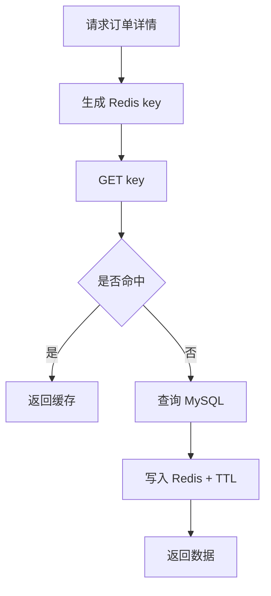

# Week 03 Day 04：Redis 缓存

> 所属周：Week 03：MySQL + Redis + ORM  
> 阶段：第一阶段：PHP + Yii2/TP 基础  
> 主仓库/项目：`mall-core`  
> 类型：架构理解  
> 建议时长：约 3h  
> 学习方法：PHP 后端主线 + JS/Node.js 类比 + AI Review

---

## 今日目标

理解 Redis 的基本用途、五大数据类型、缓存读写流程，以及企业项目中为什么会单独封装 `OrderRedis.php` 这类缓存类。

今天你要真正掌握这一句话：

> Redis 是内存型键值数据库，常用于缓存热点数据、减少 MySQL 压力；项目中把 Redis 操作封装成 `OrderRedis`，是为了统一 key 命名、过期时间和读写逻辑。

---

## 0. 今日学习路线

建议按下面顺序学习：

1. 先理解 Redis 是什么
2. 理解缓存解决什么问题
3. 学习 Redis 五大数据类型
4. 学习 `get` / `set` / `expire`
5. 理解缓存命中与缓存未命中
6. 理解缓存过期时间 TTL
7. 理解缓存一致性问题
8. 阅读 `OrderRedis.php`
9. 画订单缓存读写流程图
10. 用 ioredis 做类比
11. 完成今日自测和 AI Review

---

## 1. 学习内容

### 1.1 Redis 是什么？

Redis 是一个内存型 key-value 数据库。

你可以先理解为：

```text
Redis ≈ 一个速度很快的 Map
```

JS 类比：

```js
const cache = new Map();
cache.set('order:1', { id: 1, order_no: 'O001' });
cache.get('order:1');
```

Redis 和普通 Map 的区别：

| 对比项 | JS Map | Redis |
|---|---|---|
| 存储位置 | 当前进程内存 | 独立服务内存 |
| 多进程共享 | 不共享 | 可共享 |
| 过期时间 | 需要自己实现 | 原生支持 TTL |
| 数据结构 | Map | string/hash/list/set/zset |
| 持久化 | 无 | 可配置持久化 |

---

### 1.2 为什么需要缓存？

如果每次请求都查 MySQL，压力会很大。

例如订单详情：

```text
用户频繁刷新订单详情
  ↓
每次都查 MySQL
  ↓
DB 压力增加
```

加入 Redis 缓存：

```text
先查 Redis
  ↓ 命中
直接返回
  ↓ 未命中
查 MySQL → 写 Redis → 返回
```

缓存的主要作用：

- 减少 DB 查询
- 提升响应速度
- 缓存热点数据
- 保存临时状态
- 做分布式锁/计数器等

---

### 1.3 Redis 五大数据类型

| 类型 | 含义 | 常见用途 |
|---|---|---|
| string | 字符串/数字/JSON 字符串 | 缓存单个值、token、计数 |
| hash | 对象字段集合 | 用户信息、订单摘要 |
| list | 有序列表 | 消息队列、时间线 |
| set | 无序去重集合 | 标签、去重集合 |
| zset | 有序集合 | 排行榜、按分数排序 |

今天重点掌握 string 和 hash 即可。

---

### 1.4 get / set / expire

Redis 常见命令：

```bash
SET order:1 '{"id":1,"order_no":"O001"}'
GET order:1
EXPIRE order:1 300
TTL order:1
DEL order:1
```

含义：

| 命令 | 含义 |
|---|---|
| `SET key value` | 写缓存 |
| `GET key` | 读缓存 |
| `EXPIRE key seconds` | 设置过期时间 |
| `TTL key` | 查看剩余过期时间 |
| `DEL key` | 删除缓存 |

---

### 1.5 缓存命中与未命中

缓存命中：

```text
Redis 中有数据 → 直接返回
```

缓存未命中：

```text
Redis 中没有数据 → 查 MySQL → 写 Redis → 返回
```

伪代码：

```php
$cache = $redis->get($key);

if ($cache !== null) {
    return json_decode($cache, true);
}

$data = $repository->findById($id);
$redis->set($key, json_encode($data));
$redis->expire($key, 300);

return $data;
```

---

### 1.6 缓存 key 如何设计？

好的 key 要有可读性和唯一性。

示例：

```text
order:detail:1
order:no:O001
user:profile:100
cart:user:100
```

建议：

```text
业务域:对象:标识
```

不要写太随意：

```text
abc
order
user
```

否则容易冲突，也难排查。

---

### 1.7 过期时间 TTL

缓存一般要设置过期时间。

例如：

```text
订单详情缓存 5 分钟
商品详情缓存 10 分钟
验证码缓存 5 分钟
token 缓存 7 天
```

为什么要过期？

- 避免旧数据一直存在
- 避免 Redis 内存无限增长
- 降低缓存一致性问题

---

### 1.8 缓存一致性问题

缓存的难点是：MySQL 变了，Redis 里的旧数据怎么办？

常见策略：

1. 更新 DB 后删除缓存
2. 设置较短过期时间
3. 更新 DB 后同步更新缓存
4. 对强一致场景不使用缓存

常见做法：

```text
更新订单
  ↓
更新 MySQL
  ↓
删除 order:detail:{id} 缓存
  ↓
下次查询重新加载
```

---

## 2. 源码阅读

- `mall-core/common/redis/order/OrderRedis.php`

> 说明：路径均为公开代号 + 相对路径。学习时按你的本地仓库映射查找对应文件。

---

### 2.1 阅读目标

打开 `OrderRedis.php` 后重点找：

1. class 名和 namespace
2. key 是如何命名的
3. 是否有 key 前缀常量
4. 是否有 get 方法
5. 是否有 set 方法
6. 是否有 expire / ttl
7. 是否有 delete 方法
8. 缓存的数据结构是什么

---

### 2.2 阅读记录表

| 观察点 | 记录 |
|---|---|
| 文件路径 | `mall-core/common/redis/order/OrderRedis.php` |
| class 名 |  |
| key 前缀 |  |
| get 方法 |  |
| set 方法 |  |
| delete 方法 |  |
| 过期时间 |  |
| 缓存数据 |  |

---

## 3. 练习任务

### 练习 1：写缓存读写流程

```text
查询订单详情
  ↓
根据 orderId 生成 key：order:detail:{id}
  ↓
Redis GET key
  ↓
命中：返回缓存
  ↓
未命中：查 MySQL
  ↓
写 Redis，设置 TTL
  ↓
返回数据
```

---

### 练习 2：写 PHP 伪代码

```php
function getOrderDetail(int $id): array
{
    $key = 'order:detail:' . $id;
    $cache = $redis->get($key);

    if ($cache !== false) {
        return json_decode($cache, true);
    }

    $order = $orderRepository->findById($id);
    $redis->set($key, json_encode($order));
    $redis->expire($key, 300);

    return $order;
}
```

---

### 练习 3：列缓存场景

| 场景 | 是否适合缓存 | 原因 | TTL 建议 |
|---|---|---|---|
| 商品详情 | 适合 | 读多写少 | 5-30 分钟 |
| 用户 token | 适合 | 登录态校验频繁 | 按登录有效期 |
| 验证码 | 适合 | 临时数据 | 5 分钟 |
| 订单详情 | 谨慎 | 状态会变化 | 短 TTL / 更新后删 |
| 库存 | 谨慎 | 强一致要求高 | 看业务设计 |

---

### 练习 4：画缓存流程图



---

## 4. JS/Node.js 类比

| PHP/Redis | Node 类比 | 说明 |
|---|---|---|
| Redis | Redis 服务 | 两边一样 |
| PHP Redis 封装类 | ioredis helper class | 封装 key 和 TTL |
| `get()` | `redis.get()` | 读缓存 |
| `set()` | `redis.set()` | 写缓存 |
| `expire()` | `redis.expire()` / `EX` | 设置过期 |
| `OrderRedis` | `orderCache.ts` | 订单缓存封装 |
| 缓存未命中查 DB | cache-aside pattern | 常见缓存模式 |

---

## 5. AI Review 提问

```text
我正在学习 Redis 缓存和 OrderRedis 封装。

我阅读了 OrderRedis.php，整理了 key 设计、get/set/delete 方法和缓存流程图。
请你按资深 PHP 后端和 Redis 工程师标准帮我检查：

1. 我对 Redis 缓存的理解是否正确？
2. 我的 key 命名是否合理？
3. 我画的缓存命中/未命中流程是否准确？
4. 哪些订单数据适合缓存，哪些不适合？
5. 缓存一致性还需要注意什么？

请用中文输出：问题清单、修正建议、下一步练习。
```

---

## 6. 今日产出

- [ ] Redis 五大数据类型笔记
- [ ] `OrderRedis.php` 阅读笔记
- [ ] Redis key 设计表
- [ ] 缓存读写流程图
- [ ] 订单缓存场景表
- [ ] PHP Redis 伪代码
- [ ] AI Review 记录

---

## 7. 今日完成标准

- [ ] 能解释 Redis 是什么
- [ ] 能说出 Redis 五大数据类型
- [ ] 能解释 `get` / `set` / `expire`
- [ ] 能解释缓存命中和未命中
- [ ] 能设计一个订单缓存 key
- [ ] 能说明为什么要设置 TTL
- [ ] 能说出缓存一致性问题
- [ ] 能读懂 `OrderRedis.php` 的大概职责
- [ ] 能用 ioredis 类比 PHP Redis 封装

---

## 8. 今日自测题

### 8.1 Redis 是什么？

参考答案：Redis 是内存型 key-value 数据库，常用于缓存、计数、分布式锁、临时数据等场景。

### 8.2 Redis string 适合存什么？

参考答案：适合存 token、验证码、JSON 字符串、计数值等单个值。

### 8.3 缓存命中是什么意思？

参考答案：Redis 中能直接读到所需数据，不需要再查 MySQL。

### 8.4 缓存未命中通常怎么处理？

参考答案：查 MySQL，拿到数据后写入 Redis，并设置过期时间。

### 8.5 为什么缓存要设置过期时间？

参考答案：避免旧数据长期存在，控制内存增长，并降低一致性问题。

### 8.6 更新订单后为什么常删除缓存？

参考答案：避免 Redis 继续返回旧订单数据，让下次查询重新从 DB 加载。

### 8.7 `OrderRedis` 这类封装有什么意义？

参考答案：统一 key 命名、TTL、序列化、读写删除逻辑，避免 Redis 操作散落在业务代码中。

---

## 9. 学习记录

| 记录项 | 内容 |
|--------|------|
| 今日最清楚的概念 |  |
| 今日最卡的概念 |  |
| JS/Node 类比是否帮助理解 |  |
| 实际耗时 |  |
| 明日要补的问题 |  |

---

## 10. AI Review 提示词

```text
我正在进行 Week 03 Day 04：Redis 缓存 的学习。
请你扮演资深 PHP 后端工程师，帮我检查：
1. 今日理解是否正确
2. JS/Node 类比是否准确
3. 练习任务是否遗漏关键风险
4. 真实项目中还需要注意什么

请用中文输出：问题清单、修正建议、下一步练习。
```

---

## 返回本周

- [返回 Week 03 README](./README.md)
