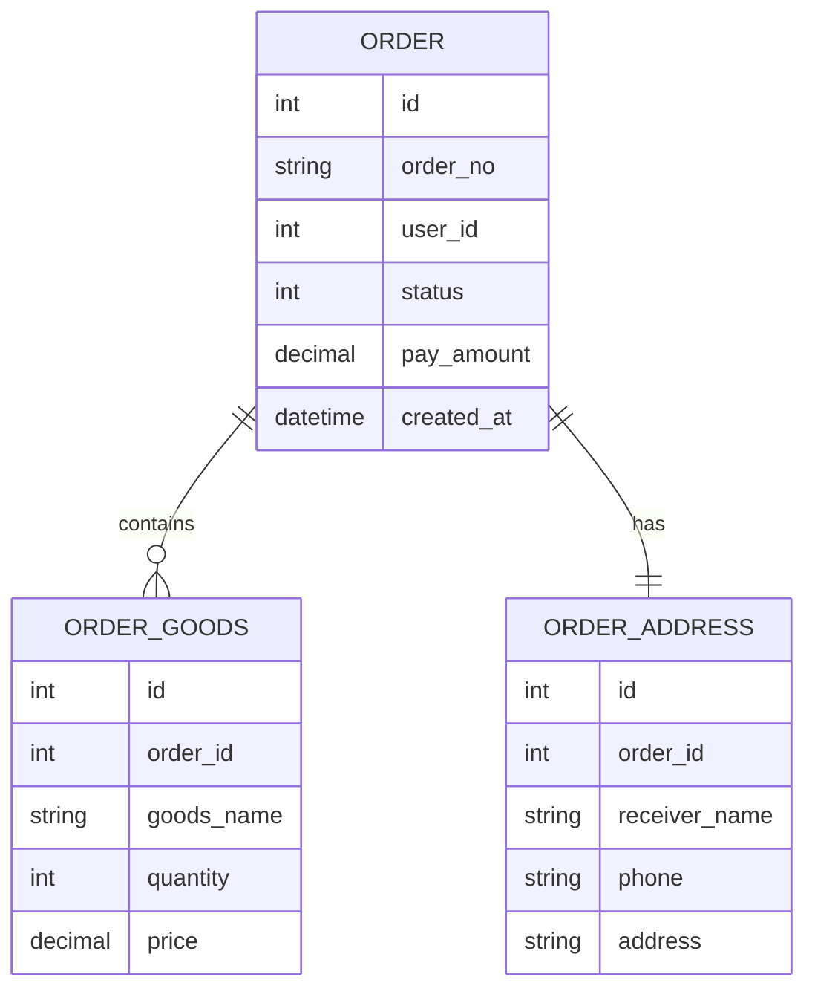

# Week 03 Day 06：订单 ER 图实战

> 所属周：Week 03：MySQL + Redis + ORM  
> 阶段：第一阶段：PHP + Yii2/TP 基础  
> 主仓库/项目：`mall-core`  
> 类型：项目实战  
> 建议时长：约 3h  
> 学习方法：PHP 后端主线 + JS/Node.js 类比 + AI Review

---

## 今日目标

画出订单相关表 `order`、`order_goods`、`order_address` 的 ER 图，理解一对多、一对一关系，并写 SQL 验证这些关系。

今天你要真正掌握这一句话：

> ER 图是数据库表关系的地图；订单主表保存订单整体信息，订单商品表保存一个订单里的多件商品，订单地址表保存下单时的收货地址快照。

---

## 0. 今日学习路线

建议按下面顺序学习：

1. 理解 ER 图是什么
2. 理解实体、字段、关系
3. 理解一对一、一对多、多对多
4. 理解订单主表
5. 理解订单商品表
6. 理解订单地址表
7. 画订单 ER 图
8. 写 JOIN SQL 验证关系
9. 解释每个字段来自哪张表
10. 用数据模型设计图类比前端类型设计
11. 完成今日自测和 AI Review

---

## 1. 学习内容

### 1.1 ER 图是什么？

ER 是 Entity Relationship，实体关系图。

小白理解：

> ER 图就是画出数据库有哪些表，以及表和表之间怎么关联。

例如：

```text
order 1 ---- N order_goods
order 1 ---- 1 order_address
```

表示：

- 一个订单有多个订单商品
- 一个订单有一个收货地址快照

---

### 1.2 实体、字段、关系

| 概念 | 含义 | 示例 |
|---|---|---|
| 实体 | 一类业务对象 | 订单、用户、商品 |
| 表 | 实体在数据库中的存储 | `order` |
| 字段 | 表中的列 | `order_no`, `status` |
| 关系 | 表之间的关联 | `order.id = order_goods.order_id` |

---

### 1.3 一对多关系

一个订单可以有多个商品。

```text
order
  1
  ↓
  N
order_goods
```

SQL 关联：

```sql
order_goods.order_id = order.id
```

---

### 1.4 一对一关系

一个订单通常有一个订单地址快照。

```text
order
  1
  ↓
  1
order_address
```

SQL 关联：

```sql
order_address.order_id = order.id
```

---

### 1.5 为什么订单地址要单独存？

用户地址可能会变化。

例如用户下单时地址是：

```text
上海市 A 地址
```

后来用户修改默认地址：

```text
北京市 B 地址
```

但历史订单仍然应该显示下单时的地址，所以订单地址表保存的是「地址快照」。

---

### 1.6 订单 ER 图示例



---

## 2. 源码阅读

本日无指定源码阅读，重点完成练习与复盘。

建议参考：

- `mall-core/common/models/order/Order.php`
- `mall-core/common/models/order/OrderGoods.php`
- `mall-core/common/models/order/OrderAddress.php`
- `mall-core/common/repositorys/order/OrderRepository.php`

---

## 3. 练习任务

### 练习 1：画订单 ER 图

至少包含：

```text
order
order_goods
order_address
```

并标出：

```text
order.id → order_goods.order_id
order.id → order_address.order_id
```

---

### 练习 2：写 JOIN SQL

```sql
SELECT
    o.id,
    o.order_no,
    o.status,
    og.goods_name,
    og.quantity,
    oa.receiver_name,
    oa.address
FROM orders o
LEFT JOIN order_goods og ON og.order_id = o.id
LEFT JOIN order_address oa ON oa.order_id = o.id
WHERE o.order_no = 'O001';
```

---

### 练习 3：字段来源表

| 页面字段 | 表 | 字段 |
|---|---|---|
| 订单号 | order | order_no |
| 订单状态 | order | status |
| 商品名 | order_goods | goods_name |
| 商品数量 | order_goods | quantity |
| 收货人 | order_address | receiver_name |
| 收货地址 | order_address | address |

---

### 练习 4：SQL 验证记录

| SQL | 目的 | 是否成功 | 备注 |
|---|---|---|---|
|  | 查订单主表 |  |  |
|  | 查订单商品 |  |  |
|  | 查订单地址 |  |  |
|  | JOIN 三表 |  |  |

---

## 4. JS/Node.js 类比

| 数据库概念 | Node/前端类比 |
|---|---|
| ER 图 | TypeScript interface 关系图 |
| order 表 | Order 类型 |
| order_goods 表 | OrderGoods[] |
| order_address 表 | OrderAddress |
| 一对多 | `goods: OrderGoods[]` |
| 一对一 | `address: OrderAddress` |
| JOIN | 后端组装嵌套对象 |

TypeScript 类比：

```ts
interface Order {
  id: number;
  orderNo: string;
  goods: OrderGoods[];
  address: OrderAddress;
}
```

---

## 5. AI Review 提问

```text
我正在学习订单 ER 图和 SQL JOIN。

我画了 order / order_goods / order_address 的 ER 图，并写了 JOIN SQL。
请你按资深数据库工程师标准帮我检查：

1. 我的 ER 关系是否合理？
2. order 与 order_goods 是不是一对多？
3. order 与 order_address 是不是一对一？
4. 我的 JOIN SQL 是否正确？
5. 订单地址为什么要做快照？

请用中文输出：问题清单、修正建议、下一步练习。
```

---

## 6. 今日产出

- [ ] 订单 ER 图
- [ ] 三表关系说明
- [ ] JOIN SQL
- [ ] 字段来源表
- [ ] SQL 验证记录
- [ ] AI Review 记录

---

## 7. 今日完成标准

- [ ] 能解释 ER 图是什么
- [ ] 能解释一对多
- [ ] 能解释一对一
- [ ] 能画出 order / order_goods / order_address 关系
- [ ] 能写三表 JOIN SQL
- [ ] 能说明订单地址快照的意义
- [ ] 能对照前端字段找到后端表字段

---

## 8. 今日自测题

### 8.1 ER 图是什么？

参考答案：描述数据库实体、字段和关系的图。

### 8.2 order 和 order_goods 是什么关系？

参考答案：一对多，一个订单可以有多个订单商品。

### 8.3 order 和 order_address 是什么关系？

参考答案：通常是一对一，一个订单对应一个地址快照。

### 8.4 为什么订单地址要存快照？

参考答案：因为用户后续修改地址不应该影响历史订单地址。

### 8.5 JOIN 三张表时关联条件是什么？

参考答案：`order_goods.order_id = order.id`，`order_address.order_id = order.id`。

---

## 9. 学习记录

| 记录项 | 内容 |
|--------|------|
| 今日最清楚的概念 |  |
| 今日最卡的概念 |  |
| JS/Node 类比是否帮助理解 |  |
| 实际耗时 |  |
| 明日要补的问题 |  |

---

## 10. AI Review 提示词

```text
我正在进行 Week 03 Day 06：订单 ER 图实战 的学习。
请你扮演资深 PHP 后端工程师，帮我检查：
1. 今日理解是否正确
2. JS/Node 类比是否准确
3. 练习任务是否遗漏关键风险
4. 真实项目中还需要注意什么

请用中文输出：问题清单、修正建议、下一步练习。
```

---

## 返回本周

- [返回 Week 03 README](./README.md)
