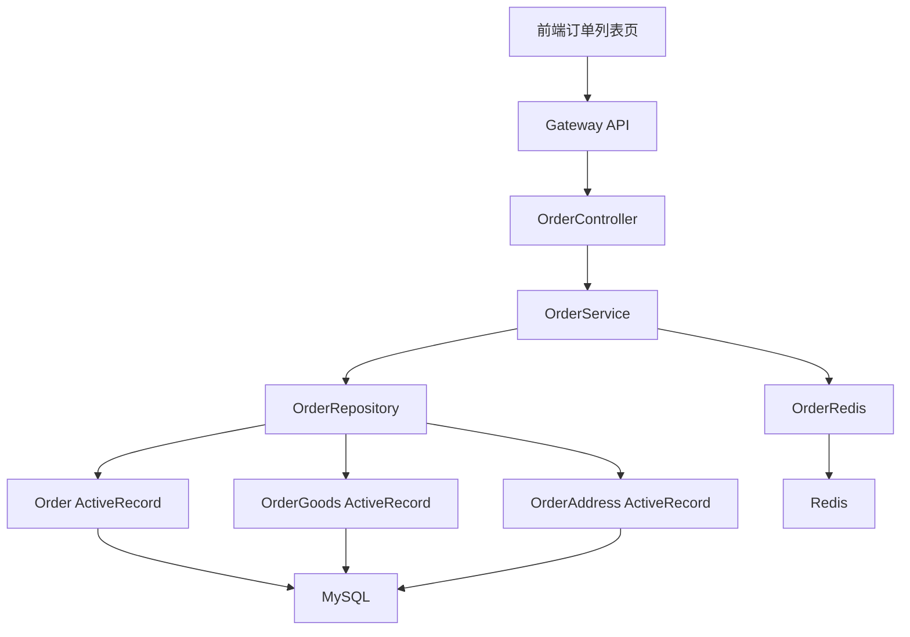

# Week 03 Day 07：验收与预习

> 所属周：Week 03：MySQL + Redis + ORM  
> 阶段：第一阶段：PHP + Yii2/TP 基础  
> 主仓库/项目：`mall-core`  
> 类型：复盘预习  
> 建议时长：约 3h  
> 学习方法：PHP 后端主线 + JS/Node.js 类比 + AI Review

---

## 今日目标

完成 Week 03 的整体验收、自评和查漏补缺，确认自己能理解 MySQL 基础查询、ActiveRecord、Repository、Redis 缓存、N+1 问题和订单 ER 图；同时预习 Week 04 的配置中心与 `g_config()`。

今天你要真正掌握这一句话：

> Week 03 的核心是建立“数据从 MySQL 表中来，经由 Model / Repository 被 Service 使用，热点数据可用 Redis 缓存优化”的后端数据访问心智模型。

---

## 0. 今日学习路线

建议按下面顺序复盘：

1. 回顾 Day 01：MySQL、JOIN、索引
2. 回顾 Day 02：Yii2 ActiveRecord
3. 回顾 Day 03：Repository 模式
4. 回顾 Day 04：Redis 缓存
5. 回顾 Day 05：N+1 与预加载
6. 回顾 Day 06：订单 ER 图
7. 按 checklist 做 Week 03 验收
8. 画出订单数据访问链路图
9. 写 Week 03 周总结
10. 列出下周学习配置中心前的 3 个问题
11. 预习 `g_config()` 和动态配置
12. 把总结交给 AI Review

---

## 1. 学习内容

### 1.1 Week 03 你到底学了什么？

Week 03 主题是：

```text
MySQL + Redis + ORM
```

也就是后端数据层基础。

你需要建立这张大图：

```text
Controller
  ↓
Service
  ↓
Repository
  ↓
ActiveRecord Model
  ↓
MySQL

热点/临时数据：
Service / Repository
  ↓
Redis 封装类
  ↓
Redis
```

小白理解：

- MySQL 保存持久化业务数据
- ActiveRecord 把表映射成 PHP 类
- Repository 封装查询
- Service 调 Repository 做业务
- Redis 用来缓存热点数据或保存临时状态

---

### 1.2 Day 01 复盘：MySQL 与索引

你应该能解释：

| 概念 | 是否能解释 |
|---|---|
| database / table / row / column |  |
| `SELECT` |  |
| `WHERE` |  |
| `ORDER BY` |  |
| `LIMIT` |  |
| `JOIN` |  |
| `LEFT JOIN` |  |
| 主键 |  |
| 索引 |  |
| 索引不是越多越好 |  |

最低要求：

> 你要能写出一个订单表和订单商品表的 JOIN 查询，并能解释索引为什么像书的目录。

---

### 1.3 Day 02 复盘：ActiveRecord

你应该能解释：

| 概念 | 是否能解释 |
|---|---|
| ORM |  |
| ActiveRecord |  |
| Model 和表的关系 |  |
| `tableName()` |  |
| `find()` |  |
| `where()` |  |
| `one()` / `all()` |  |
| `asArray()` |  |
| `hasOne()` / `hasMany()` |  |

最低要求：

> 你要能把 `Order::find()->where(['id' => 1])->one()` 类比成 Sequelize 的 `Order.findOne({ where: { id: 1 } })`。

---

### 1.4 Day 03 复盘：Repository 模式

你应该能解释：

| 概念 | 是否能解释 |
|---|---|
| Repository 是什么 |  |
| 为什么 Service 不直接 SQL |  |
| Repository 应该做什么 |  |
| Repository 不应该做什么 |  |
| Repository 和 ActiveRecord 的关系 |  |
| Repository 和 DAO 的类比 |  |

最低要求：

> 你要能说出：Repository 负责数据访问，Service 负责业务逻辑。

---

### 1.5 Day 04 复盘：Redis 缓存

你应该能解释：

| 概念 | 是否能解释 |
|---|---|
| Redis 是什么 |  |
| string / hash / list / set / zset |  |
| `get` / `set` / `expire` |  |
| 缓存命中 |  |
| 缓存未命中 |  |
| TTL |  |
| 缓存一致性 |  |
| `OrderRedis` 封装意义 |  |

最低要求：

> 你要能画出“先查 Redis，未命中再查 MySQL，然后写回 Redis”的缓存流程。

---

### 1.6 Day 05 复盘：N+1 与预加载

你应该能解释：

| 概念 | 是否能解释 |
|---|---|
| N+1 查询 |  |
| 循环里查关联数据为什么慢 |  |
| `with()` |  |
| eager loading |  |
| `joinWith()` 初步理解 |  |
| Sequelize `include` 类比 |  |

最低要求：

> 你要能说出：N+1 就是 1 次主查询 + N 次关联查询，`with()` 可以预加载关联数据减少查询次数。

---

### 1.7 Day 06 复盘：订单 ER 图

你应该能解释：

| 概念 | 是否能解释 |
|---|---|
| ER 图 |  |
| 实体 |  |
| 字段 |  |
| 一对一 |  |
| 一对多 |  |
| `order` 主表 |  |
| `order_goods` |  |
| `order_address` |  |
| 地址快照 |  |

最低要求：

> 你要能画出 `order 1:N order_goods` 和 `order 1:1 order_address`。

---

### 1.8 Week 04 预习：配置中心与 `g_config()`

Week 04 会学习配置中心。

你先理解：

> 不是所有业务开关都应该写死在代码里。很多配置需要动态调整，例如是否开启某功能、支付渠道开关、站点配置、活动开关等。

Node 类比：

```text
g_config(module, key, default)
≈ process.env.KEY ?? default
≈ 远程配置中心读取配置
```

但比 `process.env` 更灵活：

- 可以按模块分组
- 可以有默认值
- 可以从 DB / Nacos / 本地配置读取
- 可以动态影响前端展示和后端逻辑

Week 04 你会重点看：

- `g_config()`
- `ConfigHelper.php`
- `ConfigController.php`
- Nacos 配置管理
- Laravel `config()` 对比

---

## 2. 源码阅读

本日无指定新源码阅读，重点复盘本周内容。

建议回看：

- `mall-core/common/repositorys/order/OrderRepository.php`
- `mall-core/common/models/order/Order.php`
- `mall-core/common/redis/order/OrderRedis.php`

预习 Week 04 时可以先浏览：

- `mall-core/common/libraries/App/fun_helpers.php`
- `mall-core/common/libraries/App/Utils/ConfigHelper.php`
- `site-api/controllers/ConfigController.php`

> 说明：路径均为公开代号 + 相对路径。学习时按你的本地仓库映射查找对应文件。

---

## 3. 练习任务

### 练习 1：完成数据库基础验收

- [ ] 我能写基础 `SELECT`
- [ ] 我能写 `WHERE`
- [ ] 我能写 `ORDER BY` / `LIMIT`
- [ ] 我能写 `LEFT JOIN`
- [ ] 我能解释索引作用
- [ ] 我能说出索引缺点

---

### 练习 2：完成 ORM / Repository 验收

- [ ] 我能解释 ActiveRecord
- [ ] 我能读懂 `find()->where()->one()`
- [ ] 我能解释 `asArray()`
- [ ] 我能解释 `hasOne()` / `hasMany()`
- [ ] 我能解释 Repository 职责
- [ ] 我能说明为什么 Service 不直接 SQL

---

### 练习 3：完成 Redis / N+1 验收

- [ ] 我能解释 Redis 是什么
- [ ] 我能解释缓存命中 / 未命中
- [ ] 我能设计一个缓存 key
- [ ] 我能说明 TTL 作用
- [ ] 我能解释 N+1
- [ ] 我能用 `with()` 解决 N+1

---

### 练习 4：画订单数据访问链路图

```text
前端订单列表页
  ↓
Gateway API
  ↓
OrderController
  ↓
OrderService
  ↓
OrderRepository
  ↓
Order / OrderGoods / OrderAddress ActiveRecord
  ↓
MySQL

可选优化：
OrderRedis
  ↓
Redis 缓存
```

Mermaid：



---

### 练习 5：写 Week 03 周总结

```markdown
# Week 03 周总结：MySQL + Redis + ORM

## 本周我学会了什么

1. 
2. 
3. 

## 我能写出的 SQL


## 我对 ActiveRecord 的理解


## 我对 Repository 的理解


## 我对 Redis 缓存的理解


## 我对 N+1 的理解


## 我画出的订单 ER 图


## Week 04 配置中心前的问题

1. 
2. 
3. 
```

---

## 4. JS/Node.js 类比

| Week 03 概念 | PHP/Yii2 | Node/JS 类比 |
|---|---|---|
| MySQL | MySQL | 一样 |
| ActiveRecord | Yii2 AR Model | Sequelize Model |
| Repository | Repository | DAO / Prisma repository |
| Redis 封装 | `OrderRedis` | `orderCache.ts` / ioredis helper |
| N+1 | 循环访问关联 | 循环里 await 查库 |
| 预加载 | `with()` | Sequelize `include` |
| ER 图 | 表关系图 | TypeScript 类型关系图 |
| 配置预习 | `g_config()` | `process.env` + config service |

---

## 5. AI Review 提问

```text
我完成了 Week 03：MySQL + Redis + ORM 的学习。

我本周学习了：
- SELECT / WHERE / JOIN / 索引
- Yii2 ActiveRecord
- Repository 模式
- Redis 缓存
- N+1 与 with() 预加载
- 订单 ER 图

请你按资深 PHP 后端和数据库工程师标准帮我做 Week 03 验收：

1. 我的数据库基础是否足够进入后续业务阅读？
2. 我对 ActiveRecord 和 Repository 的理解是否准确？
3. 我对 Redis 缓存和一致性风险是否理解到位？
4. 我对 N+1 的理解是否正确？
5. 进入 Week 04 配置中心学习前，我还需要补什么？

请用中文输出：验收结果、问题清单、补课建议、Week 04 学习提醒。
```

---

## 6. 今日产出

- [ ] Week 03 周总结
- [ ] 数据库基础验收 checklist
- [ ] ORM / Repository 验收 checklist
- [ ] Redis / N+1 验收 checklist
- [ ] 订单数据访问链路图
- [ ] 订单 ER 图复盘
- [ ] Week 04 配置中心预习问题
- [ ] AI Review 验收记录

---

## 7. 今日完成标准

- [ ] 完成 Week 03 全部笔记回顾
- [ ] 能写基础 SQL 和 JOIN
- [ ] 能解释索引作用和代价
- [ ] 能解释 ActiveRecord
- [ ] 能解释 Repository 职责边界
- [ ] 能解释 Redis 缓存流程
- [ ] 能解释 N+1 和预加载
- [ ] 能画出订单 ER 图
- [ ] 能画出订单数据访问链路图
- [ ] 明确 Week 04 配置中心学习重点

---

## 8. 今日自测题

### 8.1 Week 03 最核心的学习目标是什么？

参考答案：建立后端数据访问心智模型：MySQL 存数据，ActiveRecord 映射表，Repository 封装查询，Redis 缓存热点数据。

### 8.2 ActiveRecord 和 Repository 的区别是什么？

参考答案：ActiveRecord 是表映射和 ORM 查询能力；Repository 是项目封装的数据访问层，封装 AR 查询给 Service 使用。

### 8.3 Redis 缓存的基本流程是什么？

参考答案：先查 Redis，命中直接返回；未命中查 MySQL，再写 Redis 并设置 TTL。

### 8.4 N+1 是什么？

参考答案：先查 1 次主列表，再对 N 条记录分别查关联数据，导致 1+N 次查询。

### 8.5 `with()` 解决什么问题？

参考答案：预加载关联数据，减少循环访问关联产生的额外查询。

### 8.6 订单 ER 图中 `order` 和 `order_goods` 是什么关系？

参考答案：一对多，一个订单有多个订单商品。

### 8.7 Week 04 要学习什么？

参考答案：配置中心、`g_config()`、ConfigHelper、配置 API、Nacos 和 Laravel config 对比。

---

## 9. 学习记录

| 记录项 | 内容 |
|--------|------|
| 本周最清楚的概念 |  |
| 本周最卡的概念 |  |
| JS/Node 类比是否帮助理解 |  |
| SQL / ER 图是否能独立完成 |  |
| 实际耗时 |  |
| 下周要补的问题 |  |
| 自评分（1-5） |  |

---

## 10. AI Review 提示词

```text
我正在进行 Week 03 Day 07：验收与预习 的学习。
请你扮演资深 PHP 后端工程师，帮我检查：
1. 今日理解是否正确
2. JS/Node 类比是否准确
3. 练习任务是否遗漏关键风险
4. 真实项目中还需要注意什么

请用中文输出：问题清单、修正建议、下一步练习。
```

---

## 返回本周

- [返回 Week 03 README](./README.md)
