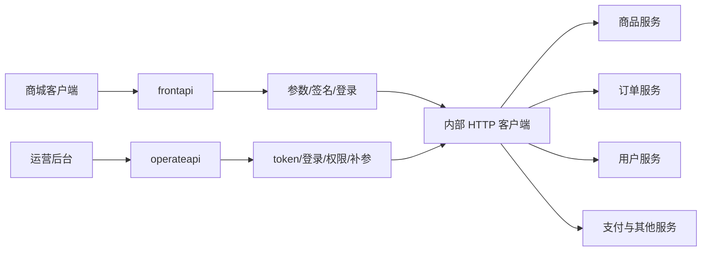
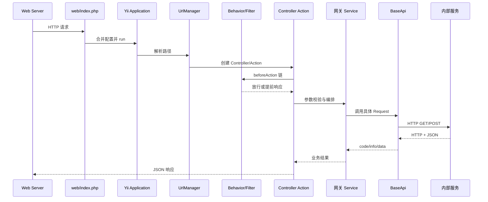
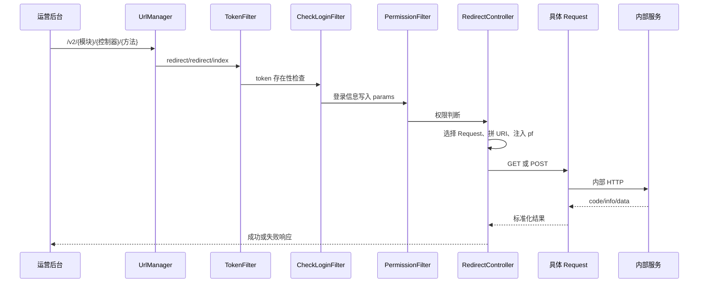
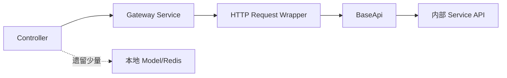

# Mall Gateway 进阶开发指南

> 证据基线：`youngs/mall-gateway` 当前源码。本文面向已掌握 Yii2 基础、能定位 Controller/Action 的开发者。
>
> 阅读原则：标注“代码现状”的内容描述仓库真实行为；标注“推荐实践”的内容是后续新增或改造建议，二者不能混为一谈。

## 1. 系统定位与有效边界

Mall Gateway 是商城公网入口与内部业务服务之间的 Yii2 网关仓库。当前有效入口集中在两个应用：

- `frontapi`：服务 PC、移动端与 App，承担公共参数、签名、登录态处理、少量聚合编排和内部 HTTP 转发。
- `operateapi`：服务运营后台，解析后台登录信息、注入操作人字段，并通过显式 Controller 或 `/v2/...` 通用路由转发。
- 商品、订单、支付、用户、营销、售后等核心规则通常属于内部服务，不应因请求先到网关就写进网关。
- 根 README 将其他历史应用目录标记为无效代码；它们可作为遗留实现参考，但不能默认仍在发布链路中。



### 1.1 什么时候改网关

适合改网关：

1. 新增公网路由并转发已有内部接口。
2. 调整客户端与内部服务之间的字段适配。
3. 增加网关级认证、签名、限流、链路标识或兼容逻辑。
4. 聚合少量、稳定、无复杂事务的跨服务查询。

不适合改网关：

- 新增核心订单状态机、价格规则、库存扣减或支付事务。
- 直接访问内部业务表来“省一次 HTTP”。
- 在 Controller 中实现跨服务补偿事务。
- 把后台权限数据源、商品索引或用户主数据复制进网关。

## 2. 真实技术版本

源码证据来自 `composer.json` 与 lock 文件：

- PHP 约束：`>=5.6.0`；这只是最低约束，不等于部署版本。
- Yii2：lock 文件为 `2.0.39.3`。
- Fecshop 包：`2.9.1`。
- HTTP：`yiisoft/yii2-httpclient`，项目通过 curl transport 封装。
- JWT：`lcobucci/jwt 3.3.3`。
- MQ：`php-amqplib/php-amqplib ^2.12`。
- 测试：Codeception 2.x 时代配置，附带 debug、Gii、faker。

代码横跨旧 PHP 生态。新增代码应先满足当前运行时，不要未经验证引入 PHP 8 专属语法。长期建议用独立升级分支完成运行时、Yii2 与 JWT 依赖升级，并建立回归基线。

## 3. 目录地图

```text
youngs/mall-gateway/
├── frontapi/
│   ├── web/index.php                 C 端入口
│   ├── config/                       应用、模块、路由、日志
│   ├── modules/                      业务路由与 Controller
│   └── filters/                      公参、签名、登录、JWT
├── operateapi/
│   ├── web/index.php                 运营入口
│   ├── config/                       v2 路由与模块配置
│   ├── modules/Redirect/             通用内部转发
│   └── filters/                      token、登录、权限
├── common/
│   ├── BaseApi.php                   内部 HTTP 基类
│   ├── RabbitMq.php                  MQ 发布封装
│   ├── components/CurlClient.php     curl transport
│   └── config/                       共享组件与参数
├── services/
│   ├── http/                         各内部服务客户端
│   ├── spu/                          商品聚合逻辑
│   └── operate/                      后台相关服务
├── models/                           遗留数据模型
├── console/                          Console 应用
├── tests/                            旧测试骨架
├── environments/                     Yii 初始化模板
└── yii/Yii.php                       扩展 Yii::$service
```

## 4. Web 入口与完整生命周期

### 4.1 frontapi 启动

`youngs/mall-gateway/frontapi/web/index.php` 的真实顺序：

1. 设置错误级别。
2. 从请求端口与 Host 计算 `homeUrl`。
3. 定义 `YII_DEBUG=true`、`YII_ENV=dev`、`FEC_APP=frontapi`。
4. 加载 Composer 与项目定制 `yii/Yii.php`。
5. 按顺序合并配置。
6. 创建 Fecshop service application，为 `Yii::$service` 提供服务容器。
7. 创建 `yii\web\Application` 并 `run()`。

配置覆盖顺序：

```text
common/config/main.php
→ common/config/main-local.php
→ frontapi/config/main.php
→ frontapi/config/main-local.php
→ common/config/fecshop.php
→ frontapi/config/frontapi.php
→ frontapi/config/fecshop_local.php
```

同名键通常以后者为准。排查配置不生效时必须沿合并顺序查，而不是只搜索一个键。

### 4.2 operateapi 启动

运营入口采用相同模式，但定义 `FEC_APP=operateapi`，配置链不完全相同。其入口没有像 frontapi 一样直接定义 debug 常量，环境最终值需结合 bootstrap 与部署注入确认。

### 4.3 一次请求的生命周期



## 5. 路由、鉴权与信任边界

### 5.1 frontapi 路由

`urlManager` 开启 Pretty URL、关闭脚本名、未开启严格解析。常见路径：

```text
/{module}/{controller}/{action}
```

例如 `/product/product/get-product-info` 对应 Product 模块、`ProductController`、`actionGetProductInfo()`。模块清单在 `frontapi/config/modules/Modules.php`。

### 5.2 frontapi 基类差异

- `BaseController`：挂载公共参数与签名过滤器，提供基础响应。
- `BaseApiController`：另一套 C 端响应与错误字段处理。
- `AuthApiController`：在基类之上按白名单挂载登录过滤器。

新增 Action 前先查看父类 `behaviors()`，不要只根据相邻文件复制继承关系。

### 5.3 公共参数过滤器现状

`CommonParamsFilter::beforeAction()` 当前在开头直接返回 true，后续站点、语言、币种逻辑不可达。

- 代码现状：该过滤器没有执行文件后半部预期的标准化。
- 推荐实践：不要继续依赖不可达逻辑；若恢复，应逐接口回归，避免历史调用方因参数默认值变化而受影响。

### 5.4 签名校验

`VerifySignatureFilter` 从 JSON body 或 GET/POST 取参数，移除签名辅助字段，递归排序并标准化标量后校验。它仅对配置路径和特定客户端条件强制执行，失败返回业务错误并写专项日志。

签名保护的关键不是“算法看起来一致”，而是：

- JSON 与表单的取值是否一致。
- 数字、布尔、null 的字符串化是否一致。
- 数组递归排序与 JSON 序列化是否一致。
- 路径是否真正命中保护清单。

本文不提供任何真实签名材料。

### 5.5 登录态

`LoginAuthFilter` 支持两类 token：较长值按 JWT 验签，较短值从 Redis 登录 key 查询用户。长度只是分流条件，不是合法性证明。JWT 密钥按环境文件加载，相关文件必须限制权限且绝不能进入文档。

### 5.6 operateapi 通用路由

核心规则：

```text
/v2/<controller>/<action>/<method>
→ redirect/redirect/index
```

`RedirectController` 把三段动态参数转换成内部 URI，再按模块选择 `*Request`。POST 走 `post()`，其他方法当前统一走 `get()`；这意味着 PUT/PATCH/DELETE 语义不会自然透传。



### 5.7 权限过滤器的真实风险

`PermissionFilter` 会计算真实 v2 URL、查询角色 URL 清单；但未授权分支当前只写日志并 `return true`，拒绝响应代码被注释。

- 代码现状：该过滤器是观察模式，不是强制授权边界。
- 风险：任何文档或测试若宣称“已通过 RBAC 保护”都是错误的。
- 推荐实践：先盘点误拦截日志与外层防护，再灰度恢复拒绝；为无权限、白名单、动态 v2 路由补自动化测试。

## 6. 网关的分层模型

网关不应机械套用完整业务仓的四层。当前主要链路是：



职责建议：

- Controller：读取参数、选择流程、返回统一结构。
- 网关 Service：字段适配、轻量聚合、兼容逻辑。
- Request Wrapper：定义目标服务和具体 URI。
- BaseApi：连接、header、超时、解析、错误归一。
- 核心仓 Controller-Service-Repository-Model：真正业务与持久化。

“Controller-Service-Repository-Model”在网关内不是主路径；若需求需要 Repository/Model 才能完成，应优先重新判断是否改错仓。

## 7. 内部 HTTP、响应与异常

`common/BaseApi.php` 维护共享 headers、超时、连接超时和 IPv4 选项；具体 Request 只需提供 base URL 与业务方法。

真实行为：

1. 生成或透传部分链路 header。
2. 发送请求。
3. 非 2xx 时记录 URL、参数与响应摘要，再抛 HTTP Client 异常。
4. 捕获异常后返回业务结构，常用错误码为 404。
5. `checkResult()` 确保 `code` 存在，并补齐 `info`、`data`。

重要问题：

- HTTP 404、内部业务 404、网关包装的连接异常 404 可能混在一起。
- 60 秒连接和请求超时会放大线程占用与级联故障。
- 基类仍直接使用 Yii 日志并可能记录完整参数。
- 自动重试不是默认能力；对写接口也不应盲目重试。

推荐实践：

- 区分网络错误、HTTP 状态、协议错误、业务错误。
- 日志只保留允许字段和摘要，敏感字段默认脱敏。
- 按服务设置更短的连接/请求超时。
- 将 request ID 全链路默认透传，而不是仅对白名单启用。
- 幂等读请求可有限重试，写请求必须先有幂等键与明确重试策略。

### 7.1 响应契约差异

- frontapi 常见成功业务码为 `200`，消息字段为 `message`。
- operateapi 与内部服务常见成功业务码为 `1`，消息字段为 `info`。
- HTTP 200 不等于业务成功；调用方必须读取 JSON `code`。

新增适配时先写清“上游契约、内部契约、映射规则”，避免直接透传导致客户端误判。

## 8. 配置与基础设施

### 8.1 配置来源

- Yii PHP 配置数组。
- 环境变量注入的 DB、Redis 等连接字段。
- 参数文件中的 MQ、服务地址和业务开关。
- 部分 Request 内硬编码的内部 host。

文档只应记录变量名或占位符，不记录值。域名示例统一使用 `api.bm.example`。

### 8.2 MySQL

共享配置可见主业务连接和另一数据连接。网关定位决定了新增业务不应直接依赖这些库。若遗留接口确实使用 Model，应确认：连接组件、读写库、事务范围、软删除规则和数据所有权。

### 8.3 Redis

Redis 用于 session、短 token 登录、运营数据和部分缓存；不同组件可能选择不同 database。排障需要同时确认组件名、database、key 前缀、TTL 与环境，不能只看 key 文本。

### 8.4 Elasticsearch

当前有效网关主链路没有统一 ES Repository。仓库历史目录中的搜索模型不能证明仍在发布。推荐让核心服务拥有索引访问权，网关通过内部 API 获取结果。

### 8.5 RabbitMQ

`common/RabbitMq.php` 使用 AMQP 客户端建立连接和 channel，支持发送与延迟相关参数。网关直接发 MQ 会绕开内部服务的业务事务，新增前必须明确消息所有者、幂等、重试、死信与可观测性。通常应由核心服务提交业务后发布领域事件。

## 9. 外部依赖

Composer 可见支付、云存储、营销、社交登录、PDF 等 SDK。依赖存在不代表当前有效入口都在使用。判断步骤：

1. 从有效 Controller 搜索调用点。
2. 跟到 Service 与 SDK client 初始化。
3. 确认配置来源和环境切换方式。
4. 查超时、重试、错误映射与日志脱敏。
5. 确认是否有回调验签和幂等。

禁止把 SDK 配置文件中的真实值复制到调试脚本。

## 10. Console、测试、调试与部署

### 10.1 Console

仓库有 Yii Console 应用，但当前网关职责主要是 HTTP。使用 Console 做验证时应调用同一 Service/Request Wrapper，不复制业务逻辑。CLI 与 FPM 的环境变量、请求对象和工作目录可能不同。

### 10.2 测试现状

仓库保留 Codeception 2.x 骨架，不能据此认定已有可靠回归。建议优先建立：

- 路由到 Action 的接口测试。
- 签名规范化测试。
- JWT/短 token 分流测试。
- operate v2 模块映射测试。
- BaseApi 的超时、非 2xx、非 JSON、缺字段测试。
- 响应码映射测试。

### 10.3 本地调试

仓库没有可证明的一键 Docker 配置。Web Server DocumentRoot 必须指向具体应用的 `web/`。示例域名使用 `gateway.bm.example`；实际本地映射、容器和端口向团队确认。

调试顺序：

1. 确认请求进入 frontapi 还是 operateapi。
2. 将 URL 拆成模块、控制器、Action，或确认命中 v2 通用规则。
3. 查看 Controller 父类与 filter 顺序。
4. 记录参数在过滤前、补参后、内部转发前的变化。
5. 定位具体 Request 与 URI。
6. 区分 DNS/连接、HTTP、JSON 协议、业务 code。
7. 使用 request ID 串联网关和内部服务日志。

### 10.4 部署核对

- DocumentRoot 与入口应用一致。
- `YII_ENV`、debug 和错误展示符合环境。
- 环境变量完整，且 FPM/CLI 一致。
- runtime 可写、日志轮转与采集正常。
- 内部域名未指错环境。
- debug/Gii 不对非开发环境开放。
- 私钥与配置文件权限最小化。

## 11. 典型新增接口步骤

### 11.1 新增 frontapi 只读接口

1. 确认核心服务已有接口及契约。
2. 确认模块已注册。
3. 选择正确 Controller 父类。
4. 定义请求字段、默认值、签名与登录要求。
5. 在现有 `*Request` 中增加明确方法，避免 Controller 直接拼 host。
6. 如需适配，放入网关 Service。
7. 使用对应响应基类返回。
8. 增加正常、缺参、未登录、签名错误、内部超时、业务失败测试。
9. 检查日志不包含敏感信息。

### 11.2 新增 operateapi v2 转发

1. 确认 URL 第一段已有 Request 映射；没有则显式增加。
2. 核对动态路径拼接结果。
3. 核对 GET/POST；若需要其他方法，不可依赖现有 else 分支。
4. 核对操作人、平台与日志字段注入。
5. 核对权限 URL 在角色系统中的形式。
6. 认识到当前权限过滤器仅观察，不把它当安全验收证据。
7. 对内部非标准响应补防御性处理。

## 12. 标准排障剧本

### 12.1 404

依次判断：Web Server 入口错误 → 模块未注册 → Controller/Action 命名错误 → v2 路径段数错误 → 内部 host/URI 错误 → BaseApi 包装的网络错误。

### 12.2 通用转发返回“模块未支持”

请求已进入 RedirectController，但没有选到 Request。核对 v2 第一段、大小写转换、`pathInfo` 拆分和映射分支。

### 12.3 签名错误

固定原始请求体，逐项比较字段集合、递归排序、类型转换、JSON 序列化、签名保护路径与客户端条件。不要通过关闭校验解决联调问题。

### 12.4 登录失败

先判断 token 类型，再检查传递位置、Redis 组件/database/TTL，或 JWT 环境、公钥、时间有效性。不要在日志输出 token 原文。

### 12.5 权限未配置仍可调用

这是当前 PermissionFilter 的观察模式行为。检查专项日志和外层保护，不要把它误判为缓存问题。

### 12.6 内部服务慢

拆分 DNS、连接、首字节、总耗时；确认是否存在串行聚合、60 秒超时放大、下游池耗尽。先降级非关键聚合，再讨论重试。

## 13. 风险与技术债清单

1. 权限过滤器未强制拒绝。
2. frontapi 入口硬编码开发环境与 debug。
3. 公共参数过滤器存在不可达代码。
4. 内部服务 host 分散甚至硬编码，环境误连风险高。
5. BaseApi 用同一业务码包装不同网络错误。
6. 超时偏长，缺少统一熔断、重试和指标。
7. 日志可能记录完整请求参数。
8. request ID 仅对白名单启用。
9. 两套成功码与消息字段并存。
10. 遗留目录多，发布边界依赖 README 而非构建约束。
11. 自动化测试基线薄弱。
12. PUT/PATCH/DELETE 在 v2 转发中没有正确方法语义。

治理顺序建议：先安全边界与泄密风险，再可观测性与错误分类，然后配置集中化和测试，最后做运行时/框架升级。

## 14. 推荐源码阅读路径

第一轮（生命周期）：

1. `youngs/mall-gateway/frontapi/web/index.php`
2. `youngs/mall-gateway/operateapi/web/index.php`
3. 两端 `config/main.php`
4. `frontapi/config/modules/Modules.php`

第二轮（认证与响应）：

1. frontapi 三个 Base Controller
2. `CommonParamsFilter`
3. `VerifySignatureFilter`
4. `LoginAuthFilter` 与 JWT
5. operateapi 三个 filter

第三轮（转发）：

1. `operateapi/modules/Redirect/controllers/RedirectController.php`
2. `services/http/ProductRequest.php`
3. `common/BaseApi.php`
4. `common/components/CurlClient.php`

第四轮（完整链路）：

- C 端商品详情：Controller → 商品聚合 Service → ProductRequest → BaseApi。
- 运营 v2：UrlManager → 三个 Filter → RedirectController → Request → 内部服务。

完成后，你应能针对任意 URL 写出：入口、路由、父类、filter、参数变化、内部 URI、超时、响应映射、日志位置和失败分支。

## 15. 代码现状与推荐实践速查

| 主题 | 代码现状 | 推荐实践 |
|---|---|---|
| 权限 | 未授权只记录后放行 | 灰度恢复强制拒绝并补测试 |
| 公参 | 过滤器提前返回 | 明确唯一标准化入口 |
| 内部地址 | 多处分散定义 | 环境化、集中注册、启动校验 |
| 错误 | 多类失败映射为相同 code | 分层错误类型并保留 request ID |
| 日志 | 可能记录完整参数 | allowlist + 脱敏 + 长度限制 |
| 链路 ID | 白名单启用 | 默认透传、入口生成 |
| 聚合 | Controller/Service 混合 | Controller 薄化，限制串行调用 |
| 测试 | 旧骨架为主 | 先补契约与过滤器回归 |
| 版本 | 老 PHP/Yii 生态 | 建基线后渐进升级 |

---

本文只引用脱敏路径与占位域名。配置值、认证材料、个人数据与真实网络信息均未纳入文档。