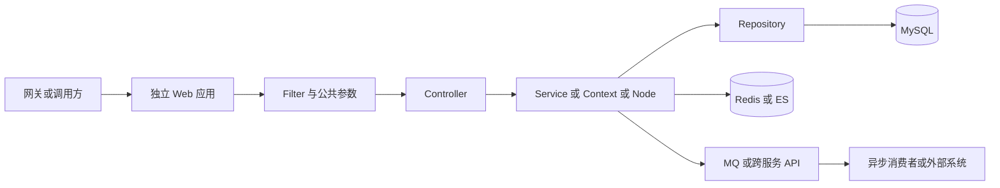
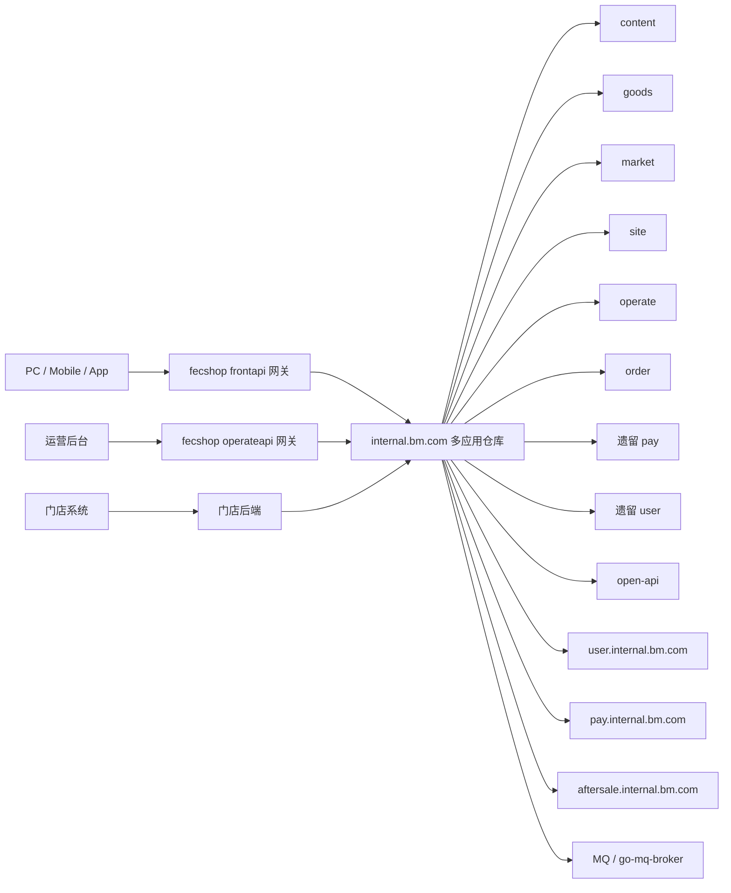
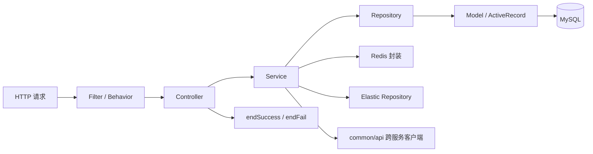
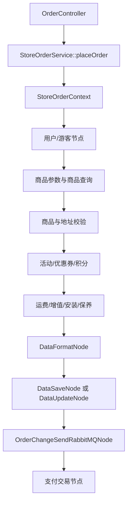
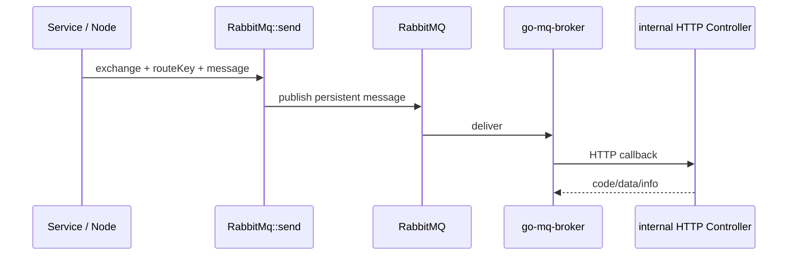
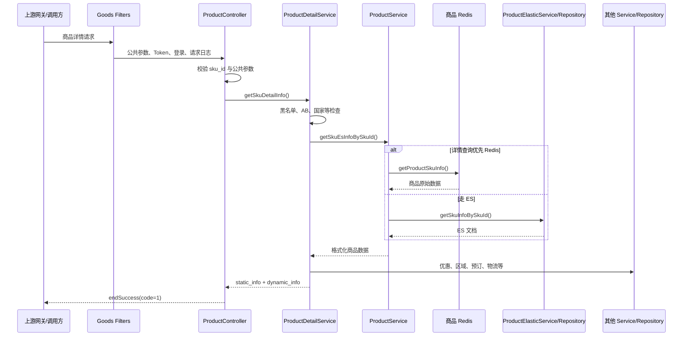
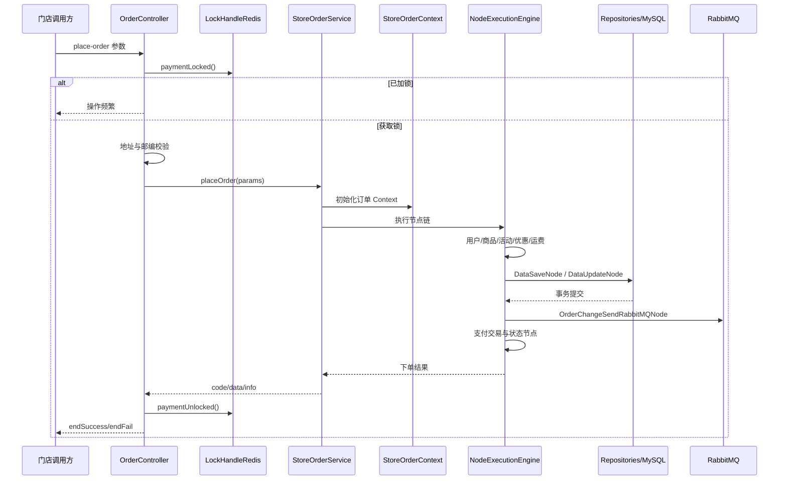

# Mall Core 进阶开发指南

> 面向读者：已读基础指南，能够定位 Yii2 Controller、Service 与配置的开发者  
> 仓库路径：`youngs/mall-core`  
> 调研基准：仓库当前代码，只描述“代码现在怎样运行”，不把 PHP 8.3 或新版 Yii 的最佳实践冒充项目现状  
> 安全说明：本文不会展示仓库中的密钥、密码、Token、内网账号或其他敏感配置值

---

## 0. 进阶阅读约定

本文以 `youngs/mall-core` 当前源码为证据，重点解释多应用仓库的运行边界、复杂链路和故障模型。每节同时区分：

- **代码现状**：当前仓库可直接证明的行为，即使它不理想。
- **推荐实践**：新增代码应遵循的方向，不代表遗留代码已经完成改造。

进阶开发的核心不是记住目录，而是能回答一次请求经过哪些 Filter、Service、Repository、缓存、索引、消息和外部调用，以及每个副作用能否随数据库事务回滚。




### 0.1 架构判断准则

1. Controller 只负责协议、校验、编排和响应，不直接操作 Model。
2. Service 表达业务规则；Repository 拥有数据访问；Model 只映射持久化结构。
3. 同一数据库连接的事务不覆盖 Redis、ES、MQ、HTTP 或第三方副作用。
4. 缓存和索引不是数据库的同义副本，排障必须明确数据权威源与同步方向。
5. 用户、支付、售后存在独立仓迁移边界，目录存在不代表仍承接所有新需求。
6. 所有真实地址、凭据、个人数据和环境实例信息都不应进入文档与测试样例。

## 1. 先建立整体认识

`internal.bm.com` 不是一个只有单一入口的普通 Yii2 应用，而是一个共享代码和依赖的“多应用仓库”：

- 根目录只有一套 `composer.json`、`vendor/` 和 Console 入口 `yii`。
- 10 个 `bm-*` 目录代表不同应用，其中 9 个是 Web API，1 个是 Console。
- `common/` 是所有应用共享的业务和基础设施代码。
- 各 Web 应用有自己的 `web/index.php`、Controller、配置和运行时日志目录。
- 应用最终仍运行在同一个 Yii2 Advanced Template 风格的代码体系中，并不等同于完全隔离、独立部署代码库的微服务。

仓库当前 `composer.json` 声明：

- PHP：`^7.0`
- Yii2：`~2.0.14`
- PHPUnit：`~6.5.5`
- Codeception：`^2.4.0`
- Redis、Elasticsearch、RabbitMQ、AWS、Stripe、Braintree 等依赖均由 Composer 管理

因此，阅读和修改代码时应以 PHP 7.x 的语法和现有框架版本为准。不要未经验证就加入 PHP 8 专有语法，例如属性注解、联合类型、命名参数或 `match`。

### 1.1 系统位置



注意：图中的“网关转发”和跨仓关系来自仓库代码及工作空间项目说明；具体生产域名、Nginx upstream、容器端口和发布拓扑不在本仓库中定义。

---

## 2. 十一个顶层模块及边界

这里把 10 个 `bm-*` 应用与共享层 `common/` 一并称为 11 个模块。

### 2.1 `bm-console`

职责：

- Yii2 命令行应用。
- 定时任务、批处理、数据修复、队列或 Redis 列表消费。
- 提供 `controllers/test/` 作为项目约定的 Console 联调入口。

关键位置：

- 配置：`bm-console/config/`
- Controller：`bm-console/controllers/`
- 基类：`bm-console/controllers/BaseController.php`
- 根入口：`yii`

命名空间：`AppConsole\`

它没有 `web/`，不能像 Web API 那样通过 HTTP 直接访问。

### 2.2 `bm-content-api`

职责：C 端内容业务。

关键位置：

- `bm-content-api/controllers/`
- `bm-content-api/forms/`
- `bm-content-api/filters/`
- `bm-content-api/web/index.php`

命名空间：`AppContentApi\`

### 2.3 `bm-goods-api`

职责：

- C 端商品业务。
- 商品详情、搜索、推荐、首页相关接口。
- 部分供 MQ Broker 回调的 HTTP 消费入口。

关键位置：

- `bm-goods-api/controllers/product/`
- `bm-goods-api/services/`
- `bm-goods-api/dto/`
- `bm-goods-api/resources/`
- `bm-goods-api/web/index.php`

命名空间：`AppGoodsApi\`

### 2.4 `bm-market-api`

职责：C 端营销业务，如活动、优惠等。

关键位置：`bm-market-api/controllers/`、`services/`、`forms/`、`web/`

命名空间：`AppMarketApi\`

### 2.5 `bm-open-api`

职责：

- 对供应链或外部系统提供接口。
- 根据 `route_key` 读取网关配置。
- 将请求转发到目标服务。
- 将请求和响应记录到网关日志。

关键位置：

- `bm-open-api/controllers/`
- `common/services/openapi/GateWayService.php`
- `common/repositorys/openapi/GatewayReposity.php`

命名空间：`AppOpenApi\`

它的成功返回码与常规内部 API 不同：`BaseOpenApiController::endSuccess()` 使用 `code=200`，而普通 `BaseWebController::endSuccess()` 使用 `code=1`。

### 2.6 `bm-operate-api`

职责：运营管理后台的 internal 服务，但 README 明确说明这里只包含导购部分，交易相关后台接口不一定在这里。

关键位置：`bm-operate-api/controllers/`、`services/`、`forms/`、`resources/`

命名空间：`AppOperateApi\`

### 2.7 `bm-order-api`

职责：

- 订单创建、试算、编辑、查询和内部订单操作。
- 门店订单。
- 复杂下单 Node 链。

关键位置：

- `bm-order-api/controllers/`
- `common/services/order/`
- `common/repositorys/order/`
- `common/models/order/`

命名空间：`AppOrderApi\`

### 2.8 `bm-pay-api`

职责：支付遗留模块。

重要边界：README 明确说明，C 端支付接口已经迁移到独立仓库 `pay.internal.bm.com`；本模块主要保留尚未迁移的后台或个别接口。开发前必须确认需求究竟属于新支付仓还是此遗留模块。

命名空间：`AppPayApi\`

### 2.9 `bm-site-api`

职责：站点、国家、地址、节假日等基础能力。

命名空间：`AppSiteApi\`

### 2.10 `bm-user-api`

职责：用户遗留模块。

重要边界：README 明确说明，C 端用户接口已经迁移到独立仓库 `user.internal.bm.com`；此处主要是后台遗留接口。`common/api/UserApi.php` 也显示本仓会通过 HTTP 调用新用户服务。

命名空间：`AppUserApi\`

### 2.11 `common`

`common/` 不是一个可单独启动的应用，而是所有模块共享的核心层：

```text
common/
├── api/             跨服务 HTTP 客户端封装
├── components/      Yii 组件、日志 Target、队列等
├── config/          公共配置和环境配置
├── enums/           枚举与常量
├── filters/         公共请求过滤器
├── libraries/App/   工具、配置、日志、RabbitMQ 等
├── models/          Yii ActiveRecord Model
├── redis/           Redis 业务封装
├── repositorys/     MySQL/ES 数据访问层
├── services/        跨模块共享业务 Service
├── strategy/        策略模式实现
├── wrapper/         部分包装器
├── BaseService.php
├── BaseRepository.php
├── BaseWebController.php
└── BaseOpenApiController.php
```

这是一个强共享仓库。虽然代码按模块入口组织，但大量业务实际位于 `common/services`。判断归属时不能只搜索对应 `bm-*` 目录。

---

## 3. 安装、入口与启动

### 3.1 安装依赖

仓库 README 给出的初始化命令是：

```bash
cd youngs/mall-core
composer install
```

安装前应确认：

1. 当前 PHP CLI 版本符合项目实际运行要求。
2. Composer 能访问依赖源。
3. 所需 PHP 扩展已安装。
4. 本地环境变量和 Nacos 配置文件已经由团队提供。

不要因为本机装有 PHP 8.3，就默认项目能直接在 PHP 8.3 下运行。当前项目依赖和历史代码以 PHP 7.x 为基准。

### 3.2 Web 入口

每个 Web 子模块都有独立入口，例如：

```text
bm-goods-api/web/index.php
bm-order-api/web/index.php
bm-open-api/web/index.php
```

以 goods 为例，入口依次做：

1. 从环境变量读取 `YII_ENV`，缺省为 `dev`。
2. 设置 `YII_DEBUG`。
3. 加载 `vendor/autoload.php`。
4. 加载 Yii 框架。
5. 加载模块 `config/bootstrap.php`。
6. 创建 `yii\web\Application` 并运行。

生产或本地 Web Server 应将 DocumentRoot 指向具体模块的 `web/`，而不是仓库根目录。Nginx、hosts、端口和 Docker Compose 不在本仓库中，需要向团队获取。

### 3.3 Console 入口

根目录 `yii` 是 Console 入口：

```bash
php yii <controller-route>/<action-route> [参数]
```

真实示例：

```bash
php yii product/product-sync/consume-data
```

它会加载：

```text
yii
→ bm-console/config/bootstrap.php
→ common/config/*
→ bm-console/config/*
→ yii\console\Application
```

### 3.4 Docker 现状

当前仓库未包含可直接使用的 `Dockerfile` 或 `docker-compose.yml`。工作空间个人环境模板提到 `docker-compose-bm.yml` 和 PHP 7.3 容器，但没有给出本机实际配置路径。

结论：不要在进阶开发者文档中承诺“一条 Docker 命令即可启动”。第一次启动前必须确认团队维护的环境仓库或 Compose 文件位置。

---

## 4. 配置如何合并

每个模块的 `config/bootstrap.php` 都会把三层配置合并。

以 goods 为例：

```text
common/config/main.php
        ↓ 合并
common/config/{YII_ENV}/main.php
        ↓ 合并
bm-goods-api/config/main.php
```

参数 `params` 也按相似顺序合并：

```text
common/config/params.php
common/config/{YII_ENV}/params.php
bm-goods-api/config/params.php
```

后合并的配置可以覆盖前面的同名键。因此排查“为什么配置值不对”时，必须按合并顺序逐层检查。

### 4.1 环境常量

`common/config/bootstrap.php` 根据 `YII_ENV` 定义：

- `BM_ENV_DEV`
- `BM_ENV_TEST`
- `BM_ENV_PROD`

并注册命名空间别名：

- `@common`
- `@AppGoodsApi`
- `@AppOrderApi`
- `@AppUserApi`
- `@AppMarketApi`
- `@AppPayApi`
- `@AppOpenApi`
- `@AppOperateApi`
- `@AppSiteApi`
- `@AppConsole`
- `@AppContentApi`

### 4.2 配置来源有三种

1. PHP 配置数组，例如 `common/config/main.php`
2. 环境变量，例如 DB、Redis、ES、RabbitMQ 连接信息
3. Nacos 落地的 INI 文件，由 `g_config()` 读取

敏感值不应写进文档、日志、提交记录或聊天内容。即使开发环境配置文件中已经存在明文值，也不能复制到教程中。

---

## 5. Yii2 路由与请求生命周期

### 5.1 默认路由

模块配置普遍启用：

```php
'enablePrettyUrl' => true,
'showScriptName' => false,
```

Yii2 会把 URL 路由转换为 Controller 和 Action。例如：

```text
product/product/get-sku-detail-info
```

对应：

```text
目录：bm-goods-api/controllers/product/
类：ProductController
方法：actionGetSkuDetailInfo()
```

转换规则：

- `product/product`：子目录 `product` + `ProductController`
- `get-sku-detail-info`：`actionGetSkuDetailInfo`

### 5.2 少量显式 URL Rule

多数接口依赖 Yii 默认路由。代码中也存在少量显式规则，例如：

- goods 的下载路由
- order 的 `mini-app/<controller>/<action>` 路由

如果一个 Action 明明存在却返回 404，应检查：

1. 请求是否进入正确模块域名。
2. Controller 命名空间是否正确。
3. 文件名、类名、Action 名与 Yii 规则是否匹配。
4. 是否被 Nginx 或上游网关改写。
5. 是否存在显式 URL Rule。

### 5.3 Filter / Behavior

请求不是直接进入 Action。Controller 的 `behaviors()` 会注册 Filter。

goods 基类包含：

```text
CommonParamsFilter（父类）
→ TokenFilter
→ CheckLoginFilter
→ ApiRequestResponseLogger
→ Controller Action
```

order 基类包含：

```text
CommonParamsFilter（父类）
→ LogStrFilter
→ UserStatusFilter
→ ApiRequestResponseLogger
→ Controller Action
```

因此接口在 Action 断点前就失败时，要先检查 Filter，而不是只盯着 Action。

### 5.4 公共请求参数

`BaseWebController::init()` 会处理或记录：

- `pf`
- `site`
- `language`
- `currency`
- `country_code`
- `version`
- AB 实验参数

它还会设置当前语言、版本数字、站点和若干请求级常量。新增接口时，应优先复用现有公共参数处理，不要在每个 Action 中重新发明一套。

---

## 6. 核心四层：Controller → Service → Repository → Model

### 6.1 总体关系



### 6.2 Controller

职责：

- 获取 GET/POST/JSON 参数。
- 使用 Form 或显式逻辑做参数校验。
- 编排多个 Service。
- 捕获异常。
- 格式化响应。

普通 API 成功时：

```php
return $this->endSuccess($data);
```

失败时：

```php
return $this->endFail($code, $message);
```

不要在 Controller 中：

- 直接 `Model::find()`。
- 直接拼 SQL。
- 承载大段可复用业务逻辑。
- 直接请求另一个内网服务。

### 6.3 Service

Service 承载业务规则，通过：

```php
SomeService::instance()
```

从 Yii 容器获取单例。

常见职责：

- 组合多个 Repository 查询。
- 计算价格、优惠、库存、状态。
- 编排 Redis、ES、MQ 和外部 API。
- 返回统一数组，例如 `code/data/info`。

### 6.4 Repository

Repository 负责数据访问：

```php
SomeRepository::instance()
SomeRepository::instance(true) // 某些场景使用从库
```

`BaseRepository` 提供：

- 单例获取。
- `DEL_FLAG_0` / `DEL_FLAG_1`。
- 主从库选择基础能力。
- 抽象的 `getConnection()`。

项目 README 还要求：返回对象的方法名应体现 `obj`，例如 `getObjByOrderNo`。

### 6.5 Model

Model 是 Yii ActiveRecord 与表的映射，通常放在：

```text
common/models/{domain}/
```

例如：

```text
common/models/product/ProductSku.php
```

Model 主要描述：

- 表名。
- DB 连接。
- 字段和关系。
- ActiveRecord 行为。

进阶开发者常见误区是把 Model 当成业务 Service。这个项目明确要求 Controller/Service 通过 Repository 操作 Model。

### 6.6 现实中的例外

老代码中仍可能发现：

- Service 或 Controller 直接调用 Model。
- Repository 命名不一致。
- `Yii::error()`。
- 超大 Controller。
- Service 互相深度调用。

这些是历史现状，不代表新增代码应继续复制。修改旧代码时要控制范围，不应未经评估做大规模“顺手重构”。

---

## 7. 复杂业务的 Node 链

订单创建不是简单的 Controller 调一个 Repository，而是使用上下文对象和节点链。



Node 链的核心概念：

- **Context**：保存整条链共享的数据。
- **Node**：只处理一个步骤，并读写 Context。
- **NodeExecutionEngine**：按顺序执行节点。
- **rollbackNode**：部分节点预留回滚能力，但不能假设所有副作用都能自动回滚。

修改 Node 链时必须关注顺序。代码注释中存在大量“必须放在某节点之后”的约束，例如积分、优惠券、客服优惠和套装折扣之间有金额依赖。不要只把新 Node 插到看起来相近的位置。

---

## 8. 跨服务调用必须走 `common/api`

README 明确规定：请求其他内网系统时，应在 `common/api` 写 Wrapper，不能在 Service 中直接 curl。

已有示例：

```text
common/api/UserApi.php
common/api/PayInternal.php
common/api/GoodsInternal.php
common/api/OmsApi.php
common/api/SiteApi.php
common/api/AfterSaleApi.php
```

这些客户端通常继承 `common\BaseApi`，由它统一处理：

- Base URL。
- HTTP 方法。
- Header 传递。
- 超时。
- 响应解析。
- 错误处理。

正确方向：

```text
Service
→ common/api/XxxApi
→ BaseApi
→ 目标内网服务
```

不要：

```text
Service
→ MyFunction::curl("https://service.bm.example/...")
```

遗留代码可能仍有后者，但新增代码应遵循 Wrapper 规范。

---

## 9. 数据库

### 9.1 连接组件

`common/config/main.php` 定义了多个 Yii DB 组件，连接参数来自环境变量，包括：

- 主业务库及从库。
- 新业务库。
- 数据管理/GA。
- BI。
- TMS。

业务 Model 会通过自己的 `getDb()` 决定使用哪个组件。

### 9.2 数据访问规则

工作空间强制规则：

- Controller 和 Service 不直接操作 Model。
- 使用 Repository。
- 查询业务表必须考虑 `del_flag = 0`。
- 删除必须使用软删除 `del_flag = 1`，禁止物理删除。
- 新表必须包含 `created_at`、`updated_at`、`del_flag`。
- 项目约定时间字段使用 Unix 时间戳整数。

### 9.3 事务

真实订单保存代码会从 Repository 获取连接并开启事务：

```text
OrderRepository::instance()->getConnection()->beginTransaction()
```

事务只保证同一数据库连接中的操作。Redis、MQ、HTTP 和第三方支付通常不属于同一个数据库事务，排障时不要误以为“抛异常就一定全部回滚”。

---

## 10. Redis

Redis 有两层：

1. `common/config/main.php` 中定义的 Yii Redis Connection。
2. `common/redis/` 下按业务封装的类。

用途包括：

- Session。
- 商品详情和商品变化缓存。
- 分布式锁。
- 用户信息。
- 基础地址与税率。
- AB 实验。
- 推荐数据。
- Console 消费列表。

常见示例：

- `LockHandleRedis`：下单锁。
- `ProductSyncRedis`：商品同步队列。
- `ProductSkuRedis`：商品数据。

排查 Redis 问题时，应记录：

1. 使用哪个 Yii Redis 组件。
2. 使用哪个 `database` 编号。
3. Key 前缀和生成规则。
4. 是否存在 TTL。
5. 是否存在主机或环境混用。

不要仅凭 Key 名直接操作生产 Redis。

---

## 11. Elasticsearch

商品、订单、内容、优惠券等使用不同的 ES 组件。商品链路的典型结构：

```text
ProductService
→ ProductElasticService
→ ProductElasticRepository
→ Yii elastic_product Connection
```

`ProductElasticRepository` 持有具体商品索引/别名信息。索引名会随版本更新，所以业务代码应尽量通过 Repository，不要在 Controller 中写死索引名。

商品详情当前存在 Redis 与 ES 两种来源：

- 详情类型查询会优先走商品 Redis Service。
- 其他分支可能走 `ProductElasticService::getSkuInfoBySkuId()`。

因此出现“ES 有数据但接口无数据”时，还要检查 Redis、国家数据、上下架状态、黑名单和格式化过滤。

---

## 12. RabbitMQ 与异步任务

RabbitMQ 连接参数由环境变量进入 `common/config/params.php`。Exchange 和 Route Key 也集中定义在参数配置中。

发送入口：

```text
common/libraries/App/Utils/RabbitMq.php
RabbitMq::send($exchangeName, $routeKey, $message, ...)
```

消息可能由 `go-mq-broker` 消费，再通过 HTTP 回调本仓库某个 Controller；也有 Console 或 Redis 列表轮询式任务。

典型模式：



新增 MQ 逻辑时要确认：

- Exchange 与 Route Key。
- 消息体格式。
- 是否延迟消息。
- 消费者是谁。
- 是否会重试。
- 是否幂等。
- 失败日志在哪里。
- HTTP 回调是否可能重复到达。

---

## 13. Nacos 配置

全局函数：

```php
g_config($module, $key, $default);
```

实际委托给：

```text
App\Utils\ConfigHelper::config()
```

当前代码不是在每次调用时直接访问 Nacos 服务，而是读取落地目录中的模块 INI 文件：

```text
${NACOS_CONFIG_DIR}/{module}.ini
```

如果 `NACOS_CONFIG_DIR` 未设置，代码使用默认目录。

模块名必须使用 `ConfigHelper` 常量，例如：

```php
g_config(ConfigHelper::$GOODS, 'KEY', $default);
```

禁止手写 `'goods'`、`'pay'` 等模块字符串，因为：

- 容易拼写错误。
- 非生产环境会校验模块合法性。
- 常量更便于统一迁移。

---

## 14. 日志

### 14.1 统一业务日志函数

项目提供：

```php
g_log_info($filename, $message, $context);
g_log_warning($filename, $message, $context);
g_log_error($filename, $message, $context);
```

定义位置：

```text
common/libraries/App/fun_helpers.php
```

底层由 `LogHelper` 写入日志。

新增业务代码禁止直接使用：

```php
\Yii::error(...)
```

仓库中仍有历史残留，但不能把遗留行为当作新规范。

### 14.2 Yii 日志 Target

各模块配置 `common\components\LogFileTarget`，常见文件：

```text
runtime/logs/{日期}/app.log
runtime/logs/{日期}/sql.log
```

order 模块还有额外业务日志 Target。`LogFileTarget` 会生成请求标识并记录 IP，便于串联一次请求。

### 14.3 不泄密

日志中不要记录：

- 支付卡数据。
- 密码、Token、Cookie。
- 完整个人信息。
- 数据库密码。
- Nacos 敏感配置。

现有代码中即使存在大段请求参数日志，也应在新增代码中主动做字段脱敏。

---

## 15. 真实调用链一：商品详情

目标 Action：

```text
bm-goods-api/controllers/product/ProductController.php
ProductController::actionGetSkuDetailInfo()
```

路由：

```text
product/product/get-sku-detail-info
```

### 15.1 调用顺序



### 15.2 精确符号

1. `ProductController::actionGetSkuDetailInfo()`
2. `ProductDetailService::getSkuDetailInfo()`
3. `ProductService::getSkuEsInfoBySkuId()`
4. `ProductSkuRedisService::getProductSkuInfo()` 或 `ProductElasticService::getSkuInfoBySkuId()`
5. `ProductFormatService::formatSkuEsData()`
6. `ProductDetailService::getStaticInfo()`
7. `ProductDetailService::getDynamicInfo()`
8. `BaseWebController::endSuccess()`

### 15.3 为什么返回空或 404

可能原因不仅是“查不到 SKU”：

- `sku_id` 非数字或为空。
- 公共参数不完整。
- SKU 命中黑名单。
- Redis 无数据。
- ES 无数据。
- 指定国家没有 `country_data`。
- 商品清销/下架。
- 定制品被过滤。
- AB 或预览数据替换异常。
- Redis 与 ES 数据不同步。

---

## 16. 真实调用链二：门店下单

目标 Action：

```text
bm-order-api/controllers/storeapi/OrderController.php
OrderController::actionPlaceOrder()
```

### 16.1 调用顺序



### 16.2 关键节点

`StoreOrderService::placeOrder()` 会根据“新建订单还是更新订单”组装不同 Node 链。可见节点包括：

- `CreateTouristByValetOrderNode`
- `GoodsParamsFormatNode`
- `StoreGoodsListGetNode`
- `GoodsListCheckNode`
- `AddressHandleNode`
- `LimitedTimeReductionNode`
- `ActivityNode`
- `StoreLimitedTimeReductionNode`
- `SuitPriceHandleNode`
- `SuitDiscountNode`
- `PointsDiscountNode`
- `CustomerServiceHandleNode`
- `StoreManagerDiscountNode`
- `ShippingFeeNode`
- `ValueAddedServiceNode`
- `InstallationServiceNode`
- `ProtectionPlanNode`
- `DataFormatNode`
- `DataSaveNode`
- `DataUpdateNode`
- `OrderChangeSendRabbitMQNode`
- `CreateTransactionNode`
- `PayStatusUpdateNode`

### 16.3 持久化

`DataSaveNode`：

- 通过 `OrderRepository` 获取 DB Connection。
- 开启事务。
- 插入订单主表及多个关联表。

`DataUpdateNode`：

- 更新订单、金额、商品、地址、用户、账单地址、税明细等。
- 操作失败时回滚数据库事务。

### 16.4 风险点

- Redis 锁必须在成功与异常分支都释放。
- Node 顺序直接影响价格和优惠金额。
- DB 提交后 MQ 或第三方交易失败，可能形成部分成功。
- 重试可能导致重复下单或重复消息，必须理解幂等逻辑。
- 日志不能记录支付敏感信息。

---

## 17. 真实调用链三：Console 商品同步消费

命令：

```bash
php yii product/product-sync/consume-data
```

调用链：

```text
yii
→ AppConsole\controllers\product\ProductSyncController
→ actionConsumeData()
→ ProductSyncRedis::rPopData()
→ ProductSyncSiteDataService::syncData()
→ 日志与后续同步
```

这个 Action 在限定时间内循环：

1. 从 Redis 取数据。
2. 无数据时休眠。
3. 解析同步类型、站点、SPU/SKU。
4. 调用运营商品同步 Service。
5. 输出 Console 日志。

这说明项目中的“任务”不全是 RabbitMQ Consumer，也可能是由进程管理器或 Cron 周期启动的 Redis 轮询命令。

---

## 18. 第一次修改接口的标准步骤

假设需求是给已有商品接口增加一个返回字段。

### 第 1 步：确认仓库和模块

先回答：

- 是 C 端商品接口还是运营商品接口？
- 请求最终进入 goods、operate，还是 fecshop 网关？
- 是否已经迁移到独立仓？

不要只根据接口名字猜。

### 第 2 步：从路由找到 Action

例如 URL：

```text
product/product/get-sku-detail-info
```

定位：

```text
bm-goods-api/controllers/product/ProductController.php
actionGetSkuDetailInfo()
```

### 第 3 步：跟踪 Service

查看 Action 调用了哪些 Service，继续跟踪：

```text
ProductDetailService::getSkuDetailInfo()
```

### 第 4 步：确认字段来源

字段可能来自：

- 现有返回数据。
- MySQL。
- Redis。
- ES。
- Nacos。
- 其他内网服务。

如果来自数据库，必须新增或复用 Repository 方法。不要在 Service 中直接 `Model::find()`。

### 第 5 步：检查缓存与索引

如果字段来自商品数据，确认：

- Redis 是否已有字段。
- ES mapping/document 是否已有字段。
- 数据同步任务是否写入字段。
- 缓存是否需要失效。

只改返回格式可能无法让线上产生数据。

### 第 6 步：实现最小改动

按层修改：

```text
Controller：参数/编排/输出
Service：业务判断
Repository：数据查询
Model：仅在表映射需要时修改
```

为新增或修改的类、方法和关键逻辑补 PHPDoc。

### 第 7 步：日志与异常

- 使用 `g_log_*`。
- 避免记录敏感字段。
- Controller 操作类 Action 用 `try/catch` 防止异常穿透。
- 不要吞掉异常后返回成功。

### 第 8 步：HTTP 测试

至少覆盖：

- 正常参数。
- 必填参数缺失。
- 非法参数。
- 查无数据。
- 权限/Token。
- 缓存命中与未命中（若可控）。

### 第 9 步：Console 测试入口

工作空间规范要求 internal 新接口同时提供 Console 测试方式，放在：

```text
bm-console/controllers/test/
```

Console 测试应尽量调用同一个 Service，不要复制业务代码。

### 第 10 步：检查红线

- 是否在独立开发分支？
- 是否直接操作 Model？
- 是否漏 `del_flag=0`？
- 是否物理删除？
- 是否直接 curl 内网服务？
- 是否使用 `Yii::error()`？
- 是否手写 Nacos 模块名？
- 是否意外打印密钥或个人信息？

---

## 19. HTTP 与 Console 测试

### 19.1 HTTP 测试

通用模板：

```bash
curl -X POST 'https://api.bm.example/<controller-route>/<action-route>' \
  -H 'Content-Type: application/json' \
  -d '{
    "site": "us",
    "language": "en",
    "currency": "usd"
  }'
```

不要把生产 Token、Cookie 或用户数据写进文档或提交到仓库。

测试关注：

- HTTP 是否进入正确模块。
- 返回结构是否为 `code/data/info`。
- 普通 internal API 成功码是否为 `1`。
- Open API 成功码是否按其基类为 `200`。
- Filter 是否提前拒绝。
- 多语言错误信息是否符合预期。

### 19.2 Console 测试

约定位置：

```text
bm-console/controllers/test/XxxController.php
```

命令示意：

```bash
php yii test/xxx/some-action
php yii test/xxx/some-action '{"id":123}'
```

Console 测试的价值：

- 绕过 HTTP 网关，直接验证 Service。
- 便于复现复杂参数。
- 便于断点和输出中间结果。

Console 测试不能替代 HTTP 测试，因为它不会覆盖 Web Filter、路由、JSON Parser 和 Controller 响应格式。

### 19.3 单元测试现状

仓库中 PHPUnit 测试数量很少，部分测试通过手动加载文件和 Reflection 测私有方法。不要误判为已有完善测试基建。

新增测试前，应先确认：

- 团队使用的实际 PHPUnit 命令。
- 是否有隐藏于部署环境的测试配置。
- 测试数据库和依赖如何隔离。

---

## 20. 常见排障流程

### 20.1 404

依次检查：

1. 域名是否映射到正确 `bm-*` 的 `web/`。
2. 路由是否符合 Yii Controller/Action 转换。
3. Controller namespace 是否正确。
4. Nginx rewrite 是否生效。
5. 网关是否转发到正确模块。

### 20.2 Action 没进断点

检查 Filter：

- Token。
- 登录状态。
- 公共参数。
- 用户状态。
- 请求日志 Filter。

### 20.3 DB 连接失败

检查：

- `YII_ENV`。
- 具体 Model 使用哪个 DB 组件。
- 该组件需要哪些环境变量。
- PHP-FPM 与 CLI 环境变量是否一致。
- 是否误用了从库。

### 20.4 Nacos 配置为空

检查：

- `NACOS_CONFIG_DIR`。
- 对应 `{module}.ini` 是否存在。
- 是否使用 `ConfigHelper` 正确模块常量。
- Key 是否位于正确 Section。
- PHP 进程是否读取到最新落地文件。

### 20.5 Redis 有 Key 但代码读不到

检查：

- Redis 主机。
- database 编号。
- Key 前缀。
- 环境是否一致。
- Key 数据格式。
- TTL。

### 20.6 ES 有数据但接口返回空

检查：

- 接口实际走 Redis 还是 ES。
- 当前索引/别名。
- `site` 和语言字段。
- `country_data`。
- 下架、清销、定制品、黑名单过滤。
- 格式化 Service 是否将记录过滤。

### 20.7 MQ 已发送但业务没执行

检查：

- Exchange/Route Key。
- 环境前缀。
- Broker consumer 配置。
- HTTP 回调地址。
- Controller Filter。
- 消费重试和死信。
- 回调日志。

### 20.8 Web 正常、Console 失败

常见原因：

- CLI 没有 PHP-FPM 的环境变量。
- Console 没有请求对象语义。
- 代码直接读取 `$_SERVER`。
- 当前工作目录错误。
- Console 使用不同 bootstrap。

---

## 21. 工作空间强制红线

### Git

- 禁止在 `master` 直接开发或提交。
- 禁止未经用户明确要求自动提交。
- 创建开发分支前按工作空间流程更新 `master`。

### 数据

- 禁止物理删除业务数据。
- 查询必须考虑 `del_flag=0`。
- 新表必须有 `created_at`、`updated_at`、`del_flag`。
- 时间字段使用整数 Unix 时间戳。

### 分层

- Controller → Service → Repository → Model。
- Controller 和 Service 禁止直接操作 Model。
- 跨内网服务走 `common/api` Wrapper。

### 配置与日志

- 使用 `ConfigHelper::$MODULE`，禁止手写 `g_config` 模块字符串。
- 使用 `g_log_info/warning/error`，禁止新增 `\Yii::error()` 业务日志。
- 不泄露密码、Token、支付信息和个人数据。

### 导出

- internal 项目禁止直接同步生成 Excel。
- 应使用异步导出与下载中心。

### 环境

- 功能开发与联调不使用生产 MCP 做实现验证。
- 生产查询、开发 DDL 和本地 Docker 不得混用环境。

---

## 22. 模块迁移边界

这是最容易让进阶开发者改错仓库的部分。

### 用户

- 本仓 `bm-user-api` 主要是遗留后台接口。
- C 端用户功能已经迁到 `user.internal.bm.com`。
- 本仓通过 `common/api/UserApi.php` 调用新用户服务。

### 支付

- 本仓 `bm-pay-api` 主要是遗留或后台个别接口。
- C 端支付已迁到 `pay.internal.bm.com`。

### 售后

- 主要在 `aftersale.internal.bm.com` 独立仓库。

### 网关

- C 端和运营端入口通常先经过 `fecshop` 的 `frontapi` / `operateapi`。
- 只改 internal Action 不一定完成完整需求；可能还需要网关路由，但必须先确认。

### 门店

- 门店前后端是独立项目，但会调用 internal 的商品、订单、用户等能力。

判断原则：以真实请求路由和调用链为准，不以目录名称凭感觉判断。

---

## 23. 第一周阅读路线

### 第 1 天：框架与启动

阅读：

1. `README.md`
2. `composer.json`
3. `yii`
4. `bm-goods-api/web/index.php`
5. `bm-goods-api/config/bootstrap.php`
6. `common/config/bootstrap.php`

目标：能解释 Web 与 Console 如何启动、配置如何合并。

### 第 2 天：Controller 与路由

阅读：

1. `common/BaseWebController.php`
2. `bm-goods-api/controllers/BaseApiController.php`
3. `bm-order-api/controllers/BaseApiController.php`
4. `common/filters/`

目标：能从 URL 定位 Action，并说清 Filter 为什么会先执行。

### 第 3 天：四层架构

阅读：

1. `common/BaseService.php`
2. `common/BaseRepository.php`
3. `common/models/product/ProductSku.php`
4. `common/repositorys/product/ProductSkuRepository.php`

目标：能区分 Controller、Service、Repository、Model。

### 第 4 天：商品详情链路

跟读：

1. `ProductController::actionGetSkuDetailInfo`
2. `ProductDetailService::getSkuDetailInfo`
3. `ProductService::getSkuEsInfoBySkuId`
4. `ProductElasticService`
5. `ProductElasticRepository`
6. 商品 Redis 类

目标：画出 Redis/ES/业务格式化链路。

### 第 5 天：订单 Node 链

跟读：

1. `OrderController::actionPlaceOrder`
2. `StoreOrderService::placeOrder`
3. `StoreOrderContext`
4. `DataSaveNode`
5. `DataUpdateNode`
6. `OrderChangeSendRabbitMQNode`

目标：理解 Context、Node 顺序、事务与 MQ 的边界。

### 第 6 天：基础设施

阅读：

1. `common/config/main.php`
2. `common/config/params.php`
3. `ConfigHelper.php`
4. `fun_helpers.php`
5. `RabbitMq.php`
6. `common/api/UserApi.php`

目标：理解 DB、Redis、ES、MQ、Nacos 和跨服务调用。

### 第 7 天：动手但不碰生产

1. 选择一个只读接口。
2. 用本地 HTTP 请求跑通。
3. 在 `bm-console/controllers/test/` 找相似测试入口。
4. 跟踪一次完整日志。
5. 写出调用链和依赖清单。
6. 由导师确认后再接真实改动。

---

## 24. 术语表

| 术语 | 含义 |
|---|---|
| Yii2 Application | 一次 Web 或 Console 应用实例 |
| Controller | 接收请求、校验和编排 |
| Action | Controller 中以 `action` 开头的可路由方法 |
| Service | 业务逻辑层 |
| Repository | 数据访问层 |
| Model / ActiveRecord | 数据表对象映射 |
| Filter / Behavior | Action 前后执行的认证、参数和日志逻辑 |
| Component | 注册到 `Yii::$app` 的共享组件 |
| Params | Yii 配置中的普通参数数组 |
| Alias | Yii 路径/命名空间别名，如 `@common` |
| Context | Node 链共享的状态对象 |
| Node | 复杂业务链中的单一步骤 |
| Gii | Yii 代码生成模块，本项目用于生成 Model |
| AR | ActiveRecord |
| FPM | PHP Web 请求进程管理器 |
| CLI | PHP 命令行运行方式 |
| Nacos | 配置中心；本项目代码读取其落地 INI 文件 |
| MQ | 消息队列，此处主要指 RabbitMQ |
| Exchange | RabbitMQ 消息交换机 |
| Route Key | RabbitMQ 消息路由键 |
| ES | Elasticsearch |
| ELK | Elasticsearch/Logstash/Kibana 日志体系 |
| SPU | 标准产品单位，代表一组商品 |
| SKU | 库存单位，代表具体可售规格 |
| `pf` | 请求平台标识，如 PC、移动端、管理端 |
| `site` | 商城站点 |
| `eid` / `distinct_id` | 业务中使用的访客或埋点标识，具体语义按调用链确认 |
| `del_flag` | 软删除标志，通常 0 正常、1 删除 |
| Wrapper | 对其他服务 HTTP 接口的封装 |

---

## 25. 待确认项

以下内容无法仅从当前仓库代码得出，进入开发前应向团队确认：

1. 本仓缺少项目自己的 `AGENTS.md`，应以哪份补充规范为准。
2. 本地 Docker Compose 或统一开发环境仓库的位置。
3. 各模块本地域名、端口、Nginx 和 hosts 配置。
4. 完整环境变量模板。
5. Nacos 配置如何同步到本地落地目录。
6. 各模块生产部署是否完全独立。
7. MQ Broker 的重试、死信和幂等约定。
8. PHPUnit/Codeception 的团队标准执行命令。
9. 用户、支付遗留接口的最新迁移清单。
10. fecshop v2 路由转发的最新规则。
11. 哪些 Redis database 和 ES 索引可用于本地或测试环境。
12. 日志采集路径与 requestId 在 ELK 中的查询方式。

---

## 26. 最后复读：进阶开发者必须记住的十件事

1. 这是 PHP 7.x + Yii2 老项目，先尊重现状，再讨论升级。
2. 一个仓库包含多个可启动应用，共享 `common/` 和 Composer 依赖。
3. 从 URL 找 Controller/Action，再沿 Service、Repository、Model 跟踪。
4. Action 前还有 Filter；接口没进 Action 不代表路由一定错。
5. 复杂订单使用 Context + Node 链，节点顺序是业务规则的一部分。
6. 跨服务调用写在 `common/api`，不要在 Service 里直接 curl。
7. DB、Redis、ES、MQ 和 Nacos 都可能影响一次请求，不能只看 MySQL。
8. 日志使用 `g_log_*`，严禁泄露密钥、Token、支付和个人数据。
9. 用户、支付、售后存在独立仓迁移边界，改代码前先确认归属。
10. 每次改接口都要做完整 HTTP 测试，并按项目规范提供 Console 测试入口。

本文所有路径和调用关系均以当前仓库代码为依据；部署拓扑、环境凭据和团队运行手册未在仓库中明确的部分，均标为待确认，而不是推测成事实。
