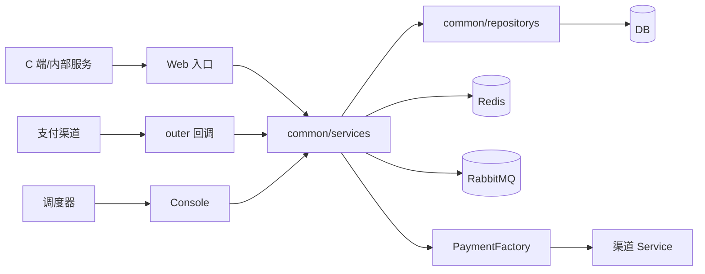
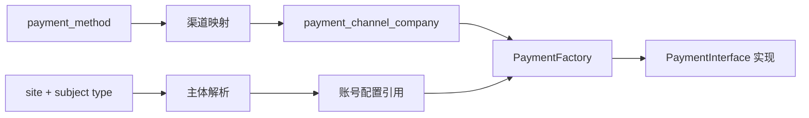
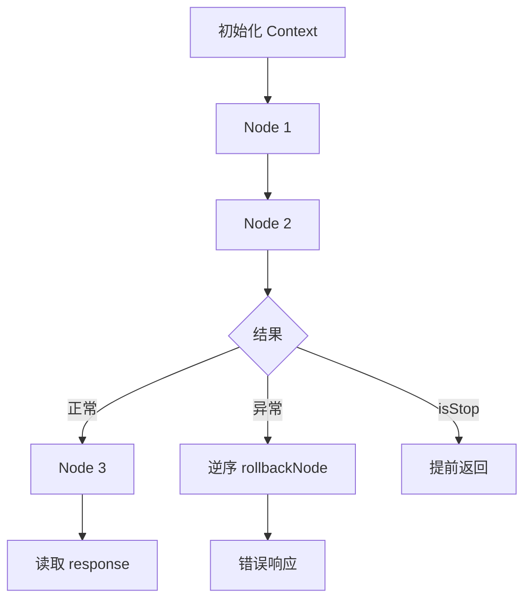
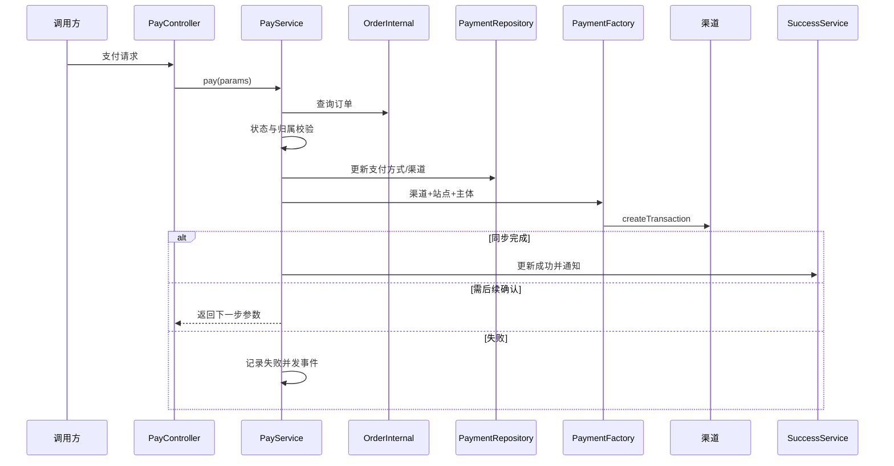
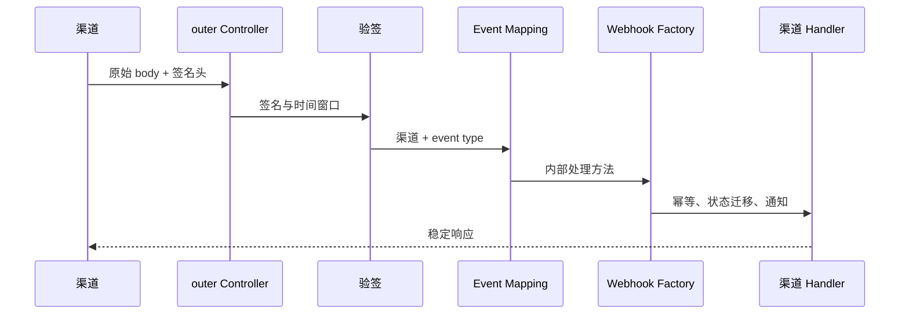

# 支付服务进阶开发指南

> 文档版本：v1.0（基于 2026-07-16 只读源码快照）  
> 适用仓库：`youngs/pay.internal.bm.com`  
> 前置：已完成新手文档，能追踪 Controller → Service → Repository → Model。  
> 标记：**现状**是源码可证明的行为；**推荐**是后续工程方向，不代表已经实现。

## 目录

1. [版本、入口与边界](#1-版本入口与边界)
2. [路由鉴权与分层](#2-路由鉴权与分层)
3. [渠道抽象](#3-渠道抽象)
4. [Context 与 Node](#4-context-与-node)
5. [支付、捕获与退款](#5-支付捕获与退款)
6. [Webhook 与争议](#6-webhook-与争议)
7. [验签、幂等、事务与对账](#7-验签幂等事务与对账)
8. [Redis、MQ、配置与日志](#8-redismq配置与日志)
9. [扩展渠道任务步骤](#9-扩展渠道任务步骤)
10. [测试、调试与部署](#10-测试调试与部署)
11. [风险与证据路径](#11-风险与证据路径)

## 1. 版本、入口与边界

| 项目 | 现状证据 | 开发含义 |
|---|---|---|
| PHP | `composer.json`：`^7.0` | 不使用 PHP 8 专属语法；运行小版本待环境确认 |
| Yii2 | `~2.0.14` | Advanced Template、DI、Filter、ActiveRecord |
| 渠道 SDK | Stripe `^9.8`、Braintree `5.4.0`、Klarna `v4.2.3`、Afterpay `1.6.2` | 能力和行为受 SDK 版本约束 |
| 基础设施 | Yii Redis、php-amqplib、Elasticsearch | 设计必须覆盖缓存失效与至少一次投递 |
| 测试依赖 | PHPUnit 6、Codeception 2 | 有依赖不等于已有完整测试套件 |

入口与配置装配：

- Web：`youngs/pay.internal.bm.com/bm-pay-api/web/index.php`
- Console：`youngs/pay.internal.bm.com/yii`
- Web bootstrap：`youngs/pay.internal.bm.com/bm-pay-api/config/bootstrap.php`
- Console bootstrap：`youngs/pay.internal.bm.com/bm-console/config/bootstrap.php`



**现状**：Web、Console 共享 `common/`；HTTP 成功不等于交易最终成功。  
**推荐**：任何设计都分别描述本地状态、渠道状态、下游状态及其收敛方式。

## 2. 路由鉴权与分层

| Controller 分区 | 调用者 | 典型能力 | 边界 |
|---|---|---|---|
| 根目录 | C 端/通用调用 | 支付、支付参数、争议 | Filter、登录态、订单归属 |
| `internal/` | 内部服务 | 统一退款、查询 | 内网隔离与服务鉴权待网关共同确认 |
| `outer/` | 支付渠道 | Webhook、3DS 回跳 | 原始 body、渠道验签、事件幂等 |
| `storeapi/` | 门店系统 | 支付方式、终端 | 门店身份与网络边界 |

关键入口：`PayController::actionPay()`、`internal\RefundController::actionRefund()`、`outer\StripeController::actionWebhook()`、`DisputesController::actionDisputed()`。

**现状**：`BaseApiController` 挂载 Filter，但部分 Filter 有占位实现；支付主链另行解析用户并校验订单归属。  
**推荐**：维护“路由 → 基类 → Filter → 网关策略 → 业务归属校验”矩阵。outer 接口不能用用户登录代替渠道验签。

分层约束：

```text
Controller：请求适配、轻量校验、统一响应
Service：领域规则、流程编排、跨服务协调
Context + Node：复杂流程的步骤与共享状态
Repository：查询、原子更新、软删除、连接选择
Model：表映射
common/api：内部 HTTP Wrapper
factory/payment：渠道选择
```

新代码不得在 Controller/Service 直接操作 Model；跨系统请求进入 Wrapper；返回使用 `endSuccess/endFail`。

## 3. 渠道抽象

三个正交维度：

1. `payment_method`：业务或用户选择的支付方式。
2. `payment_channel_company`：执行交易的渠道公司。
3. `payment_subject`：渠道下实际使用的收款主体/账号。

`PaymentRepository::$payChannelMappings` 定义方式到渠道的映射，`PayService::getPayChannelByMethod()` 负责解析；`PaymentSubjectService` 与 `PayService::getPaymentChannelConfig()` 解析主体配置。



`PaymentInterface` 覆盖创单、交易、3DS、确认、捕获、退款、取消、详情、凭证、争议、终端等能力。

**现状**：接口是能力全集；`DefaultPaymentService` 对不支持能力统一失败，具体渠道只覆盖子集。  
**推荐**：维护渠道能力矩阵，列出同步/异步、授权/捕获、部分退款、Webhook、争议、凭证、金额单位和幂等支持。接口存在不代表渠道支持。

## 4. Context 与 Node

`NodeExecutionEngine::executeEngine()` 顺序调用 `invokeNode()`；异常后逆序调用已完成节点的 `rollbackNode()`；`context->isStop` 可提前成功终止。



**现状**：引擎捕获 `Exception`；回滚依赖节点实现；渠道请求、MQ、内部通知无法被数据库事务撤销；引擎会记录 Context。  
**推荐**：每个 Node 明确输入/输出、可重入性、幂等键、事务边界、超时后的查询策略、补偿方式和日志字段白名单。Node 回滚不是分布式事务。

适合 Node：步骤多、多渠道差异、需要短路或补偿。简单单次查询不必拆分，避免依赖隐式化。

## 5. 支付、捕获与退款

### 5.1 支付主链



**现状**：订单经 Wrapper 获取；已支付短路；交易前确定方式、渠道、主体；部分渠道等待 3DS/Webhook；对外移除部分第三方数据。  
**推荐**：支付请求使用稳定业务幂等键；渠道超时先查状态；数据库使用带前置状态的原子更新；支付成功与下游通知通过可恢复事件衔接。

### 5.2 捕获

```text
PayService::capture
→ PaymentGetNode
→ PaymentCaptureCheckNode
→ PaymentCaptureNode
→ OrderGoodsCaptureCreateNode
```

Console 发货捕获会先查渠道详情判断是否已捕获，再调用 `capture()` 并更新商品捕获记录。推荐使用“支付单 + 捕获批次/商品”唯一键，累计金额用 BCMath；渠道成功而本地失败时先查询，不直接重捕。

### 5.3 退款的新旧链路

统一退款：`RefundService::refund → PaymentGetNode → OrderGoodsCaptureGetNode → RefundNode`。

申请与异步处理：`refundCreate → GetPaymentNode → RefundVerifyNode → RefundCreateNode → AddRefundHandleMqNode`。

**现状**：历史链路会延迟重试；退款成功后还要通知内部系统，失败时再次投递。  
**推荐**：退款单号唯一；累计成功/处理中金额不得超实付；渠道超时先查退款；分别补偿“渠道成功本地失败”和“本地成功通知失败”。

## 6. Webhook 与争议

`PaymentWebhookService` 通过 `WebhookEventMappingNode` 将渠道事件映射为内部方法，再由 `PaymentWebhookHandleNode` 和 Webhook 工厂调用具体服务。



争议覆盖渠道回调落库、统一争议单、MQ、自动售后/退款、人工接受和申诉。证据集中在 `DisputesService.php`、`nodes/dispute/` 与争议 Repository。

**现状风险**：多渠道存在不同历史分支；部分路径保存完整度较高的报文并拼接告警信息。  
**推荐**：以“渠道 + event id”去重；证据文件校验类型、大小和权限；自动售后校验订单状态与可退金额；告警只传内部定位 ID。

## 7. 验签、幂等、事务与对账

Webhook 必须使用原始 body 验签，校验时间戳容差和主体归属；拒绝缺失签名、算法降级与过期事件。验签失败不得进入业务，不返回内部异常。

| 场景 | 推荐幂等键 | 最终保护 |
|---|---|---|
| 支付 | 支付单号 + 请求版本 | 唯一约束、状态条件、渠道幂等 |
| Webhook | 渠道 + event id | 事件唯一约束 |
| 捕获 | 支付单 + 捕获批次 | 唯一约束、累计金额 |
| 退款 | 退款单号 | 唯一约束、渠道查询 |
| MQ | 事件类型 + 业务 ID | 消费记录或原子更新 |

Redis 锁只用于并发保护，不是最终幂等屏障。

事务建议：事务内校验状态并写处理中/待发送记录；提交后调用外部系统；保存结果时条件更新；失败进入可重入补偿。不要把网络调用放入长事务。

**现状**：可见渠道详情查询、Webhook 日志、过程日志、捕获和退款记录，但未发现覆盖全部渠道的统一日终对账框架。  
**推荐**：按渠道账单/API 比对渠道交易 ID、支付单、币种、金额和状态，输出“渠道有本地无、本地有渠道无、金额/状态不一致”。对账只产生差异和审计任务，不直接静默改账。

## 8. Redis、MQ、配置与日志

Redis 位于 `common/redis/`，用于防重锁、3DS 轮询状态、订单锁与辅助缓存。锁需有稳定 key、合理 TTL、持有者校验与异常释放。

RabbitMQ 由 `App\Utils\RabbitMq` 和 `common\services\common\MqService` 封装，覆盖开始支付、失败、过程、成功、退款、争议和税务。消息建议包含 `event_id/event_type/schema_version/occurred_at` 与非敏感业务 ID；消费者先幂等再处理，明确重试、死信和重放。

配置分三类：环境注入的敏感配置；`g_config(ConfigHelper::$PAY, ...)` 动态开关；数据库中的支付方式/主体配置。每个开关应有默认值、作用域、回滚值和清理日期。

新代码使用 `g_log_info/warning/error`。日志只保留 request_id、业务 ID、渠道、阶段和错误码；不得记录卡数据、身份令牌、渠道凭据、用户联系方式、地址或完整第三方响应。对外错误使用稳定业务码；堆栈只进脱敏后的受控日志。

## 9. 扩展渠道任务步骤

1. 输出国家、币种、3DS、捕获、退款、争议、限流、幂等能力矩阵。
2. 增加方式/渠道常量、映射及数据库初始化数据。
3. 继承默认渠道 Service，只实现真实支持的接口能力。
4. 在 `PaymentFactory` 注册，并处理主体配置缺失。
5. 统一金额单位、错误映射和第三方字段清理。
6. 新增 outer Controller、Webhook Service、工厂分支和事件映射。
7. 实现验签、事件唯一键、乱序状态迁移与未知事件策略。
8. 接入捕获、退款、争议；不支持的能力明确失败。
9. 定义 Redis TTL、消息版本、重试、死信和补偿入口。
10. 添加脱敏日志、指标与告警。
11. 沙箱验证成功、拒绝、超时、重复、乱序、部分退款和金额边界。
12. 单站点/单主体灰度，保留关闭开关和旧渠道回退；已发起交易仍需消费回调。

## 10. 测试、调试与部署
