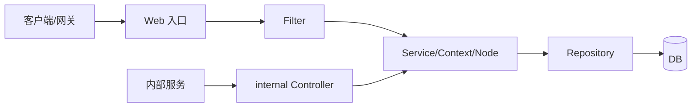
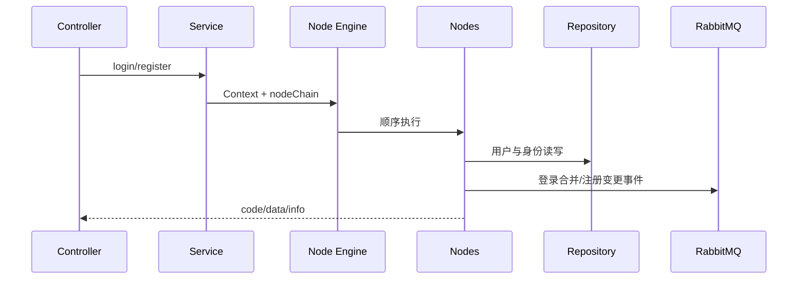
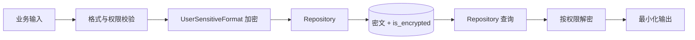

# 用户服务进阶开发指南

> 文档版本：v1.0（基于 2026-07-16 只读源码快照）  
> 适用仓库：`youngs/user.internal.bm.com`  
> 前置：已完成新手文档，能追踪 Controller → Service/Node → Repository。  
> 标记：**现状**是源码可证明的行为；**推荐**是工程建议，不代表已经实现。

## 目录

1. [版本、入口与 Console](#1-版本入口与-console)
2. [路由鉴权与分层](#2-路由鉴权与分层)
3. [注册登录与新旧编排](#3-注册登录与新旧编排)
4. [令牌、第三方登录与验证码](#4-令牌第三方登录与验证码)
5. [资料、地址与积分](#5-资料地址与积分)
6. [隐私加密与数据层](#6-隐私加密与数据层)
7. [Redis、ES 与 MQ](#7-redises-与-mq)
8. [配置、日志与错误](#8-配置日志与错误)
9. [开发任务步骤](#9-开发任务步骤)
10. [测试、调试与部署](#10-测试调试与部署)
11. [风险与证据路径](#11-风险与证据路径)

## 1. 版本、入口与 Console

| 项目 | 现状证据 | 开发含义 |
|---|---|---|
| PHP | `composer.json`：`^7.0` | 不使用 PHP 8 专属语法；运行小版本待环境确认 |
| Yii2 | `~2.0.14` | Advanced Template、DI、Filter、ActiveRecord |
| 身份 | `lcobucci/jwt 3.3.3` | JWT API 与新版不同，升级需迁移验证 |
| 基础设施 | Redis、RabbitMQ、Elasticsearch、Yii Queue | 缓存一致性、重复消息和索引滞后必须显式处理 |
| 测试依赖 | PHPUnit 6、Codeception 2 | 仓库未见完整测试目录，不能假定已有覆盖 |

Web 入口：`youngs/user.internal.bm.com/bm-user-api/web/index.php`。配置由应用 bootstrap 合并 `common/config` 和应用配置。

**Console 现状**：根目录 `yii` 引用 `bm-console/config/bootstrap.php`，但源码快照不存在该目录，所以命令入口不可用。  
**推荐**：先确认 Console 是否迁往其他部署单元；需要任务时补齐独立应用、权限、锁、审计和 dry-run，不能把 Web 调试接口当定时任务。



## 2. 路由鉴权与分层

| 分区 | 调用者 | 现状边界 |
|---|---|---|
| 根目录 | 登录、注册、资料、积分 | 基类各异，逐 Controller 检查 Filter |
| `client/` | C 端 | 处理公共参数与 OAuth |
| `internal/` | 内部服务 | 无登录 Filter，依赖内网隔离 |
| `admin/` | 管理后台 | 权限需结合上游网关确认 |
| `storeapi/` | 门店侧 | 需确认门店身份与网络边界 |

`AuthApiController` 使用 `LoginAuthFilter`，其白名单包含部分第三方登录、快捷登录与重置动作。`BaseApiController` 挂 `TokenFilter`、`CheckLoginFilter`，后二者当前基本是占位。

**推荐**：建立“路由 → 基类 → Filter → 白名单 → 网关 → 资源归属”清单；白名单默认拒绝；`internal/` 只允许可信网络和服务身份，不得公网直转。

分层约束：Controller 做取参、Form 校验和响应；Service 编排；Context/Node 拆步骤；Repository 负责 DB、加解密和软删除；Model 负责映射。

## 3. 注册登录与新旧编排

主链使用 Context 和 Node 拆分步骤，并通过统一引擎顺序执行。

登录主链：

```text
common\services\LoginService::login
→ SetThirdInfoNode → LoginCheckNode → LoginRegisterNode
→ LoginNode → ReturnDataFormatNode
```

注册主链：

```text
common\services\RegisterService::register
→ RegisterParamsCheckNode → SetGuestInfoNode → SetThirdInfoNode
→ ThirdInfoIsRegisterNode → RegisterNode
→ RegisterSubscribeNode → ReturnDataFormatNode
```



**现状**：同名 Service 多套并存。`common\services\LoginService` 是主要 C 端链；`common\services\user\LoginService` 承担 quickLogin 等旧链；`common\services\login\LoginService` 是另一套历史实现，注册也有多套。  
**推荐**：从 Controller 的实际 FQCN 反查流量，不按类名猜。新能力优先进入主链；旧入口先补契约测试和流量证据，再以适配层迁移。

Node 回滚不是跨 DB、MQ、邮件的事务。用户已创建但订阅/MQ 失败时，应记录可重试事件，不应删除用户。

## 4. 令牌、第三方登录与验证码

`JwtService` 使用本地密钥文件签发和验证令牌；普通令牌代码默认有效期 180 天，快捷登录与重置凭证为 15 分钟；开发环境与其他环境读取不同密钥目录。本文不读取也不描述密钥内容。

**现状风险**：长期令牌缺少源码可证明的统一撤销机制；验证逻辑会根据令牌头选择算法；部分短期凭证承载邮箱等个人信息。  
**推荐**：固定允许算法；验证签名、过期、用途、签发方和令牌版本；将普通 access token 缩短，使用可轮换 refresh token；密码修改、风险登录和账号禁用后按版本撤销；日志只记录哈希指纹。

## 5. 资料、地址与积分

用户主档与多身份由 `UserRepository`、`UserAuthsRepository` 管理；地址由 `UserAddressRepository` 管理；积分能力集中在 `common/services/points/`，并有根、client、internal、admin 多类入口。

**现状**：部分 internal 地址入口直接调用 Repository；积分领取由 `PointsService::receiveTaskSend()` 编排。  
**推荐**：资料更新使用字段白名单和资源归属校验；地址默认值切换应在事务中保证同一用户最多一个默认地址；积分变更使用唯一业务流水、余额原子更新和不可变审计账。积分不能只靠 Redis 锁防重。

## 6. 隐私加密与数据层

`UserSensitiveFormat` 对邮箱、电话、姓名、街道、账号和 identifier 等字段执行加解密，并通过 `is_encrypted` 兼容历史数据；查询条件可同时匹配明文与密文。



**现状风险**：邮箱采用局部结构保留方案；兼容查询扩大匹配面；模糊查询存在字符串条件拼接；解密失败可能保留原值。  
**推荐**：加密与搜索分离，敏感值密文存储，另建规范化盲索引做等值查询；禁止用字符串拼 SQL；建立密钥版本和轮换流程；批量迁移可断点、可审计；解密失败显式报错，不把密文误当明文返回。

数据库规则：查询带 `del_flag = 0`，删除用软删除；新表含 `created_at/updated_at/del_flag`，时间使用 Unix int。Controller/Service 不直接操作 Model。

## 7. Redis、ES 与 MQ

Redis 主要用于登录辅助状态、用户缓存、验证码、二次认证和积分；缓存 key、TTL、失效时机必须和数据所有者绑定。数据库写成功后优先删除缓存，缓存重建需防击穿；认证缓存故障时采用明确的 fail-open/fail-closed 策略。

ES 的直接证据包括 `ZipElasticRepository` 等索引封装，用户主登录链不应默认依赖 ES。推荐把 DB 作为事实源，ES 仅用于搜索/聚合；通过事件增量同步并提供全量重建与一致性抽检。

RabbitMQ 在登录后发送数据合并事件，在注册/用户变更后发送变更事件。消息建议包含 event id、类型、schema version、发生时间和非敏感用户 ID；消费者按 event id 幂等，明确重试、死信、重放与顺序要求。消息不得包含令牌、密码、验证码或明文个人信息。

## 8. 配置、日志与错误

配置合并顺序为公共主配置、环境覆盖、应用配置；动态配置使用 `g_config(ConfigHelper::$USER, key, default)`，禁止手写模块名。敏感值由受控环境注入，文档、日志和测试数据只写变量名或占位符。

**现状**：代码中同时存在 `g_log_*`、历史 `Yii::error()` 和自定义日志；部分异常路径记录完整请求或返回堆栈。  
**推荐**：新代码统一 `g_log_info/warning/error`，仅记录 request_id、内部用户 ID、入口、节点、错误码和耗时。密码、验证码、令牌、第三方凭证、邮箱、电话、地址不得进入日志、告警或 MQ。对外返回稳定业务码，不返回堆栈。

## 9. 开发任务步骤

以“增加一种登录方式或资料字段”为例：

1. 从实际路由和 Controller 的 FQCN 确认主链或旧链。
2. 记录鉴权、白名单、网关和资源归属要求。
3. 定义输入、稳定错误码、隐私分类和输出最小集。
4. 参数格式进入 Form；业务步骤进入 Node/Service；DB 进入 Repository。
5. 新身份在 `user_auths` 中定义类型、唯一约束与绑定冲突策略。
6. 个人字段通过统一加密与查询格式层，禁止裸写。
7. 定义注册、绑定、解绑、重复绑定和账号合并语义。
8. 定义 Redis key/TTL/失效和 MQ schema/幂等键。
9. 增加脱敏日志、失败指标、频控和风险告警。
10. 覆盖新老入口契约测试、并发、重放、依赖超时和迁移数据。
11. 使用关闭开关部署，单入口灰度，再扩流量。
12. 观察登录成功率、注册转化、验证码错误、MQ 堆积和缓存命中；异常时关开关回退。

## 10. 测试、调试与部署

最小测试矩阵：

- 注册：新用户、已注册、游客升级、并发重复、订阅/MQ 失败。
- 登录：密码、验证码、第三方、未绑定自动注册、禁用用户、令牌过期与撤销。
- 第三方：伪造凭证、错误受众、重复回调、身份冲突、依赖超时。
- 验证码：发送频控、过期、错误次数、重放、业务类型隔离。
- 资料/地址：越权、默认地址并发、加解密失败、软删除。
- 积分：重复领取、并发、回滚、余额与流水一致。
- 基础设施：Redis 不可用、ES 延迟、MQ 重复/死信、配置缺失。

调试顺序：确认环境和入口 → 记录脱敏 request_id/用户 ID → 查 Filter 与实际 Service → 查 `user/user_auths` 及软删除状态 → 查 Redis → 查 MQ → 必要时查 ES → 用日志验证节点。数据库中的个人字段可能是密文，禁止用明文 SQL 直接下结论。

部署顺序：兼容 DDL/索引 → 关闭状态配置 → 代码 → 灰度开关 → 扩量。数据迁移分批、可断点、可回滚并记录数量校验。Console 缺失期间不要编造 `php yii` 验证；使用已批准的 HTTP 测试或专用受控脚本。示例域名统一使用 `https://bm.example`。

## 11. 风险与证据路径

主要现状风险：鉴权 Filter 存在占位；internal 依赖网络隔离；JWT 默认生命周期长且算法选择需收紧；验证码位数、随机源、复用与失败次数需要治理；多套登录/注册链易改错；日志可能携带完整请求；Console 入口残缺；个人信息兼容查询与模糊查询风险较高。

核心证据：

- `youngs/user.internal.bm.com/composer.json`
- `youngs/user.internal.bm.com/README.md`
- `youngs/user.internal.bm.com/yii`
- `youngs/user.internal.bm.com/bm-user-api/controllers/LoginController.php`
- `youngs/user.internal.bm.com/bm-user-api/controllers/RegisterController.php`
- `youngs/user.internal.bm.com/bm-user-api/controllers/ThirdController.php`
- `youngs/user.internal.bm.com/bm-user-api/controllers/internal/UserAddressController.php`
- `youngs/user.internal.bm.com/bm-user-api/filters/TokenFilter.php`
- `youngs/user.internal.bm.com/bm-user-api/filters/CheckLoginFilter.php`
- `youngs/user.internal.bm.com/common/filters/LoginAuthFilter.php`
- `youngs/user.internal.bm.com/common/services/LoginService.php`
- `youngs/user.internal.bm.com/common/services/RegisterService.php`
- `youngs/user.internal.bm.com/common/services/user/JwtService.php`
