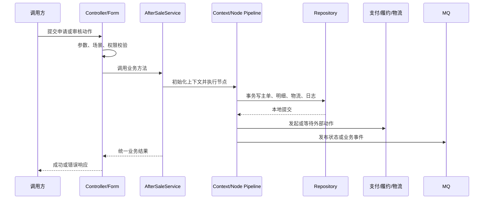
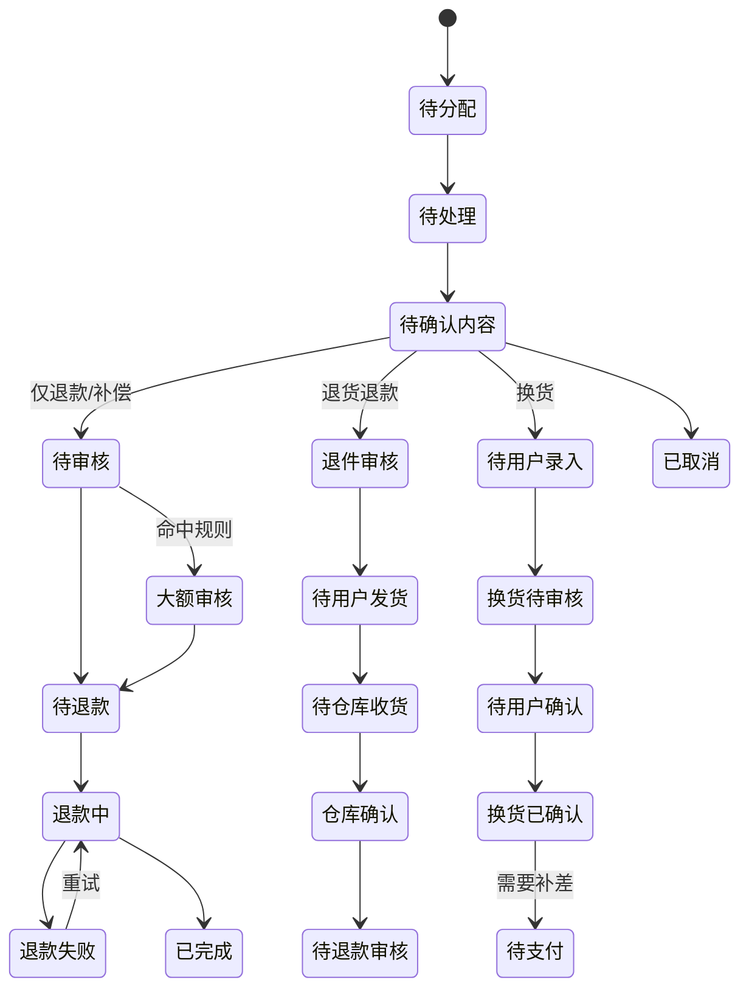
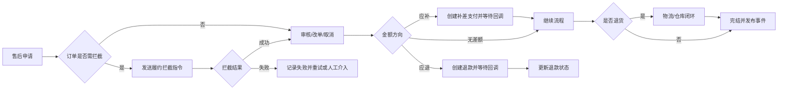

# bm 售后服务进阶开发指南

> 本文基于源码静态分析，面向维护退款、退货、换货及其外部协作链路的后端工程师。“现状”描述可由源码确认的行为；“推荐”是演进建议，不代表系统已经具备。

## 1. 技术基线与系统边界

### 1.1 现状

- PHP `^7.0`，Yii 2 Advanced，框架约束为 `~2.0.14`。
- 数据访问采用 Yii ActiveRecord，并在 `common/repositorys`（源码保留该拼写）封装 Repository。
- Redis 由 Yii Redis 组件和业务 Redis 类共同使用；RabbitMQ 由 `php-amqplib` 及项目封装发送。
- Web 与 Console 入口分离，共享模型、仓储、服务、节点、上下文和枚举。
- 售后服务协调订单、支付、履约、退货物流、仓库、邮件及异步事件，不是孤立退款模块。

证据：`youngs/bm-aftersale-service/composer.json`、`youngs/bm-aftersale-service/bm-aftersale-api/config/main.php`、`youngs/bm-aftersale-service/bm-console/config/main.php`。

### 1.2 推荐认知

把售后单视为长事务编排实例，而不是一张可任意更新状态的表。数据库事务只能保证本地写入；支付退款、物流、履约指令和 MQ 均是跨系统副作用，必须通过幂等键、可重试记录和补偿流程保证最终一致。

## 2. 目录与职责

```text
bm-aftersale-api/
  controllers/{admin,client,internal,storeapi}/  不同调用方的 HTTP 入口
  forms/                                         参数和场景校验
bm-console/controllers/                          修复、补偿、批处理命令
common/
  enums/                                         状态、方案、动作枚举
  models/                                        ActiveRecord 与字段约束
  repositorys/                                   查询、写入、软删除过滤
  services/processingType/                       处理方案策略
  services/nodes/ + contexts/                    管道节点与流程上下文
  services/{oms,payment,ams,cache,common}/        外部协作与基础设施
  redis/                                         锁和缓存
```

阅读调用链：`Controller -> Form -> Service -> Context/Node 或 ProcessingType -> Repository -> Model`。Controller 负责协议、校验和响应；Service 编排业务；Repository 固化数据语义；Model 表达表和字段规则。

## 3. 请求生命周期



申请保存节点在同一数据库事务中写商品明细、换货推荐或商品、售后主单、物流信息和操作日志，提交后发送异步消息。证据：`youngs/bm-aftersale-service/common/services/nodes/apply/SaveDataNode.php`。

风险：提交后直接发消息存在“数据库成功、消息失败”的窗口；外部调用若在事务内，则可能出现“外部成功、本地回滚”。推荐使用事务 Outbox：事务内写业务数据和唯一事件记录，独立发布器投递，消费端按 `event_id + aggregate_id` 去重。

## 4. 处理方案与状态机

### 4.1 三个维度

- `processing_type` 表示处理方案：仅退款、退货退款、换货、补偿、修改订单、补差、补发、服务增减、税费退款等。
- `status` 表示当前阶段：待处理、待审核、退件审核、待用户发货、待仓库收货、待退款、退款中、失败、完成等。
- `action` 表示事件语义：申请、用户申请、更新、取消、完成、退款成功。

证据：`youngs/bm-aftersale-service/common/enums/AfterSaleProcessTypeEnum.php`、`youngs/bm-aftersale-service/common/enums/AfterSaleStatusEnum.php`、`youngs/bm-aftersale-service/common/enums/AfterSaleActionEnum.php`。

### 4.2 申请初态（现状）

- 仅退款、补偿、补差单退款等进入待审核。
- 退货退款进入退件审核。
- 换货按录入方式进入待用户录入或待用户确认。
- 补差、修改收货方式、修改订单信息进入内容已确认。
- 暂存统一停在协商或待确认阶段。

证据：`youngs/bm-aftersale-service/common/services/nodes/submitAuditOrTemporaryData/PreDataFormatNode.php`。

### 4.3 核心状态图



这是便于维护的归纳图，不替代具体分支条件。现状并非单一集中式状态机：状态定义集中，但迁移分散在审核服务、处理方案类、节点、回调和 Console 中。

### 4.4 退货退款

核心路径为申请、退件审核、填写退货物流、仓库收货、退款审核、可能的大额审核、退款、完结。物流信息既落库又写 Redis，并从物流系统同步轨迹、面单和妥投状态。证据：`youngs/bm-aftersale-service/common/services/cache/ReturnCacheService.php`。

排查顺序：主单状态 -> 物流表 -> 物流缓存 -> 外部退货单 -> 仓库回调 -> 退款单。主单可能只表达“等待外部确认”，不能单独作为故障结论。

### 4.5 换货

换货有用户录入、客服录入和自主换货等分支，可能产生新商品、推荐商品、补差支付、原订单拦截或取消及新订单。税费使用高精度运算计算新旧差额，并限制为非负。证据：`youngs/bm-aftersale-service/common/services/nodes/exchange/` 与 `youngs/bm-aftersale-service/common/services/nodes/submitAuditOrTemporaryData/PreDataFormatNode.php`。

风险：换货是“旧单终止 + 新商品确认 + 差额收退 + 新单生成”的组合流程。任一重复回调都可能重复建单或重复收退。

## 5. 订单、支付和物流协作



现状中履约命令具有独立命令状态和日志，退款状态也区分待退款、退款中、失败和成功。必须区分“请求已发送”与“业务已确认”。

推荐为每个外部动作建立统一协作记录：业务键、请求摘要、外部请求号、状态、重试次数、下次重试时间、最后错误和响应摘要。不要通过主单状态反推所有外部动作。

## 6. 事务、幂等与一致性

### 6.1 现状

- 多个处理方案和节点显式开启、提交和回滚事务。
- 售后号在 Model 规则中唯一，可阻止同号重复插入。
- 提交审核入口使用 Redis 短锁抑制快速重复请求。
- 退款、履约、MQ 依赖回调和异步事件推进最终状态。

### 6.2 推荐检查清单

1. 状态更新使用条件更新：`WHERE id=? AND status IN (...)`，受影响行数必须为 1。
2. 幂等键使用稳定业务键；创建退款、补差单、换货单、补发单必须有数据库唯一约束。
3. Redis 锁只降低并发，不是最终正确性依据；锁过期后仍由数据库约束兜底。
4. MQ 消费先登记消费键，再执行副作用；成功的重复消费直接返回成功。
5. 金额使用定点数或 BCMath，禁止浮点比较。
6. 事务内不做不可控远程调用，拆成“本地意图 -> 异步执行 -> 回写结果”。

## 7. MQ、Redis 与 Console

MQ 封装支持状态变化、分析事件和邮件事件。状态事件包含售后号、状态、操作者、动作和来源。证据：`youngs/bm-aftersale-service/common/services/common/MqService.php`。

Redis 用于短锁、物流和资源缓存。缓存不是事实源：缺失时回源，冲突时按明确的数据所有权规则处理。

Console 包含历史回填、状态修复及退款或履约重试。证据：`youngs/bm-aftersale-service/bm-console/controllers/AfterSaleController.php`。推荐命令统一支持 `--dry-run`、批次上限、游标断点、明确环境、操作依据、前后摘要、可重复执行和失败清单。生产修复不得依赖从日志文本反向解析业务语义。

## 8. 配置、日志与错误

现状：Web 与 Console 分别配置日志；Controller 使用统一成功或失败响应，并通过业务日志函数记录请求与结果；SQL 日志仅在调试环境开启。

风险：部分路径整体记录请求参数和异常堆栈，而售后参数可能包含隐私及支付字段。推荐按字段白名单记录；敏感字段禁止落日志；错误响应只返回错误码、可理解信息和 `trace_id`；配置值由环境或配置中心注入。

## 9. 测试与调试

仓库未发现成体系的自动化测试目录，这是高风险流程的重要债务。最小测试矩阵：状态允许与拒绝迁移；各处理方案初态和金额方向；事务中途失败回滚；并发提交、重复回调和 MQ 重投；支付、履约、物流及仓库集成；退款不超上限、数量不为负、终态不可倒退。

调试时用一个脱敏售后号串起主单、明细、状态日志、履约命令、退款单、MQ 消费和外部请求日志，先构建时间线，再判断故障点。

## 10. 常见任务

- 新增处理方案：定义枚举和初态，实现策略，补表单校验、金额规则、迁移、日志、事件与回调。现状通过扫描 PHP 文件和反射匹配策略；推荐改为显式映射或容器注册。证据：`youngs/bm-aftersale-service/common/services/processingType/AfterSaleHandleService.php`。
- 新增状态：同步检查类型映射、可执行动作、审核、回调、文案、MQ、统计、Console 和终态判断。
- 增加回调：验证签名与时间窗，以外部事件号去重，条件更新状态，成功的重复回调返回成功，未知业务号进入异常队列。

## 11. 排障

- 卡在退款中：检查退款请求、外部状态、回调消费键、条件更新和重试任务。
- 卡在同步中：检查履约命令表，确认是否外部成功但回写失败，不盲目重发。
- 重复退款或建单：检查唯一约束、幂等键、消费去重和锁 TTL。
- 已签收未推进：检查物流缓存、轨迹节点映射、包裹数量、仓库确认和退件审核。
- 金额不一致：核对可退上限、商品/税费/服务拆分、汇率快照、累计退款及补差方向。

## 12. 风险债务

1. 状态迁移分散，难以证明完整性。
2. PHP 与 Yii 基线较旧。
3. 动态扫描策略不利于性能、测试和静态分析。
4. 本地事务与 MQ 或外部 API 之间缺少统一 Outbox/Saga。
5. Controller 和服务存在大文件与多重职责。
6. 自动化测试不足，Console 修复承担质量兜底。
7. 日志存在过量采集风险。
8. 历史注释与实际常量可能不一致，应以可执行代码为准。

## 13. 阅读顺序

1. `youngs/bm-aftersale-service/common/enums/AfterSaleProcessTypeEnum.php`
2. `youngs/bm-aftersale-service/common/enums/AfterSaleStatusEnum.php`
3. `youngs/bm-aftersale-service/bm-aftersale-api/controllers/admin/AfterSaleController.php`
4. `youngs/bm-aftersale-service/common/services/AfterSaleService.php`
5. `youngs/bm-aftersale-service/common/services/nodes/` 与 `youngs/bm-aftersale-service/common/services/contexts/`
6. `youngs/bm-aftersale-service/common/services/processingType/`
7. `youngs/bm-aftersale-service/common/repositorys/AfterSaleRepository.php`
8. `youngs/bm-aftersale-service/common/models/AfterSale.php`
9. `youngs/bm-aftersale-service/common/services/{oms,payment,ams,cache,common}/`
10. `youngs/bm-aftersale-service/bm-console/controllers/`
