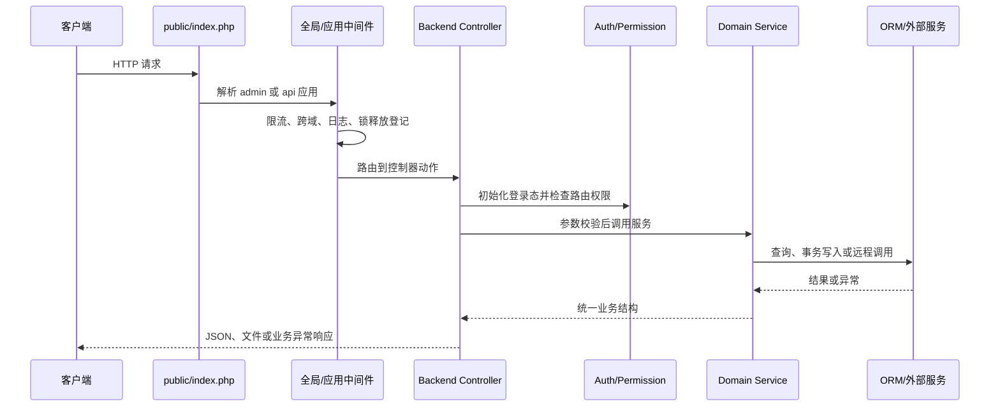
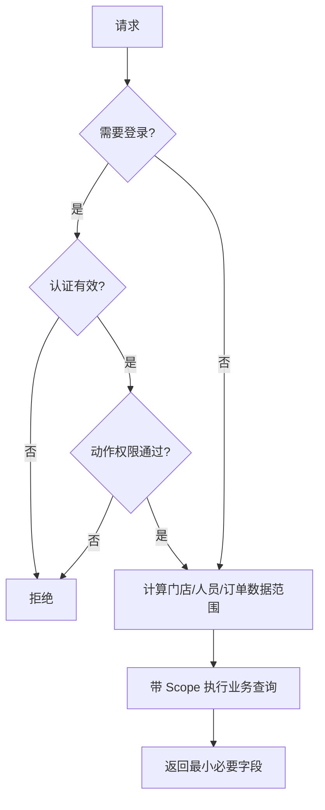

# bm 门店 API 进阶开发指南

> 本文基于源码静态分析，面向维护门店后台、业务 API、订单、库存、用户和统计能力的工程师。“现状”描述源码行为；“推荐”是演进建议。

## 1. 技术基线

- PHP `>=8.2`，ThinkPHP `8.1.1`，ThinkORM `3.0.33`。
- 使用 ThinkPHP 多应用扩展、限流和迁移组件，后台骨架采用 BuildAdmin。
- Redis 客户端、PDF、电子表格、对象存储和分布式 ID 均有依赖。
- 默认应用为 `admin`，另有 `api` 应用；公共能力位于 `app/common`。

证据：`youngs/bm-store-api/composer.json`、`youngs/bm-store-api/config/app.php`。

## 2. 目录与职责

```text
public/index.php              Web 入口
app/admin/                   管理后台应用：Controller、Model、Validate、Auth
app/api/                     业务 API 应用
app/common/controller/       Api、Backend、外部接口基类
app/common/service/          订单、库存、用户、门店、支付、统计等服务
app/common/model/            公共 ORM 模型
app/common/library/          登录态、Redis、配置、外部服务辅助类
app/common/middleware/       跨域、日志、锁释放
app/command/                 定时、同步、结算和初始化命令
app/provider/                Redis、配置键、外部客户端等容器绑定
config/                      应用、数据库、缓存、日志、限流配置
database/migrations/         版本化结构和初始化数据
```

现状主要链路为 `入口 -> 应用中间件 -> Controller/Validate -> Service -> Model 或外部服务 -> 统一响应`。部分通用 CRUD 由 BuildAdmin Trait 直接通过 Model 实现；复杂业务集中在 `app/common/service`。

推荐：Controller 只处理协议、身份、参数和响应；复杂写操作必须进入 Service。对跨聚合业务逐步引入 Repository 或 Gateway，避免 Service 直接散落多数据源细节。

## 3. 多应用请求生命周期



全局中间件包含 Redis 锁请求结束释放和限流；`admin` 应用另有跨域、管理日志、多语言及请求响应日志；`api` 应用主要加载跨域与语言。证据：`youngs/bm-store-api/app/middleware.php`、`youngs/bm-store-api/app/admin/middleware.php`、`youngs/bm-store-api/app/api/middleware.php`。

## 4. 路由、中间件、鉴权和权限

### 4.1 现状

后台基类初始化时读取认证信息，验证登录态，再以 `控制器路径/动作` 检查权限；之后触发后台初始化事件并记录最近访问。`noNeedLogin` 和 `noNeedPermission` 提供动作级豁免。证据：`youngs/bm-store-api/app/common/controller/Backend.php`。

权限不只有菜单或接口 RBAC，还包括数据范围：总部、店长、店员在门店、店员和订单范围上拥有不同可见集合。订单查询会先计算允许的订单号集合，再传给订单服务。

### 4.2 关键风险

- 某订单控制器当前以 `noNeedPermission = [*]` 跳过动作权限，属于明确风险，应确认是否仅为临时验收配置。
- 登录鉴权和业务数据权限是两层边界；通过路由权限不代表可读取任意门店数据。
- 开发免登录虽受环境和显式开关限制，仍依赖固定管理员身份，配置错误会扩大本地数据权限。
- 权限依赖外部人员/门店关系时，失败必须拒绝访问，不能把依赖异常解释为空权限或全权限。

### 4.3 推荐

权限校验采用默认拒绝；Controller 声明业务权限名，数据权限统一形成 Scope 对象并注入查询；新增接口必须测试未登录、无路由权限、跨门店访问、店员越权、总部访问和依赖失败六类场景。



## 5. 业务域：库存、订单、用户和统计

### 5.1 库存

现状：库存服务先由门店仓库映射站点，通过内部商品服务分页取商品，再调用供应链服务批量查询门店、站点和在途库存，最终合并结果。证据：`youngs/bm-store-api/app/common/service/stock/StockService.php`。

风险：这是跨服务快照，不具备同一时刻强一致性；不能直接把列表库存当作扣减依据。推荐下单时由库存所有者执行原子预占，并使用业务号幂等；展示查询标注采集时间和失败降级策略。

### 5.2 订单与报价单

订单 Controller 提供列表、详情、轨迹、地址修改、下单试算、下单、PDF 等能力，主体委托给 OrderService。报价单新增会在事务内写主记录、地址和商品，编辑时先校验允许状态，再事务更新并逻辑删除旧商品。证据：`youngs/bm-store-api/app/admin/controller/order/OrderController.php`、`youngs/bm-store-api/app/common/service/order/QuotationService.php`。

推荐：订单和报价单状态更新使用条件更新或版本号；外部下单与本地事务分离；PDF 远程资源启用需设置下载白名单、大小和超时限制；日志不得完整记录地址或联系方式。

### 5.3 用户

用户域包含认证、地址、跟进和门店授权。任何用户查询都应同时应用身份权限和门店数据范围；个人字段在日志、导出和异常中按最小化原则处理。

### 5.4 统计

统计服务按时间、门店和店员聚合跟进数据，并跨另一数据源分批判断成交；还组合订单与售后统计生成门店、站点和人员维度报表。证据：`youngs/bm-store-api/app/common/service/overview/OverviewService.php`。

风险：跨库统计不是事务快照；源字段语义、时间边界和晚到数据会导致口径漂移。推荐为每个指标定义口径、时区、去重键、刷新时间、数据延迟和重算规则。

## 6. 事务、并发与幂等

### 6.1 现状

- 报价、活动、权限和账户等流程显式使用数据库事务。
- 个别余额或积分模型查询使用行锁。
- Redis 锁使用 `SET NX EX` 原子加锁，以唯一锁值标识持有者，并用 Lua 校验归属后续期或释放。
- 全局中间件在响应结束释放本请求登记的锁，异常退出仍依赖 TTL。

证据：`youngs/bm-store-api/app/common/library/redis/RedisLock.php`、`youngs/bm-store-api/app/common/middleware/RedisLockAutoRelease.php`。

### 6.2 推荐模式


Redis 锁用于削峰，数据库唯一约束、条件更新或版本号用于最终正确性。锁 TTL 必须覆盖最坏处理时长或安全续期；跨请求锁关闭自动释放时要显式记录所有权。远程调用不应包在长事务中。

## 7. 导入导出

现状具备 CSV、电子表格和 PDF 服务；统计接口通常先返回 `headers/field/list`，由上层生成文件；订单 PDF 使用 HTML 渲染。

推荐：大数据导出异步化，使用游标分页并固定查询快照；导出前重复应用数据权限；单元格防公式注入；限制行数、列宽、图片和远程资源；文件设置过期时间并记录审计。导入使用模板版本、表头校验、逐行错误报告、dry-run、批次事务和幂等批次号。

## 8. 配置中心与服务提供者

现状：静态配置位于 `youngs/bm-store-api/config/`，环境差异通过环境变量读取；Provider 将 Redis、配置键和外部客户端绑定到容器。证据：`youngs/bm-store-api/app/provider/RedisServiceProvider.php`、`youngs/bm-store-api/app/provider/RdkeyServiceProvider.php`。

推荐将配置分为启动期静态配置和运行期动态配置。动态配置必须有类型、默认值、版本、灰度范围、缓存 TTL、回滚策略和变更审计。敏感值只由环境或密钥系统注入，文档和日志只出现占位符；示例域名统一使用 `bm.example`。

## 9. 日志、错误与可观测性

文件日志格式包含时间、来源、路由、请求 ID、级别、模块和消息。业务异常统一返回业务码、消息、时间、数据及 `trace_id`。证据：`youngs/bm-store-api/config/log.php`、`youngs/bm-store-api/app/exception/business/AbstractBusinessException.php`。

推荐日志结构化为 JSON，并统一字段：`trace_id`、`route`、`actor_id`、`store_scope`、`biz_no`、`latency_ms`、`dependency`、`result`。禁止记录认证材料、会话标识、个人字段和连接信息。异常分为参数、权限、状态冲突、依赖失败和系统错误；仅依赖失败和系统错误进入告警。

## 10. 命令与部署

Console 注册了店员佣金、商品同步、成本初始化、活动同步、账号同步、优惠计算和过期处理等命令。证据：`youngs/bm-store-api/config/console.php`、`youngs/bm-store-api/app/command/`。

推荐部署顺序：检查 PHP 扩展和配置 -> 安装锁定依赖 -> 执行可回滚迁移 -> 清理或预热缓存 -> 平滑重启 -> 健康检查 -> 小流量验证 -> 启用定时命令。命令需支持互斥锁、dry-run、批次上限、断点、幂等、超时、退出码和指标。迁移应向前兼容，先扩展字段，再发布读写兼容代码，最后清理旧结构。

## 11. 测试与调试

仓库未发现常规 `tests` 目录，但存在命令式单元测试入口。现状不足以覆盖权限和跨服务业务风险。建议分层：纯计算和状态规则单测；Controller 权限测试；数据库事务集成测试；Redis 锁并发测试；外部客户端契约测试；导入导出文件测试；命令幂等和断点恢复测试。

本地调试使用占位环境配置和隔离数据。先确认请求落在哪个应用，再检查中间件、Controller 初始化、路由权限、数据 Scope、Service、ORM/外部调用和统一异常。通过 `trace_id` 串联日志，不以临时关闭鉴权作为常规调试手段。

## 12. 常见开发任务

- 新增后台接口：选择应用和 Controller；声明登录及权限；增加 Validate；将逻辑放入 Service；应用数据 Scope；使用统一响应和业务异常；补权限及越权测试。
- 新增门店查询：先解析总部、店长、店员身份，再把允许门店集合放入查询；禁止仅依赖前端传入门店 ID。
- 新增库存动作：区分查询、预占、扣减、释放；定义幂等键和所有者；并发失败返回可识别冲突。
- 新增统计指标：先写口径、时间和去重定义，再实现聚合；避免请求时逐行跨服务查询。
- 新增导入导出：复用公共服务，重新校验权限，防公式注入，并设置行数和文件生命周期。
- 新增命令：注册命令名，支持互斥、dry-run、批次和退出码，明确调度频率及失败告警。

## 13. 排障

- 接口提示未登录：检查应用、认证信息提取、缓存登录态、过期策略和环境免登录开关。
- 已登录但无数据：区分路由权限与数据权限，检查角色类型、门店关系和允许订单集合的依赖调用。
- 库存不一致：核对商品站点映射、查询时间、供应链响应和是否误把展示库存当可售库存。
- 重复下单或重复优惠：检查业务幂等键、唯一约束、Redis 锁范围、TTL 和事务条件更新。
- 统计口径漂移：检查时区、时间字段、软删除过滤、跨库延迟、去重和百分比公式。
- 导出超时：检查是否同步全量加载、是否逐行远程调用，以及是否缺少游标和异步任务。
- 锁未释放：检查自动释放登记、是否关闭自动释放、进程异常和 TTL；不得删除不属于当前持有者的锁。

## 14. 风险与技术债务

1. 部分 Controller 明确跳过动作权限，需尽快收口。
2. Service 直接访问多外部系统和多数据源，边界复杂。
3. 跨库统计在请求路径执行，性能和口径一致性风险较高。
4. 自动化测试体系不足，命令式测试不易持续执行。
5. 通用 CRUD 与复杂业务并存，可能绕过统一 Service 约束。
6. 同步导出和远程 PDF 资源可能造成内存、SSRF 和超时风险。
7. 配置文件中存在不应硬编码的安全参数；应迁移到安全注入并轮换。
8. 日志默认非 JSON，跨服务检索与字段治理成本较高。

## 15. 阅读顺序

1. `youngs/bm-store-api/composer.json` 与 `youngs/bm-store-api/config/app.php`
2. `youngs/bm-store-api/app/middleware.php`、`youngs/bm-store-api/app/admin/middleware.php`、`youngs/bm-store-api/app/api/middleware.php`
3. `youngs/bm-store-api/app/common/controller/Api.php` 与 `youngs/bm-store-api/app/common/controller/Backend.php`
4. `youngs/bm-store-api/app/admin/library/Auth.php`
5. `youngs/bm-store-api/app/admin/controller/order/OrderController.php`
6. `youngs/bm-store-api/app/common/service/order/`
7. `youngs/bm-store-api/app/common/service/stock/StockService.php`
8. `youngs/bm-store-api/app/common/service/user/` 与 `store/`
9. `youngs/bm-store-api/app/common/service/overview/OverviewService.php`
10. `youngs/bm-store-api/app/common/library/redis/`
11. `youngs/bm-store-api/app/provider/` 与 `youngs/bm-store-api/config/`
12. `youngs/bm-store-api/app/command/` 与 `youngs/bm-store-api/database/migrations/`

完成基础链路后，选择一个“订单列表”请求和一个“报价单编辑”写请求，分别追踪权限过滤与事务更新；再选择一个命令，核对其幂等、锁和失败恢复。
