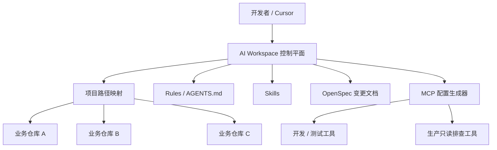
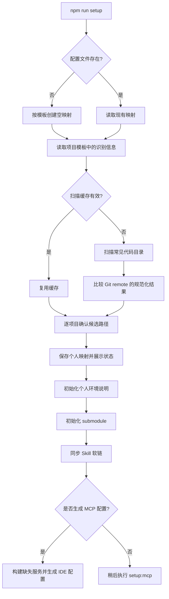
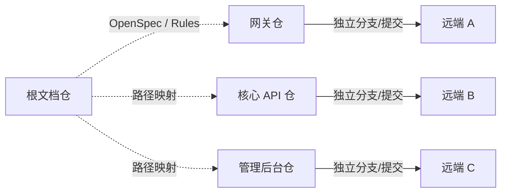
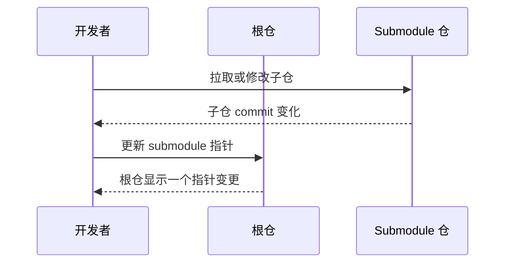
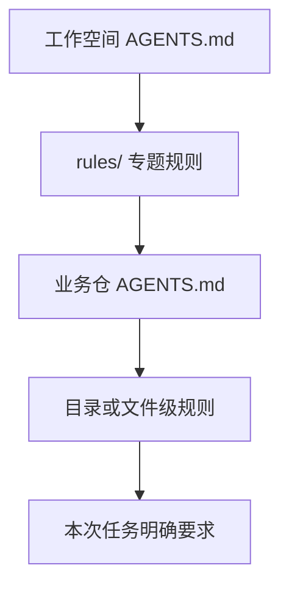
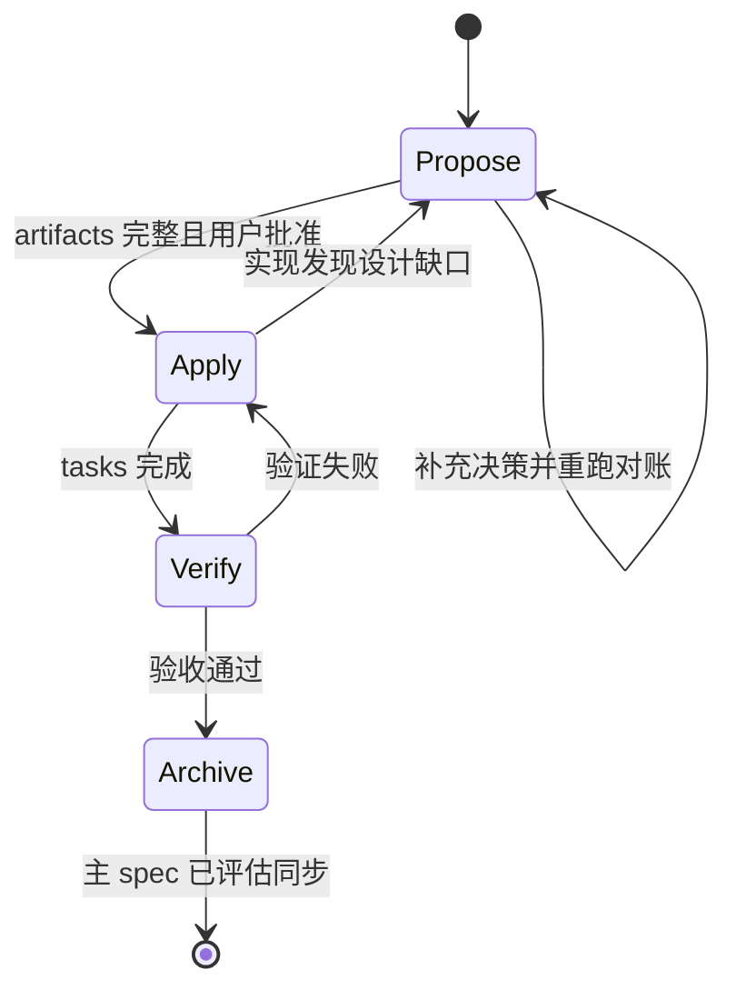
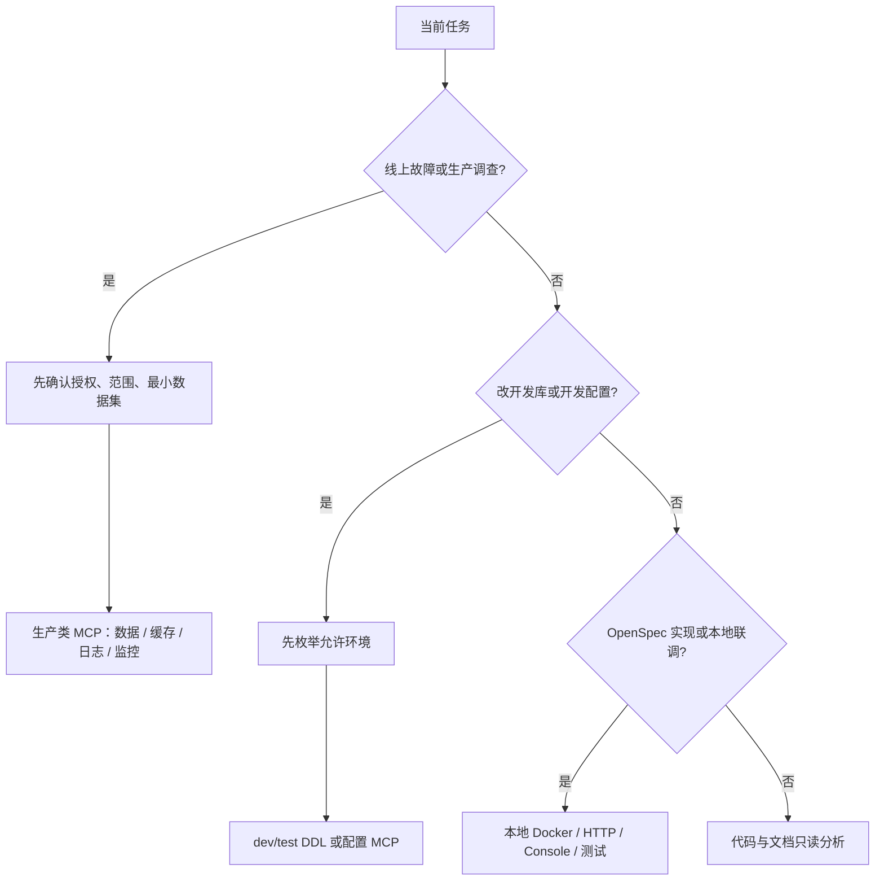
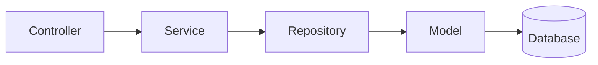
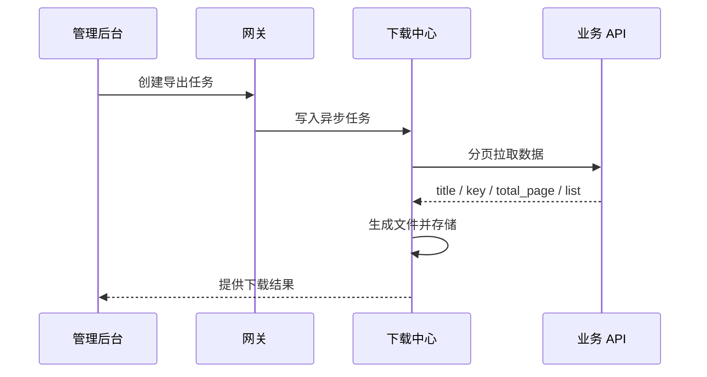
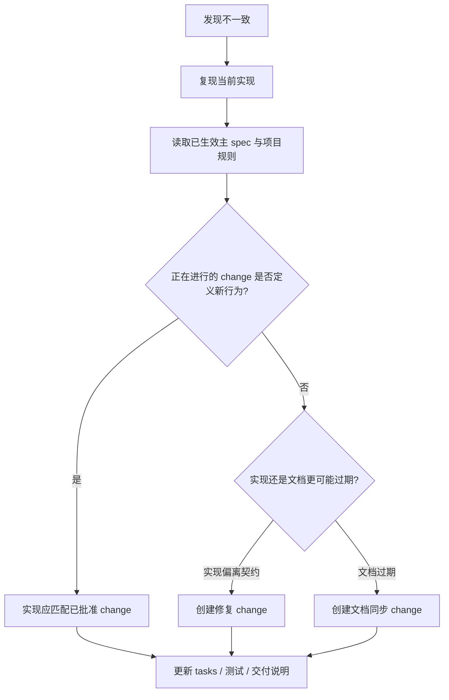

# 07. AI Workspace 进阶使用指南

> 适用读者：已经完成新手文档、能够在 Cursor 中完成单仓库修改，希望掌握多仓库协作、规范治理、OpenSpec 和 MCP 的开发者。
>
> 本文以脱敏后的 `bm` 工作空间为例。路径、仓库名、主机和配置值均为示意，不代表任何真实环境。

## 1. 先建立正确心智模型

AI Workspace 的核心价值不是“把所有代码放进一个大仓库”，而是提供一个统一的**控制平面**：它告诉 AI 去哪里找项目、先读哪些规则、可调用哪些技能和工具，以及一项需求应该如何从方案走到交付。

业务代码仍保存在彼此独立的 Git 仓库中。工作空间根仓主要保存治理资料、自动化脚本、OpenSpec 变更文档，以及 MCP、Skill 两个 submodule 的指针。



### 1.1 现状

- 根仓与业务仓库是独立 Git 仓库，各自拥有分支、提交历史和远端。
- 根仓通过 `workspace.config.json` 保存“项目逻辑名 → 本机路径”的映射。
- `AGENTS.md` 与 `rules/` 提供常驻约束；项目自身的 `AGENTS.md` 提供局部约束。
- `skills` 提供按任务触发的操作手册和脚本，不等同于常驻规则。
- `openspec/` 保存需求、设计、增量规格、任务、部署说明和归档记录。
- MCP Server 与团队 Skill 以 submodule 引入，根仓只记录固定版本指针。

### 1.2 推荐实践

把根仓视为“导航、契约与护栏”，不要把它当作业务源码集合。接到任务时，先回答四个问题：

1. 需求影响哪些独立仓库？
2. 每个仓库的真实路径和局部规则是什么？
3. 当前属于分析、方案、实现、归档，还是线上排查？
4. 当前环境允许调用哪些 MCP，哪些操作必须在本地完成？

只要这四个问题没有答案，就不应直接改代码。

## 2. 目录结构：每一层解决什么问题

下面是脱敏后的逻辑结构，实际条目会随版本演进：

```text
youngs/ai-workspace/
├── AGENTS.md                       # 工作空间总规则与入口
├── PROJECTS.md                     # 项目版图、技术栈、调用关系
├── README.md                       # 初始化和常用命令
├── package.json                    # npm scripts 入口
├── workspace.config.example.json   # 可共享的项目清单与仓库识别信息
├── workspace.config.schema.json    # 配置结构约束
├── workspace.config.json           # 个人路径映射，不提交
├── LOCAL_ENV.example.md            # 个人环境说明模板
├── LOCAL_ENV.md                    # 个人环境说明，不提交
├── mcp.config.example.json         # MCP 配置模板，不放真实凭据
├── scripts/
│   ├── setup.mjs                   # 初始化总入口
│   └── lib/                        # 扫描、配置、MCP、Skill 同步模块
├── rules/                          # 跨项目强制规则
├── openspec/
│   ├── specs/                      # 已生效的主规格
│   └── changes/                    # 活跃变更与 archive
├── bm-mcp-server/                  # MCP Server submodule（示意名）
└── bm-skill/                       # 团队 Skill submodule（示意名）
```

### 2.1 哪些文件可以共享，哪些必须本地化

**可提交、可评审：**模板、Schema、规则、OpenSpec、脚本、submodule 指针。

**只留本机：**真实项目路径、个人 Docker/别名说明、扫描缓存、IDE 生成配置、任何访问凭据。

这个边界非常重要：`workspace.config.example.json` 描述“有哪些项目、如何识别”；`workspace.config.json` 描述“它们在你的电脑哪里”。前者属于团队知识，后者属于个人状态。

## 3. workspace.config 初始化机制

### 3.1 配置的职责

AI 在访问业务项目之前，必须先读取 `workspace.config.json`，用项目逻辑名解析真实路径，然后再读取该项目自己的 `AGENTS.md`。不要猜路径，也不要根据最近打开的目录推断。

脱敏示意：

```json
{
  "projects": {
    "gateway": "youngs/projects/gateway",
    "core-api": "youngs/projects/core-api",
    "admin-web": "youngs/projects/admin-web"
  }
}
```

真实映射不得复制到文档、Issue、日志或聊天输出中。

### 3.2 `npm run setup` 实际做了什么



扫描器不会仅凭目录名认项目，而是读取 Git remote，规范化后与模板中的目标仓库标识比较。常见依赖目录、构建目录和系统目录会被跳过；扫描深度有限，避免遍历整台机器。若找到一个候选，会请求确认；找到多个候选，会让你选择；找不到时允许手工填写或留空。

留空不是“配置完成”，只是允许你暂时不使用该项目。任务涉及该项目时必须补齐。

### 3.3 npm scripts 速查

| 命令 | 现状行为 | 何时使用 |
|---|---|---|
| `npm run setup` | 完整交互式初始化；映射、个人环境、submodule、Skill，并可继续生成 MCP | 首次使用或配置缺失 |
| `npm run setup:force` | 忽略扫描缓存，重新发现仓库 | 仓库移动、重克隆、缓存错误 |
| `npm run validate` | 校验映射路径并输出 OK / MISSING / EMPTY | 修改配置后 |
| `npm run status` | 汇总配置、个人环境文件和 submodule 状态 | 日常健康检查 |
| `npm run setup:mcp` | 构建缺失的 MCP 产物并生成多 IDE 配置 | 首次启用或模板变化后 |
| `npm run pull:mcp` | 更新 MCP submodule、强制全量构建、重新生成配置 | 拉取 MCP 新版本后 |
| `npm run pull:skill` | 更新 Skill submodule、更新指针并重新同步软链 | 获取团队新 Skill 后 |
| `npm install` | `postinstall` 做轻量检查并同步 Skill | 安装根仓依赖时 |

**推荐：**初始化必须使用 `npm run setup`，不要手工拆成“复制配置、初始化 submodule、创建软链”等零散步骤。脚本是幂等入口，手工拆分容易让部分 IDE 或个人环境状态遗漏。

## 4. 独立仓库映射与多仓协作

一个需求可能同时涉及网关、核心 API、管理后台和根文档仓。它们不是 monorepo：在仓库 A 执行的 `git status` 不会告诉你仓库 B 的改动。



### 4.1 现状

- 每个业务仓库独立执行 `status`、`diff`、`log`、测试和提交。
- 同一需求跨仓时，建议各仓使用相同的分支描述和日期，便于关联。
- OpenSpec 位于根文档仓，因此实现代码与方案文档天然分属不同提交。

### 4.2 推荐的多仓清单

在实现前明确记录：

- 仓库逻辑名与脱敏路径；
- 仓库局部规则文件是否已读；
- 当前分支与目标分支；
- 本次计划修改的模块；
- 验证命令；
- 是否包含未提交的既有改动；
- 文档仓中对应的 OpenSpec change。

不要对所有映射仓库批量执行 Git 写操作，只处理需求明确涉及的仓库。

## 5. Submodule：版本指针，不是普通目录

根仓中的 MCP Server 与 Skill 库使用 Git submodule。根仓提交的是子仓某个 commit 的指针，不是子仓全部文件历史。



### 5.1 常见误区

- 只更新子仓但不更新根仓指针：同事拉根仓后仍拿到旧版本。
- 只更新根仓指针但未递归拉取：本机目录仍停留在旧 commit。
- 在 submodule 内改代码，却误以为根仓一次提交会包含文件内容。
- 把 submodule 目录当作生成目录删除，导致工作区状态异常。

### 5.2 推荐操作

- 克隆根仓时初始化 submodule，或统一运行 `npm run setup`。
- MCP 更新走 `npm run pull:mcp`，确保“更新 → 全量构建 → 刷新配置”连续完成。
- Skill 更新走团队提供的脚本，确认子仓提交与根仓指针均符合预期。
- 提交前分别检查根仓和 submodule 的 `git status`。

## 6. Rules 与 Skills：常驻约束和按需能力

### 6.1 Rules 是“必须遵守什么”

Rules 适合稳定、跨任务、可机械检查的约束，例如：禁止在 `master` 开发、数据库软删除、实现期禁止访问生产 MCP、Controller 到 Model 必须经过 Repository。

规则来源有层级：



越靠近具体代码的规则越具体，但不能放宽上层安全红线。冲突时应指出冲突并请求确认，而不是静默选择一个版本。

### 6.2 Skills 是“如何完成某类任务”

Skill 通常由 `SKILL.md`、脚本和模板组成，适合可复用流程，例如数据脱敏处理、异步导出接入、OpenSpec propose/apply/archive。初始化脚本会扫描团队 Skill submodule 中包含 `SKILL.md` 的目录，再向多个 IDE 的 skill 目录创建相对软链。

软链同步具有保护逻辑：目标若是已有真实目录，会跳过，不会删除个人自定义 Skill。

### 6.3 何时新增 Rule，何时新增 Skill

- “每次都必须/禁止”：Rule。
- “当用户要做 X 时，按这些步骤和脚本执行”：Skill。
- “描述某项已生效能力的行为契约”：OpenSpec 主 spec。
- “只影响某一个项目的编码约定”：项目自身 `AGENTS.md`。

## 7. OpenSpec：从意图到可归档证据

OpenSpec 将“为什么改、改成什么、如何实现、如何验证”拆成可评审 artifact。典型 change 包含：

```text
openspec/changes/<change-name>/
├── .openspec.yaml
├── proposal.md
├── specs/<capability>/spec.md
├── design.md
├── tasks.md
├── deployment.md              # 涉及 DDL、配置、实验或发布顺序时强制
└── scripts/ 或 test-*.md       # 按需
```

### 7.1 Propose：冻结问题与交付边界

推荐顺序：

```text
proposal → delta specs → design → deployment（按需）→ tasks → 最终对账
```

- `proposal.md`：问题、目标、非目标、影响范围。
- delta spec：使用可验证的 Requirement / Scenario 定义行为变化。
- `design.md`：技术决策、数据流、兼容策略和权衡。
- `deployment.md`：完整 DDL、配置结构、发布顺序、回滚和验证清单。
- `tasks.md`：实现的唯一执行主线，必须能单独驱动 apply 不漏项。

**现状强制收尾：**宣布“可以 apply”前，读取 change 目录内全部 Markdown，对账 design 决策、deployment 配置、权限、DDL、外部 owner 和验证清单。任何新增决策都必须同步到 tasks。tasks 应区分：本期研发、运营/配置交付、外部团队事项。

### 7.2 Apply：按任务实现并保留验证证据

Apply 前先读取 CLI 返回的实际 `contextFiles`，不要假设文件名。然后：

1. 识别所有受影响独立仓库；
2. 按 Git 规则准备每个仓库的开发分支；
3. 按 pending task 顺序做最小改动；
4. 每完成一项立即勾选；
5. 实现暴露设计问题时暂停并更新 artifact；
6. 使用本地 Docker、HTTP、Console 或项目测试验证；
7. 禁止为了“验证”调用生产类 MCP。

### 7.3 Archive：确认完成、同步主规格、保留历史

Archive 不是简单移动文件。归档前应检查：

- artifact 是否完成；
- tasks 是否全部勾选；
- delta spec 与主 spec 是否需要同步；
- 若仍有未完成项，用户是否明确接受带警告归档。

主 spec 同步发生在归档阶段。需要同步时，先展示新增、修改、删除或重命名的差异摘要，再更新 `openspec/specs/<capability>/spec.md`，最后将 change 移入带日期的 `archive` 目录。



## 8. MCP 配置生成与环境路由

### 8.1 配置如何生成

`mcp.config.example.json` 是可共享模板；生成器会：

1. 扫描 MCP submodule 中命名符合约定且包含 `package.json` 的服务；
2. 对模板中已注册的服务构建缺失 `dist/index.js`；
3. `pull:mcp` 模式下强制全量构建；
4. 只把入口文件实际存在的服务写入结果；
5. 将多环境结构序列化为 `CONFIG_JSON` 环境变量；
6. 生成 Cursor、其他 IDE 和 Codex 所需格式；
7. 提示空环境变量，但不替你生成凭据。

配置中不得提交真实密钥、访问凭据、真实主机、连接串或实例标识。个人敏感值只应进入受忽略的本地配置或安全凭据系统。

### 8.2 环境路由矩阵

| 诉求 | 环境 | 推荐工具 | 关键边界 |
|---|---|---|---|
| 生产业务数据排查 | 生产 | `http-db` | 只查必要字段，先确认用户授权与范围 |
| 生产缓存核对 | 生产 | `redis` | 不输出敏感值，不做实现期验证 |
| 生产日志排查 | 生产 | `elk` | 避免泄露请求凭据和个人数据 |
| 生产资源监控 | 生产 | `grafana` | 用于故障定位，不用于功能自测 |
| 开发/测试表结构与 DDL | dev/test | `ddl` | 先列出允许的环境与数据库，再明确选择 |
| 开发/测试配置 | dev/test | `nacos` | 先列出可用环境，再读写指定 namespace |
| 分支与 MR | 无业务环境 | `git` | 写操作仍需遵守用户授权和 Git 规则 |
| OpenSpec 实现、联调、自测 | 本地/dev | Docker、HTTP、Console、测试脚本 | 禁止生产类 MCP |



**两个容易混淆的表结构来源：**生产排查工具可能提供离线 schema 快照，它不等于连开发库；DDL 工具查询的是 dev/test 实时结构，并可包含索引和外键信息。写生产排查 SQL 前可看快照，改 dev/test 结构前必须看实时结构。

## 9. Git 分支、提交与 MR 规则

### 9.1 创建分支前的强制流程

禁止在 `master` 上开发。对每个受影响仓库：

```bash
cd youngs/projects/<project>
git status --porcelain
git branch --show-current
# 如存在与本需求无关的改动，先安全保存，再切换分支。
git checkout master
git pull origin master
GIT_USER="$(git config user.name)"
DATE="$(date +%m%d)"
git checkout -b "${GIT_USER}/feat_<description>_${DATE}"
```

分支类型：新增能力使用 `feat`，优化使用 `opt`，缺陷修复使用 `fix`。同一需求跨仓时应保持描述一致。

如果仓库已有未提交改动，不得覆盖、丢弃或混入本需求。可以在确认后 stash，并在恢复时处理冲突。`git fetch` 不能替代 `git pull origin master`，因为它不会更新本地 `master`。

### 9.2 提交授权

- 修改代码不等于获得提交授权。
- 只有用户明确要求，才能执行 `git commit`。
- 提交信息遵循 Conventional Commits，并准确描述目的。
- 禁止提交凭据文件、个人配置和真实数据样本。
- 提交前分别检查所有涉及仓库的 staged / unstaged / untracked 状态。

### 9.3 MR 汇报边界

OpenSpec 实现通常同时涉及文档根仓和业务代码仓。现行约定是：对用户汇报时只提供文档根仓的 MR 链接；业务代码仓仅汇报分支名、最新 commit 和远端同步状态，不贴业务仓 MR URL。

实现阶段只提交 change 目录中的文档与 delta spec；主 spec 在 archive 阶段评估同步，避免尚未验收的行为提前成为正式规格。

## 10. PHP 后端强制规范

以下规则适用于工作空间中指定的 Yii2 后端仓；某些其他框架项目可能有独立规范，必须以项目 `AGENTS.md` 为准。

### 10.1 数据库

新表必须包含：

```sql
`created_at` int NOT NULL DEFAULT '0' COMMENT '创建时间',
`updated_at` int NOT NULL DEFAULT '0' COMMENT '更新时间',
`del_flag` tinyint(1) NOT NULL DEFAULT '0' COMMENT '删除标志 0正常 1删除'
```

强制要求：

- 时间字段使用 Unix 时间戳 `int`，不使用 `datetime` 或 `timestamp`；
- 删除使用 `UPDATE ... SET del_flag = 1`，禁止物理 `DELETE`；
- 查询必须包含 `del_flag = 0`；
- 更新业务数据时同步更新 `updated_at`；
- DDL 同时写入项目既有迁移载体和 OpenSpec `deployment.md`；
- deployment 中给出执行顺序、验证 SQL、回滚或兼容策略，但不得包含真实数据。

### 10.2 日志

- 使用统一 `g_log_info()`、`g_log_warning()`、`g_log_error()`；
- 禁止直接调用框架底层错误日志方法；
- 日志文件名使用小写下划线；
- context 保留排查所需的业务关联字段，但不得写入凭据、完整个人信息或支付敏感信息；
- 核心支付流程的日志写入应由 `try-catch` 保护，日志故障不能中断主流程。

日志“包含关键参数”不等于“记录所有参数”。最小必要原则优先于调试便利。

### 10.3 配置中心

动态业务配置通过统一 `g_config()` 读取，并提供安全默认值。模块参数必须引用 `ConfigHelper` 的已有常量，禁止手写模块字符串。新增配置必须在 `deployment.md` 中说明键、结构、默认值、关闭方式和回滚方式；示例只用占位数据。

### 10.4 Repository 分层



- Controller 负责协议适配、参数入口和标准响应；
- Service 负责编排业务规则和事务边界；
- Repository 负责查询、更新、筛选、分页与持久化数据组装；
- Model 负责映射和基础数据能力；
- Controller / Service 禁止直接调用 Model 查询或更新。

新增或修改的类、方法、属性和关键业务分支应有完整 PHPDoc/注释。注释要解释意图、约束和兼容原因，而不是重复代码字面含义。

### 10.5 导出

运营后台导出必须复用异步下载中心：



禁止在指定核心 API 项目中直接生成 Excel。这样可以避免大数据量请求占满 PHP-FPM、超时或内存溢出，并统一任务状态与下载体验。

## 11. 典型需求：从分析到交付

假设需求是“为运营端增加某业务列表与异步导出”，完整流程如下。

### 阶段 A：只读分析

1. 读取根仓 `workspace.config.json`，只在内存中解析涉及项目路径，不复制映射。
2. 阅读根 `AGENTS.md`、相关专题规则和各业务仓 `AGENTS.md`。
3. 确认调用链：管理后台 → 网关 → 核心 API → Repository → 数据库 → 下载中心。
4. 检查现有相似实现，识别可复用的权限、分页、导出与响应结构。
5. 列出未知项：字段语义、权限 owner、数据规模、配置、DDL、发布顺序。

### 阶段 B：Propose

1. 创建 kebab-case change。
2. 写 proposal，明确目标和非目标。
3. 写列表、导出、权限和异常场景的 delta spec。
4. 写 design，确定分层、路由、分页、异步导出和兼容方案。
5. 如涉及表或配置，写 deployment。
6. 最后写 tasks，把后端、前端、权限、测试、发布、文档逐项落地。
7. 扫描 change 目录全部文档，执行收尾对账，等待用户批准。

### 阶段 C：Apply

1. 为每个受影响仓库保存既有改动、更新 `master`、创建同名开发分支。
2. 先实现 Repository 和 Service，再实现 Controller、网关或前端。
3. 导出只返回下载中心约定的数据分页结构。
4. 对新增 DDL 使用 dev/test DDL 工具；对配置使用 dev/test 配置工具。
5. 使用本地 HTTP 和 Console 脚本覆盖成功、空数据、参数错误、权限不足、分页边界和导出大数据场景。
6. 每个 task 完成后立即勾选，并保留测试结果。

### 阶段 D：Review 与交付

1. 检查 diff 是否超出需求范围。
2. 检查数据库、日志、Repository、导出、注释和响应规范。
3. 运行项目测试、静态检查和必要构建。
4. 检查 deployment 中 DDL、配置、顺序、回滚与验证清单是否完整。
5. 用户明确授权后，按仓库分别提交和推送。
6. 汇报文档 MR、业务仓分支/commit、测试证据与已知风险。

### 阶段 E：Archive

1. 确认所有 tasks 和验收完成。
2. 比较 delta spec 与主 spec。
3. 经用户选择同步正式规格。
4. 将 change 归档，并保留实施历史。

## 12. 如何扩展工作空间

### 12.1 添加项目

**现状要求：**同时更新三个共享入口：

1. `workspace.config.example.json`：添加项目逻辑名和用于自动识别的仓库信息；
2. `workspace.config.schema.json`：添加字段说明或保持扩展规则一致；
3. `AGENTS.md` / `PROJECTS.md`：补充项目职责、技术栈与规则入口。

然后由每位开发者运行 `npm run setup` 或 `setup:force`，确认个人路径。不要把某个人的绝对路径写进模板。

**推荐补充：**新项目应自带 `AGENTS.md`，说明技术栈、版本、启动、测试、分层、禁止事项和安全边界。

### 12.2 添加 MCP

1. 在 MCP submodule 中建立符合命名约定的服务目录；
2. 提供 `package.json`、build 脚本、`dist/index.js` 入口约定与 `SPEC.md`；
3. 工具 description 明确标注生产、开发/测试或离线快照；
4. 在根仓 MCP 模板中登记 entry 与非敏感环境变量名；
5. 多环境配置使用结构化 `configJson`，不硬编码个人值；
6. 执行 `npm run pull:mcp` 或 `npm run setup:mcp`；
7. 重启 IDE，核对 server identifier 和工具清单；
8. 用无敏感数据的最小请求验证路由。

如果 submodule 中有服务但模板未登记，生成器会警告；模板已登记但目录或构建产物缺失，也会警告并跳过不可用服务。

### 12.3 添加 Skill

1. 在 Skill submodule 建立独立目录；
2. 编写 `SKILL.md`：名称、触发条件、输入、步骤、边界、验证和失败处理；
3. 脚本只接受显式参数，不把密钥或个人路径写入源码；
4. 给出可运行的脱敏示例；
5. 更新 submodule commit 和根仓指针；
6. 运行 Skill 同步脚本，确认各 IDE 软链；
7. 用触发词和反例验证不会误触发。

### 12.4 添加 Rule

1. 先判断是否真的是跨任务、长期稳定的强制约束；
2. 给出适用范围、正确示例、错误示例和验证方式；
3. 在 `AGENTS.md` 增加入口或摘要；
4. 若只适用于某仓，放入该仓 `AGENTS.md`；
5. 若需要自动执行复杂流程，改用 Skill；
6. 审核新规则是否与既有规则冲突，避免同一术语多种定义。

## 13. 故障排查

### 13.1 `workspace.config.json` 不存在

运行 `npm run setup`。不要手工只复制模板，因为完整初始化还负责路径发现、个人环境、submodule 和 Skill。若自动扫描不到，确认项目是 Git 仓库、remote 可识别、所在目录未超过扫描深度，再手工确认路径。

### 13.2 路径显示 MISSING 或 EMPTY

- `EMPTY`：该项目尚未配置；涉及任务时补齐。
- `MISSING`：配置过但目录移动或删除；运行 `setup:force` 重新扫描。
- 扫描缓存异常：强制扫描，不要直接编辑缓存伪造结果。

### 13.3 submodule 未初始化或版本不一致

先运行 `npm run status`。首次环境用 `npm run setup`；MCP 更新用 `pull:mcp`。若目录存在但状态异常，分别检查根仓记录的指针和子仓当前 commit，避免直接删除目录或执行破坏性 Git 命令。

### 13.4 MCP 在 Cursor 中不可见

按顺序检查：

1. submodule 是否初始化；
2. 对应服务是否有 `package.json` 和 build 脚本；
3. `dist/index.js` 是否存在；
4. 模板是否注册该服务；
5. IDE 配置是否重新生成；
6. 必需的个人环境变量是否已在本地补齐；
7. Cursor 是否重启；
8. 实际 server identifier 是否带 IDE 前缀。

不要把本地配置全文粘贴到聊天中排查。

### 13.5 Skill 不触发

确认 Skill 目录存在 `SKILL.md`、软链有效、触发描述具体、IDE 已重载。若目标位置是一个真实目录，同步器会保护性跳过；应人工比较后决定保留、迁移还是重命名，不能让脚本覆盖。

### 13.6 OpenSpec 无法 apply

- 查看 `openspec status --change <name> --json`；
- 检查 `applyRequires` 中的 artifact 是否完成；
- 读取 `instructions apply` 返回的真实 contextFiles；
- 确认 tasks 不是只写“参考 design”，而是可执行动作；
- 设计未冻结或任务歧义时回到 propose，不要边猜边实现。

### 13.7 多仓改动遗漏

在每个相关仓分别运行状态检查。根仓 clean 不代表业务仓 clean，业务仓 clean 也不代表 submodule clean。交付摘要应逐仓列出分支、commit、测试和未提交状态。

## 14. 安全边界

1. **最小权限：**生产 MCP 只用于明确授权的线上调查，查询范围最小化。
2. **环境隔离：**OpenSpec 实现、联调和自测禁止调用生产数据、缓存、日志和监控 MCP。
3. **最小披露：**输出不得包含凭据、Cookie、账号、个人信息、私钥、真实主机、连接串、实例标识或真实数据行。
4. **写操作授权：**提交、推送、创建 MR、执行 DDL、发布配置等外部写操作必须符合用户授权和环境规则。
5. **Git 安全：**不使用破坏性 reset、强制推送或覆盖用户改动，除非用户明确要求并理解风险。
6. **数据库安全：**禁止物理删除，查询过滤软删除，DDL 先在 dev/test 校验并提供回滚策略。
7. **日志安全：**业务关联字段必须可排查，但个人和认证信息必须脱敏或不记录。
8. **文档安全：**示例只写占位值；模板只声明变量名，不填真实值。

## 15. 文档与实现不一致时怎么办

不一致不是“小问题”，而是交付缺陷。先判断证据等级：



处理原则：

- 不凭“代码现在这样跑”就认定代码正确；代码可能是未记录的漂移。
- 不凭“文档写了”就认定文档正确；先核对版本、归档 change、测试和运行证据。
- 活跃 change 的 delta spec 描述待交付行为，主 spec 描述已生效行为。
- 实现阶段发现设计缺口，应暂停、更新 artifact、重新获得确认。
- 修正文档与修正实现最好在同一交付链路中完成，避免再次漂移。
- README、规则、脚本行为不一致时，以可复现脚本为当前事实，但应立即修正文档或脚本，并明确“现状”与“推荐目标”。

## 16. 现状与推荐改进汇总

| 主题 | 当前机制 | 推荐增强 |
|---|---|---|
| 路径发现 | remote 匹配、有限深度扫描、缓存 | 增加非交互式 CI 校验与更清晰的候选诊断 |
| 多仓状态 | 各仓独立检查 | 提供只读聚合状态命令，不做批量写操作 |
| Rules | 根规则 + 项目规则 | 为关键红线增加自动 lint 或 preflight |
| Skills | submodule + 多 IDE 软链 | 增加触发测试、版本与变更日志 |
| MCP | 模板生成多 IDE 配置 | 引入凭据注入机制和环境策略自动校验 |
| OpenSpec | propose/apply/archive + 人工对账 | 在 CI 校验 tasks、delta spec、deployment 的交叉引用 |
| 文档一致性 | 人工 review | 将示例命令、链接和 Schema 校验纳入 CI |
| 安全 | 规则约束和人工确认 | 增加敏感信息扫描与生产工具调用审计 |

“推荐增强”不是当前已存在能力，落地前应单独评审，不能在使用指南中当作现状承诺。

## 17. 推荐阅读顺序

已读新手文档后，建议按下面顺序深化：

1. 根 `AGENTS.md`：先掌握不可违反的红线和项目入口。
2. `PROJECTS.md`：理解系统版图、调用链和技术栈差异。
3. `rules/git-branch.md`：掌握独立仓库分支、提交和 MR 边界。
4. `rules/mcp-routing.md`：建立生产与开发/测试环境隔离意识。
5. `rules/database.md`：熟悉时间字段、软删除和查询约束。
6. `rules/rules.md`：补齐日志、配置、Repository、导出、测试规范。
7. `rules/openspec-propose-checklist.md`：学会把设计完整映射到 tasks。
8. `scripts/setup.mjs` 与 `scripts/lib/`：理解初始化、MCP 和 Skill 的真实行为。
9. OpenSpec 的 propose/apply/archive Skills：掌握端到端变更生命周期。
10. 一个已归档且验收完整的 change：从 proposal 一路对照到 tasks、deployment 和主 spec。
11. 当前任务涉及项目的 `AGENTS.md`：进入实现前最后补齐局部规则。
12. 各 MCP 的 `SPEC.md` 与团队 Skill 的 `SKILL.md`：按实际任务深入，不必一次读完。

## 18. 最终检查清单

开始任务前：

- [ ] 已从个人映射解析真实项目路径，未猜路径。
- [ ] 已读根规则、专题规则和业务仓规则。
- [ ] 已区分分析、propose、apply、archive 或线上排查。
- [ ] 已列出所有独立仓库和现有未提交改动。
- [ ] 已确定允许使用的环境与工具。

实现期间：

- [ ] 未在 `master` 开发。
- [ ] 未使用生产 MCP 做实现验证。
- [ ] tasks 与新增决策同步。
- [ ] 数据库、日志、Repository、导出和注释符合强制规范。
- [ ] DDL、配置、实验或发布顺序已写入 deployment。
- [ ] 测试覆盖成功、失败和边界场景。

交付前：

- [ ] 每个仓库都单独检查 diff、状态和测试结果。
- [ ] 未提交个人配置或敏感信息。
- [ ] 用户已明确授权提交/推送等写操作。
- [ ] 文档 MR 与业务仓分支/commit 按约定汇报。
- [ ] delta spec 在归档时完成同步评估。
- [ ] 文档与实现无已知漂移；如有，已明确记录和跟踪。

掌握这套工作方式后，你使用的就不再只是“一个装了很多项目入口的目录”，而是一套可审计、可复现、能约束 AI 行为的工程控制平面。
