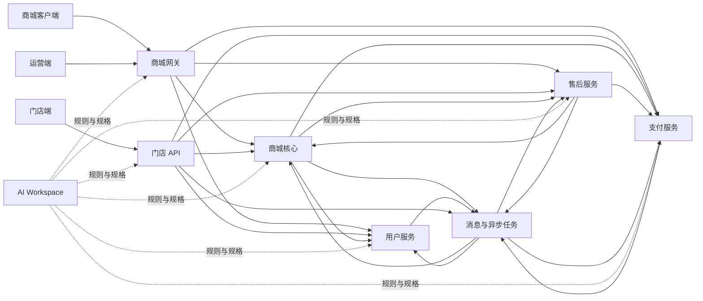
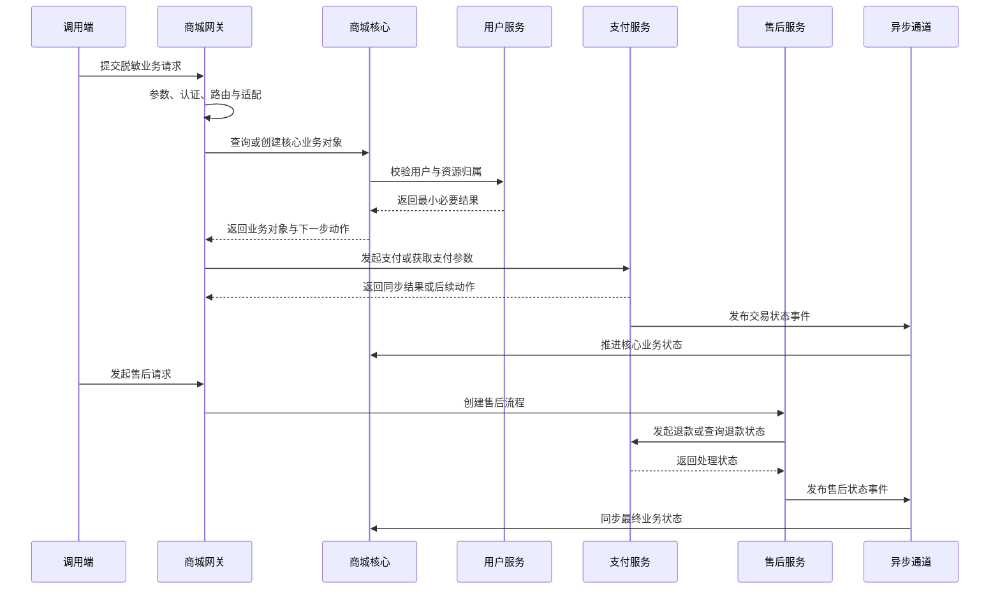

# bm PHP 全栈工程进阶文档索引
> 输出目录：`/Users/youngsdream/Documents/AI-Full-Stack-Engineer/php/进阶文档`
>
> 本索引对应当前目录中的 7 份进阶指南，用于建立跨仓请求追踪、业务协作、变更设计与安全交付能力。
## 1. 这套资料解决什么问题
这套资料不是框架语法手册，也不是环境配置清单。
它围绕七个工程视角展开：
1. 商城入口如何完成参数处理、认证、路由和内部转发。
2. 商城核心如何组织多应用、共享层、数据访问和复杂业务链。
3. 支付服务如何处理渠道抽象、交易状态、回调、退款与一致性。
4. 用户服务如何处理注册登录、令牌、隐私数据和身份关联。
5. 售后服务如何编排状态机、退款、退货、换货及外部协作。
6. 门店 API 如何组织权限、数据范围、库存、订单和统计能力。
7. AI Workspace 如何约束多仓开发、规格流程、工具路由和交付行为。
学习重点不是记忆目录，而是形成一套可重复的方法：
- 先确认入口、调用者和仓库边界。
- 再沿调用链寻找业务事实源。
- 区分同步请求、异步消息、回调和定时任务。
- 最后用契约、测试和观测证据完成变更。
## 2. 读者前置
开始阅读前，建议你已经具备以下能力：
- 能阅读 PHP 类、方法、继承关系和异常处理。
- 能理解 Controller、Service、Repository、Model 的基本职责。
- 能从路由定位 Controller 与 Action。
- 能使用 Git 查看状态、差异、分支和提交历史。
- 能区分 HTTP 状态码与 JSON 业务码。
- 能理解数据库事务只覆盖同一连接内的操作。
- 知道 Redis、消息队列和搜索索引不属于数据库事务。
- 能在隔离环境中执行 HTTP、Console 或项目测试。
- 能识别日志、配置、个人信息和认证材料的安全边界。
- 已完成至少一次范围较小的单仓修改与联调。
如果你暂时不满足全部条件，可以先读商城网关、商城核心和 AI Workspace 三份指南，并用第 8 节术语表补齐概念。
## 3. 七份文档导航
### 3.1 商城网关
[01-mall-gateway-进阶开发指南.md](01-mall-gateway-进阶开发指南.md)
学习目标：
- 区分面向商城客户端与运营后台的入口职责。
- 从 URL、路由、Controller 基类和 Filter 还原请求生命周期。
- 理解签名、登录态、权限检查和通用转发的真实边界。
- 跟踪内部 HTTP Wrapper、超时、错误映射和响应契约。
- 判断需求应该改网关，还是应该落到内部业务服务。
- 识别入口层聚合、日志泄露、长超时和方法透传风险。
完成标准：能针对一个外部请求写出入口、路由、过滤链、参数变化、目标服务、内部路径、响应映射和主要失败分支。
### 3.2 商城核心
[02-mall-core-进阶开发指南.md](02-mall-core-进阶开发指南.md)
学习目标：
- 理解多应用仓库与共享层的组织方式。
- 区分商品、订单、营销、站点、开放接口及遗留模块边界。
- 掌握 Controller → Service → Repository → Model 的核心分层。
- 理解 Context、Node 链、事务、缓存、索引和异步副作用。
- 跟踪商品详情、门店下单和 Console 消费等完整链路。
- 判断用户、支付、售后能力是否已经迁移到独立服务。
完成标准：能从核心 API 路由追到数据事实源，并说明 DB、Redis、搜索索引、消息与跨服务调用之间的一致性关系。
### 3.3 支付服务
[03-pay-service-进阶开发指南.md](03-pay-service-进阶开发指南.md)
学习目标：
- 理解支付方式、支付渠道和收款主体三个独立维度。
- 使用工厂、接口、默认实现和渠道实现分析能力差异。
- 跟踪支付、确认、捕获、退款、回调和争议处理链路。
- 理解 Context、Node、补偿与数据库事务的边界。
- 设计幂等键、条件更新、事件去重和超时后的状态查询。
- 建立渠道能力矩阵、对账思路、灰度策略和回退方案。
完成标准：能把支付变更拆成渠道能力、状态迁移、本地记录、外部副作用、回调收敛、补偿和对账七类问题。
### 3.4 用户服务
[04-user-service-进阶开发指南.md](04-user-service-进阶开发指南.md)
学习目标：
- 区分注册、登录、快捷登录和历史链路的实际入口。
- 理解身份、令牌、第三方登录、验证码和账号合并风险。
- 跟踪 Context 与 Node 驱动的注册登录流程。
- 理解用户主档、多身份、地址、积分和软删除规则。
- 掌握隐私字段加密、兼容查询、盲索引和密钥轮换思路。
- 处理缓存失效、消息重复、索引延迟和日志脱敏。
完成标准：能从 Controller 的实际调用反查主链，避免因同名 Service 或历史实现而改错位置，并为个人字段定义最小处理边界。
### 3.5 售后服务
[05-aftersale-service-进阶开发指南.md](05-aftersale-service-进阶开发指南.md)
学习目标：
- 把售后单理解为长事务编排实例，而不是单表状态修改。
- 区分处理方案、当前状态和业务动作三个维度。
- 跟踪退款、退货退款、换货、补差与履约协作链路。
- 理解外部动作记录、消息投递、回调推进和最终一致性。
- 设计状态条件更新、稳定幂等键、重试与人工介入机制。
- 使用业务时间线排查卡单、重复退款、物流停滞和金额差异。
完成标准：能为售后变更画出状态迁移，并列出每个外部协作者的成功、失败、超时、重复和乱序分支。
### 3.6 门店 API
[06-store-api-进阶开发指南.md](06-store-api-进阶开发指南.md)
学习目标：
- 理解多应用、中间件、后台基类、认证与动作权限。
- 区分路由权限与门店、人员、订单等数据范围权限。
- 跟踪库存聚合、订单、报价单、用户与统计业务。
- 理解 Redis 锁、数据库约束、事务与远程调用边界。
- 识别导入导出、PDF、跨库统计和远程资源风险。
- 为后台接口、库存动作、统计指标和命令建立测试策略。
完成标准：能对任一门店接口同时回答“谁能调用”和“能访问哪些数据”，并区分展示库存与可扣减库存。
### 3.7 AI Workspace
[07-ai-workspace-进阶使用指南.md](07-ai-workspace-进阶使用指南.md)
学习目标：
- 理解工作空间控制平面与独立业务仓库之间的关系。
- 使用项目映射定位仓库，并按层级读取工程规则。
- 区分 Rules、Skills、OpenSpec、MCP 与 submodule 的职责。
- 管理跨仓分支、差异、测试、提交授权和交付状态。
- 按 propose、apply、verify、archive 推进规格化变更。
- 根据任务与环境选择本地工具、开发工具或生产只读排查工具。
完成标准：能把跨仓需求组织成可评审、可执行、可验证、可归档的交付链路，并避免环境、仓库和权限混用。
## 4. 推荐学习顺序
### 4.1 默认顺序：先请求链，再领域链，最后治理
1. [01-mall-gateway-进阶开发指南.md](01-mall-gateway-进阶开发指南.md)
2. [02-mall-core-进阶开发指南.md](02-mall-core-进阶开发指南.md)
3. [04-user-service-进阶开发指南.md](04-user-service-进阶开发指南.md)
4. [03-pay-service-进阶开发指南.md](03-pay-service-进阶开发指南.md)
5. [05-aftersale-service-进阶开发指南.md](05-aftersale-service-进阶开发指南.md)
6. [06-store-api-进阶开发指南.md](06-store-api-进阶开发指南.md)
7. [07-ai-workspace-进阶使用指南.md](07-ai-workspace-进阶使用指南.md)
这个顺序先建立入口和核心数据流，再进入身份、交易、逆向交易和门店场景，最后用工作空间治理方法把知识转化为交付流程。
### 4.2 跨仓开发顺序：先治理，再实现
1. 先读 [07-ai-workspace-进阶使用指南.md](07-ai-workspace-进阶使用指南.md)，掌握仓库、规则、环境和变更流程。
2. 再读 [01-mall-gateway-进阶开发指南.md](01-mall-gateway-进阶开发指南.md)，确认入口、认证和转发契约。
3. 然后读 [02-mall-core-进阶开发指南.md](02-mall-core-进阶开发指南.md)，确认核心业务与数据事实源。
4. 按需求选择用户、支付、售后或门店指南深入。
### 4.3 按业务主题选读
- 登录、注册、账号、地址：网关 → 用户服务 → 商城核心。
- 商品详情、搜索、缓存：网关 → 商城核心。
- 下单、交易、退款：网关 → 商城核心 → 支付服务。
- 退货、换货、退款推进：商城核心 → 售后服务 → 支付服务。
- 门店库存、报价、下单：门店 API → 商城核心 → 用户或支付服务。
- 多仓方案、分支和交付：AI Workspace → 所有受影响业务指南。
## 5. 跨仓请求与业务协作
下图描述逻辑协作关系，不代表部署拓扑，也不包含真实网络信息。

阅读每条箭头时，回答六个问题：
1. 谁是调用方，谁拥有业务事实？
2. 请求通过同步 HTTP、异步消息还是回调传递？
3. 调用方如何认证，资源归属如何校验？
4. 请求和响应契约由谁维护，错误如何映射？
5. 超时、重复、乱序和部分成功时如何收敛？
6. 哪个仓库负责日志、指标、补偿与最终状态？
### 5.1 典型交易协作

实际改动必须回到对应指南，以源码中的入口、Wrapper、状态和事件为准。
## 6. 跨仓变更检查清单
### 6.1 分析阶段
- [ ] 已明确用户场景、成功条件、失败条件和非目标。
- [ ] 已列出所有可能受影响的独立仓库。
- [ ] 已确认请求入口，不根据接口名称猜仓库。
- [ ] 已从路由追踪到实际 Controller、Service 和数据事实源。
- [ ] 已区分同步调用、异步消息、回调和定时任务。
- [ ] 已识别用户、支付、售后等迁移边界与遗留入口。
- [ ] 已记录各仓当前分支和已有未提交改动。
- [ ] 已读取工作空间规则与相关项目规则。
- [ ] 已确认当前工作允许使用的环境与工具。
- [ ] 已明确未知项，不把推测写成事实。
### 6.2 契约与设计阶段
- [ ] 已定义上游请求、内部请求与最终响应字段。
- [ ] 已定义 HTTP 状态、业务码和错误映射规则。
- [ ] 已说明认证、动作权限、数据范围和资源归属校验。
- [ ] 已确定事实源以及缓存、索引的同步方向。
- [ ] 已定义状态机允许的迁移与终态。
- [ ] 已为写操作定义稳定幂等键和数据库兜底约束。
- [ ] 已覆盖超时、重复、乱序、重试和部分成功。
- [ ] 已区分数据库事务与外部系统副作用。
- [ ] 已定义消息版本、去重键、重试和死信策略。
- [ ] 已定义日志字段白名单、指标、告警与追踪标识。
- [ ] 已评估个人信息、认证材料和支付信息的最小化处理。
- [ ] 已准备灰度、兼容期、回退路径与数据修复方案。
### 6.3 实现阶段
- [ ] 每个仓库均在符合规范的独立开发分支上修改。
- [ ] 改动范围与设计一致，没有夹带无关重构。
- [ ] Controller 只负责协议、校验、编排和响应。
- [ ] 业务规则进入 Service 或既有流程抽象。
- [ ] 数据访问遵循项目既有 Repository 或 Gateway 约定。
- [ ] 查询处理软删除条件，删除采用逻辑删除。
- [ ] 金额使用精确计算方式，不使用浮点数直接比较。
- [ ] 跨服务请求复用统一 Wrapper。
- [ ] 缓存具备明确 key、TTL、失效和回源策略。
- [ ] 锁具有所有者、超时、释放和数据库最终保护。
- [ ] 外部回调使用原始请求验证并执行事件去重。
- [ ] 日志不记录完整请求、认证材料或个人字段。
- [ ] 配置使用占位说明和安全默认值。
### 6.4 验证阶段
- [ ] 已覆盖正常请求、缺参、非法参数和查无数据。
- [ ] 已覆盖未登录、无权限、越权和资源归属错误。
- [ ] 已覆盖依赖超时、网络失败、异常响应和降级路径。
- [ ] 已覆盖重复请求、并发请求、重复消息和重复回调。
- [ ] 已覆盖状态乱序、终态保护和条件更新失败。
- [ ] 已验证事务中途失败不会留下错误的本地部分写入。
- [ ] 已验证外部成功、本地失败时能够查询和补偿。
- [ ] 已验证本地成功、消息失败时能够恢复投递。
- [ ] 已检查缓存命中、未命中和失效后的结果。
- [ ] 已验证日志、指标和追踪标识足以定位故障。
- [ ] 已执行每个受影响仓库的测试或等价验证。
- [ ] 已记录无法自动验证的风险与人工验收步骤。
### 6.5 交付阶段
- [ ] 已逐仓检查差异、未跟踪文件和最终状态。
- [ ] 已确认没有提交本机配置、凭据或真实数据样本。
- [ ] 已同步接口契约、变更说明和必要部署步骤。
- [ ] 已明确仓库之间的发布顺序和兼容窗口。
- [ ] 已明确数据库、配置、消息和任务的启用顺序。
- [ ] 已准备发布后观察指标、异常阈值和回退条件。
- [ ] 已说明数据修复、消息重放和人工补偿入口。
- [ ] 已获得提交、推送、合并或环境写操作的明确授权。
- [ ] 已保留测试结果、已知风险与未完成事项。
- [ ] 已在验收后评估正式规格是否需要同步或归档。
## 7. 如何使用这套资料
### 7.1 接到新需求时
1. 先读 AI Workspace 指南，确认任务类型、规则、仓库和环境边界。
2. 从用户请求的最外层入口开始，阅读网关或门店 API 指南。
3. 根据路由和 Wrapper 找到拥有业务数据与状态的服务。
4. 阅读对应领域指南，画出当前调用链与目标调用链。
5. 使用第 6 节检查清单补齐契约、失败分支和验证计划。
6. 只有在仓库归属和设计边界明确后再开始实现。
### 7.2 排查故障时
1. 固定现象、发生时间和脱敏追踪标识。
2. 判断请求是否进入正确入口、路由和过滤链。
3. 区分 HTTP 失败、协议失败、业务失败和异步未收敛。
4. 从业务事实源建立状态时间线，再检查缓存、索引和消息。
5. 对支付、售后等长流程逐个核对外部动作记录。
6. 先形成证据链，再提出修复或补偿方案。
### 7.3 做代码评审时
1. 确认改动是否落在正确仓库与正确层。
2. 对照请求契约、状态迁移、幂等和权限检查实现。
3. 检查事务之外的 HTTP、消息、缓存和回调副作用。
4. 检查日志、错误响应和配置是否遵循最小披露。
5. 检查测试是否覆盖失败、并发、重复和回退。
6. 使用第 6 节清单记录具体缺口，不只给出风格意见。
### 7.4 建议的学习产出
每读完一份指南，产出一页自己的学习记录：
- 仓库定位与不负责的事项。
- 一个典型请求的完整调用链。
- 数据库、缓存、索引、消息和外部依赖。
- 三个最重要的安全或一致性风险。
- 一个适合练习的只读接口。
- 一个适合练习的写流程及测试矩阵。
- 仍需向维护者确认的问题。
不要抄写整篇指南。用自己的语言重画链路和边界，才能验证是否真正理解。
## 8. 术语说明
### 8.1 应用与分层
- **Controller**：接收请求，完成协议适配、基础校验、编排和统一响应。
- **Action**：Controller 中可由路由调用的具体方法。
- **Filter / Middleware**：在业务方法前后执行认证、权限、参数、限流或日志逻辑。
- **Service**：承载业务规则、流程编排和跨组件协调。
- **Repository**：封装数据库查询、更新、软删除和连接选择。
- **Model / ORM**：映射数据表、字段和基础持久化行为。
- **Wrapper / Gateway**：封装对其他服务或外部系统的调用协议。
- **Context**：复杂流程中供多个步骤共享的状态对象。
- **Node**：复杂流程中的单一处理步骤。
- **Factory**：根据渠道、类型或场景选择具体实现的入口。
### 8.2 数据与一致性
- **事实源**：对某类业务数据拥有最终解释权的存储或服务。
- **软删除**：通过删除标记隐藏记录，而不是物理移除数据。
- **事务边界**：一次数据库事务能够原子保证的操作范围。
- **幂等**：同一业务请求执行多次，最终结果与执行一次一致。
- **条件更新**：更新时同时校验旧状态或版本，避免并发覆盖。
- **最终一致性**：多个系统通过事件、重试或补偿最终收敛。
- **补偿**：外部副作用无法回滚时，用新的业务动作修正不一致。
- **Outbox**：事务内记录待发送事件，再由独立发布器可靠投递。
- **Saga**：用多个本地事务与补偿动作组织跨服务长流程。
### 8.3 缓存、搜索与异步
- **Redis 锁**：降低并发冲突的短期协调手段，不替代数据库约束。
- **TTL**：缓存、令牌或锁的有效时长。
- **搜索索引**：用于检索与聚合的数据副本，不默认是事实源。
- **MQ**：用于异步传递事件或任务的消息队列。
- **事件去重**：通过稳定事件标识阻止重复消费产生副作用。
- **死信**：超过重试策略后等待分析或人工处理的消息。
- **Webhook**：外部系统主动调用本系统的事件通知接口。
- **乱序**：较晚发生的事件比较早事件先到达。
### 8.4 安全与治理
- **认证**：确认调用者是谁。
- **授权**：确认调用者可以执行什么动作。
- **数据范围**：确认调用者能够访问哪些业务对象。
- **资源归属**：确认目标对象属于当前用户、门店或业务主体。
- **最小披露**：只输出、记录或传递完成任务所必需的信息。
- **脱敏**：隐藏或替换可识别个人、认证或交易敏感信息的内容。
- **灰度**：先向受控范围启用变更，再逐步扩大。
- **契约测试**：验证服务间请求和响应结构保持兼容的测试。
- **OpenSpec**：用提案、规格、设计、任务和部署说明管理变更。
- **MCP**：让开发工具以受控方式调用外部能力的协议与工具层。
- **Skill**：针对特定任务提供步骤、脚本和边界的可复用能力。
- **Rule**：跨任务持续生效的工程约束。
## 9. 阅读完成标准
完成七份资料后，你应能：
1. 从外部请求定位到实际入口和业务所属仓库。
2. 画出同步调用、消息、回调和定时任务组成的完整链路。
3. 区分 Controller、Service、Repository、Model 与流程抽象的职责。
4. 识别数据库事务不能覆盖的副作用及其补偿方式。
5. 为支付、售后、登录和门店权限设计失败场景测试。
6. 解释数据库、缓存和搜索索引之间的数据所有权关系。
7. 使用幂等键、唯一约束、条件更新和事件去重保护写流程。
8. 在不暴露敏感信息的前提下保留足够排障证据。
9. 组织跨仓分支、规格、验证、发布顺序和回退计划。
10. 区分源码现状、目标设计、推荐实践和待确认事项。
## 10. 使用边界
- 本索引只导航当前目录中的 7 份实际指南。
- 指南中的“现状”以各自调研时的源码证据为基准，代码演进后需重新核对。
- 指南中的“推荐”是工程方向，不表示系统已经实现。
- 示例只用于学习结构和方法，不能替代项目规则、接口契约或发布审批。
- 涉及环境写入、数据修改、提交、推送或发布的动作，必须获得明确授权。
- 文档中不得补充真实网络位置、身份信息、认证材料、连接信息或业务数据。
从一个低风险的只读请求开始：先画链路，再对照指南验证；随后选择一个小型写流程，为它补齐状态、幂等、失败分支和测试矩阵。
