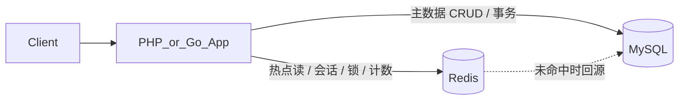
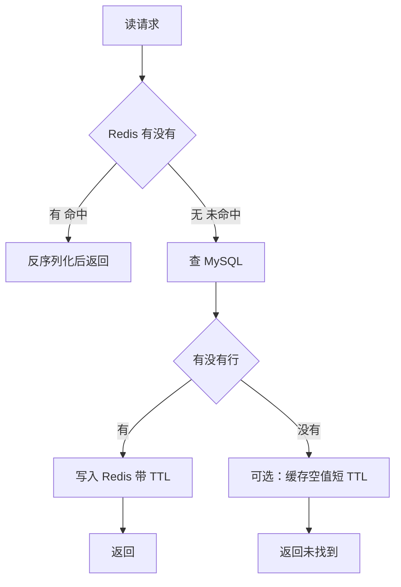

# Redis 入门：一天学完

> 所属：后端通识（与 [mysql/](../mysql/README.md) 平级）  
> 类型：零基础一天通识 + 手敲命令 + 双语言最小示例  
> 建议时长：6–8h（可按下方时间线拆开）  
> 交叉阅读：Go 周计划里的缓存专题 → [plan/week06/第六周-Redis与缓存.md](../plan/week06/第六周-Redis与缓存.md)  
> 真实代码锚点：[php/week03/common/redis/order/OrderRedis.php](../php/week03/common/redis/order/OrderRedis.php)

---

## 今日目标

装好 Redis、搞清它解决什么问题、手敲五大数据结构、能在 PHP / Go 里做最基础的 Set/Get，并说清缓存三大问题和一把合格分布式锁长什么样。

**今日核心句：**

> Redis 是跑在内存里的数据结构服务器。MySQL 是真相源，Redis 是加速器、协调器和计数器——别把该持久的业务主数据只放在 Redis 里。

这句话和 [mysql/day01.md](../mysql/day01.md) 完全对齐：

- MySQL：表关联、事务、强约束 → 订单 / 账务 / 用户主数据
- Redis：KV / 缓存 / 计数 → 热点读、会话、限流、锁、排行榜

---

## 0. 今日路线（建议时间）

| 时段 | 时长 | 内容 |
|------|------|------|
| 上午 1 | 1.5h | 第 1–3 节：是什么、装起来、概念地图 |
| 上午 2 | 2h | 第 4 节：五大数据结构，全部手敲一遍 |
| 下午 1 | 1.5h | 第 5–6 节：进阶能力 + PHP/Go 最小接入 |
| 下午 2 | 1.5h | 第 7–8 节：缓存模式、三大问题、分布式锁 |
| 晚上 | 1h | 第 9–10 节：坑、自测、复盘 |

学完当天应能独立做到：

1. 用 Docker 起一个 Redis，用 `redis-cli` 连上并 `PING`
2. 用 String / Hash / List / Set / ZSet 各解决一个真实小场景
3. 画出 Cache-Aside 的读路径和写路径
4. 区分穿透、雪崩、击穿，各说出一种解法
5. 解释 `SET key value NX EX` 为什么比裸 `SETEX` 更适合当锁
6. 对照仓库里的 `OrderRedis.php`，看懂 `setex` / `get` / `del` 和 key 命名

---

## 1. Redis 是什么、解决什么问题

### 1.1 一句话定位

**Redis（Remote Dictionary Server）** 是一个开源的、基于内存的 **键值（KV）数据库**，同时也是一台 **数据结构服务器**：value 不只是字符串，还可以是 Hash、List、Set、Sorted Set 等。

三个必须同时记住的属性：

| 属性 | 含义 | 带来的后果 |
|------|------|------------|
| 内存为主 | 数据默认在 RAM 里 | 读写极快（通常 10 万+ QPS / 单实例），进程挂了内存就没了 |
| KV + 丰富类型 | key 是字符串，value 是多种结构 | 排行榜、队列、去重不必自己用 SQL 硬拧 |
| 可选持久化 | RDB 快照 + AOF 日志 | 可以当「带过期的小数据库」，但不是 MySQL 的替代品 |

### 1.2 它解决哪些痛点

没有 Redis 时，后端经常会把不该交给关系库的事塞给 MySQL：

| 痛点 | 用 MySQL 会怎样 | Redis 怎么接 |
|------|-----------------|--------------|
| 热点读打爆数据库 | 商品详情、配置、首页每次都 `SELECT` | 把读多写少的结果放到内存，毫秒级返回 |
| Session / Token | 多机部署时 Session 粘在某一台 PHP/Go 进程 | 把会话放到 Redis，任意机器都能读 |
| 计数、库存预扣、点赞 | `UPDATE ... SET n = n + 1` 行锁打架 | `INCR` 原子自增 |
| 排行榜 | `ORDER BY score DESC LIMIT 10` 每次扫或反复排 | Sorted Set 按分数维护，取 Top N 是 O(log N + M) |
| 限流 | 自己建表记窗口，难写且慢 | `INCR` + TTL，或滑动窗口 |
| 分布式锁 | 数据库行锁跨服务不好用 | `SET key token NX EX` |
| 简单队列 / 最新列表 | 轮询一张任务表 | List 的 `LPUSH` / `BRPOP` |
| 去重、共同好友 | `DISTINCT` / 多次 JOIN | Set 的交集并集 |

一句话：**MySQL 保证「对」；Redis 保证「快」和「好协调」。**

### 1.3 和相近东西怎么区分

| 对比 | 怎么选 |
|------|--------|
| Redis vs MySQL | 订单、钱、用户主数据进 MySQL；热点、会话、计数、锁、排行榜进 Redis。**真相源仍是 MySQL。** |
| Redis vs Memcached | 只要 String 缓存、极简部署，Memcached 够用。需要结构、过期精细控制、持久化、Pub/Sub、锁，选 Redis。现在几乎默认 Redis。 |
| Redis vs 本地内存（PHP 数组 / Go map） | 本地内存更快，但多进程、多机器不共享，重启即丢。跨请求、跨机器的状态放 Redis。 |

### 1.4 典型架构位置



读多写少的路径（Cache-Aside，第 7 节细讲）：

1. 先问 Redis
2. 命中 → 直接返回
3. 未命中 → 问 MySQL → 把结果写回 Redis（带 TTL）→ 返回

### 1.5 今天先建立的边界（比会敲命令更重要）

- Redis **可以丢**：进程被杀、没开持久化、内存满了按策略淘汰。不能当唯一账本。
- Redis **不是关系库**：没有 JOIN、没有多表事务语义（`MULTI/EXEC` 是排队执行，不是 MVCC）。
- key 必须有 **过期** 和 **命名空间**，否则内存会悄悄涨死。
- 生产禁止 `KEYS *`，用 `SCAN`。

---

## 2. 安装与连接

推荐 Docker，和 [plan/week06](../plan/week06/第六周-Redis与缓存.md) 用同一镜像 `redis:7-alpine`。

### 2.1 Docker（首选）

```bash
# 前台试跑（Ctrl+C 停）
docker run --rm -p 6379:6379 redis:7-alpine

# 后台常驻，数据落到 named volume
docker run -d --name redis \
  -p 6379:6379 \
  -v redis-data:/data \
  redis:7-alpine
```

两条都是 **`docker run`：用镜像起一个 Redis 容器**。差别只在「试跑」还是「常驻」。

`docker run` 在干什么：

1. 本地没有 `redis:7-alpine` 就去 Docker Hub 拉
2. 用这个镜像创建一个容器（隔离的小 Linux 环境）
3. 容器里默认启动 Redis，监听 **容器内部** 的 `6379`

你的电脑要连它，必须再做端口映射，这就是 `-p`。

#### 第一条：前台试跑

```bash
docker run --rm -p 6379:6379 redis:7-alpine
```

| 片段 | 含义 |
|------|------|
| `docker run` | 创建并启动一个容器 |
| `--rm` | 容器一停就删掉自己，不留垃圾容器 |
| `-p 6379:6379` | 把本机 `6379` 转到容器里的 `6379`（写法是 `本机端口:容器端口`） |
| `redis:7-alpine` | 镜像 `名字:标签`。`7` 是 Redis 7.x，`alpine` 是小体积 Linux 基础镜像 |

这条**不加 `-d`**，Redis 日志打在当前终端。`Ctrl+C` 会停掉 Redis；因为有 `--rm`，容器也会被删掉。适合确认「Docker 能不能把 Redis 跑起来」。

```text
你的电脑 127.0.0.1:6379  ──映射──►  容器内 Redis :6379
```

本机 6379 已被占用（例如 Homebrew 装过 Redis）会报 `port is already allocated`。可改成 `-p 6380:6379`，然后 `redis-cli -p 6380`。

#### 第二条：后台常驻 + 数据落盘

```bash
docker run -d --name redis \
  -p 6379:6379 \
  -v redis-data:/data \
  redis:7-alpine
```

`\` 只是换行，和写成一行效果相同。

| 片段 | 含义 |
|------|------|
| `-d` | detached，后台跑，终端还能继续用 |
| `--name redis` | 容器名叫 `redis`。后面才能 `docker exec -it redis redis-cli`、`docker stop redis` |
| `-p 6379:6379` | 同上，本机 6379 → 容器 6379 |
| `-v redis-data:/data` | 把 Docker **命名卷** `redis-data` 挂到容器里的 `/data` |
| `redis:7-alpine` | 同一个镜像 |

官方 Redis 镜像默认把 RDB/AOF 写在容器内 `/data`。不挂卷的话，`docker rm` 删容器，数据一起没。挂上之后：

```text
容器 /data  ──持久化──►  Docker 管的卷 redis-data
（卷在 Docker 自己的目录里，不在你的项目文件夹）
```

卷不存在会自动创建：

```bash
docker volume ls
docker volume inspect redis-data
```

没有 `--rm`：停掉后容器还在，可以 `docker start redis` 再起来。

#### 两条怎么选

| | 试跑 | 学习常用 |
|--|------|----------|
| 命令 | `--rm` 前台 | `-d --name redis -v ...` |
| 关终端 | 进程停、容器删 | Redis 继续跑 |
| 数据 | 随容器消失 | 在 `redis-data` 卷里 |
| 再启动 | 再 `docker run` 一次 | `docker start redis` |

学习阶段用第二条即可。第一条还在跑时，第二条会因为 **端口 6379 被占** 或 **名字 `redis` 已存在** 失败。先停掉旧的：

```bash
docker stop redis && docker rm redis
# 如果是第一条前台跑的，在那个终端 Ctrl+C 即可
```

#### 日常配套命令

```bash
docker ps                    # 正在跑的容器，应看到 redis、端口 0.0.0.0:6379->6379
docker logs redis            # 看 Redis 启动日志
docker stop redis            # 停
docker start redis           # 再开（容器还在）
docker rm redis              # 删容器（-v 的卷默认还在，数据还在）
docker volume rm redis-data  # 连数据一起清掉
```

镜像名拆开：**仓库名 `redis` + 标签 `7-alpine`**。不写标签默认 `latest`。学习里钉死 `7-alpine`，避免每次拉到不同版本。

docker-compose 备选：

```yaml
services:
  redis:
    image: redis:7-alpine
    ports:
      - "6379:6379"
    volumes:
      - redis-data:/data
volumes:
  redis-data:
```

```bash
docker compose up -d
```

这是第二条 `docker run` 的 YAML 写法：`image` / `ports` / `volumes` 一一对应镜像、`-p`、`-v`。`docker compose up -d` 的 `-d` 同样是后台跑。

进容器里的客户端：

```bash
docker exec -it redis redis-cli
```

| 片段 | 含义 |
|------|------|
| `docker exec` | 在**已经在跑**的容器里再执行一条命令 |
| `-i` | 保持标准输入，这样才能打字 |
| `-t` | 分配伪终端，交互更好用 |
| `redis` | `--name` 起的那个名字 |
| `redis-cli` | 容器里 Redis 自带的客户端 |

顺序：先 `docker run ... --name redis`（或 compose）把服务拉起来，再 `exec` 进去敲 `PING`。

本机已装 `redis-cli` 时不必进容器：

```bash
redis-cli -h 127.0.0.1 -p 6379
```

连的是 `-p` 映射出来的端口，和进容器里连 `localhost:6379` 是同一台 Redis。

### 2.2 macOS Homebrew

```bash
brew install redis
brew services start redis
redis-cli ping
```

### 2.3 Linux（Debian / Ubuntu 摘要）

```bash
sudo apt update
sudo apt install -y redis-server redis-tools
sudo systemctl enable --now redis-server
redis-cli ping
```

发行版仓库里的 Redis 版本可能偏旧。学习阶段仍优先 Docker 钉死 7.x。

### 2.4 连通性体检（必须亲手做）

进入 `redis-cli` 后：

```text
127.0.0.1:6379> PING
PONG

127.0.0.1:6379> INFO server
# 看到 redis_version、tcp_port、uptime_in_seconds 即成功

127.0.0.1:6379> INFO memory
# used_memory_human 看当前占用

127.0.0.1:6379> TIME
# 两个整数：Unix 秒 + 微秒

127.0.0.1:6379> SELECT 0
OK

127.0.0.1:6379> DBSIZE
(integer) 0
```

常用「卫生」命令：

```text
SET hello "world"
GET hello
EXISTS hello
TTL hello                 # -1 = 永不过期；-2 = key 不存在
EXPIRE hello 60
TTL hello
DEL hello

# 学习环境才能用：
KEYS *                    # 生产禁止，会扫全库卡住实例
FLUSHDB                   # 清空当前库。生产禁止随手敲
FLUSHALL                  # 清空全部库。更危险
```

切库：默认 16 个逻辑库，编号 `0–15`，`SELECT n` 切换。

- 单机学习可以 `SELECT 1` 隔离实验数据。
- **Redis Cluster 只有 db 0**。生产规范是：用 key 前缀隔离，不要靠多 db。

本机命令行测延迟：

```bash
redis-cli --latency
# Ctrl+C 停。本机 Docker 通常是 0.1–1ms 量级
```

### 2.5 今日安装验收

- [ ] `PING` 返回 `PONG`
- [ ] 能 `SET` / `GET` 一个 key
- [ ] 知道 `TTL = -1` 和 `-2` 的区别
- [ ] 知道 `KEYS *` / `FLUSHDB` 只能在自己的学习实例上用

---

## 3. 核心概念地图

先把这张表刻进脑子，再去敲五大数据结构。

| 概念 | 一句话 |
|------|--------|
| 内存数据库 | 热数据在 RAM；快的代价是贵、易丢 |
| 单线程执行命令 | 命令排队执行，单个命令内部原子，不用自己加「线程锁」；慢命令（大 key、`KEYS`）会卡住所有人 |
| I/O 线程（6+） | 读请求、写回包可以多线程，**数据操作仍单线程** |
| key | 永远是字符串。用 `业务:实体:字段:id` 这种冒号分层 |
| TTL / 过期 | `EXPIRE` / `SETEX` / `SET ... EX`。过期后 key 消失 |
| 过期删除 | **惰性删除**（访问时发现过期再删）+ **定期删除**（后台抽样删）。过期了不一定立刻从内存消失 |
| 持久化 RDB | 某一时刻的二进制快照，恢复快，可能丢最后一次快照之后的数据 |
| 持久化 AOF | 追加写命令日志，更耐久，文件更大；7.x 可与 RDB 混合 |
| 内存淘汰 | 内存到 `maxmemory` 后按策略丢 key：`noeviction` / `allkeys-lru` / `volatile-lru` / `allkeys-lfu` 等 |
| 逻辑库 db | `SELECT 0..15`。学习可用，生产用前缀 |
| 原子性 | 单条命令原子；多条命令要用 `MULTI/EXEC`、Lua 或 Pipeline（Pipeline **不保证**事务语义） |

### 3.1 为什么「单线程」还能那么快

1. 纯内存操作，没有磁盘寻道
2. 命令简单，多数是 O(1) / O(log N)
3. 没有多线程锁竞争
4. 用 I/O 多路复用同时服务成千上万连接

推论（今天就要遵守）：

- **不要** 对百万级 key 跑 `KEYS *`
- **不要** 对几百万元素的 List 做 `LRANGE 0 -1` 当作家常便饭
- **不要** 把 10MB 的 JSON 当一个 String 来 `GET`（这就是大 key）

### 3.2 key 命名规范（对照真实代码）

仓库里订单 Redis 封装是这样写的：

```20:21:php/week03/common/redis/order/OrderRedis.php
        $key = sprintf('bm:order:orderLocked:%s', $orderNo);
        return $this->getConnection()->setex($key, $expire, 1);
```

拆开看：

| 段 | 例 | 作用 |
|----|----|------|
| 业务/集群前缀 | `bm` | 多系统共用一个 Redis 时防撞 |
| 模块 | `order` | 一眼知道谁的数据 |
| 用途 | `orderLocked` | 这把 key 干什么 |
| 主键 | `{orderNo}` | 定位到哪一条业务记录 |

推荐格式：

```text
{app}:{module}:{entity}:{id}
bm:order:orderLocked:202609180001
user:session:10086
product:detail:9527
```

反例：`123`、`user_123`、`orderLocked202609180001`（没有命名空间，无法按前缀扫描、无法多人协作）。

### 3.3 过期时间怎么选（先有数）

| 场景 | 量级 | 例子 |
|------|------|------|
| 验证码 / 短锁 | 30s–5min | 登录 OTP、下单互斥 |
| 热点详情 | 5–30min | 商品、用户资料 |
| 会话 | 30min–7d | Token、购物车 |
| 业务标记 | 小时–天 | `OrderRedis` 里支付轮询 1 天、次日达提醒 5 天 |
| 「永久」 | 尽量不要 | 必须永久也要有淘汰策略和监控 |

`OrderRedis` 里能直接看到三种 TTL：

| 方法 | TTL | 含义 |
|------|-----|------|
| `setOrderLocked` | 600 秒（10 分钟） | 订单锁定标记 |
| `setLoopOrderPayStatusStartTime` | 86400 秒（1 天） | 支付状态轮询窗口 |
| `setNextDayDeliveryPreviewNotice` | 5 天 | 提醒只发一次的去重标记 |

---

## 4. 五大数据结构 + 命令实操

下面全部在 `redis-cli` 里敲。每个结构：**场景 → 命令 → 小练习**。

先清空学习库（确认连的是自己的 Docker，不是公司生产）：

```text
SELECT 0
FLUSHDB
```

### 4.1 String：缓存对象、计数器、锁的底座

String 的 value 是二进制安全的字节串：一段 JSON、一个数字、一个 token 都可以。

```text
SET user:1:name "Alice"
GET user:1:name

# 只有不存在才设置（分布式锁的 NX）
SET lock:order:100 NX EX 10
# 返回 OK 表示抢到；返回 (nil) 表示别人持有

# 设置并带过期
SETEX session:abc 1800 "uid=42"
TTL session:abc

# 不存在才设（等价 SET NX）
SETNX flag:welcome 1

# 计数器：value 必须是整数形式的字符串
SET page:home:uv 0
INCR page:home:uv
INCRBY page:home:uv 10
DECR page:home:uv
GET page:home:uv

# 批量
MSET product:1:stock 100 product:2:stock 50
MGET product:1:stock product:2:stock

# 截取 / 追加（了解即可）
APPEND user:1:name " Smith"
STRLEN user:1:name
```

**场景对照**

| 场景 | 命令骨架 |
|------|----------|
| 缓存整个对象 | `SETEX user:42 1800 '{"id":42,"name":"Alice"}'` |
| 计数 | `INCR article:9:views` |
| 限流（固定窗口） | `INCR rate:ip:1.2.3.4` + 第一次时 `EXPIRE 60` |
| 分布式锁 | `SET lock:xx {token} NX EX 10` |

**小练习 A**

1. 用 String 缓存一条用户 JSON，TTL 120 秒
2. 做一个 `article:1:views` 计数器，自增 3 次后 `GET` 应为 3
3. `TTL` 看用户缓存，确认不是 `-1`

### 4.2 Hash：对象字段、购物车

一个 key 下面挂多个 field-value，适合「常常只改一个字段」的对象。

```text
HSET user:1 name "Alice" age 25 city "Shanghai"
HGET user:1 name
HMGET user:1 name age
HGETALL user:1

HEXISTS user:1 email
HSET user:1 email "alice@example.com"
HDEL user:1 city

HINCRBY user:1 age 1
HKEYS user:1
HVALS user:1
HLEN user:1
```

购物车直觉模型：

```text
# cart:{userId}  →  field=skuId, value=数量
HSET cart:42 sku:1001 2
HSET cart:42 sku:1002 1
HINCRBY cart:42 sku:1001 1
HGETALL cart:42
HDEL cart:42 sku:1002
```

**String(JSON) vs Hash**

| | String JSON | Hash |
|--|-------------|------|
| 改一个字段 | 读出 → 反序列化 → 改 → 再写入 | `HSET` 一个 field |
| 取整个对象 | 一次 `GET` | `HGETALL`（field 极多时也重） |
| 适合 | 小对象、整存整取 | 中等对象、部分更新（购物车、资料卡） |

`HGETALL` 在 field 成千上万时会阻塞。大 Hash 用 `HSCAN`。

**小练习 B**

用 Hash 存 `user:100` 的 `name` / `email` / `login_count`，把 `login_count` 自增 1，再 `HGETALL` 看结果。

### 4.3 List：队列、最新 N 条

双向链表（实现细节随版本有 ziplist/listpack 优化，心智模型按「两头都能进能出的队列」即可）。

```text
LPUSH inbox:42 "msg-1" "msg-2"     # 左进，后进的在左边
RPUSH inbox:42 "msg-3"
LRANGE inbox:42 0 -1               # 从左到右看全部（学习用）
LLEN inbox:42

LPOP inbox:42                      # 左出
RPOP inbox:42                      # 右出

LTRIM inbox:42 0 99                # 只留最新 100 条

# 阻塞弹出：队列空了就等，适合简单 worker
# 在另一个 redis-cli 窗口执行 BRPOP jobs 30
RPUSH jobs '{"type":"email","to":"a@b.c"}'
```

常见组合：

| 模式 | 写法 | 用途 |
|------|------|------|
| 栈 | `LPUSH` + `LPOP` | 后进先出 |
| 队列 | `LPUSH` + `RPOP` 或 `RPUSH` + `LPOP` | 先进先出 |
| 可靠一点的队列 | `RPOPLPUSH` / `BLMOVE` 转到 processing 列表 | 防止 worker 崩溃丢任务 |
| 最新列表 | `LPUSH` + `LTRIM 0 N-1` | 动态、评论、时间线 |

List 不是 Kafka。没有消费组、没有长久堆积百万级的设计目标。任务量小、允许丢、要简单，用 List；正经异步任务用专业 MQ。

**小练习 C**

1. 用 List 做 `feed:100`，左边插入 5 条动态，只保留 3 条（`LTRIM`）
2. `LRANGE feed:100 0 -1` 确认长度是 3

### 4.4 Set：去重、标签、共同好友

无序、唯一。

```text
SADD user:1:tags "php" "redis" "mysql"
SADD user:2:tags "go" "redis" "mysql"
SMEMBERS user:1:tags
SISMEMBER user:1:tags "redis"

SCARD user:1:tags
SREM user:1:tags "php"

SINTER user:1:tags user:2:tags     # 共同标签
SUNION user:1:tags user:2:tags
SDIFF user:1:tags user:2:tags      # 1 有 2 没有

SRANDMEMBER user:1:tags 1
SPOP user:1:tags                   # 随机取出并删除
```

**场景**

| 场景 | 结构 |
|------|------|
| 文章标签 | `SADD article:9:tags ...` |
| 点赞去重 | `SADD article:9:likers {userId}`，`SCARD` 当点赞数 |
| 共同好友 | `SINTER user:1:friends user:2:friends` |
| 抽奖池 | `SADD lottery:1 {uid}` + `SPOP` |
| UV 粗算 | 大量 UV 用 HyperLogLog（`PFADD`/`PFCOUNT`），不要用巨型 Set 硬扛 |

**小练习 D**

构造两个用户的好友 Set，求出共同好友，再 `SISMEMBER` 判断某 id 是不是好友。

### 4.5 Sorted Set（ZSet）：排行榜

每个 member 带一个 score（浮点）。内部是跳表 + hash，按 score 排序。

```text
ZADD product:sales 100 "sku:1" 250 "sku:2" 180 "sku:3"

ZSCORE product:sales "sku:2"
ZINCRBY product:sales 20 "sku:1"     # sku:1 变成 120

# 分数从低到高
ZRANGE product:sales 0 -1 WITHSCORES

# 排行榜：从高到低 Top 10
ZREVRANGE product:sales 0 9 WITHSCORES

# 名次（0 起；ZREVRANK 是从高到低的名次）
ZREVRANK product:sales "sku:2"

# 按分数区间
ZRANGEBYSCORE product:sales 100 200 WITHSCORES

ZREM product:sales "sku:3"
ZCARD product:sales
```

Redis 6.2+ 更推荐 `ZRANGE ... REV` 统一语法，学习阶段 `ZREVRANGE` 更直观。

**场景**

| 场景 | score 是什么 | member 是什么 |
|------|--------------|----------------|
| 销量榜 | 销量 | skuId |
| 游戏积分榜 | 分数 | userId |
| 延迟队列 | 执行时间戳 | 任务 id |
| 热搜 | 热度 | 词条 |

**小练习 E**

1. 用 ZSet 做 `article:hot`，插入 5 篇文章及热度
2. 给其中一篇 `ZINCRBY 15`
3. 取出 Top 3 及分数
4. 查某一篇的排名（从 1 开始 = `ZREVRANK + 1`）

### 4.6 类型速查（卡住时看这张）

| 我想做的事 | 用什么 | 核心命令 |
|------------|--------|----------|
| 缓存一个 JSON | String | `SET` / `GET` / `SETEX` |
| 计数、限流 | String | `INCR` + `EXPIRE` |
| 对象部分更新 / 购物车 | Hash | `HSET` / `HGET` / `HINCRBY` |
| 队列 / 最新 N 条 | List | `LPUSH` / `BRPOP` / `LTRIM` |
| 去重 / 标签 / 关系 | Set | `SADD` / `SISMEMBER` / `SINTER` |
| 排行榜 / 延迟队列 | ZSet | `ZADD` / `ZINCRBY` / `ZREVRANGE` |

---

## 5. 进阶能力（点到为止，今天建立名字）

这些不必一天写进项目，但面试和读源码会碰到。知道「干什么用、有什么坑」即可。

### 5.1 Pub/Sub 发布订阅

```text
# 终端 A
SUBSCRIBE order.paid

# 终端 B
PUBLISH order.paid "orderNo=202609180001"
```

终端 A 会收到消息。特点：

- **不持久**：没人订阅时发布就丢
- 不是任务队列，不能当 Kafka / RabbitMQ 用
- 适合「此刻在线的人听一声」：本地缓存失效广播、简单通知

### 5.2 事务 `MULTI` / `EXEC`

```text
MULTI
INCR wallet:1
DECR wallet:2
EXEC
```

Redis 事务是：**排队，然后连续执行**。

- 中间不会插入别人的命令
- **没有** MySQL 那种回滚：排队时语法错会全取消；执行时某条运行时失败，其余照样执行
- 需要「看见的值没被别人改过」时用 `WATCH`（乐观锁）。冲突就 `EXEC` 失败，自己重试

不要把 Redis 事务理解成 InnoDB 事务。

### 5.3 Lua 脚本（真正的原子组合）

把「读 + 判断 + 写」放进一段 Lua，在服务端一次跑完，避免竞态。解锁脚本是经典例子（第 8 节完整写出）。

```text
EVAL "return redis.call('GET', KEYS[1])" 1 user:1:name
```

约束：脚本里不要访问随机数、不要做长时间循环；Redis 7 有函数（Function）机制，入门先会 `EVAL` 即可。

### 5.4 Pipeline 批量

把多条命令一次性发给服务器，减少网络往返。

- **提的是吞吐**，不是事务
- 中间失败不会自动回滚
- PHP / Go 客户端都有 pipeline API

适合：预热缓存、批量 `GET`、导出一堆 TTL。

### 5.5 持久化怎么记

| 方式 | 做什么 | 丢数据窗口 | 恢复速度 |
|------|--------|------------|----------|
| RDB | 某时刻快照 | 两次快照之间 | 快 |
| AOF | 追加命令 | 取决于 `appendfsync`（everysec 常见，最多丢约 1 秒） | 相对慢（7.x 混合后好很多） |
| 都不开 | 纯缓存 | 进程没就空 | — |

学习实例可以全关，当纯缓存。要当「重启后还在」的会话存储，至少开 RDB 或 AOF。

### 5.6 内存满了怎么办

`maxmemory` + `maxmemory-policy`：

| 策略 | 行为 |
|------|------|
| `noeviction` | 写命令报错（默认常见）。缓存场景通常不合适 |
| `allkeys-lru` | 所有 key 里淘汰最近最少用。通用缓存首选之一 |
| `volatile-lru` | 只在设置了 TTL 的 key 里 LRU |
| `allkeys-lfu` | 按访问频率淘汰（4.0+） |
| `volatile-ttl` | 优先丢更快走完 TTL 的 |

今天记住一句：**当缓存用时，给所有 key 设 TTL，并选 `allkeys-lru` 或 `volatile-lru`，监控 `used_memory` 和 `evicted_keys`。**

---

## 6. 在项目里用 Redis（PHP + Go）

原理与命令语言无关。客户端只是把 `SET key value EX 60` 换成函数调用。

### 6.1 PHP：phpredis 扩展

```php
$redis = new Redis();
$redis->connect('127.0.0.1', 6379);

$redis->setex('user:1', 1800, json_encode(['id' => 1, 'name' => 'Alice']));
$raw = $redis->get('user:1');
$user = $raw === false ? null : json_decode($raw, true);

$redis->incr('article:1:views');
$redis->hSet('user:1:profile', 'login_count', 1);
$redis->zIncrBy('product:sales', 1, 'sku:1001');
$redis->del('user:1');
```

抢锁（注意：这才是 NX，下一节会对比 `setex`）：

```php
$ok = $redis->set('lock:order:100', $token, ['nx', 'ex' => 10]);
// $ok === true 抢到；false 没抢到
```

Yii2 里常见是组件 `Yii::$app->redis`（基于 `yiisoft/yii2-redis`），命令名仍然是 `setex` / `get` / `del`，和扩展非常接近。

### 6.2 对照仓库真实封装：`OrderRedis`

完整文件：[php/week03/common/redis/order/OrderRedis.php](../php/week03/common/redis/order/OrderRedis.php)

它做了三件工程上非常典型的事：

**（1）连接从应用容器拿，不在业务里 `new Redis()`**

```10:13:php/week03/common/redis/order/OrderRedis.php
    public function getConnection()
    {
        return \Yii::$app->redisBmMaster;
    }
```

**（2）每个业务一个方法，key 拼在类内部，调用方只传订单号**

```18:31:php/week03/common/redis/order/OrderRedis.php
    public function setOrderLocked($orderNo, $expire = 600)
    {
        $key = sprintf('bm:order:orderLocked:%s', $orderNo);
        return $this->getConnection()->setex($key, $expire, 1);
    }

    public function getOrderLocked($orderNo)
    {
        $key = sprintf('bm:order:orderLocked:%s', $orderNo);
        return $this->getConnection()->get($key);
    }
```

**（3）全是「带 TTL 的标记位」：锁状态、轮询起点、提醒去重**

```67:82:php/week03/common/redis/order/OrderRedis.php
    public function setLoopOrderPayStatusStartTime($orderNo, $userId, $loopStartTime)
    {
        return $this->getConnection()->setex($this->getLoopOrderPayStatusKey($orderNo, $userId), 86400, $loopStartTime);
    }

    public function delLoopOrderPayStatusStartTime($orderNo, $userId)
    {
        return $this->getConnection()->del($this->getLoopOrderPayStatusKey($orderNo, $userId));
    }
```

读这段代码时抓住模式，而不是背方法名：

```text
业务 Redis 类
  ├─ getConnection()        选哪台 Redis
  ├─ 私有方法拼 key         命名规范集中在一处
  ├─ setex(key, ttl, 1)     写入标记 / 时间戳
  ├─ get(key)               读标记
  └─ del(key)               业务结束主动清
```

`setex(..., 1)` 的 value 经常只是 `1`，表示「这件事已经发生过」。TTL 到了自动消失，等于免维护的去重表。这和「缓存整份订单 JSON」不是同一类用法，但底层都是 String。

> 注意：`setOrderLocked` 用的是 `SETEX`，**会覆盖**已有值，不是 `SET NX`。它更像「给订单打上锁定标记」，不是严格互斥锁。严格锁见第 8 节。

### 6.3 Go：go-redis v9

与 [plan/week06](../plan/week06/第六周-Redis与缓存.md) 同一套客户端。

```go
package main

import (
	"context"
	"encoding/json"
	"fmt"
	"time"

	"github.com/redis/go-redis/v9"
)

func main() {
	ctx := context.Background()
	rdb := redis.NewClient(&redis.Options{
		Addr:         "localhost:6379",
		Password:     "",
		DB:           0,
		DialTimeout:  5 * time.Second,
		ReadTimeout:  3 * time.Second,
		WriteTimeout: 3 * time.Second,
	})

	if err := rdb.Ping(ctx).Err(); err != nil {
		panic(err)
	}

	type User struct {
		ID   int    `json:"id"`
		Name string `json:"name"`
	}
	buf, _ := json.Marshal(User{ID: 1, Name: "Alice"})
	_ = rdb.Set(ctx, "user:1", buf, 30*time.Minute).Err()

	val, err := rdb.Get(ctx, "user:1").Result()
	if err == redis.Nil {
		fmt.Println("cache miss")
	} else if err != nil {
		panic(err)
	} else {
		fmt.Println("cache hit:", val)
	}

	rdb.HSet(ctx, "user:1:profile", "name", "Alice", "age", 25)
	rdb.RPush(ctx, "queue:email", "task-1")
	rdb.ZIncrBy(ctx, "product:sales", 1, "sku:1001")
}
```

安装：

```bash
go get github.com/redis/go-redis/v9
```

### 6.4 客户端对照表

| 动作 | redis-cli | PHP phpredis | Yii2 `OrderRedis` | Go go-redis |
|------|-----------|--------------|-------------------|-------------|
| 设值+TTL | `SETEX k 60 v` | `setex($k, 60, $v)` | `$conn->setex(...)` | `Set(ctx, k, v, 60*time.Second)` |
| 取值 | `GET k` | `get($k)` | `$conn->get(...)` | `Get(ctx, k).Result()` |
| 删除 | `DEL k` | `del($k)` | `$conn->del(...)` | `Del(ctx, k)` |
| 自增 | `INCR k` | `incr($k)` | `$conn->incr(...)` | `Incr(ctx, k)` |
| 互斥设值 | `SET k v NX EX 10` | `set(..., ['nx','ex'=>10])` | 需自己调 `set` 选项 | `SetNX` 或 `SetArgs{Mode:"NX"}` |

`GET` 未命中：PHP 扩展常返回 `false`；go-redis 返回 `redis.Nil`。**一定要区分「没这个 key」和「Redis 挂了」。**

### 6.5 封装原则（从 `OrderRedis` 抽象出来）

1. 业务代码不拼接 key 字符串，不散落 TTL 魔法数字
2. 一个 Redis 类对应一个模块（order / user / pay），不要搞上帝客户端
3. 读配置拿到 host/db/password，不要写死在方法里
4. 所有写入默认带过期，除非你能讲出永不过期的理由

---

## 7. 缓存设计模式与三大问题

缓存不是「把查询结果 SET 进去」就结束。一致性、失效、击穿，决定你会不会把数据库打崩。

### 7.1 Cache-Aside（旁路缓存，最常用）

应用自己管缓存，Redis 当配角。



**读：**

1. 查 Redis
2. 命中则返回
3. 未命中查 MySQL
4. 查到则写入 Redis（带 TTL）

**写（记住顺序）：**

1. **先更新 MySQL**
2. **再删除 Redis**（不要「更新缓存」）

为什么删除而不是更新缓存：

- 并发下「先改缓存再改库」或「改库后写新缓存」都更容易写回过期值
- 删掉后，下一次读自然回源，逻辑更简单
- 这个 key 可能暂时没人读，更新是浪费

伪代码（语言无关）：

```text
GetUser(id):
    raw = redis.GET("user:{id}")
    if raw 存在:
        return decode(raw)
    user = mysql.Find(id)
    if user 为空:
        redis.SETEX("user:{id}", 30s, "null")   # 防穿透，见下
        return 未找到
    redis.SETEX("user:{id}", 30min, encode(user))
    return user

UpdateUser(user):
    mysql.Update(user)          # 先库
    redis.DEL("user:{user.id}") # 后缓存
```

### 7.2 什么时候不该加缓存

- 写多读少（缓存还没人读就被删）
- 数据必须绝对强一致（库存扣减的真相仍在 DB 或专门的库存服务）
- 结果集每人都不一样且没有复用（「当前用户的草稿」未必值得）
- 还没测量：先 `EXPLAIN` / 慢查询，别把 Redis 当遮羞布

### 7.3 缓存穿透（Penetrate）

**现象：** 查询根本不存在的数据（uid=-1、乱造的 sku）。缓存没有，数据库也没有，**每次都打到 DB**。攻击者扫一遍不存在的 id，数据库就跪。

**和「没写缓存」的区别：** 正常未命中至少能把「存在的行」填进 Redis；穿透是 **永远填不进有效值**。

**解法 1：缓存空值（入门必会）**

```text
DB 没有 → SETEX user:999 30 "null"
下次 GET 到 "null" → 直接返回未找到，不再查库
```

TTL 要短，避免「刚注册的用户一直被当成不存在」。

**解法 2：布隆过滤器（了解）**

用一块很小的位图判断「一定不存在 / 可能存在」。返回一定不存在就连 Redis 都不用查。有误判（假阳性），没有假阴性。

### 7.4 缓存雪崩（Avalanche）

**现象：** 大量 key **同一时刻**过期（或 Redis 宕机），请求一起砸向 MySQL。

**解法：**

1. TTL 加随机抖动：`30min + random(0, 5min)`
2. Redis 高可用（主从 + 哨兵 / 集群）——超出今天实操范围，但要知道「单实例挂了也是雪崩」
3. 多级缓存：进程内短 TTL + Redis + DB
4. 核心热点「逻辑过期」：物理上不过期，过期时间写在 value 里，后台异步刷新

### 7.5 缓存击穿（Breakdown / 热点过期）

**现象：** **一个**热点 key 过期的瞬间，成千上万并发一起回源打同一行。

和雪崩的差别：雪崩是 **一片 key**；击穿是 **一根热 key**。

**解法：**

1. 互斥锁：只有一个请求去查 DB，其他人等锁然后读缓存
2. 单飞（Go `singleflight`、进程内合并相同查询）
3. 热点永不过期 + 异步刷新

伪代码：

```text
raw = GET hot:product:1
if 命中: return
if 抢到 lock:product:1:rebuild:
    查 DB → SETEX 缓存 → 释放锁
else:
    短暂 sleep 后重试 GET
```

### 7.6 三兄弟对照

| | 穿透 | 击穿 | 雪崩 |
|--|------|------|------|
| 触发 | 查不存在的数据 | 一个热点刚好过期 | 大批 key 同时过期或 Redis 挂 |
| 打到 DB 的是 | 大量无效 id | 同一个有效 id | 很多有效 id |
| 入门解法 | 空值缓存 | 锁 / singleflight | TTL 随机；Redis 别单点 |

### 7.7 随机过期（防雪崩最小实现）

PHP：

```php
$ttl = 1800 + random_int(0, 300);
$redis->setex($key, $ttl, $json);
```

Go：

```go
jitter := time.Duration(rand.Intn(300)) * time.Second
rdb.Set(ctx, key, val, 30*time.Minute+jitter)
```

---

## 8. 分布式锁（对照 `setOrderLocked`）

多台机器、多个 PHP-FPM / Go goroutine 不能用进程内 `mutex`。大家约定：Redis 里某个 key 存在 = 有人持锁。

### 8.1 合格锁的四条

1. **互斥**：同一时刻只有一个持有者（需要 `NX`）
2. **有 TTL**：持有者崩溃也要自动释放，避免死锁
3. **谁加谁解**：value 放唯一 token，解锁前比对，避免删掉别人的锁
4. **释放原子**：比对 + 删除必须 Lua，不能 GET 后再 DEL（中间别人可能刚续上新锁）

### 8.2 正确的加锁

```text
SET lock:order:202609180001 {random-token} NX EX 10
```

- `NX`：已存在则失败
- `EX 10`：10 秒后自动释放
- `{random-token}`：UUID / 雪花，解锁用

PHP：

```php
$token = bin2hex(random_bytes(16));
$ok = $redis->set("lock:order:$orderNo", $token, ['nx', 'ex' => 10]);
```

Go：

```go
ok, err := rdb.SetNX(ctx, "lock:order:"+orderNo, token, 10*time.Second).Result()
```

### 8.3 正确的解锁（Lua）

```lua
if redis.call("GET", KEYS[1]) == ARGV[1] then
  return redis.call("DEL", KEYS[1])
else
  return 0
end
```

```php
$script = <<<'LUA'
if redis.call("GET", KEYS[1]) == ARGV[1] then
  return redis.call("DEL", KEYS[1])
else
  return 0
end
LUA;
$redis->eval($script, [$key, $token], 1);
```

### 8.4 和 `OrderRedis::setOrderLocked` 的关系

再看一眼真实代码：

```18:22:php/week03/common/redis/order/OrderRedis.php
    public function setOrderLocked($orderNo, $expire = 600)
    {
        $key = sprintf('bm:order:orderLocked:%s', $orderNo);
        return $this->getConnection()->setex($key, $expire, 1);
    }
```

| | `SETEX key 600 1`（现状） | `SET key token NX EX 10`（严格锁） |
|--|---------------------------|-------------------------------------|
| 已有 key 时 | **覆盖**，别人的「锁」被你续/改掉 | 失败，互斥成立 |
| value | 固定 `1` | 唯一 token，能校验主人 |
| 解锁 | `DEL` 谁都能删 | Lua 比对后再删 |
| 适合 | 「给订单打锁定标记 / 状态位」 | 「同一时刻只允许一个下单/支付流程」 |

所以：

- 读源码时把它理解成 **带 TTL 的锁定标记**，和同文件里的「提醒是否已发」是同一类用法
- 若业务要求「并发下单只成功一次」，要在标记之外再上 `NX` 锁，或在 MySQL 用唯一索引 / 行锁做最终互斥
- **最终正确性仍应落在数据库约束上**，Redis 锁只是挡并发、减冲突

### 8.5 今天不要做的事

- 不要用 `KEYS lock:*` 找锁
- 不要假定 TTL 内业务一定跑完：耗时长要 **看门狗续期**（Redisson 那套），或把 TTL 留足余量
- 不要在 Redis 主从异步复制场景把锁当成金融级互斥（主挂了锁可能未同步）。入门知道这个边界即可；更强用 Redlock / 还是用 DB 约束，属于下一阶段

---

## 9. 常见坑 + 最佳实践

### 9.1 忘记过期时间

```text
# 反例：内存只增不减
SET user:1 "{...json...}"
```

```text
# 正例
SETEX user:1 1800 "{...json...}"
```

`OrderRedis` 全部走 `setex`，这是它最值得学的一点。

### 9.2 key 命名混乱

```text
# 反例
SET 123 ...
SET user_123 ...
SET orderLocked2026 ...
```

```text
# 正例（与仓库一致）
SET bm:order:orderLocked:202609180001 1 EX 600
```

### 9.3 先删缓存再改库

```text
# 反例
DEL user:1
mysql UPDATE ...     # 若失败，缓存已空；或删完到更新前，别人读到旧库又写回旧缓存
```

```text
# 正例
mysql UPDATE ...
DEL user:1
```

仍可能有极端并发窗口，入门先守住「先库后删」。延迟双删、订阅 binlog 失效属于进阶。

### 9.4 大 key / 热 key

| 问题 | 样子 | 后果 | 处理 |
|------|------|------|------|
| 大 key | 单个 String 数 MB；Hash/List/ZSet 几十万元素 | `GET` / `HGETALL` 卡住单线程 | 拆 key、压缩、分页、`HSCAN` |
| 热 key | 明星商品被所有流量 `GET` 同一个 key | 网卡打满、Redis CPU 打满 | 本地缓存、复制多份 key、打散 |

发现手段（了解）：`redis-cli --bigkeys`、`MEMORY USAGE key`、监控慢日志。

### 9.5 把 `KEYS *` 当查询 API

生产用 `SCAN 0 MATCH bm:order:* COUNT 100` 游标迭代。`KEYS` 只许在自己的学习容器里玩。

### 9.6 序列化

PHP：

```php
// 反例：serialize 和 json 混用，或直接存对象资源
$redis->set($key, $user);

// 正例
$redis->setex($key, 1800, json_encode($user, JSON_UNESCAPED_UNICODE));
```

Go：不要 `Set` 一个结构体指针指望它变 JSON，先 `json.Marshal`。

### 9.7 未命中 vs 故障

| | PHP phpredis | go-redis |
|--|--------------|----------|
| key 不存在 | `false` | `redis.Nil` |
| 连接失败 / 超时 | 抛异常或 `false`+`getLastError` | 普通 `error` |

把「没缓存」当成「Redis 挂了」会把流量全部打到 DB（等于主动雪崩）。超时要熔断、降级。

### 9.8 清单（贴显示器）

- [ ] 写入必有 TTL（或能解释为什么没有）
- [ ] key 带业务前缀
- [ ] 先更新 DB 再删缓存
- [ ] 空结果也要短 TTL（对公开查询）
- [ ] TTL 加随机抖动
- [ ] 锁用 `NX` + token + Lua 删
- [ ] 不用 `KEYS` / `FLUSHALL`
- [ ] 监控内存、命中率、驱逐数

---

## 10. 一天自测 + 推荐资源

### 10.1 自测清单（会做再打勾）

- [ ] 能用一句话说清 Redis 和 MySQL 的分工
- [ ] 本地 `PING` 通，能 `SET`/`GET`/`TTL`
- [ ] 五大数据结构各举一个业务场景
- [ ] 能解释 Cache-Aside 读写顺序
- [ ] 能区分穿透 / 击穿 / 雪崩
- [ ] 能指出 `OrderRedis::setOrderLocked` 为什么不是严格分布式锁
- [ ] 能默写 `SET key token NX EX 10` 和 Lua 解锁的意图

### 10.2 15 道自测题

先自己答，再展开答案。

<details>
<summary>1. Redis 为什么快？只答「在内存里」够不够？</summary>

不够。内存是主因，还有：单线程无锁、数据结构针对 KV 优化、I/O 多路复用、命令大多 O(1)/O(log N)。反过来：大 key、`KEYS`、把 Redis 当慢盘扫描工具，一样会慢。
</details>

<details>
<summary>2. 「真相源仍是 MySQL」在下单场景具体指什么？</summary>

订单行、金额、库存最终以数据库提交成功为准。Redis 里的锁定标记、库存预扣、详情缓存都可以丢，丢了应能从 DB 重建或通过约束拒绝脏写。不能只在 Redis `INCR` 一下就算卖出一件商品。
</details>

<details>
<summary>3. `TTL key` 返回 `-1` 和 `-2` 分别是什么？</summary>

`-1`：key 存在但没设过期（危险信号）。`-2`：key 不存在（过期删掉了，或从来没有）。
</details>

<details>
<summary>4. 给用户资料做缓存，选 String JSON 还是 Hash？</summary>

整份读写、对象很小：String JSON。经常只改 `login_count` 一个字段、或字段不太多：Hash。两者都可以，先保证 TTL 和失效，再谈微优化。
</details>

<details>
<summary>5. 排行榜为什么不用 `SELECT * FROM products ORDER BY sales DESC LIMIT 10` 每次现算？</summary>

读频繁时每次排序/扫索引都打 DB。ZSet 把分数维护在内存，`ZREVRANGE 0 9` 取 Top 10 成本低。销量真相仍应在下单事务里写入 MySQL，再 `ZINCRBY` 同步榜（允许榜短暂不准，看业务）。
</details>

<details>
<summary>6. List 能当生产消息队列吗？</summary>

能当 **小规模、可丢失、单消费者** 的简易队列。缺消费组、重试、堆积、追踪。正经异步用专业 MQ；List 适合「最新动态」「轻量 job」。
</details>

<details>
<summary>7. `INCR` 是原子的吗？两个客户端同时 `INCR` 会丢更新吗？</summary>

单条 `INCR` 原子，不会丢。这是用 Redis 做计数器的原因。跨多 key 的「扣库存 + 写订单」仍然不是这一条命令能保证的，需要 Lua / 事务 / 回到 DB。
</details>

<details>
<summary>8. Cache-Aside 更新时为什么推荐删缓存而不是写新缓存？</summary>

并发更新容易把旧值写回；新缓存可能没人读；删除更简单。先更新 DB，再 `DEL`。
</details>

<details>
<summary>9. 穿透、击穿、雪崩各举一个解法。</summary>

穿透：缓存空值或布隆过滤器。击穿：互斥锁 / singleflight / 热点逻辑过期。雪崩：TTL 加随机、Redis 高可用、多级缓存。
</details>

<details>
<summary>10. `SETEX lock 10 1` 为什么不能当严格分布式锁？</summary>

没有 `NX`，后到的请求会覆盖先到的锁；value 不是唯一 token，解锁可能删掉别人的锁；持有者崩溃虽能靠 TTL 恢复，但互斥在覆盖那一刻已经破了。`OrderRedis::setOrderLocked` 属于状态标记。
</details>

<details>
<summary>11. 解锁为什么必须用 Lua？</summary>

`GET` 判断是自己的 token 再 `DEL`，中间可能 TTL 到期、别人抢到新锁。你的 `DEL` 会删掉别人的锁。Lua 让判断和删除在服务端一次执行。
</details>

<details>
<summary>12. 过期了的 key 是不是立刻从内存消失？</summary>

不一定。惰性删除：下次访问才删。定期删除：后台抽样。所以 `INFO memory` 和「逻辑上已过期的量」可能短暂不一致。
</details>

<details>
<summary>13. 生产环境为什么禁用 `KEYS *`？</summary>

它会线性扫描全部 key，Redis 命令执行单线程，扫描期间其他请求排队。用 `SCAN`。
</details>

<details>
<summary>14. 看这段 key：`bm:order:orderLocked:202609180001`，四段分别是什么？</summary>

`bm` 业务/集群前缀；`order` 模块；`orderLocked` 用途；最后一段订单号。来自 `OrderRedis`。
</details>

<details>
<summary>15. PHP `get` 返回 `false` 一定是缓存未命中吗？</summary>

不一定。phpredis 在连接失败等情况下也可能返回 `false`。要结合 `getLastError()` / 异常。Go 用 `redis.Nil` 区分未命中。处理错了会把故障放大成雪崩。
</details>

### 10.3 手敲验收（今晚必须留下痕迹）

在自己的 Redis 里实际存在过这些 key（可用 `SCAN` 确认）：

```text
user:1                          # String JSON + TTL
page:home:uv                    # 计数器
cart:42                         # Hash 购物车
feed:100                        # List 最新 N 条
user:1:tags                     # Set
product:sales                   # ZSet 排行榜
lock:order:demo                 # SET NX EX 试一把锁
```

然后 `FLUSHDB` 清掉学习数据（再次确认不是生产）。

### 10.4 5 行复盘

```text
今天最清楚：
今天最卡：
我手敲过的命令数：
和 OrderRedis.php 对上的点：
明天若继续：把 Cache-Aside 接到一个真实查询接口上
```

### 10.5 推荐资源

**必读（短）：**

- [Redis 官方文档](https://redis.io/docs/)
- [Redis 命令参考](https://redis.io/commands/)
- [go-redis](https://redis.uptrace.dev/)
- [phpredis](https://github.com/phpredis/phpredis)

**本仓库：**

- 真实 PHP 封装：[php/week03/common/redis/order/OrderRedis.php](../php/week03/common/redis/order/OrderRedis.php)
- Go 一周缓存计划（含 Cache-Aside 代码与排行榜任务）：[plan/week06/第六周-Redis与缓存.md](../plan/week06/第六周-Redis与缓存.md)
- MySQL 侧的分工表述：[mysql/day01.md](../mysql/day01.md)

**进阶书与长文（不必今天读完）：**

- 《Redis 设计与实现》
- [缓存更新的套路（酷壳）](https://coolshell.cn/articles/17416.html)
- [缓存穿透、雪崩、击穿](https://xiaolincoding.com/redis/cluster/cache_problem.html)

---

## 附：一天结束时你该有的心智模型

```text
请求进来
  ├─ 要不要 Redis？
  │    ├─ 热点读 / 会话 / 计数 / 排行 / 限流 / 锁 / 去重标记 → 要
  │    └─ 下单、支付、账务主路径的真相 → MySQL（Redis 最多当助手）
  ├─ 用哪种结构？
  │    String / Hash / List / Set / ZSet（第 4.6 节表）
  ├─ key 怎么命名？带前缀、带 TTL
  ├─ 写入失败或重启丢失能不能接受？
  │    不能 → 数据必须在 DB；Redis 只是投影
  └─ 并发下会不会打穿数据库？
       空值、随机 TTL、热点锁
```

第二天若要把 Redis 接到真实接口上，直接按 week06 的 Cache-Aside 示例做「用户详情 / 商品详情」即可；PHP 工程里则仿 `OrderRedis` 再写一个 `XxxRedis`，不要把 `setex` 散落在 Controller。
